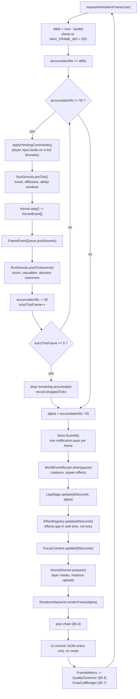

# KERNEL TRAIL - System Architecture Specification

**Version 1.0. Companion to `docs/00-DESIGN-BRIEF.md`.**

The design brief is authoritative on what the game is. This document is
authoritative on how it is built. Where this document and the brief disagree, the
brief wins and this document is wrong and must be corrected. Where this document
and `src/kernel/types.ts` or `src/game/types.ts` disagree, those files win; they
are frozen contracts and this document describes the machinery around them.

## 0. How to read this document

The audience is an implementing agent that will produce the codebase from this
spec without further architectural input. Every choice that could reasonably be
made two ways has been made one way here, with the reason given in a sentence. If
you find yourself about to invent an architectural decision, the spec has a hole:
record it in `docs/astra/OPEN-QUESTIONS.md` and escalate rather than guessing,
because a leg built against a guessed contract will conflict with every other leg
in flight.

Conventions used throughout:

- **MUST / MUST NOT** are enforced by a test or a lint rule that this document
  names. If you cannot find the enforcement, write it.
- **SHOULD** is a strong default; deviating requires a comment at the deviation
  site explaining why.
- File paths are repository-relative. Import paths use the aliases defined in
  Appendix B.
- All TypeScript in this document is real code intended to be typed into the
  repository more or less as written, not pseudocode. It compiles under
  `strict: true` with `noUncheckedIndexedAccess` and `exactOptionalPropertyTypes`
  enabled, which are both on.

### 0.1 Vocabulary

| Term | Meaning |
|---|---|
| **tick** | One discrete unit of simulated CPU time. `Tick` in `@kernel/types`. Integer, monotonic, starts at 0. One tick is one quantum unit, not one frame. |
| **frame** | One rendered image. Variable rate, target 60 Hz. |
| **step** | One call to `Kernel.step()`. Advances exactly one tick. |
| **leg** | One of the fourteen journey segments. The unit of parallel work. |
| **stage** | The 3D presentation of a leg. A `LegStage` instance, built by `@world`. |
| **run** | One playthrough from Boot Sector to Portal or death. `RunState`. |
| **backend** | A `RendererBackend`: the WebGPU or WebGL2 implementation. |
| **tier** | A quality tier: `low`, `medium`, `high`. |
| **the Substrate** | The setting. The only proper noun for it. |

### 0.2 What this document does not cover

Art direction, colour and type tokens (`docs/02-DESIGN-SYSTEM.md`), the audio
synthesis graph (`docs/03-AUDIO.md`), per-leg content (`docs/astra/LEG-*.md`), and
the curriculum mapping (the brief, section 4). This document covers the runtime
skeleton those things hang on.

---

## 1. Layer model and dependency rules

### 1.1 The graph

```
                            ┌──────────────────────────────────────┐
                            │              src/app                 │
                            │  bootstrap, GameLoop, SceneDirector  │
                            │  the only module allowed to know     │
                            │  about every other module            │
                            └───────────────┬──────────────────────┘
                                            │  composes
      ┌──────────────┬──────────────┬───────┴───────┬──────────────┬──────────────┐
      │              │              │               │              │              │
      ▼              ▼              ▼               ▼              ▼              ▼
┌───────────┐  ┌───────────┐  ┌───────────┐  ┌───────────┐  ┌───────────┐  ┌───────────┐
│ src/legs  │  │ src/world │  │  src/ui   │  │src/terminal│ │ src/audio │  │src/render │
│ 14 leg    │  │ diegetic  │  │ HUD,codex │  │ the shell │  │procedural │  │ backends, │
│ modules   │  │ 3D of     │  │ screen-   │  │ over live │  │ score and │  │ post, the │
│           │  │ kernel    │  │ space     │  │ sim state │  │ effects   │  │ materials │
│           │  │ structures│  │ only      │  │           │  │           │  │           │
└─────┬─────┘  └─────┬─────┘  └─────┬─────┘  └─────┬─────┘  └─────┬─────┘  └─────┬─────┘
      │              │              │              │              │              │
      │              └──────────────┴──────────────┴──────────────┘              │
      │                             │  READ ONLY:                                │
      │                             │   - KernelEvent stream                     │
      │                             │   - RunStore snapshots                     │
      │                             │   - Kernel read accessors                  │
      │                             ▼                                            │
      │                    ┌─────────────────┐                                   │
      └───────────────────▶│    src/game     │                                   │
              drives       │ RunState, convoy│                                   │
                           │ ledger, scoring,│                                   │
                           │ save, LegRunner │                                   │
                           └────────┬────────┘                                   │
                                    │  drives                                    │
                                    ▼                                            │
                           ┌─────────────────┐                                   │
                           │   src/kernel    │                                   │
                           │ headless,       │                                   │
                           │ deterministic,  │                                   │
                           │ zero deps       │                                   │
                           └─────────────────┘                                   │
                                                                                 │
   ┌───────────────────────────────────────────────────────────────┐             │
   │   src/design  (tokens: colour, type, easing, timing)          │◀────────────┘
   │   src/platform (capability detection, quality tiers, storage) │
   │   leaf modules: depend on nothing inside src/ except each     │
   │   other, and design depends on nothing at all                 │
   └───────────────────────────────────────────────────────────────┘
```

Read the arrows as "may import from". There are no arrows pointing up. The graph
is acyclic, and Appendix D contains the machine-readable form of it that both the
lint rule and the boundary test consume.

### 1.2 Why the kernel is headless

`src/kernel` imports nothing: not Three.js, not the DOM, not a logging library,
not the design tokens. Five things follow from that, and each one is a feature the
game needs rather than a purity exercise.

1. **The counterfactual debrief works.** The brief calls the end-of-run
   counterfactual the strongest teaching device in the game. It replays the run
   under a different policy. That replay runs in a Web Worker where there is no
   `document`, no `window` and no WebGPU adapter. A kernel that touched any of
   those could not run there, and the feature would have to be faked.
2. **Textbook fixtures are testable directly.** A scheduling policy can be fed
   arrival times and burst lengths and compared against a Gantt chart copied from
   Silberschatz. No canvas, no headless browser, no rendering.
3. **Determinism is provable rather than hoped for.** The only nondeterminism a
   headless kernel can express is the injected `Rng`. The determinism test in
   section 11.2 is meaningful precisely because there is no other channel.
4. **Save files stay small and verifiable.** `KernelSnapshot` is plain data by
   construction, because there is nothing else it could be. Structured clone works
   on it, `JSON.stringify` works on it, and the checksum in section 8.4 is
   well-defined.
5. **The visual layer cannot quietly become the source of truth.** If the world
   could write to the kernel, the first "just nudge the position" would put game
   state inside a mesh, and the second would put it inside a material. One-way
   flow makes that a compile error instead of a code review argument.

The kernel also has no logger. When it needs to say something, it emits a
`KernelEvent`. `kernel.panic` exists for exactly this reason.

### 1.3 The permission matrix

Rows are the importing directory. Columns are the imported one. `Y` means allowed,
`T` means type-only imports allowed (`import type` and nothing else), blank means
forbidden.

| from ↓ / to → | kernel | game | legs | world | render | terminal | audio | ui | design | platform | app |
|---|---|---|---|---|---|---|---|---|---|---|---|
| **kernel**    | Y | | | | | | | | | | |
| **game**      | Y | Y | T¹ | | | | | | | | |
| **legs**      | T | Y | | Y | | T | | | Y | T | |
| **world**     | T | T | | Y | Y | | | | Y | T | |
| **render**    | | | | | Y | | | | Y | Y | |
| **terminal**  | T | Y | | | | Y | | | Y | | |
| **audio**     | T | T | | | | | Y | | Y | T | |
| **ui**        | T | T | | | | T | | Y | Y | T | |
| **design**    | | | | | | | | | Y | | |
| **platform**  | | | | | | | | | Y | Y | |
| **app**       | Y | Y | Y² | Y | Y | Y | Y | Y | Y | Y | Y |

¹ `game` may import the `LegId` union and `Leg` interface types only, never a leg
implementation. The registry that maps `LegId` to a dynamic import lives in
`src/legs/registry.ts` and is imported by `app`, not by `game`.

² `app` imports `src/legs/registry.ts`, which contains only `() => import(...)`
thunks. `app` never statically imports a leg module, because that would defeat the
code splitting in section 12.3.

Additional rules that the matrix cannot express:

- **No leg may import another leg.** `src/legs/quantum_pass/**` importing
  `src/legs/the_narrows/**` is forbidden in both directions and at any depth. Legs
  share code by putting it in `src/world`, `src/game` or `src/design`, never by
  reaching sideways. This is what makes legs buildable in parallel.
- **`src/world` may import `src/render`, but not the reverse.** `render` owns
  backends, materials and the post chain, and knows nothing about page frames or
  ready queues.
- **`src/ui` may not import `three`.** The HUD is screen-space DOM. If a HUD
  element needs a 3D position, it receives a projected 2D point from `@world`
  through the store, never a `Vector3`.
- **`src/kernel` may not import `src/design`.** Colour belongs to presentation.
  Kernel events carry semantic fields (`severity: 'warning' | 'critical'`), and
  `@world` maps semantics to tokens.
- **Nothing may import from a leg's internals.** Each leg exposes exactly one
  entry point, `src/legs/<leg_id>/index.ts`, exporting a single default `Leg`.

### 1.4 Forbidden globals inside `src/kernel`

Beyond imports, the following identifiers MUST NOT appear anywhere under
`src/kernel`, including in comments-as-code, template strings, and dynamic
property access:

```
Math.random        Date.now           Date (as a constructor)
performance.now    performance        crypto.getRandomValues
setTimeout         setInterval        queueMicrotask
requestAnimationFrame                 fetch
window             document           navigator            globalThis
localStorage       indexedDB          Worker               console
```

`console` is on the list deliberately. A `console.log` left in a hot kernel path
is both a performance problem and a determinism smell, and `KernelEvent` is the
sanctioned channel. Debugging a kernel algorithm is done from a vitest run, where
`console` is available in the test file rather than in the kernel.

### 1.5 Enforcement

Three mechanisms, layered so that a violation is caught at the earliest possible
moment.

**(a) Editor and pre-commit: ESLint.** `eslint.config.js` uses
`eslint-plugin-boundaries` for the layer graph and `no-restricted-imports` for the
specific bans. The element definitions come from the same JSON that the test in
(b) reads, so the two can never drift.

```js
// eslint.config.js  (flat config, ESLint 9)
import boundaries from 'eslint-plugin-boundaries';
import tseslint from 'typescript-eslint';
import layers from './architecture.layers.json' with { type: 'json' };

const elements = layers.layers.map((l) => ({
  type: l.name,
  pattern: `src/${l.name}/**/*`,
  mode: 'full',
}));

const rules = layers.layers.flatMap((l) => [
  { from: l.name, allow: l.allow.map((a) => [a, {}]) },
]);

export default tseslint.config(
  {
    files: ['src/**/*.ts'],
    plugins: { boundaries },
    settings: {
      'boundaries/elements': elements,
      'boundaries/include': ['src/**/*'],
    },
    rules: {
      'boundaries/element-types': ['error', { default: 'disallow', rules }],
      'boundaries/no-private': ['error', { allowUncles: false }],
    },
  },
  {
    // The kernel is stricter than the graph alone can express.
    files: ['src/kernel/**/*.ts'],
    rules: {
      'no-restricted-imports': ['error', {
        patterns: [
          { group: ['three', 'three/*', '@world/*', '@render/*', '@ui/*',
                    '@game/*', '@legs/*', '@audio/*', '@design/*',
                    '@platform/*', '@terminal/*', '@app/*'],
            message: 'src/kernel is headless and depends on nothing. See 01-ARCHITECTURE §1.2.' },
        ],
      }],
      'no-restricted-globals': ['error',
        'window', 'document', 'navigator', 'localStorage', 'indexedDB',
        'performance', 'fetch', 'Worker', 'console', 'requestAnimationFrame',
      ],
      'no-restricted-properties': ['error',
        { object: 'Math', property: 'random',
          message: 'Use the injected Rng. See kernel/types.ts invariant 2.' },
        { object: 'Date', property: 'now',
          message: 'Kernel time is Tick, never wall clock.' },
      ],
      'no-restricted-syntax': ['error',
        { selector: "NewExpression[callee.name='Date']",
          message: 'Kernel time is Tick, never wall clock.' },
        { selector: "CallExpression[callee.name='setTimeout']",
          message: 'The kernel does not schedule against wall time.' },
      ],
    },
  },
  {
    files: ['src/legs/*/**/*.ts'],
    rules: {
      'no-restricted-imports': ['error', {
        patterns: [
          { group: ['@legs/*', '../../*/index', '../*'],
            message: 'A leg may not import another leg. Share via @world or @game.' },
          { group: ['@render/*'],
            message: 'Legs build stages through @world factories, never the renderer directly.' },
        ],
      }],
    },
  },
  {
    files: ['src/ui/**/*.ts'],
    rules: {
      'no-restricted-imports': ['error', {
        patterns: [{ group: ['three', 'three/*'],
          message: 'The HUD is screen-space. Receive projected 2D points from @world.' }],
      }],
    },
  },
);
```

`architecture.layers.json` is the single source of truth:

```json
{
  "version": 1,
  "layers": [
    { "name": "design",   "allow": ["design"] },
    { "name": "platform", "allow": ["design", "platform"] },
    { "name": "kernel",   "allow": ["kernel"] },
    { "name": "game",     "allow": ["kernel", "game"] },
    { "name": "render",   "allow": ["render", "design", "platform"] },
    { "name": "world",    "allow": ["world", "render", "design", "kernel", "game", "platform"] },
    { "name": "terminal", "allow": ["terminal", "game", "kernel", "design"] },
    { "name": "audio",    "allow": ["audio", "design", "kernel", "game", "platform"] },
    { "name": "ui",       "allow": ["ui", "design", "game", "kernel", "platform", "terminal"] },
    { "name": "legs",     "allow": ["game", "kernel", "world", "design", "platform", "terminal"] },
    { "name": "app",      "allow": ["kernel", "game", "legs", "world", "render",
                                    "terminal", "audio", "ui", "design", "platform", "app"] }
  ],
  "typeOnly": {
    "world":    ["kernel", "game"],
    "ui":       ["kernel", "game", "terminal"],
    "audio":    ["kernel", "game", "platform"],
    "terminal": ["kernel"],
    "legs":     ["kernel", "terminal", "platform"],
    "game":     ["legs"]
  }
}
```

**(b) CI and local test run: a boundary test that greps imports.** ESLint can be
disabled per line. The test cannot, because it reads source text and does not care
about lint directives. `tests/architecture/imports.test.ts`:

```ts
import { describe, expect, it } from 'vitest';
import { readFile } from 'node:fs/promises';
import fg from 'fast-glob';
import layers from '../../architecture.layers.json' with { type: 'json' };

/** Matches static imports, `export ... from`, and dynamic `import()`. */
const IMPORT_RE =
  /(?:^|\n)\s*(?:import|export)\s[\s\S]*?from\s*['"]([^'"]+)['"]|import\s*\(\s*['"]([^'"]+)['"]\s*\)/g;

/** Matches `import type` / `export type` so type-only edges can be permitted. */
const TYPE_ONLY_RE = /(?:import|export)\s+type\s/;

const ALLOW = new Map(layers.layers.map((l) => [l.name, new Set(l.allow)]));
const TYPE_ONLY = new Map(
  Object.entries(layers.typeOnly).map(([k, v]) => [k, new Set(v as string[])]),
);

function layerOf(specifier: string, fromFile: string): string | null {
  const alias = /^@(\w+)\//.exec(specifier);
  if (alias) return alias[1] ?? null;
  if (specifier.startsWith('.')) {
    // Resolve relative specifiers against the importing file's layer.
    const resolved = new URL(specifier, `file:///${fromFile}`).pathname;
    const m = /\/src\/(\w+)\//.exec(resolved);
    return m?.[1] ?? null;
  }
  return null; // bare package specifier, handled separately
}

async function importsOf(file: string) {
  const src = await readFile(file, 'utf8');
  const out: { spec: string; typeOnly: boolean; line: number }[] = [];
  for (const m of src.matchAll(IMPORT_RE)) {
    const spec = m[1] ?? m[2];
    if (!spec) continue;
    const before = src.slice(0, m.index ?? 0);
    const line = before.split('\n').length;
    const stmt = src.slice(m.index ?? 0, (m.index ?? 0) + 40);
    out.push({ spec, typeOnly: TYPE_ONLY_RE.test(stmt), line });
  }
  return out;
}

describe('architecture: layer boundaries', () => {
  it('no module imports outside its permitted set', async () => {
    const files = await fg('src/**/*.ts', { absolute: true });
    const violations: string[] = [];

    for (const file of files) {
      const from = /\/src\/(\w+)\//.exec(file)?.[1];
      if (!from) continue;
      const allowed = ALLOW.get(from);
      if (!allowed) { violations.push(`unknown layer for ${file}`); continue; }

      for (const imp of await importsOf(file)) {
        const to = layerOf(imp.spec, file);
        if (to === null || to === from) continue;
        if (!allowed.has(to)) {
          violations.push(`${file}:${imp.line} ${from} -> ${to} (${imp.spec})`);
          continue;
        }
        if (TYPE_ONLY.get(from)?.has(to) && !imp.typeOnly) {
          violations.push(
            `${file}:${imp.line} ${from} -> ${to} must be \`import type\` (${imp.spec})`,
          );
        }
      }
    }
    expect(violations, violations.join('\n')).toEqual([]);
  });

  it('src/kernel imports no third-party package except none at all', async () => {
    const files = await fg('src/kernel/**/*.ts', { absolute: true });
    const bad: string[] = [];
    for (const file of files) {
      for (const imp of await importsOf(file)) {
        const bare = !imp.spec.startsWith('.') && !imp.spec.startsWith('@kernel/');
        if (bare) bad.push(`${file}: ${imp.spec}`);
      }
    }
    expect(bad, bad.join('\n')).toEqual([]);
  });

  it('src/kernel uses no wall clock, no ambient randomness, no host globals', async () => {
    const banned = [
      /\bMath\s*\.\s*random\b/, /\bDate\s*\.\s*now\b/, /\bnew\s+Date\b/,
      /\bperformance\s*\./, /\bcrypto\s*\./, /\bsetTimeout\b/, /\bsetInterval\b/,
      /\bqueueMicrotask\b/, /\brequestAnimationFrame\b/, /\bconsole\s*\./,
      /\bwindow\b/, /\bdocument\b/, /\bnavigator\b/, /\blocalStorage\b/,
      /\bindexedDB\b/, /\bnew\s+Worker\b/, /\bfetch\s*\(/,
    ];
    const files = await fg('src/kernel/**/*.ts', { absolute: true });
    const bad: string[] = [];
    for (const file of files) {
      const src = await readFile(file, 'utf8');
      src.split('\n').forEach((line, i) => {
        if (line.trimStart().startsWith('*') || line.trimStart().startsWith('//')) return;
        for (const re of banned) {
          if (re.test(line)) bad.push(`${file}:${i + 1} ${re} :: ${line.trim()}`);
        }
      });
    }
    expect(bad, bad.join('\n')).toEqual([]);
  });

  it('no leg imports another leg', async () => {
    const files = await fg('src/legs/*/**/*.ts', { absolute: true });
    const bad: string[] = [];
    for (const file of files) {
      const own = /\/src\/legs\/([^/]+)\//.exec(file)?.[1];
      for (const imp of await importsOf(file)) {
        const other = /@legs\/([^/]+)/.exec(imp.spec)?.[1];
        if (other && other !== own) bad.push(`${file}: ${imp.spec}`);
        if (imp.spec.startsWith('../') && !imp.spec.startsWith('../../')) {
          // ../x from inside a leg subdirectory is fine; ../../<otherleg> is not
        }
        if (/\.\.\/\.\.\/(?!\.)/.test(imp.spec) && !imp.spec.includes('..//')) {
          const seg = imp.spec.split('/')[2];
          if (seg && seg !== own && !seg.startsWith('.')) bad.push(`${file}: ${imp.spec}`);
        }
      }
    }
    expect(bad, bad.join('\n')).toEqual([]);
  });

  it('src/ui never imports three', async () => {
    const files = await fg('src/ui/**/*.ts', { absolute: true });
    const bad: string[] = [];
    for (const file of files) {
      for (const imp of await importsOf(file)) {
        if (imp.spec === 'three' || imp.spec.startsWith('three/')) bad.push(file);
      }
    }
    expect(bad, bad.join('\n')).toEqual([]);
  });
});
```

**(c) Build time: a Vite plugin that fails the production build.** The same JSON
drives `tools/vite-plugin-layers.ts`, which hooks `resolveId` and throws on a
forbidden edge. This catches the case where a developer runs `vite build` without
running tests. Its implementation is fifteen lines wrapping the same `layerOf`
logic and is not reproduced here.

### 1.6 Public surface of each layer

Every layer has exactly one barrel, `src/<layer>/index.ts`, and cross-layer
imports MUST go through it. Deep imports such as
`@world/structures/FrameVault/mesh` from outside `@world` are forbidden by
`boundaries/no-private`. Inside a layer, deep relative imports are fine and
encouraged, because barrels inside a layer create import cycles.

The barrels are small on purpose:

```ts
// src/kernel/index.ts
export * from './types';
export { createKernel } from './Kernel';
export { createRng } from './rng/Sfc32Rng';
export { SCHEDULERS } from './scheduler/registry';
export { REPLACEMENT_POLICIES } from './memory/registry';
export { DISK_POLICIES } from './storage/registry';
export { KernelInvariantError } from './errors';
```

```ts
// src/world/index.ts
export { createStageBuilder } from './StageBuilder';
export { WorldEventRouter } from './WorldEventRouter';
export type { WorldContext, StructureHandle, AnchorId } from './contracts';
export { FrameVault, ReadyQueueProcession, WaitForRing, PlatterStack,
         PageOcean, BusSpine, ArchiveShelves, DomainRings } from './structures';
export { EffectRegistry } from './effects/EffectRegistry';
```

A leg's `createStage` therefore reads like a shopping list of world structures and
never contains geometry code. That keeps leg modules small, which is what makes
fourteen of them tractable.

---

## 2. The game loop

### 2.1 The decision

**Simulation runs at a fixed 20 Hz. Rendering runs at the display refresh rate,
uncapped, with interpolation.**

Twenty hertz, meaning one tick every 50 ms, is chosen for four reasons.

1. A tick is one CPU quantum unit. A round-robin quantum of 4 ticks, which is the
   default in `SchedulerParams` for `quantum_pass`, becomes 200 ms of wall time:
   long enough for the player to see a slice begin and end, short enough that a
   ten-process ready queue cycles in two seconds.
2. 20 Hz divides evenly into every common refresh rate the target hardware
   produces. At 60 Hz there are exactly 3 frames per tick; at 120 Hz exactly 6.
   Interpolation alpha therefore lands on clean values and stutter is invisible.
3. 50 ms is an exact integer number of milliseconds, so the accumulator can be
   kept in integer milliseconds and never accumulates floating point drift over a
   forty minute run.
4. It leaves headroom. At 20 Hz the sim consumes one `Kernel.step()` per 3 frames
   at 60 fps, so the amortised sim cost per frame is a third of a step. Section 7
   budgets a full step at 0.8 ms, which amortises to 0.27 ms per frame.

Rates outside 10 to 30 Hz were rejected: below 10 Hz a context switch reads as a
teleport rather than a movement; above 30 Hz the quantum becomes shorter than
human reaction time and the player cannot observe the thing the game exists to
teach.

### 2.2 Frame pipeline



The ordering rules that matter, and why:

- **Player commands apply at tick boundaries only.** A policy change made
  mid-frame is queued and applied immediately before the next `Kernel.step()`. If
  input could land between ticks, the decision log would need sub-tick timestamps
  and replay would stop being exact.
- **Store flush happens once, after ticking, before anything reads.** The HUD and
  the world therefore see the same state within a frame. Without this, the HUD can
  show a process as running while the world still draws it as ready.
- **Event routing happens after the store flush.** Routing may read run state
  (which convoy Program owns a pid, for instance) and must see post-tick values.
- **Effects age in wall time.** A derezz animation lasts 900 ms whether that is
  eighteen ticks at normal speed or two ticks while the game is fast-forwarding.
  Section 3.5 covers the consequences.

### 2.3 The loop

`src/app/GameLoop.ts`, complete:

```ts
/**
 * Fixed-timestep simulation, variable-rate rendering, integer-millisecond
 * accumulator. See docs/01-ARCHITECTURE §2.
 */

/** Simulation rate. One tick is one CPU quantum unit. */
export const TICK_HZ = 20;
/** Exactly 50. Kept integer so the accumulator never drifts. */
export const TICK_MS = 1000 / TICK_HZ;
export const TICK_SECONDS = TICK_MS / 1000;

/**
 * Longest wall-clock gap we will simulate in one frame. 250 ms is five ticks:
 * enough to absorb a garbage collection pause or a shader compile hitch, short
 * enough that the sim can never outrun the renderer (the spiral of death).
 */
export const MAX_FRAME_MS = 250;
export const MAX_TICKS_PER_FRAME = MAX_FRAME_MS / TICK_MS; // 5

export interface FrameMetrics {
  /** Wall time between this rAF callback and the previous one. */
  readonly frameMs: number;
  /** Time spent inside our own frame body, excluding browser compositing. */
  readonly cpuMs: number;
  readonly simMs: number;
  readonly routeMs: number;
  readonly worldMs: number;
  readonly renderMs: number;
  readonly ticksThisFrame: number;
  /** Ticks discarded because the frame clamp hit. Non-zero means we are behind. */
  readonly droppedTicks: number;
  readonly alpha: number;
  readonly frameIndex: number;
}

/**
 * Everything the loop drives. `app` supplies the implementation; the loop knows
 * nothing about kernels, scenes or stores, which is what makes it unit-testable
 * with a fake clock.
 */
export interface SimHost {
  /** Apply queued player commands. Runs immediately before every tick. */
  applyPendingCommands(tick: number): void;
  /** Advance the simulation exactly one tick. */
  fixedUpdate(tick: number): void;
  /** Publish store changes. Called once per frame after all ticks. */
  flushState(): void;
  /** Deliver this frame's batched kernel events to the world. */
  routeEvents(): void;
  /** Advance visuals. `alpha` is the fraction of a tick already elapsed. */
  variableUpdate(dtSeconds: number, alpha: number): void;
  /** Draw. */
  render(alpha: number): void;
  onFrameMetrics(m: FrameMetrics): void;
  /** Called when the loop pauses or resumes so audio and effects can react. */
  onRunStateChanged(running: boolean): void;
}

/** Injected so tests can drive the loop with a scripted clock. */
export interface LoopClock {
  now(): number;
  schedule(cb: (now: number) => void): number;
  cancel(handle: number): void;
}

export const browserClock: LoopClock = {
  now: () => performance.now(),
  schedule: (cb) => requestAnimationFrame(cb),
  cancel: (h) => cancelAnimationFrame(h),
};

export interface GameLoopOptions {
  readonly host: SimHost;
  readonly clock?: LoopClock;
  /** Multiplies simulated time. 0 pauses, 1 is normal, 3 is fast-forward. */
  readonly initialTimeScale?: number;
}

export class GameLoop {
  private readonly host: SimHost;
  private readonly clock: LoopClock;

  private handle = 0;
  private running = false;
  private lastMs = 0;
  private accumulatorMs = 0;
  private tick = 0;
  private frameIndex = 0;
  private timeScale: number;
  /** Set by pause(), visibility change, or a fatal error. */
  private suspended = false;

  constructor(opts: GameLoopOptions) {
    this.host = opts.host;
    this.clock = opts.clock ?? browserClock;
    this.timeScale = opts.initialTimeScale ?? 1;
  }

  start(): void {
    if (this.running) return;
    this.running = true;
    this.lastMs = this.clock.now();
    this.accumulatorMs = 0;
    this.host.onRunStateChanged(true);
    this.handle = this.clock.schedule(this.frame);
  }

  stop(): void {
    if (!this.running) return;
    this.running = false;
    this.clock.cancel(this.handle);
    this.host.onRunStateChanged(false);
  }

  /** Soft pause: keeps rendering so the world stays alive, stops advancing sim. */
  setTimeScale(scale: number): void {
    this.timeScale = Math.max(0, Math.min(8, scale));
  }

  /** Hard suspend: stops the rAF entirely. Used on tab hide and on fatal error. */
  suspend(): void {
    if (this.suspended) return;
    this.suspended = true;
    this.clock.cancel(this.handle);
    this.host.onRunStateChanged(false);
  }

  resume(): void {
    if (!this.suspended) return;
    this.suspended = false;
    // Discard everything that happened while we were away. The alternative,
    // catching up, would run thousands of ticks in one frame and would make a
    // backgrounded tab into a cheat.
    this.lastMs = this.clock.now();
    this.accumulatorMs = 0;
    this.host.onRunStateChanged(true);
    if (this.running) this.handle = this.clock.schedule(this.frame);
  }

  get currentTick(): number { return this.tick; }

  private readonly frame = (now: number): void => {
    if (!this.running || this.suspended) return;
    this.handle = this.clock.schedule(this.frame);

    const frameStart = now;
    let rawDelta = now - this.lastMs;
    this.lastMs = now;

    // A negative delta can occur if the clock is adjusted. Treat it as one frame.
    if (!Number.isFinite(rawDelta) || rawDelta < 0) rawDelta = TICK_MS;

    // The clamp. Without it, a 4-second stall queues 80 ticks, the frame that
    // simulates them takes longer than 4 seconds, and the queue grows forever.
    const frameMs = rawDelta;
    const clamped = Math.min(rawDelta, MAX_FRAME_MS);

    this.accumulatorMs += clamped * this.timeScale;

    const simStart = this.clock.now();
    let ticksThisFrame = 0;
    let droppedTicks = 0;

    while (this.accumulatorMs >= TICK_MS) {
      if (ticksThisFrame >= MAX_TICKS_PER_FRAME) {
        droppedTicks = Math.floor(this.accumulatorMs / TICK_MS);
        this.accumulatorMs = 0;
        break;
      }
      this.host.applyPendingCommands(this.tick);
      this.host.fixedUpdate(this.tick);
      this.tick += 1;
      this.accumulatorMs -= TICK_MS;
      ticksThisFrame += 1;
    }
    const simMs = this.clock.now() - simStart;

    const alpha = this.timeScale === 0 ? 0 : this.accumulatorMs / TICK_MS;

    this.host.flushState();

    const routeStart = this.clock.now();
    this.host.routeEvents();
    const routeMs = this.clock.now() - routeStart;

    const worldStart = this.clock.now();
    this.host.variableUpdate(clamped / 1000, alpha);
    const worldMs = this.clock.now() - worldStart;

    const renderStart = this.clock.now();
    this.host.render(alpha);
    const renderMs = this.clock.now() - renderStart;

    const end = this.clock.now();
    this.host.onFrameMetrics({
      frameMs,
      cpuMs: end - frameStart,
      simMs, routeMs, worldMs, renderMs,
      ticksThisFrame, droppedTicks, alpha,
      frameIndex: this.frameIndex++,
    });
  };
}
```

### 2.4 Tab blur, visibility and focus

Three browser signals could pause the game and they mean different things. The
decisions:

| Signal | Action | Reason |
|---|---|---|
| `document.visibilitychange` to hidden | `loop.suspend()`, autosave a provisional save (§8.5), mute audio over 120 ms | The tab is not on screen. `requestAnimationFrame` is throttled to roughly 1 Hz or stopped entirely, so continuing would produce 1000 ms frame deltas that the clamp turns into permanent tick loss. Suspending makes that explicit. |
| `document.visibilitychange` to visible | `loop.resume()`, which resets `lastMs` and zeroes the accumulator, then show a 400 ms "resuming" wipe | Discarding the gap is the only choice that preserves both determinism and fairness. Simulated time is not wall time, so nothing is lost conceptually. |
| `window.blur` (another window on top, tab still visible) | Keep running. Reduce audio gain by 6 dB. | The player may be watching on a second monitor or reading the codex in another window while a long leg travels. Pausing here would be surprising. |
| `pagehide` / `freeze` | Synchronous best-effort save through `navigator.storage` is not available, so we write the provisional save on the preceding `visibilitychange` instead and treat `pagehide` as a no-op | IndexedDB writes cannot be relied upon during `pagehide`. Section 8.5 explains the earlier-write policy. |

`src/app/VisibilityGovernor.ts`:

```ts
export function installVisibilityGovernor(
  loop: GameLoop,
  hooks: {
    onHide(): void;   // provisional save, mute
    onShow(): void;   // unmute, show resume wipe
    onBlur(): void;   // duck audio
    onFocus(): void;
  },
): () => void {
  const onVisibility = () => {
    if (document.visibilityState === 'hidden') { hooks.onHide(); loop.suspend(); }
    else { loop.resume(); hooks.onShow(); }
  };
  document.addEventListener('visibilitychange', onVisibility);
  window.addEventListener('blur', hooks.onBlur);
  window.addEventListener('focus', hooks.onFocus);
  return () => {
    document.removeEventListener('visibilitychange', onVisibility);
    window.removeEventListener('blur', hooks.onBlur);
    window.removeEventListener('focus', hooks.onFocus);
  };
}
```

### 2.5 Interpolation and what alpha means

`alpha` is the fraction of the current tick that has already elapsed in wall time,
in `[0, 1)`. It is passed to `LegStage.update(dtSeconds, alpha)` exactly as
declared in `@game/types`.

Any visual driven by discrete kernel state MUST double-buffer that state at tick
boundaries and interpolate. The helper lives in `@world`:

```ts
// src/world/interpolation.ts

/** A value sampled at tick boundaries and read at frame rate. */
export class Interpolated<T> {
  private prev: T;
  private curr: T;
  constructor(initial: T, private readonly lerp: (a: T, b: T, t: number) => T) {
    this.prev = initial;
    this.curr = initial;
  }
  /** Call exactly once per tick, from the tick handler, never from a frame. */
  commit(next: T): void { this.prev = this.curr; this.curr = next; }
  /** Call from variableUpdate. */
  sample(alpha: number): T { return this.lerp(this.prev, this.curr, alpha); }
  get target(): T { return this.curr; }
}

export const lerpNumber = (a: number, b: number, t: number) => a + (b - a) * t;
```

Not every visual interpolates. The rule:

- **Continuous quantities interpolate.** Convoy position along the leg path, disk
  head cylinder, clock hand angle, queue slot positions, fault-rate meters.
- **Discrete state changes snap and then animate on their own clock.** A frame
  turning from free to allocated does not lerp its colour over a tick; it snaps
  the logical state and plays a 220 ms flare driven by wall time. Interpolating a
  categorical value produces a muddy in-between colour that means nothing.
- **Nothing extrapolates.** When `droppedTicks > 0` the world simply holds; a
  visual that guesses ahead will contradict the next tick and jerk backwards.

### 2.6 Time scale, fast-forward and pause

`TravelPolicy.pace` maps to the scheduler quantum inside the kernel, and does not
touch `timeScale`. The two are independent, and conflating them is a bug: pace is
a simulated property that changes outcomes; time scale is a presentation control
that changes nothing.

`timeScale` values used by the game:

| Context | Scale | Notes |
|---|---|---|
| Normal travel | 1 | |
| Fast travel (player-held key, or "skip to next event") | 3 | Effects still age in wall time, so the world reads as busy rather than sped-up. Above 3 the event router coalesces so aggressively that the player learns nothing, so 3 is the cap. |
| Structure focus (page table open, Banker's matrix open) | 0.25 | Sim continues slowly so the player feels time pressure while reading. Set by `FocusCamera`, released on exit. |
| Modal decision (river crossing, depot) | 0 | Genuine pause. Rendering continues, `alpha` is pinned to 0. |
| Debrief and tombstone | 0 | |

At `timeScale === 0` the loop still calls `variableUpdate` and `render`, so
ambient motion, effects and the camera keep working. That is what keeps a paused
game from looking crashed.

---
## 3. The sim-to-visual contract

### 3.1 The only channel

The world, the HUD, the audio engine and the codex learn what the kernel did from
`KernelEvent` and from read-only accessors on `Kernel` and `RunStore`. There is no
second channel. In particular:

- No visual module holds a reference to a `ProcessControlBlock` object. It holds a
  `Pid` and asks `kernel.process(pid)` when it needs current values. PCBs are
  mutable and reused; a held reference would silently observe future mutations.
- No visual module calls a kernel mutator. `setScheduler` and friends are called
  by `@game`, in response to a player command that has been recorded in
  `RunState.decisions`.
- `Kernel.events.lastFrame` is the kernel's own convenience view of the events
  from the most recent `step()`. The loop does not use it, because a frame may
  contain up to five steps. The loop accumulates into a `FrameEventQueue` instead.

### 3.2 `WorldEventRouter`

`src/world/WorldEventRouter.ts` contains one exhaustive `switch` over
`KernelEvent['type']`. Every variant has a case; the default arm calls
`assertNever`, whose parameter type is `never`. Adding a variant to the union in
`@kernel/types` without adding a case makes `assertNever(e)` a compile error, which
is exactly the behaviour the frozen contract file promises.

```ts
// src/world/WorldEventRouter.ts
import type { KernelEvent } from '@kernel/types';
import type { WorldContext } from './contracts';
import { ProcessVisuals } from './domains/ProcessVisuals';
import { SchedulerVisuals } from './domains/SchedulerVisuals';
import { MemoryVisuals } from './domains/MemoryVisuals';
import { SyncVisuals } from './domains/SyncVisuals';
import { DeadlockVisuals } from './domains/DeadlockVisuals';
import { StorageVisuals } from './domains/StorageVisuals';
import { IoVisuals } from './domains/IoVisuals';
import { FsVisuals } from './domains/FsVisuals';
import { SecurityVisuals } from './domains/SecurityVisuals';
import { SystemVisuals } from './domains/SystemVisuals';

/** Compile-time exhaustiveness guard. Never called at runtime. */
function assertNever(x: never): never {
  throw new Error(`Unhandled KernelEvent variant: ${JSON.stringify(x)}`);
}

export interface WorldDomains {
  readonly process: ProcessVisuals;
  readonly scheduler: SchedulerVisuals;
  readonly memory: MemoryVisuals;
  readonly sync: SyncVisuals;
  readonly deadlock: DeadlockVisuals;
  readonly storage: StorageVisuals;
  readonly io: IoVisuals;
  readonly fs: FsVisuals;
  readonly security: SecurityVisuals;
  readonly system: SystemVisuals;
}

export class WorldEventRouter {
  constructor(
    private readonly d: WorldDomains,
    private readonly ctx: WorldContext,
  ) {}

  /**
   * Route one event. Called only by FrameEventQueue.drain, never directly, so
   * that coalescing always applies.
   */
  route(e: KernelEvent): void {
    const c = this.ctx;
    switch (e.type) {
      /* ---- processes, Ch. 3 ---- */
      case 'process.created':       this.d.process.onCreated(e, c); return;
      case 'process.state_changed': this.d.process.onStateChanged(e, c); return;
      case 'process.exited':        this.d.process.onExited(e, c); return;
      case 'process.reaped':        this.d.process.onReaped(e, c); return;
      case 'process.starving':      this.d.process.onStarving(e, c); return;

      /* ---- scheduling, Ch. 5 ---- */
      case 'context.switch':        this.d.scheduler.onContextSwitch(e, c); return;
      case 'quantum.expired':       this.d.scheduler.onQuantumExpired(e, c); return;

      /* ---- threads, Ch. 4 ---- */
      case 'thread.created':        this.d.process.onThreadCreated(e, c); return;
      case 'thread.joined':         this.d.process.onThreadJoined(e, c); return;

      /* ---- memory, Ch. 9 and 10 ---- */
      case 'memory.access':            this.d.memory.onAccess(e, c); return;
      case 'memory.page_fault':        this.d.memory.onPageFault(e, c); return;
      case 'memory.page_loaded':       this.d.memory.onPageLoaded(e, c); return;
      case 'memory.page_evicted':      this.d.memory.onPageEvicted(e, c); return;
      case 'memory.allocated':         this.d.memory.onAllocated(e, c); return;
      case 'memory.allocation_failed': this.d.memory.onAllocationFailed(e, c); return;
      case 'memory.thrashing':         this.d.memory.onThrashing(e, c); return;
      case 'tlb.miss':                 this.d.memory.onTlbMiss(e, c); return;

      /* ---- synchronisation, Ch. 6 and 7 ---- */
      case 'sync.acquired':       this.d.sync.onAcquired(e, c); return;
      case 'sync.blocked':        this.d.sync.onBlocked(e, c); return;
      case 'sync.released':       this.d.sync.onReleased(e, c); return;
      case 'sync.race_detected':  this.d.sync.onRace(e, c); return;
      case 'sync.busy_wait':      this.d.sync.onBusyWait(e, c); return;

      /* ---- deadlock, Ch. 8 ---- */
      case 'resource.requested':  this.d.deadlock.onRequested(e, c); return;
      case 'resource.granted':    this.d.deadlock.onGranted(e, c); return;
      case 'resource.denied':     this.d.deadlock.onDenied(e, c); return;
      case 'bankers.evaluated':   this.d.deadlock.onBankers(e, c); return;
      case 'deadlock.detected':   this.d.deadlock.onDetected(e, c); return;
      case 'deadlock.resolved':   this.d.deadlock.onResolved(e, c); return;

      /* ---- storage, Ch. 11 ---- */
      case 'disk.queued':  this.d.storage.onQueued(e, c); return;
      case 'disk.seek':    this.d.storage.onSeek(e, c); return;
      case 'disk.served':  this.d.storage.onServed(e, c); return;
      case 'raid.rebuild': this.d.storage.onRaidRebuild(e, c); return;

      /* ---- I/O, Ch. 12 ---- */
      case 'io.request':      this.d.io.onRequest(e, c); return;
      case 'io.interrupt':    this.d.io.onInterrupt(e, c); return;
      case 'io.dma_transfer': this.d.io.onDma(e, c); return;
      case 'io.poll_wasted':  this.d.io.onPollWasted(e, c); return;

      /* ---- file system, Ch. 13 to 15 ---- */
      case 'fs.block_allocated': this.d.fs.onBlockAllocated(e, c); return;
      case 'fs.fragmented':      this.d.fs.onFragmented(e, c); return;
      case 'fs.journal':         this.d.fs.onJournal(e, c); return;
      case 'fs.corruption':      this.d.fs.onCorruption(e, c); return;
      case 'fs.recovered':       this.d.fs.onRecovered(e, c); return;

      /* ---- protection and security, Ch. 16 and 17 ---- */
      case 'security.access_denied':       this.d.security.onAccessDenied(e, c); return;
      case 'security.escalation_attempt':  this.d.security.onEscalation(e, c); return;

      /* ---- system ---- */
      case 'syscall.invoked': this.d.system.onSyscall(e, c); return;
      case 'kernel.panic':    this.d.system.onPanic(e, c); return;

      default: return assertNever(e);
    }
  }
}
```

Three notes for the implementer.

- Each `on*` handler receives the narrowed event type. Write the domain classes so
  the parameter types come from `KernelEventOf<'memory.page_fault'>` and so on,
  which keeps them in step with the frozen union automatically.
- Handlers MUST NOT throw. A domain handler that fails takes down the frame. Wrap
  the drain loop (section 3.4) in a guard that catches, records, and disables the
  offending handler for the remainder of the leg rather than letting an exception
  escape.
- Handlers MUST be cheap and allocation-free in the common path. The budget in
  section 7 gives the whole routing stage 0.4 ms.

### 3.3 Audio, HUD and codex subscribe to the same stream, separately

`WorldEventRouter` is the world's subscriber. Audio and the codex have their own,
built the same way, and they run from the same `FrameEventQueue` in a fixed order:
world, then audio, then codex, then HUD counters. Fixed order matters because the
world computes 3D positions that audio uses for panning, and the codex asks the
world whether the pathology is currently on screen before it offers an entry.

```ts
// src/app/EventFanout.ts
export interface EventConsumer {
  readonly name: string;
  beginFrame(): void;
  consume(e: KernelEvent): void;
  endFrame(): void;
}

export class EventFanout {
  private readonly consumers: EventConsumer[] = [];
  private readonly disabled = new Set<string>();

  add(c: EventConsumer): void { this.consumers.push(c); }

  /** Order is registration order and is fixed by app/bootstrap.ts. */
  dispatch(events: readonly KernelEvent[], onError: (c: string, err: unknown) => void): void {
    for (const c of this.consumers) {
      if (this.disabled.has(c.name)) continue;
      try {
        c.beginFrame();
        for (const e of events) c.consume(e);
        c.endFrame();
      } catch (err) {
        this.disabled.add(c.name);
        onError(c.name, err);
      }
    }
  }
}
```

Disabling a consumer that throws is the resilience rule from section 10 applied
here: losing the audio reaction to page faults is a degraded game; a white screen
is not a game.

### 3.4 Per-frame batching and coalescing

A frame may contain up to five ticks, and a single tick on the Drowned Reach can
emit several hundred `memory.access` events. Delivering all of them to the world
individually is both slow and visually useless, because five hundred simultaneous
flashes read as one flash.

`FrameEventQueue` accumulates during the fixed-step loop and applies a per-type
coalescing rule when drained.

```ts
// src/world/FrameEventQueue.ts
import type { KernelEvent, KernelEventType } from '@kernel/types';

export type CoalesceRule =
  /** Every event is routed. Default for anything not listed. */
  | { readonly kind: 'all' }
  /** Only the final event of this type in the frame is routed. */
  | { readonly kind: 'last' }
  /** Route the first `n`, then route one synthetic summary. */
  | { readonly kind: 'sample'; readonly n: number }
  /** Never routed individually; the domain reads an aggregate counter instead. */
  | { readonly kind: 'aggregate' };

/**
 * Coalescing policy. The choices are visual, not performance guesses: a rule of
 * `last` means intermediate values have no independent meaning on screen.
 */
export const COALESCE: Partial<Record<KernelEventType, CoalesceRule>> = {
  // The heat map reads a counter. Individual reads are invisible anyway.
  'memory.access': { kind: 'aggregate' },
  // 500 faults in a tick become 12 motes plus one surge. See §3.6.
  'memory.page_fault': { kind: 'sample', n: 12 },
  'tlb.miss': { kind: 'sample', n: 8 },
  // Only the head's final position this frame matters; the path is drawn from
  // the policy snapshot, not from the individual seeks.
  'disk.seek': { kind: 'last' },
  // A poll loop can emit every tick. One spinner update per frame is plenty.
  'io.poll_wasted': { kind: 'last' },
  'sync.busy_wait': { kind: 'sample', n: 4 },
  // Syscalls drive the terminal transcript, which needs all of them, but the
  // world only draws the trap arc for the first few.
  'syscall.invoked': { kind: 'sample', n: 6 },
};

export interface FrameAggregates {
  /** page -> access count this frame, for the heat map. */
  readonly accessesByPage: Map<number, number>;
  readonly faultCount: number;
  readonly tlbMissCount: number;
  readonly busyWaitTicks: number;
  readonly suppressed: number;
}

export class FrameEventQueue {
  private readonly buffer: KernelEvent[] = [];
  private readonly counts = new Map<KernelEventType, number>();
  private readonly lastOfType = new Map<KernelEventType, KernelEvent>();
  private readonly accessesByPage = new Map<number, number>();
  private faultCount = 0;
  private tlbMissCount = 0;
  private busyWaitTicks = 0;
  private suppressed = 0;

  /** Called once per tick, inside the fixed step. */
  push(events: readonly KernelEvent[]): void {
    for (const e of events) this.buffer.push(e);
  }

  /**
   * Called once per frame. Applies coalescing, hands survivors to the fanout,
   * and exposes aggregates for domains that read counters.
   */
  drain(dispatch: (events: readonly KernelEvent[]) => void): FrameAggregates {
    this.counts.clear();
    this.lastOfType.clear();
    this.accessesByPage.clear();
    this.faultCount = 0;
    this.tlbMissCount = 0;
    this.busyWaitTicks = 0;
    this.suppressed = 0;

    const survivors: KernelEvent[] = [];

    for (const e of this.buffer) {
      const seen = (this.counts.get(e.type) ?? 0) + 1;
      this.counts.set(e.type, seen);

      // Aggregate side-channels, computed for every event regardless of routing.
      if (e.type === 'memory.access') {
        const page = e.page as unknown as number;
        this.accessesByPage.set(page, (this.accessesByPage.get(page) ?? 0) + 1);
      } else if (e.type === 'memory.page_fault') {
        this.faultCount += 1;
      } else if (e.type === 'tlb.miss') {
        this.tlbMissCount += 1;
      } else if (e.type === 'sync.busy_wait') {
        this.busyWaitTicks += e.spunTicks;
      }

      const rule = COALESCE[e.type] ?? { kind: 'all' as const };
      switch (rule.kind) {
        case 'all':       survivors.push(e); break;
        case 'aggregate': this.suppressed += 1; break;
        case 'last':      this.lastOfType.set(e.type, e); break;
        case 'sample':
          if (seen <= rule.n) survivors.push(e);
          else this.suppressed += 1;
          break;
      }
    }

    for (const e of this.lastOfType.values()) survivors.push(e);

    // Sequence order is the kernel's `seq`, which is monotonic across the run.
    survivors.sort((a, b) => a.seq - b.seq);

    dispatch(survivors);
    this.buffer.length = 0;

    return {
      accessesByPage: this.accessesByPage,
      faultCount: this.faultCount,
      tlbMissCount: this.tlbMissCount,
      busyWaitTicks: this.busyWaitTicks,
      suppressed: this.suppressed,
    };
  }

  /** The terminal and the replay recorder need the uncoalesced log. */
  peekRaw(): readonly KernelEvent[] { return this.buffer; }
}
```

Two consumers need the raw stream and get it before coalescing runs: the terminal
transcript (a `trace` command that dropped events would lie) and the replay
recorder used by the determinism test. Both call `peekRaw()` from a hook that runs
at the top of `drain`. Everything visual uses the coalesced stream.

### 3.5 Effects outlive the tick that spawned them

A page eviction takes one tick to happen and 900 ms to look like it happened. The
effect must therefore survive:

- the end of the tick,
- the end of the frame,
- the death of the process that caused it,
- and a policy change that removes the structure it was attached to.

The rule that makes this safe: **an effect captures values, never references.** It
stores a world-space `Vector3`, a colour, a numeric pid for the label, and nothing
that can be mutated or freed underneath it. If an effect needs to follow a moving
object, it stores an `AnchorId` and resolves it every frame, tolerating `null`.

```ts
// src/world/effects/types.ts
import type { Vector3 } from 'three';
import type { AnchorId } from '../contracts';

export type EffectKind =
  | 'derezz' | 'page_flare' | 'page_dissolve' | 'fault_mote' | 'fault_surge'
  | 'seek_arc' | 'interrupt_spike' | 'lock_pulse' | 'race_shear'
  | 'deadlock_ring' | 'journal_stamp' | 'denial_ward' | 'trap_arc';

export interface EffectSpawn {
  readonly kind: EffectKind;
  /** World position, copied. Effects never hold a reference to a live object. */
  readonly at: Vector3;
  readonly to?: Vector3;
  /** Optional moving anchor. Resolved each frame; null is tolerated. */
  readonly follow?: AnchorId;
  readonly lifetimeSeconds: number;
  /** 0..1, drives brightness, scale and particle count. */
  readonly intensity: number;
  /** Packed rgb. Comes from @design tokens via the domain handler. */
  readonly colour: number;
  /** Free-form numeric payload, at most four values, no objects. */
  readonly a?: number;
  readonly b?: number;
  readonly c?: number;
  readonly d?: number;
}

export interface LiveEffect extends EffectSpawn {
  /** Wall-clock seconds since spawn. */
  age: number;
  /** Slot in the instanced batch that draws this effect kind. */
  slot: number;
  /** Monotonic id, used for stable sorting and for debug overlays. */
  readonly id: number;
  alive: boolean;
}
```

Effects age on wall time inside `variableUpdate`, so `timeScale` does not
compress them. That means at `timeScale = 3` more effects are alive at once, which
is precisely why the pool has to be bounded.

### 3.6 The bounded effect pool

Five hundred page faults in one tick must not allocate five hundred objects. The
pool is preallocated at stage build time, sized by quality tier, and never grows.

```ts
// src/world/effects/EffectPool.ts
import type { EffectSpawn, LiveEffect } from './types';

export type OverflowPolicy =
  /** Recycle the oldest live effect. Correct for continuous phenomena. */
  | 'recycle_oldest'
  /** Drop the new spawn and raise the intensity of the newest live one. */
  | 'aggregate'
  /** Drop silently. Correct for purely decorative effects. */
  | 'drop';

export interface EffectPoolOptions {
  readonly capacity: number;
  readonly overflow: OverflowPolicy;
}

export class EffectPool {
  private readonly items: LiveEffect[];
  private readonly free: number[] = [];
  private nextId = 1;
  private liveCount = 0;
  /** Ring of live indices in spawn order, so recycle_oldest is O(1). */
  private readonly order: number[] = [];

  constructor(private readonly opts: EffectPoolOptions) {
    this.items = new Array(opts.capacity);
    for (let i = opts.capacity - 1; i >= 0; i--) {
      this.items[i] = {
        kind: 'derezz', at: null as never, lifetimeSeconds: 0, intensity: 0,
        colour: 0, age: 0, slot: i, id: 0, alive: false,
      } as LiveEffect;
      this.free.push(i);
    }
  }

  get inUse(): number { return this.liveCount; }
  get capacity(): number { return this.opts.capacity; }

  spawn(spec: EffectSpawn): LiveEffect | null {
    let index = this.free.pop();

    if (index === undefined) {
      switch (this.opts.overflow) {
        case 'drop':
          return null;
        case 'aggregate': {
          const newest = this.order[this.order.length - 1];
          if (newest !== undefined) {
            const e = this.items[newest]!;
            e.intensity = Math.min(1, e.intensity + spec.intensity * 0.25);
          }
          return null;
        }
        case 'recycle_oldest': {
          const oldest = this.order.shift();
          if (oldest === undefined) return null;
          this.items[oldest]!.alive = false;
          this.liveCount -= 1;
          index = oldest;
          break;
        }
      }
    }

    const e = this.items[index!]!;
    // Mutate in place. No object literal is created per spawn.
    (e as { -readonly [K in keyof EffectSpawn]: EffectSpawn[K] }).kind = spec.kind;
    e.at = spec.at.clone();          // one Vector3 per spawn, from a Vector3 pool
    e.to = spec.to?.clone();
    e.follow = spec.follow;
    e.lifetimeSeconds = spec.lifetimeSeconds;
    e.intensity = spec.intensity;
    e.colour = spec.colour;
    e.a = spec.a; e.b = spec.b; e.c = spec.c; e.d = spec.d;
    e.age = 0;
    e.alive = true;
    (e as { id: number }).id = this.nextId++;
    this.liveCount += 1;
    this.order.push(index!);
    return e;
  }

  /** Wall-clock ageing. Called once per frame from variableUpdate. */
  update(dtSeconds: number, onExpire?: (e: LiveEffect) => void): void {
    for (let k = this.order.length - 1; k >= 0; k--) {
      const index = this.order[k]!;
      const e = this.items[index]!;
      if (!e.alive) { this.order.splice(k, 1); continue; }
      e.age += dtSeconds;
      if (e.age >= e.lifetimeSeconds) {
        e.alive = false;
        this.liveCount -= 1;
        this.order.splice(k, 1);
        this.free.push(index);
        onExpire?.(e);
      }
    }
  }

  forEachLive(fn: (e: LiveEffect) => void): void {
    for (const index of this.order) {
      const e = this.items[index]!;
      if (e.alive) fn(e);
    }
  }

  clear(): void {
    for (const index of this.order) { this.items[index]!.alive = false; this.free.push(index); }
    this.order.length = 0;
    this.liveCount = 0;
  }
}
```

`Vector3.clone()` in `spawn` is the one allocation left. It is removed by giving
each pool a parallel `Float32Array(capacity * 6)` for positions, which the
implementer SHOULD do for the four highest-volume kinds (`fault_mote`,
`page_flare`, `page_dissolve`, `seek_arc`) and MAY skip for the rest. The
interface above stays the same; only the storage changes.

**Pool registry and per-kind capacities.** `EffectRegistry` owns one pool per
kind, sized from the tier:

```ts
// src/world/effects/EffectRegistry.ts
import type { QualityTier } from '@platform/quality';
import { EffectPool, type OverflowPolicy } from './EffectPool';
import type { EffectKind, EffectSpawn, LiveEffect } from './types';

interface KindConfig {
  readonly capacity: Readonly<Record<QualityTier, number>>;
  readonly overflow: OverflowPolicy;
}

export const EFFECT_CONFIG: Readonly<Record<EffectKind, KindConfig>> = {
  derezz:          { capacity: { low: 4,   medium: 8,   high: 12  }, overflow: 'recycle_oldest' },
  page_flare:      { capacity: { low: 64,  medium: 192, high: 384 }, overflow: 'recycle_oldest' },
  page_dissolve:   { capacity: { low: 48,  medium: 128, high: 256 }, overflow: 'recycle_oldest' },
  fault_mote:      { capacity: { low: 32,  medium: 96,  high: 192 }, overflow: 'aggregate' },
  fault_surge:     { capacity: { low: 2,   medium: 4,   high: 6   }, overflow: 'aggregate' },
  seek_arc:        { capacity: { low: 16,  medium: 48,  high: 96  }, overflow: 'recycle_oldest' },
  interrupt_spike: { capacity: { low: 24,  medium: 64,  high: 128 }, overflow: 'recycle_oldest' },
  lock_pulse:      { capacity: { low: 16,  medium: 32,  high: 64  }, overflow: 'recycle_oldest' },
  race_shear:      { capacity: { low: 2,   medium: 4,   high: 8   }, overflow: 'drop' },
  deadlock_ring:   { capacity: { low: 1,   medium: 2,   high: 4   }, overflow: 'drop' },
  journal_stamp:   { capacity: { low: 8,   medium: 24,  high: 48  }, overflow: 'recycle_oldest' },
  denial_ward:     { capacity: { low: 4,   medium: 12,  high: 24  }, overflow: 'recycle_oldest' },
  trap_arc:        { capacity: { low: 8,   medium: 24,  high: 48  }, overflow: 'drop' },
};

export class EffectRegistry {
  private readonly pools = new Map<EffectKind, EffectPool>();

  constructor(private readonly tier: QualityTier) {
    for (const [kind, cfg] of Object.entries(EFFECT_CONFIG) as [EffectKind, KindConfig][]) {
      this.pools.set(kind, new EffectPool({
        capacity: cfg.capacity[tier],
        overflow: cfg.overflow,
      }));
    }
  }

  spawn(spec: EffectSpawn): LiveEffect | null {
    return this.pools.get(spec.kind)?.spawn(spec) ?? null;
  }

  update(dtSeconds: number): void {
    for (const p of this.pools.values()) p.update(dtSeconds);
  }

  forEach(kind: EffectKind, fn: (e: LiveEffect) => void): void {
    this.pools.get(kind)?.forEachLive(fn);
  }

  /** Total live effects, reported in FrameMetrics for the quality governor. */
  get liveTotal(): number {
    let n = 0;
    for (const p of this.pools.values()) n += p.inUse;
    return n;
  }

  disposeAll(): void { for (const p of this.pools.values()) p.clear(); }
}
```

### 3.7 The 500-page-fault worked example

This is the case the brief's showpiece leg produces routinely, so it is worth
tracing end to end.

1. A tick on the Drowned Reach emits 500 `memory.page_fault` events plus roughly
   1400 `memory.access` events.
2. `FrameEventQueue.push` appends all 1900 to the buffer. No allocation beyond
   array growth, and the buffer's backing array is retained across frames, so
   after the first busy frame there is no growth at all.
3. `drain` runs. `memory.access` has rule `aggregate`: 1400 events update
   `accessesByPage` and are suppressed. `memory.page_fault` has rule
   `sample: 12`: the first 12 are routed, 488 are counted into `faultCount` and
   suppressed.
4. `MemoryVisuals.onPageFault` runs 12 times and spawns 12 `fault_mote` effects,
   comfortably inside the medium-tier pool of 96.
5. `MemoryVisuals.endFrame` reads `aggregates.faultCount === 500`, and because it
   crosses the surge threshold, spawns exactly one `fault_surge` effect with
   `intensity = clamp01(500 / 400)` and a numeric payload carrying the count. The
   surge is a single screen-wide shader effect, one draw call.
6. The heat map for the frame vault is written from `accessesByPage` into a single
   `InstancedBufferAttribute` update, one `bufferSubData` call for the whole
   vault.
7. Audio receives the same coalesced stream: 12 fault ticks, hard-limited by a
   voice allocator to 4 simultaneous grains, plus one surge swell.

Total allocation for the frame: zero effect objects, zero event objects beyond
what the kernel already emitted, one typed-array upload. Total draw calls added:
two.

### 3.8 What the world reads that is not an event

Events describe changes. Some visuals need current totals, and polling a snapshot
every frame is cheaper and simpler than reconstructing state from an event
history. The sanctioned read-only surfaces, all cheap and none allocating:

| Surface | Called | Cost rule |
|---|---|---|
| `kernel.process(pid)` | On demand, per visible process, at most once per frame each | O(1) map lookup |
| `kernel.processes` | Once per frame at most | Returns the live array; MUST NOT be copied or sorted in place |
| `scheduler.snapshot()` | Once per frame | Contract says it must not allocate per tick; the implementation returns a stable object mutated in place |
| `replacementPolicy.snapshot()` | Once per frame | Same |
| `diskPolicy.snapshot()` | Once per frame | Same |
| `kernel.snapshot()` | Never, from the world | Allocates a full deep copy. Only save, replay and leg evaluation call it |
| `RunStore.get()` | Freely | Returns the same object; changes are observed through subscriptions |

`kernel.snapshot()` being off limits to the world is worth stating twice, because
it is the obvious wrong answer to "how do I draw the frame table". The frame table
is drawn from `replacementPolicy.snapshot().order` plus `memory.*` events, and the
full snapshot is reserved for save points and leg evaluation, where a deep copy
once per leg costs nothing.

---
## 4. State management

### 4.1 Where each kind of state lives

There are four kinds of state in this game and confusing them is the most likely
architectural failure, so they are separated explicitly.

| Kind | Owner | Mutated by | Persisted | Observable |
|---|---|---|---|---|
| **Simulation state** (PCBs, frames, page tables, disk queue) | `Kernel` | `Kernel` only, during `step()` and `syscall()` | Yes, via `KernelSnapshot` | No. Observed through `KernelEvent` and read accessors |
| **Run state** (`RunState`: convoy, ledger, policy, decisions, score) | `RunStore` in `@game` | `RunDirector` and `LegRunner` in `@game`, only between ticks | Yes, in `SaveFile` | Yes, through the store in §4.3 |
| **Session state** (quality tier, volume, camera mode, which panel is open, terminal history) | `SessionStore` in `@app` | UI and app | Settings persist to IndexedDB; transient parts do not | Yes, same store type |
| **View state** (mesh transforms, effect ages, material uniforms) | `@world` and `@render` | Themselves | Never | No. Rebuilt from run and sim state on load |

The load path proves the split: `SaveFile` contains run state and a kernel
snapshot and nothing else, and the world is rebuilt from scratch. If a save ever
needs a mesh transform, something has been put in the wrong place.

### 4.2 Who may mutate `RunState`

`RunState` is a mutable object by declaration in `@game/types` (its `convoy`,
`resources`, `legIndex` and others are not readonly). That mutability is confined:

- **`RunDirector`** (`src/game/RunDirector.ts`) mutates run state during
  `preTick` and `postTick`, which run inside the fixed step. Every mutation goes
  through `store.mutate`, which bumps the version.
- **`LegRunner`** (`src/game/LegRunner.ts`) mutates at leg boundaries: applying
  `LegOutcome.resourceDelta`, appending tombstones, advancing `legIndex`.
- **`CommandBus`** (`src/game/CommandBus.ts`) translates a player verb into a
  recorded `DecisionRecord` plus a kernel call. It is the only place a player
  action becomes state.

Nothing else. Specifically: no leg module mutates `RunState` directly; a leg
returns a `LegOutcome` and `LegRunner` applies it. No UI component mutates
`RunState`; the HUD dispatches a command. No world module mutates anything outside
`@world`.

This is enforced by convention plus one test: `tests/game/run-mutation.test.ts`
freezes a `RunState` with `Object.freeze` on its top level and drives a full leg
through `LegRunner` with a stub that asserts the frozen object is never written
outside the three sanctioned call sites. The store's `mutate` unfreezes for the
duration of a recipe, which makes any out-of-band write throw in strict mode.

### 4.3 The store

No React, no Zustand, no Redux, no signals library. The requirements are narrow:
one mutable root object, a version counter, selector subscriptions with custom
equality, and a single flush per frame so listeners never see a half-updated
frame. That is about sixty lines.

`src/game/store/createStore.ts`, complete:

```ts
export type Unsubscribe = () => void;
export type Equality<S> = (a: S, b: S) => boolean;

export interface Store<T extends object> {
  /** The live root. Treat as readonly outside mutate(). */
  get(): Readonly<T>;
  /** Increments on every committed mutation. Cheap change detection. */
  readonly version: number;
  /** Mutate the root in place. Changes are queued until flush(). */
  mutate(recipe: (draft: T) => void): void;
  /** Subscribe to a derived slice. Fires on flush when the slice changes. */
  watch<S>(select: (s: Readonly<T>) => S, on: (next: S, prev: S) => void,
           eq?: Equality<S>): Unsubscribe;
  /** Subscribe to every commit. Use sparingly; prefer watch(). */
  subscribe(on: (s: Readonly<T>, version: number) => void): Unsubscribe;
  /** Publish queued changes. Called once per frame by GameLoop.flushState(). */
  flush(): void;
}

interface Watcher<T, S> {
  select: (s: Readonly<T>) => S;
  on: (next: S, prev: S) => void;
  eq: Equality<S>;
  last: S;
  dead: boolean;
}

const strictEq = <S>(a: S, b: S): boolean => Object.is(a, b);

export function createStore<T extends object>(initial: T): Store<T> {
  const root = initial;
  let version = 0;
  let dirty = false;
  let flushing = false;
  const watchers = new Set<Watcher<T, unknown>>();
  const subscribers = new Set<(s: Readonly<T>, v: number) => void>();

  const store: Store<T> = {
    get: () => root,
    get version() { return version; },

    mutate(recipe) {
      if (flushing) throw new Error('store.mutate() during flush: listeners must not write.');
      recipe(root);
      version += 1;
      dirty = true;
    },

    watch(select, on, eq = strictEq) {
      const w: Watcher<T, never> = {
        select: select as (s: Readonly<T>) => never,
        on: on as (a: never, b: never) => void,
        eq: eq as Equality<never>,
        last: select(root) as never,
        dead: false,
      };
      watchers.add(w as Watcher<T, unknown>);
      return () => { w.dead = true; watchers.delete(w as Watcher<T, unknown>); };
    },

    subscribe(on) {
      subscribers.add(on);
      return () => { subscribers.delete(on); };
    },

    flush() {
      if (!dirty) return;
      dirty = false;
      flushing = true;
      try {
        for (const w of watchers) {
          if (w.dead) continue;
          const next = w.select(root);
          if (w.eq(next, w.last)) continue;
          const prev = w.last;
          w.last = next;
          w.on(next, prev);
        }
        for (const s of subscribers) s(root, version);
      } finally {
        flushing = false;
      }
    },
  };
  return store;
}

/** Shallow array equality, for selectors that return `readonly Pid[]`. */
export const shallowArrayEq = <S>(a: readonly S[], b: readonly S[]): boolean =>
  a === b || (a.length === b.length && a.every((v, i) => Object.is(v, b[i])));
```

Design points, each of which is a decision:

- **The root is mutated in place, with no immutable copy.** `RunState.convoy` is
  an array of five objects updated many times per second. Producing a new object
  graph per mutation would allocate constantly for no benefit, since there is no
  virtual DOM to diff against. Change detection is the version counter plus
  per-watcher selector equality.
- **`mutate` throws if called during `flush`.** A listener that writes back into
  the store produces a re-entrancy hazard and an ordering that depends on
  `Set` iteration order. Making it an error at the first occurrence is better than
  a heisenbug in leg 9.
- **Watchers hold their own `last` value.** A selector that returns a derived
  scalar (`s.resources.cycles`) works with `Object.is`. A selector returning an
  array must pass `shallowArrayEq`, or it will fire every flush.
- **No async.** Flush is synchronous and happens at a known point in the frame.
  Anything that wants to react to a change later queues its own work.

### 4.4 The two store instances

```ts
// src/game/store/runStore.ts
import { createStore, type Store } from './createStore';
import type { RunState } from '@game/types';

export type RunStore = Store<RunState>;

export function createRunStore(initial: RunState): RunStore {
  return createStore<RunState>(initial);
}
```

```ts
// src/app/store/sessionStore.ts
import { createStore, type Store } from '@game/store/createStore';
import type { QualityTier } from '@platform/quality';
import type { BackendId } from '@render/backend';

export interface SessionState {
  /* presentation */
  tier: QualityTier;
  tierChosenBy: 'benchmark' | 'user' | 'downgrade';
  backend: BackendId;
  dpr: number;
  /* camera */
  cameraMode: 'travel' | 'focus' | 'debrief';
  focusAnchor: string | null;
  /* panels; the HUD is the only screen-space layer, per the brief §8 */
  openPanel: 'none' | 'codex' | 'terminal' | 'policy' | 'convoy' | 'map';
  codexEntry: string | null;
  /* audio */
  masterGain: number;
  musicGain: number;
  sfxGain: number;
  muted: boolean;
  /* accessibility */
  reducedMotion: boolean;
  highContrast: boolean;
  colourBlindMode: 'none' | 'deuteranopia' | 'protanopia' | 'tritanopia';
  captionsEnabled: boolean;
  /* diagnostics */
  showFrameGraph: boolean;
  lastFrameMs: number;
  droppedTickCount: number;
  /* run control */
  timeScale: number;
  paused: boolean;
}

export type SessionStore = Store<SessionState>;

export function createSessionStore(initial: SessionState): SessionStore {
  return createStore<SessionState>(initial);
}
```

`SessionState` is flat and all-scalar on purpose: every field is watchable with
`Object.is` and the persisted subset (everything under presentation, audio and
accessibility) serialises to one IndexedDB record without a schema.

### 4.5 How the HUD observes state without a framework

The HUD is plain DOM built once and updated by watchers. Each HUD element owns its
subscriptions and its teardown. The pattern, which every HUD component follows:

```ts
// src/ui/hud/ResourceGauge.ts
import type { RunStore } from '@game/store/runStore';
import type { ResourceKind } from '@game/types';
import { tokens } from '@design/tokens';

export interface HudComponent {
  readonly el: HTMLElement;
  dispose(): void;
}

export function createResourceGauge(store: RunStore, kind: ResourceKind): HudComponent {
  const el = document.createElement('div');
  el.className = `kt-gauge kt-gauge--${kind}`;
  el.setAttribute('role', 'meter');
  el.setAttribute('aria-label', kind);

  const fill = document.createElement('div');
  fill.className = 'kt-gauge__fill';
  const label = document.createElement('span');
  label.className = 'kt-gauge__value';
  el.append(fill, label);

  let lastText = '';

  const unwatch = store.watch(
    (s) => (kind === 'integrity' ? averageIntegrity(s) : s.resources[kind as 'cycles']),
    (value) => {
      // Write-only. Never read layout here; that would force a synchronous
      // reflow in the middle of the frame. See §7.5.
      const pct = Math.max(0, Math.min(1, value / gaugeMax(kind)));
      fill.style.transform = `scaleX(${pct.toFixed(4)})`;
      fill.style.setProperty('--kt-gauge-hue', tokens.resourceHue[kind]);
      const text = formatValue(value);
      if (text !== lastText) { label.textContent = text; lastText = text; }
      el.setAttribute('aria-valuenow', String(Math.round(value)));
    },
  );

  return { el, dispose: unwatch };
}
```

Rules the HUD MUST follow, all of them consequences of running inside a frame that
also renders 3D:

1. **Write only.** No `getBoundingClientRect`, no `offsetWidth`, no
   `getComputedStyle` during a watcher callback. Layout reads force a synchronous
   reflow and blow the 0.8 ms UI budget instantly. Any measurement happens once at
   construction or in a `ResizeObserver`.
2. **Animate with CSS, not with JavaScript.** A gauge that eases toward its target
   does so with a CSS transition on `transform`, so the compositor owns it. The
   watcher sets the target and stops.
3. **Prefer `transform` and `opacity`.** Changing `width`, `top` or `font-size`
   per frame triggers layout. Transform and opacity do not.
4. **`textContent` only when the string actually changed.** Compare first, as
   above. Setting identical text still dirties the node.
5. **Every component returns `dispose`.** Leg transitions tear down and rebuild the
   HUD panel set; a leaked watcher keeps a dead DOM node alive for the rest of the
   run.

### 4.6 How the world observes state

The world subscribes to the same store, but for a different purpose: run state
tells it what to draw (which convoy Programs are alive, what the current policy
is), while kernel events tell it what just happened. Two examples:

```ts
// src/world/structures/ReadyQueueProcession.ts (excerpt)
const unwatchPolicy = runStore.watch(
  (s) => s.policy.pace,
  (pace) => this.setMarchCadence(PACE_CADENCE[pace]),
);

const unwatchConvoy = runStore.watch(
  (s) => s.convoy.filter((m) => m.status !== 'derezzed').map((m) => m.id),
  (alive) => this.rebuildRunnerBanners(alive),
  shallowArrayEq,
);
```

The second selector allocates an array every flush, which is acceptable because
flush happens once per frame and the array has at most five entries. Selectors
that would allocate a large array MUST instead watch a scalar summary
(`s.convoy.length`, a version counter on the sub-object) and read the full data in
the callback.

### 4.7 Commands: the write path from UI to kernel

Every player verb travels the same road, and it is the road that makes replay
possible.

```
UI element  ──dispatch(Command)──▶  CommandBus queue
                                          │
                                    (next tick boundary)
                                          │
                           GameLoop.applyPendingCommands()
                                          │
                    ┌─────────────────────┼─────────────────────┐
                    ▼                     ▼                     ▼
        RunStore.mutate(...)   Kernel.setScheduler(...)  DecisionRecord appended
        (ledger, policy)       Kernel.syscall(...)       to RunState.decisions
```

```ts
// src/game/CommandBus.ts
import type { AllocationStrategy, DiskSchedulingId, PageReplacementId,
              SchedulerId, SyscallRequest, Tick } from '@kernel/types';
import type { ConvoyMemberId, LegId, Pace, Rations } from '@game/types';

export type Command =
  | { readonly kind: 'set_scheduler'; readonly to: SchedulerId; readonly quantum?: number }
  | { readonly kind: 'set_replacement'; readonly to: PageReplacementId }
  | { readonly kind: 'set_disk_policy'; readonly to: DiskSchedulingId }
  | { readonly kind: 'set_allocation'; readonly to: AllocationStrategy }
  | { readonly kind: 'set_pace'; readonly to: Pace }
  | { readonly kind: 'set_rations'; readonly to: Rations }
  | { readonly kind: 'set_degree'; readonly to: number }
  | { readonly kind: 'use_ability'; readonly member: ConvoyMemberId; readonly target: number | null }
  | { readonly kind: 'syscall'; readonly request: SyscallRequest }
  | { readonly kind: 'interaction'; readonly id: string; readonly anchor: string }
  | { readonly kind: 'terminal'; readonly line: string };

export interface CommandOrigin {
  /** Where the command came from. Replay only accepts 'replay'. */
  readonly source: 'hud' | 'world' | 'terminal' | 'replay';
  readonly legId: LegId;
}

export class CommandBus {
  private readonly queue: { cmd: Command; origin: CommandOrigin }[] = [];

  dispatch(cmd: Command, origin: CommandOrigin): void {
    // Bounded: a stuck key must not queue ten thousand commands.
    if (this.queue.length >= 64) return;
    this.queue.push({ cmd, origin });
  }

  /** Drained by GameLoop.applyPendingCommands, immediately before a tick. */
  drain(at: Tick, apply: (cmd: Command, origin: CommandOrigin, at: Tick) => void): void {
    for (const item of this.queue) apply(item.cmd, item.origin, at);
    this.queue.length = 0;
  }
}
```

Because every command is applied at a tick boundary and recorded with that tick,
`RunState.decisions` plus the seed reproduce the run exactly. Section 8.6 depends
on this and nothing else.

---
## 5. Rendering architecture

### 5.1 The backend decision

**One Three.js `WebGPURenderer` from `three/webgpu`, wrapped behind our own
`RendererBackend` interface, with `forceWebGL: true` as the WebGL2 path.**

The reasoning: Three.js already implements a node-material system that compiles to
both WGSL and GLSL, and maintaining two separate material sets would double the
shader work for a project whose art is entirely procedural and therefore entirely
shader. Using `WebGPURenderer` in both modes means one material graph, one post
chain description, and one set of shaders to debug. The wrapper exists anyway,
because the two paths differ in capabilities (compute, storage buffers, timestamp
queries, MSAA on float targets) and the game needs to branch on those differences
in a small number of named places rather than everywhere.

Rejected alternatives, for the record: writing raw WebGPU (throws away Three's
scene graph, camera and loaders for no gain on a procedural project); shipping
`WebGLRenderer` only (loses compute-driven particles and the volumetric pass, and
the brief requires WebGPU preferred); shipping both `WebGLRenderer` and
`WebGPURenderer` with parallel material sets (doubles the shader surface).

### 5.2 Capability detection at boot

```ts
// src/platform/capabilities.ts

export interface RenderCapabilities {
  readonly backend: 'webgpu' | 'webgl2';
  /** WebGPU only. Drives GPU particle integration and the histogram pass. */
  readonly compute: boolean;
  readonly storageBuffers: boolean;
  /** Multisample count usable on the HDR target. 1 means no MSAA. */
  readonly maxSamples: 1 | 2 | 4;
  readonly float32Filterable: boolean;
  readonly float16Renderable: boolean;
  readonly maxTextureSize: number;
  readonly maxInstances: number;
  /** WebGPU timestamp queries, for the in-game GPU frame graph. */
  readonly timestampQuery: boolean;
  readonly deviceMemoryGb: number | null;
  readonly hardwareConcurrency: number;
  readonly adapterLabel: string;
  readonly isIntegrated: boolean;
  readonly prefersReducedMotion: boolean;
  readonly devicePixelRatio: number;
}

export interface CapabilityProbeResult {
  readonly caps: RenderCapabilities;
  /** Non-fatal problems worth showing in the diagnostics panel. */
  readonly warnings: readonly string[];
}

export async function probeCapabilities(): Promise<CapabilityProbeResult> {
  const warnings: string[] = [];
  const dpr = Math.min(window.devicePixelRatio || 1, 2);
  const reduced = window.matchMedia('(prefers-reduced-motion: reduce)').matches;
  const cores = navigator.hardwareConcurrency || 4;
  const mem = 'deviceMemory' in navigator
    ? (navigator as { deviceMemory?: number }).deviceMemory ?? null
    : null;

  const gpu = (navigator as { gpu?: GPU }).gpu;
  if (gpu) {
    try {
      const adapter = await gpu.requestAdapter({ powerPreference: 'high-performance' });
      if (adapter) {
        const info = await adapterInfo(adapter);
        return {
          caps: {
            backend: 'webgpu',
            compute: true,
            storageBuffers: true,
            // WebGPU guarantees sampleCount 1 and 4 only.
            maxSamples: 4,
            float32Filterable: adapter.features.has('float32-filterable'),
            float16Renderable: true,
            maxTextureSize: adapter.limits.maxTextureDimension2D,
            maxInstances: 1_000_000,
            timestampQuery: adapter.features.has('timestamp-query'),
            deviceMemoryGb: mem,
            hardwareConcurrency: cores,
            adapterLabel: info.label,
            isIntegrated: info.integrated,
            prefersReducedMotion: reduced,
            devicePixelRatio: dpr,
          },
          warnings,
        };
      }
      warnings.push('navigator.gpu present but no adapter was returned.');
    } catch (err) {
      warnings.push(`WebGPU adapter request failed: ${String(err)}`);
    }
  }

  const canvas = document.createElement('canvas');
  const gl = canvas.getContext('webgl2', { antialias: false, powerPreference: 'high-performance' });
  if (!gl) {
    throw new UnsupportedBrowserError(
      'KERNEL TRAIL needs WebGL2. See §10.6 for the fallback screen.',
    );
  }
  const dbg = gl.getExtension('WEBGL_debug_renderer_info');
  const label = dbg ? String(gl.getParameter(dbg.UNMASKED_RENDERER_WEBGL)) : 'webgl2';
  const colorBufferFloat = !!gl.getExtension('EXT_color_buffer_float');
  const floatLinear = !!gl.getExtension('OES_texture_float_linear');
  if (!colorBufferFloat) warnings.push('No EXT_color_buffer_float: HDR runs at 8-bit, bloom will band.');

  const caps: RenderCapabilities = {
    backend: 'webgl2',
    compute: false,
    storageBuffers: false,
    maxSamples: clampSamples(gl.getParameter(gl.MAX_SAMPLES) as number),
    float32Filterable: floatLinear,
    float16Renderable: colorBufferFloat,
    maxTextureSize: gl.getParameter(gl.MAX_TEXTURE_SIZE) as number,
    maxInstances: 65_536,
    timestampQuery: false,
    deviceMemoryGb: mem,
    hardwareConcurrency: cores,
    adapterLabel: label,
    isIntegrated: /intel|apple|adreno|mali|powervr|iris|uhd/i.test(label),
    prefersReducedMotion: reduced,
    devicePixelRatio: dpr,
  };
  canvas.remove();
  return { caps, warnings };
}

function clampSamples(n: number): 1 | 2 | 4 {
  return n >= 4 ? 4 : n >= 2 ? 2 : 1;
}
```

`adapterInfo` wraps `adapter.requestAdapterInfo()` where available and falls back
to `{ label: 'webgpu', integrated: true }`, because assuming integrated is the safe
default for a game that targets a MacBook Air.

Probe results are cached in `localStorage` under `kt.caps.v1` keyed by
`adapterLabel + userAgent`, so the second boot skips the async adapter request.
The cache is invalidated by a build-id field.

### 5.3 The `RendererBackend` interface

```ts
// src/render/backend/RendererBackend.ts
import type { Camera, Scene, WebGLRenderTarget } from 'three';
import type { RenderCapabilities } from '@platform/capabilities';

export type BackendId = 'webgpu' | 'webgl2';

export interface FrameRequest {
  readonly scene: Scene;
  readonly camera: Camera;
  /** Interpolation alpha, forwarded to time-dependent uniforms. */
  readonly alpha: number;
  /** Seconds since the previous frame, already clamped by the loop. */
  readonly dtSeconds: number;
  /** Wall seconds since boot. Drives all ambient shader animation. */
  readonly elapsedSeconds: number;
}

export interface RenderStats {
  readonly drawCalls: number;
  readonly triangles: number;
  readonly programs: number;
  readonly textures: number;
  readonly geometries: number;
  /** GPU milliseconds, when timestamp queries are available; otherwise null. */
  readonly gpuMs: number | null;
  readonly targetMemoryBytes: number;
}

export interface InstancedBatchDesc {
  readonly name: string;
  readonly capacity: number;
  readonly geometry: 'slab' | 'chit' | 'sector' | 'beam' | 'mote' | 'ring';
  readonly material: 'structure' | 'queue' | 'sector' | 'beam' | 'particle';
  /** Whether per-instance colour is written. Skipped for single-hue batches. */
  readonly perInstanceColour: boolean;
  readonly castShadow: boolean;
  readonly layer: number;
}

export interface InstancedBatchHandle {
  readonly name: string;
  readonly capacity: number;
  /** Number of instances currently drawn. Set every frame. */
  count: number;
  /** 16 floats per instance. Written directly; no Matrix4 allocation. */
  readonly matrices: Float32Array;
  /** 3 floats per instance, linear-space rgb. */
  readonly colours: Float32Array;
  /** 4 floats per instance: [stateEnum, phase01, intensity, ownerHue]. */
  readonly state: Float32Array;
  /** Mark a contiguous range dirty. Coalesced into one upload per frame. */
  touch(from: number, to: number): void;
  dispose(): void;
}

export interface RendererBackend {
  readonly id: BackendId;
  readonly capabilities: RenderCapabilities;
  readonly stats: RenderStats;
  readonly domElement: HTMLCanvasElement;

  init(canvas: HTMLCanvasElement, opts: BackendInitOptions): Promise<void>;
  resize(cssWidth: number, cssHeight: number, pixelRatio: number): void;
  setQuality(profile: RenderQualityProfile): void;
  createInstancedBatch(desc: InstancedBatchDesc): InstancedBatchHandle;

  /** Renders the scene plus the whole post chain into the canvas. */
  renderFrame(req: FrameRequest): void;

  /** Precompile materials for a scene before it becomes visible. */
  compileAsync(scene: Scene, camera: Camera): Promise<void>;

  onDeviceLost(cb: (info: { readonly reason: string }) => void): () => void;
  dispose(): void;
}

export interface BackendInitOptions {
  readonly forceWebGL: boolean;
  readonly antialias: boolean;
  readonly samples: 1 | 2 | 4;
  readonly profile: RenderQualityProfile;
}
```

The factory picks the implementation and is the only place `three/webgpu` is
imported outside `src/render`:

```ts
// src/render/backend/createBackend.ts
import type { RenderCapabilities } from '@platform/capabilities';
import type { RendererBackend, BackendInitOptions } from './RendererBackend';

export async function createBackend(
  canvas: HTMLCanvasElement,
  caps: RenderCapabilities,
  opts: Omit<BackendInitOptions, 'forceWebGL'>,
): Promise<RendererBackend> {
  const { ThreeUnifiedBackend } = await import('./ThreeUnifiedBackend');
  const backend = new ThreeUnifiedBackend(caps);
  await backend.init(canvas, { ...opts, forceWebGL: caps.backend === 'webgl2' });
  return backend;
}
```

There is one implementation class, `ThreeUnifiedBackend`, because both paths run
through `WebGPURenderer`. Its constructor branches on `caps` in exactly four
places: MSAA sample count, the particle integration strategy (compute versus
vertex-shader), the volumetric pass step count ceiling, and whether the GPU timer
is available. Those four branches are the entire cost of supporting two APIs.

### 5.4 What degrades on the WebGL2 path

| Feature | WebGPU | WebGL2 | Player-visible difference |
|---|---|---|---|
| Particle integration | Compute shader, 1 dispatch, up to 20k particles | Vertex-shader integration with transform-feedback buffer ping-pong (the pinned renderer's native WebGL2 mechanism; earlier text said float render targets), capped at 8k | Fewer motes in a fault storm. The surge effect compensates by raising per-mote size. |
| Volumetric light | Raymarched, 48 steps at high, blue-noise dithered, half-res | Raymarched, 24 steps max, quarter-res, plus a cheaper analytic cone falloff | Softer god-rays, slightly banded at grazing angles. |
| HDR target format | `rgba16float`, always | `rgba16float` when `EXT_color_buffer_float` exists, otherwise `rgba8` with a Reinhard pre-tonemap | Without the extension, bloom banding on gradients. Rare; the extension is near-universal on WebGL2. |
| MSAA | 4x on the HDR target | 4x when `MAX_SAMPLES >= 4` and float renderbuffers are supported, otherwise 0 and FXAA takes over | Slightly softer edges on the fallback. The art is hard-edged emissive geometry, so this is the most noticeable degradation and is why FXAA is retained rather than dropped. |
| Storage-buffer instance state | Per-instance state read from a storage buffer, updated by compute | Per-instance state as float vertex attributes | None visible. Upload cost is higher on WebGL2, which is reflected in the instance ceilings in §7.3. |
| GPU frame timing | `timestamp-query` | Not available; `gpuMs` is `null` and the frame graph shows CPU only | Diagnostics panel only. |
| Depth prepass | Enabled at medium and high | Enabled at high only | Slightly more overdraw at medium on the fallback. |

Nothing in the gameplay, the simulation or the teaching content differs between
backends. A leg that looked different on WebGL2 in a way a player could
misinterpret would be a bug.

### 5.5 The post-processing chain

The chain is declared as data so that tiers can switch stages on and off without
rebuilding code paths, and so the order is inspectable in one place.

```ts
// src/render/post/chain.ts
export type PostStageId =
  | 'depth_prepass'
  | 'scene_opaque'
  | 'scene_transparent'
  | 'bright_extract'
  | 'volumetric'
  | 'bloom'
  | 'derez_glitch'
  | 'tonemap'
  | 'grade'
  | 'aberration'
  | 'vignette_grain'
  | 'antialias'
  | 'output';

export interface PostStage {
  readonly id: PostStageId;
  /** Lower runs first. Gaps left deliberately so a stage can be inserted. */
  readonly order: number;
  /** Which tiers run this stage at all. */
  readonly tiers: readonly ('low' | 'medium' | 'high')[];
  /** Resolution multiplier relative to the main target. */
  readonly scale: number;
  readonly description: string;
}

export const POST_CHAIN: readonly PostStage[] = [
  { id: 'depth_prepass',  order: 10,  tiers: ['high', 'medium'], scale: 1,
    description: 'Z-only pass. Pays for itself once the frame vault is on screen and overdraw is heavy.' },
  { id: 'scene_opaque',   order: 20,  tiers: ['low', 'medium', 'high'], scale: 1,
    description: 'Main pass into the HDR target. Emissive-heavy; almost no lighting maths.' },
  { id: 'scene_transparent', order: 30, tiers: ['low', 'medium', 'high'], scale: 1,
    description: 'Additive beams, ribbons, effect quads. Sorted back to front, depth-write off.' },
  { id: 'bright_extract', order: 40,  tiers: ['low', 'medium', 'high'], scale: 0.5,
    description: 'Soft-knee threshold at 1.0 luminance into the bloom pyramid base.' },
  { id: 'volumetric',     order: 50,  tiers: ['medium', 'high'], scale: 0.5,
    description: 'Raymarched light shafts, reads scene depth. Additive into HDR before bloom so shafts bloom too.' },
  { id: 'bloom',          order: 60,  tiers: ['low', 'medium', 'high'], scale: 0.5,
    description: 'Dual-filter down/up pyramid. Mip count by tier. Additive.' },
  { id: 'derez_glitch',   order: 70,  tiers: ['low', 'medium', 'high'], scale: 1,
    description: 'Event-driven block displacement and channel shear. Amplitude is 0 except during a derezz or a race.' },
  { id: 'tonemap',        order: 80,  tiers: ['low', 'medium', 'high'], scale: 1,
    description: 'ACES fitted. Runs after all HDR accumulation and before any LDR-only effect.' },
  { id: 'grade',          order: 90,  tiers: ['medium', 'high'], scale: 1,
    description: 'Procedural 32^3 LUT built at boot from @design tokens. Low tier folds a cheap lift/gamma/gain into tonemap instead.' },
  { id: 'aberration',     order: 100, tiers: ['high'], scale: 1,
    description: 'Radial chromatic aberration, strength ramps with focus-camera transitions.' },
  { id: 'vignette_grain', order: 110, tiers: ['low', 'medium', 'high'], scale: 1,
    description: 'Vignette plus animated grain. Grain is 1 texture fetch; it hides banding on the low tier.' },
  { id: 'antialias',      order: 120, tiers: ['low', 'medium', 'high'], scale: 1,
    description: 'TAA at high when velocity is available, FXAA otherwise, skipped entirely when MSAA >= 4 and tier is high.' },
  { id: 'output',         order: 130, tiers: ['low', 'medium', 'high'], scale: 1,
    description: 'sRGB transfer and blit to the canvas.' },
];
```

Ordering constraints that are not negotiable, each with its reason:

- **`volumetric` before `bloom`.** Light shafts are physically bright; if they are
  added after bloom they never glow, and the shot loses the thing that makes it
  read as volumetric light.
- **`bloom` before `tonemap`.** Bloom is an HDR operation. Applying it to tonemapped
  values crushes highlights and makes bright areas grey.
- **`derez_glitch` before `tonemap`.** The glitch displaces the HDR image, so a
  displaced highlight stays a highlight.
- **`grade` after `tonemap`.** A LUT authored in display space must be applied in
  display space.
- **`aberration` and `vignette_grain` after `grade`.** They are lens effects; they
  belong at the end of the imaging chain.
- **`antialias` last before `output`.** FXAA is a luminance-edge filter and needs
  final display-space colour to find edges correctly.

### 5.6 Scene graph organisation

One `Scene` per leg, built by the leg's `createStage` through `@world` factories,
with a fixed set of top-level groups. The fixed structure lets the `SceneDirector`
reason about the scene without knowing which leg is loaded, and lets the focus
camera and the volumetric mask use layer numbers that mean the same thing
everywhere.

```
Scene (leg root)
├── [0] env          Layer 1  skybox shell, horizon band, fog proxy, ground grid
├── [1] terrain      Layer 2  leg ground; on Drowned Reach this is the page ocean
├── [2] structures   Layer 3  every InstancedMesh batch (§5.7)
│     ├── frameVault
│     ├── readyQueue
│     ├── platterStack
│     ├── archiveShelves
│     └── domainRings
├── [3] actors       Layer 4  convoy runners, arbiters, depot keepers
├── [4] beams        Layer 5  wait-for edges, IPC channels, DMA paths (instanced)
├── [5] effects      Layer 6  pooled transient visuals, drawn from EffectRegistry
├── [6] labels       Layer 7  billboarded SDF text, one InstancedMesh per atlas page
└── [7] lights       Layer 8  at most three: key rim, convoy point, focus fill
```

Rules:

- **Group indices and layer numbers are constants** in
  `src/world/contracts.ts`. A leg MUST attach to the correct group; adding a
  top-level child to the scene directly is forbidden and caught by an assertion in
  development builds.
- **At most three real lights.** The art is emissive; lighting is mostly the
  emissive term plus an image-space bloom. A fourth light doubles the forward
  shading cost for a change almost nobody can see.
- **Shadows are off by default.** See §6.2. Where a leg needs a ground contact cue
  it uses a projected blob decal on the terrain group, which is one extra quad.
- **Frustum culling is on for actors and effects, off for instanced batches.**
  Culling an `InstancedMesh` whose instances span the whole vault is pointless work
  and occasionally wrong; the batch itself is one draw call either way.
- **`matrixAutoUpdate = false` everywhere.** Transforms are written explicitly.
  Three's automatic update walks the whole graph every frame, and with a few
  thousand nodes that is measurable.
- **Object names follow `kt.<group>.<structure>.<detail>`.** The focus camera and
  the `anchor(id)` lookup in `LegStage` resolve through a `Map<AnchorId, Object3D>`
  built at stage construction, never by traversing the scene at runtime.

### 5.7 Instancing strategy

Page frames, ready-queue entries and disk sectors are hundreds of near-identical
objects. Each is one `InstancedMesh`, and the per-instance data is written into
typed arrays that the batch owns.

```ts
// src/world/instancing/InstancedBatch.ts
import { InstancedBufferAttribute, InstancedMesh, type BufferGeometry, type Material } from 'three';

/** Semantic states shared by every structure batch. Packed into state[i * 4 + 0]. */
export const enum InstanceState {
  Hidden = 0,
  Free = 1,
  Allocated = 2,
  Active = 3,
  Dirty = 4,
  Pinned = 5,
  Evicting = 6,
  Faulting = 7,
  Corrupt = 8,
  Locked = 9,
  Waiting = 10,
  Selected = 11,
}

export interface BatchWriter {
  /** Write position, uniform scale and Y-rotation without allocating a Matrix4. */
  setTransform(i: number, x: number, y: number, z: number, scale: number, yaw: number): void;
  setColour(i: number, r: number, g: number, b: number): void;
  /** state, animation phase 0..1, intensity 0..1, owner hue 0..1 */
  setState(i: number, state: InstanceState, phase: number, intensity: number, ownerHue: number): void;
  hide(i: number): void;
}

export class InstancedBatch implements BatchWriter {
  readonly mesh: InstancedMesh;
  readonly capacity: number;
  private readonly matrices: Float32Array;
  private readonly colours: Float32Array;
  private readonly stateArr: Float32Array;
  private readonly stateAttr: InstancedBufferAttribute;
  private dirtyLo = Number.POSITIVE_INFINITY;
  private dirtyHi = -1;

  constructor(geometry: BufferGeometry, material: Material, capacity: number) {
    this.capacity = capacity;
    this.mesh = new InstancedMesh(geometry, material, capacity);
    this.mesh.frustumCulled = false;
    this.mesh.matrixAutoUpdate = false;
    this.mesh.count = 0;

    this.matrices = this.mesh.instanceMatrix.array as Float32Array;
    this.mesh.instanceMatrix.setUsage(35048 /* DynamicDrawUsage */);

    this.colours = new Float32Array(capacity * 3);
    this.mesh.instanceColor = new InstancedBufferAttribute(this.colours, 3);
    this.mesh.instanceColor.setUsage(35048);

    this.stateArr = new Float32Array(capacity * 4);
    this.stateAttr = new InstancedBufferAttribute(this.stateArr, 4);
    this.stateAttr.setUsage(35048);
    this.mesh.geometry.setAttribute('aState', this.stateAttr);
  }

  get count(): number { return this.mesh.count; }
  set count(n: number) { this.mesh.count = Math.min(n, this.capacity); }

  setTransform(i: number, x: number, y: number, z: number, scale: number, yaw: number): void {
    const o = i * 16;
    const c = Math.cos(yaw) * scale;
    const s = Math.sin(yaw) * scale;
    const m = this.matrices;
    m[o] = c;      m[o + 1] = 0;      m[o + 2] = -s;     m[o + 3] = 0;
    m[o + 4] = 0;  m[o + 5] = scale;  m[o + 6] = 0;      m[o + 7] = 0;
    m[o + 8] = s;  m[o + 9] = 0;      m[o + 10] = c;     m[o + 11] = 0;
    m[o + 12] = x; m[o + 13] = y;     m[o + 14] = z;     m[o + 15] = 1;
    this.touch(i);
  }

  setColour(i: number, r: number, g: number, b: number): void {
    const o = i * 3;
    this.colours[o] = r; this.colours[o + 1] = g; this.colours[o + 2] = b;
    this.touch(i);
  }

  setState(i: number, state: InstanceState, phase: number, intensity: number, ownerHue: number): void {
    const o = i * 4;
    this.stateArr[o] = state;
    this.stateArr[o + 1] = phase;
    this.stateArr[o + 2] = intensity;
    this.stateArr[o + 3] = ownerHue;
    this.touch(i);
  }

  hide(i: number): void { this.setState(i, InstanceState.Hidden, 0, 0, 0); }

  private touch(i: number): void {
    if (i < this.dirtyLo) this.dirtyLo = i;
    if (i > this.dirtyHi) this.dirtyHi = i;
  }

  /** Called once per frame by SceneDirector.prepare(). One upload per attribute. */
  commit(): void {
    if (this.dirtyHi < 0) return;
    const lo = this.dirtyLo, hi = this.dirtyHi;
    this.mesh.instanceMatrix.addUpdateRange(lo * 16, (hi - lo + 1) * 16);
    this.mesh.instanceMatrix.needsUpdate = true;
    if (this.mesh.instanceColor) {
      this.mesh.instanceColor.addUpdateRange(lo * 3, (hi - lo + 1) * 3);
      this.mesh.instanceColor.needsUpdate = true;
    }
    this.stateAttr.addUpdateRange(lo * 4, (hi - lo + 1) * 4);
    this.stateAttr.needsUpdate = true;
    this.dirtyLo = Number.POSITIVE_INFINITY;
    this.dirtyHi = -1;
  }

  dispose(): void { this.mesh.geometry.dispose(); this.mesh.dispose(); }
}
```

Decisions embedded in that code, spelled out:

- **The transform helper writes the matrix by hand.** A `Matrix4.compose` per
  instance allocates nothing but does a quaternion conversion the game does not
  need: structures are axis-aligned slabs with a yaw and a uniform scale. Writing
  twelve floats directly is roughly four times faster and removes the temptation to
  keep a `Object3D` per instance.
- **State is a `vec4` of floats, not an integer attribute.** WebGL2 supports
  integer attributes and WebGPU does too, but keeping the attribute float-typed
  means one shader source works on both without a `#ifdef`, and four floats is
  already the smallest useful vertex attribute stride.
- **Dirty ranges are coalesced into one contiguous upload.** Updating a scattered
  set of instances still results in a single `bufferSubData`, which on integrated
  GPUs is far cheaper than many small uploads even when it re-sends untouched
  bytes.
- **`count` is set every frame from the logical structure size**, so a vault of
  1024 frames that currently uses 300 draws 300 instances. Hidden instances are
  never packed away; their slot index is their identity and moving them would break
  the anchor map.

**Free-list allocation.** Structures that add and remove instances (the ready
queue, the disk queue, the effect batches) use a free list, so an instance keeps
its slot for its lifetime:

```ts
// src/world/instancing/SlotAllocator.ts
export class SlotAllocator {
  private readonly free: number[] = [];
  private high = 0;
  constructor(private readonly capacity: number) {}
  alloc(): number | null {
    const reused = this.free.pop();
    if (reused !== undefined) return reused;
    if (this.high < this.capacity) return this.high++;
    return null; // caller must degrade, never grow
  }
  release(slot: number): void { this.free.push(slot); }
  get used(): number { return this.high - this.free.length; }
  reset(): void { this.free.length = 0; this.high = 0; }
}
```

`alloc` returning `null` is a normal condition, not an error. The caller's
degradation is specified per structure: the ready-queue procession draws the first
`capacity` entries and a "+N more" label; the frame vault clamps to the
tier's instance ceiling and switches to an aggregated block representation above
it.

### 5.8 The draw-call budget and how it is enforced

**Budgets: 90 draw calls at low, 130 at medium, 180 at high, per frame,
post-processing included.**

Those numbers come from the target hardware. On Apple silicon integrated graphics,
a draw call with a simple emissive material costs roughly 15 to 30 microseconds of
CPU-side submission in a browser. 180 calls is about 4 ms of submission, which is
what section 7 budgets for the main pass. The post chain accounts for 8 to 14 of
those calls depending on tier, and the scene must fit in the rest.

A frame that needs more than the budget is a design error, not a performance
problem to optimise later: the whole point of the instancing strategy is that a
vault of 4096 frames is one call. Typical high-tier frame composition:

| Group | Calls |
|---|---|
| env (skybox shell, horizon, grid, fog proxy) | 4 |
| terrain (1 to 3 chunks) | 3 |
| structures (one per instanced batch, up to 9 batches) | 9 |
| actors (5 convoy runners + up to 6 arbiters, each 2 calls) | 22 |
| beams (one instanced batch) | 1 |
| effects (one batch per active effect kind, at most 8) | 8 |
| labels (one per SDF atlas page, at most 3) | 3 |
| depth prepass (opaque subset) | 12 |
| post chain | 14 |
| **total** | **76** |

That leaves more than double the headroom for a leg that needs unusual geometry,
which is deliberate.

Enforcement:

```ts
// src/render/DrawCallBudget.ts
import type { QualityTier } from '@platform/quality';
import type { RenderStats } from './backend/RendererBackend';

export const DRAW_CALL_BUDGET: Readonly<Record<QualityTier, number>> = {
  low: 90, medium: 130, high: 180,
};

export interface BudgetViolation {
  readonly frameIndex: number;
  readonly tier: QualityTier;
  readonly budget: number;
  readonly actual: number;
}

export class DrawCallBudget {
  private consecutive = 0;
  private worst = 0;

  constructor(
    private tier: QualityTier,
    private readonly onViolation: (v: BudgetViolation) => void,
    /** Throwing is correct in dev and in tests, never in production. */
    private readonly mode: 'throw' | 'report' = import.meta.env.DEV ? 'throw' : 'report',
  ) {}

  setTier(tier: QualityTier): void { this.tier = tier; this.consecutive = 0; }

  check(stats: RenderStats, frameIndex: number): void {
    const budget = DRAW_CALL_BUDGET[this.tier];
    if (stats.drawCalls > this.worst) this.worst = stats.drawCalls;
    if (stats.drawCalls <= budget) { this.consecutive = 0; return; }
    this.consecutive += 1;
    const v = { frameIndex, tier: this.tier, budget, actual: stats.drawCalls };
    this.onViolation(v);
    // A single spike during a leg transition is expected. Thirty in a row is a
    // structural problem with the scene.
    if (this.consecutive >= 30 && this.mode === 'throw') {
      throw new Error(
        `Draw-call budget exceeded for 30 consecutive frames: ` +
        `${v.actual} > ${v.budget} at tier ${v.tier}. See 01-ARCHITECTURE §5.8.`,
      );
    }
  }

  get worstObserved(): number { return this.worst; }
}
```

In production, a sustained violation feeds `QualityGovernor` (section 6.4) as one
of its downgrade signals rather than throwing.

There is also a static check. `tests/render/draw-budget.test.ts` builds each leg's
stage against a headless stub backend that counts `renderFrame` submissions per
group and asserts the total against the budget, using a synthetic worst case:
maximum instance counts, every effect pool saturated, every structure visible.
This runs in CI without a GPU because the stub backend implements
`RendererBackend` and counts rather than draws.

### 5.9 Materials

All materials are Three node materials (TSL), built once at boot into a
`MaterialLibrary` and shared by reference. There are seven, and adding an eighth
requires a note in `docs/02-DESIGN-SYSTEM.md` explaining why an existing one could
not be parameterised.

| Material | Used by | Key inputs |
|---|---|---|
| `structure` | frame slabs, archive shelves, domain rings | `aState`, instance colour, edge-glow width, scan-line phase |
| `queue` | ready-queue chits, disk-queue tickets | as `structure`, plus a march-phase uniform |
| `sector` | platter sectors | as `structure`, plus angular gradient and head-proximity term |
| `beam` | wait-for edges, IPC channels, DMA paths | endpoints packed into `aState`, flow speed, additive |
| `particle` | every effect pool | age/lifetime, intensity, soft-particle depth fade |
| `actor` | convoy runners, arbiters | rim term, derezz progress, identity-hue |
| `terrain` | ground, page ocean | height field, materialisation mask (leg 8), grid falloff |

The page ocean's materialisation mask is the leg 8 showpiece and is a single
R8 texture the size of the page grid, written from `memory.page_loaded` and
`memory.page_evicted` events; the ocean shader reads it and raises solid ground
where the mask is high. That is one texture upload per frame at most, and it is
how "the ground vanishes behind you" is implemented without any geometry churn.

### 5.10 The focus camera

The brief requires that engaging with a structure locks the camera to a head-on
orthographic framing with labels billboarded to that plane, and that the player is
never fighting perspective while thinking.

```ts
// src/render/camera/FocusCamera.ts
import { OrthographicCamera, PerspectiveCamera, Vector3, type Camera } from 'three';

export interface FocusTarget {
  readonly anchorId: string;
  /** Centre of the structure in world space. */
  readonly centre: Vector3;
  /** Plane normal the camera looks down. Usually the structure's face normal. */
  readonly normal: Vector3;
  /** Half-extents in the framing plane, used to fit the orthographic box. */
  readonly halfWidth: number;
  readonly halfHeight: number;
  /** Time scale to apply while focused. See §2.6. */
  readonly timeScale: number;
}

export type CameraMode = 'travel' | 'focusing' | 'focused' | 'releasing';

export class FocusCamera {
  readonly perspective = new PerspectiveCamera(50, 1, 0.1, 4000);
  readonly orthographic = new OrthographicCamera(-1, 1, 1, -1, 0.1, 4000);
  private mode: CameraMode = 'travel';
  private t = 0;
  /** 700 ms in, 450 ms out. Long enough to read as deliberate, short enough
   *  that a player checking a page table six times a minute is not annoyed. */
  private static readonly IN_SECONDS = 0.7;
  private static readonly OUT_SECONDS = 0.45;

  focus(target: FocusTarget): void { /* set up interpolation endpoints */ }
  release(): void { /* run the reverse */ }

  update(dtSeconds: number): void { /* ease, blend projection, emit camera state */ }

  /**
   * The active camera. During the blend, this is the perspective camera with a
   * progressively lerped projection matrix, which avoids the pop that switching
   * camera objects mid-transition produces.
   */
  get active(): Camera { return this.mode === 'focused' ? this.orthographic : this.perspective; }
}
```

The projection blend is the detail that makes this work: rather than cutting from
perspective to orthographic, the camera lerps the two projection matrices element
by element over the transition, which reads as the world flattening out. Labels
query `FocusCamera.billboardPlane` and orient to it, so during the blend they
rotate with the world and end up exactly parallel to the screen.

---
## 6. Quality tiers

### 6.1 The tier type and where it lives

```ts
// src/platform/quality.ts
export type QualityTier = 'low' | 'medium' | 'high';

export interface RenderQualityProfile {
  readonly tier: QualityTier;

  /* resolution */
  /** Multiplier on CSS size before devicePixelRatio is applied. */
  readonly renderScale: number;
  /** Hard cap on devicePixelRatio, regardless of the display. */
  readonly maxPixelRatio: number;

  /* antialiasing */
  readonly msaaSamples: 0 | 2 | 4;
  readonly antialiasMode: 'none' | 'fxaa' | 'taa';

  /* bloom */
  readonly bloomEnabled: boolean;
  /** Resolution of the bloom pyramid base relative to the main target. */
  readonly bloomScale: number;
  readonly bloomMips: number;

  /* volumetrics */
  readonly volumetricEnabled: boolean;
  readonly volumetricSteps: number;
  readonly volumetricScale: number;

  /* shadows */
  readonly shadowPolicy: 'none' | 'blob' | 'shadowmap';
  readonly shadowMapSize: number;

  /* geometry and instances */
  readonly maxInstances: Readonly<Record<InstanceClass, number>>;
  readonly maxParticles: number;
  readonly maxLiveEffects: number;
  readonly labelBudget: number;

  /* misc */
  readonly depthPrepass: boolean;
  readonly gradeLut: boolean;
  readonly aberration: boolean;
  readonly softParticles: boolean;
  readonly anisotropy: number;
}

export type InstanceClass =
  | 'page_frames' | 'queue_entries' | 'disk_sectors' | 'beams'
  | 'archive_blocks' | 'domain_rings' | 'labels';
```

### 6.2 The three profiles

```ts
// src/platform/quality.ts (continued)
export const PROFILES: Readonly<Record<QualityTier, RenderQualityProfile>> = {
  low: {
    tier: 'low',
    renderScale: 0.75,
    maxPixelRatio: 1,
    msaaSamples: 0,
    antialiasMode: 'fxaa',
    bloomEnabled: true,
    bloomScale: 0.25,
    bloomMips: 3,
    volumetricEnabled: false,
    volumetricSteps: 0,
    volumetricScale: 0,
    shadowPolicy: 'none',
    shadowMapSize: 0,
    maxInstances: {
      page_frames: 1024, queue_entries: 128, disk_sectors: 2048,
      beams: 128, archive_blocks: 1024, domain_rings: 32, labels: 48,
    },
    maxParticles: 2000,
    maxLiveEffects: 96,
    labelBudget: 48,
    depthPrepass: false,
    gradeLut: false,
    aberration: false,
    softParticles: false,
    anisotropy: 1,
  },
  medium: {
    tier: 'medium',
    renderScale: 1,
    maxPixelRatio: 1.5,
    msaaSamples: 2,
    antialiasMode: 'fxaa',
    bloomEnabled: true,
    bloomScale: 0.5,
    bloomMips: 5,
    volumetricEnabled: true,
    volumetricSteps: 24,
    volumetricScale: 0.25,
    shadowPolicy: 'blob',
    shadowMapSize: 0,
    maxInstances: {
      page_frames: 2048, queue_entries: 256, disk_sectors: 4096,
      beams: 256, archive_blocks: 2048, domain_rings: 64, labels: 96,
    },
    maxParticles: 8000,
    maxLiveEffects: 256,
    labelBudget: 96,
    depthPrepass: true,
    gradeLut: true,
    aberration: false,
    softParticles: true,
    anisotropy: 4,
  },
  high: {
    tier: 'high',
    renderScale: 1,
    maxPixelRatio: 2,
    msaaSamples: 4,
    antialiasMode: 'taa',
    bloomEnabled: true,
    bloomScale: 0.5,
    bloomMips: 6,
    volumetricEnabled: true,
    volumetricSteps: 48,
    volumetricScale: 0.5,
    shadowPolicy: 'shadowmap',
    shadowMapSize: 1024,
    maxInstances: {
      page_frames: 4096, queue_entries: 512, disk_sectors: 8192,
      beams: 512, archive_blocks: 4096, domain_rings: 128, labels: 192,
    },
    maxParticles: 20000,
    maxLiveEffects: 512,
    labelBudget: 192,
    depthPrepass: true,
    gradeLut: true,
    aberration: true,
    softParticles: true,
    anisotropy: 8,
  },
};
```

Notes on specific choices:

- **Shadows are `blob` at medium and a single 1024 shadow map at high.** Casters
  are limited to the seven actor objects; instanced structures never cast. A
  shadow map that included the frame vault would double the vertex cost of the
  heaviest scene for a cue that emissive geometry does not need. The `blob` policy
  is a projected soft quad under each actor, which costs one extra draw call
  total because the blobs are themselves instanced.
- **Bloom is never disabled, at any tier.** The art direction is emissive
  circuitry in a black void; without bloom the game does not read at all, so it
  degrades in resolution rather than switching off. At low the pyramid base is a
  quarter resolution with three mips, which still produces a glow and costs under
  0.6 ms.
- **Volumetrics are off at low.** They are the single most expensive stage and the
  most optional; their absence changes the mood, not the readability.
- **`renderScale` at low is 0.75 with `maxPixelRatio` 1.** On a Retina display
  that is a 0.75x buffer upscaled, which is a large win and, with FXAA plus the
  grain pass, holds up because the art has few high-frequency details.
- **TAA only at high.** TAA needs motion vectors, and motion vectors on instanced
  geometry require a second matrix buffer per batch. That memory cost is only paid
  at high.

### 6.3 Automatic tier selection at boot

Selection runs once per device and is then cached. The order of evidence is:
cached choice, then explicit user choice, then benchmark, then heuristic.

```ts
// src/platform/tierSelect.ts
import { PROFILES, type QualityTier } from './quality';
import type { RenderCapabilities } from './capabilities';

export interface TierDecision {
  readonly tier: QualityTier;
  readonly by: 'cache' | 'user' | 'benchmark' | 'heuristic' | 'fallback';
  readonly medianFrameMs: number | null;
  readonly notes: string;
}

const CACHE_KEY = 'kt.tier.v1';

export async function selectTier(
  caps: RenderCapabilities,
  buildId: string,
  runBenchmark: (caps: RenderCapabilities) => Promise<number>,
): Promise<TierDecision> {
  const cached = readCache(caps, buildId);
  if (cached) return cached;

  // Heuristic prior. Used directly if the benchmark cannot run, and used to pick
  // the benchmark's starting load so a weak GPU is not asked to draw 20k
  // instances just to be told it cannot.
  const prior: QualityTier =
    caps.backend === 'webgl2' ? 'low'
    : caps.isIntegrated ? 'medium'
    : 'high';

  let medianMs: number | null = null;
  try {
    medianMs = await runBenchmark(caps);
  } catch {
    const d: TierDecision = { tier: prior, by: 'heuristic', medianFrameMs: null,
      notes: 'Benchmark failed to run; used adapter heuristic.' };
    writeCache(caps, buildId, d);
    return d;
  }

  // Thresholds are for the benchmark scene, not for the game. The scene is
  // calibrated so that "medium tier at 60 fps" corresponds to ~8 ms here.
  const tier: QualityTier =
    medianMs <= 6.0 ? 'high'
    : medianMs <= 11.0 ? 'medium'
    : 'low';

  // Never promote a WebGL2 device above medium at boot. The fallback path has
  // higher per-frame CPU cost that the benchmark under-represents.
  const capped: QualityTier =
    caps.backend === 'webgl2' && tier === 'high' ? 'medium' : tier;

  const decision: TierDecision = {
    tier: capped, by: 'benchmark', medianFrameMs: medianMs,
    notes: `${caps.adapterLabel} median ${medianMs.toFixed(2)} ms`,
  };
  writeCache(caps, buildId, decision);
  return decision;
}
```

**The benchmark scene.** `src/platform/benchmark.ts` builds a throwaway scene that
matches the game's actual cost shape rather than a synthetic stress test:

- one `InstancedMesh` of 3000 slabs using the real `structure` material,
- one `InstancedMesh` of 6000 particle quads using the real `particle` material,
- the full post chain at medium settings,
- rendered at 960x600 into an offscreen target.

It runs 12 warm-up frames (discarded, because the first frames include shader
compilation), then 30 measured frames, and returns the median. Median rather than
mean, because a single compile hitch or GC pause should not decide the tier. Total
cost is roughly 400 ms of boot time, hidden behind the title card, and it never
runs again on that device.

If `caps.prefersReducedMotion` is true, the chosen tier is unchanged but
`SessionState.reducedMotion` is set, which reduces camera movement, disables the
aberration and glitch amplitude ramps, and shortens effect lifetimes. Motion
settings and quality settings are separate axes and MUST NOT be conflated.

### 6.4 Runtime downgrade

```ts
// src/platform/QualityGovernor.ts
import type { FrameMetrics } from '@app/GameLoop';
import { PROFILES, type QualityTier, type RenderQualityProfile } from './quality';

const ORDER: readonly QualityTier[] = ['low', 'medium', 'high'];

export interface GovernorOptions {
  /** Frame time above which a frame counts as over budget. */
  readonly budgetMs: number;          // 18.5
  /** Consecutive over-budget frames required to downgrade. */
  readonly consecutive: number;       // 90  (~1.5 s at 60 fps)
  /** Frames to ignore after any tier change or leg transition. */
  readonly cooldownFrames: number;    // 600 (~10 s)
  /** Frames of stable headroom before an upgrade is offered (never automatic). */
  readonly upgradeWindow: number;     // 1800 (~30 s)
}

export const DEFAULT_GOVERNOR: GovernorOptions = {
  budgetMs: 18.5, consecutive: 90, cooldownFrames: 600, upgradeWindow: 1800,
};

export class QualityGovernor {
  private over = 0;
  private under = 0;
  private cooldown = 0;
  private tier: QualityTier;
  /** Set when the player picks a tier by hand. Disables all automatic changes. */
  private manual = false;

  constructor(
    initial: QualityTier,
    private readonly apply: (p: RenderQualityProfile, why: string) => void,
    private readonly offerUpgrade: (to: QualityTier) => void,
    private readonly opts: GovernorOptions = DEFAULT_GOVERNOR,
  ) { this.tier = initial; }

  setManual(tier: QualityTier): void {
    this.manual = true;
    this.tier = tier;
    this.cooldown = this.opts.cooldownFrames;
    this.apply(PROFILES[tier], 'user');
  }

  /** Called on every leg transition, because the first seconds are never typical. */
  pauseForTransition(): void { this.cooldown = this.opts.cooldownFrames; this.over = 0; this.under = 0; }

  onFrame(m: FrameMetrics, drawCallOverBudget: boolean): void {
    if (this.cooldown > 0) { this.cooldown -= 1; return; }
    if (this.manual) return;

    // Dropped ticks mean the sim could not keep up, which is a stronger signal
    // than frame time alone and is weighted as three over-budget frames.
    const overBudget = m.frameMs > this.opts.budgetMs || drawCallOverBudget;
    if (overBudget) {
      this.over += m.droppedTicks > 0 ? 3 : 1;
      this.under = 0;
    } else {
      this.under += 1;
      // Decay rather than reset, so an alternating pattern still trips.
      this.over = Math.max(0, this.over - 1);
    }

    if (this.over >= this.opts.consecutive) {
      const idx = ORDER.indexOf(this.tier);
      if (idx > 0) {
        this.tier = ORDER[idx - 1]!;
        this.over = 0;
        this.cooldown = this.opts.cooldownFrames;
        this.apply(PROFILES[this.tier], 'auto-downgrade');
      } else {
        // Already at low. Fall back to the last-resort measures in §6.5.
        this.over = 0;
        this.cooldown = this.opts.cooldownFrames;
        this.apply({ ...PROFILES.low, renderScale: 0.6 }, 'auto-downgrade-floor');
      }
      return;
    }

    if (this.under >= this.opts.upgradeWindow) {
      this.under = 0;
      const idx = ORDER.indexOf(this.tier);
      if (idx < ORDER.length - 1) this.offerUpgrade(ORDER[idx + 1]!);
    }
  }
}
```

**Upgrades are offered, never applied automatically.** An automatic upgrade
followed by an automatic downgrade produces a visible oscillation, and the player
experiences it as the game flickering between two looks. Offering it puts a
one-line prompt in the HUD ("This device can handle higher quality. Raise it?")
that the player can accept once.

**A tier change must not stall the frame.** `apply` reconfigures the profile and
the backend rebuilds render targets, which is a few milliseconds, but it MUST NOT
rebuild materials or geometry. Instance ceilings are reduced by lowering
`InstancedBatch.count` and the structure's own draw limit; the batches keep their
allocated capacity from the highest tier seen. That costs a little GPU memory in
exchange for a downgrade that never hitches, which matters because a downgrade
happens precisely when the game is already struggling.

### 6.5 What happens below low

Two last-resort measures, applied in order, before the game admits defeat:

1. `renderScale` drops to 0.6 and `maxPixelRatio` is pinned to 1.
2. `timeScale` is held at 1 but the loop's `MAX_TICKS_PER_FRAME` is reduced to 2,
   which prioritises frame pacing over sim catch-up and makes the game run in slow
   motion rather than stutter. `droppedTicks` climbs, the HUD shows a small "sim
   throttled" indicator, and the run is still perfectly valid because simulated
   time is not wall time.

If frame time still exceeds 33 ms after both, the diagnostics panel offers a
"minimal mode" toggle that disables the volumetric, bloom and grade stages
entirely and draws structures with a flat unlit material. Minimal mode is ugly and
playable, which is the right trade for a device that cannot run the intended look.

---

## 7. Performance budgets

### 7.1 Per-frame millisecond budget

Target: 60 fps at 1440x900 on an Apple silicon MacBook Air with integrated
graphics, which is a 16.6 ms frame. The budget below is for the **worst
representative frame**: mid-leg on the Drowned Reach, frame vault visible, several
hundred faults in the tick, a convoy of five moving, focus camera in travel mode.

| Stage | Budget (ms) | Measured by | Notes |
|---|---|---|---|
| Input drain and command apply | 0.15 | `simMs` (included) | At most 64 queued commands, usually 0 or 1. |
| Simulation, amortised | 0.30 | `simMs` | One `Kernel.step()` costs up to 0.80 ms and occurs on 1 frame in 3 at 20 Hz sim / 60 Hz display. |
| Store flush | 0.15 | folded into `routeMs` | One pass over roughly 40 watchers. |
| Event routing and coalescing | 0.40 | `routeMs` | Includes `FrameEventQueue.drain` over up to 2000 raw events. |
| World update (`LegStage.update` + structures) | 1.60 | `worldMs` | Instance attribute writes, interpolation, anchor resolution. |
| Effect update and batch writes | 0.60 | `worldMs` | Up to 512 live effects at high. |
| Camera, culling, scene prepare | 0.40 | `worldMs` | Includes `InstancedBatch.commit` uploads. |
| Render, main pass (CPU submission) | 4.20 | `renderMs` | Up to 180 draw calls plus depth prepass. |
| Post chain (CPU submission) | 1.20 | `renderMs` | 14 fullscreen passes at high. |
| UI / HUD DOM writes | 0.80 | measured separately in dev | Write-only; no layout reads. |
| Audio graph maintenance | 0.30 | measured separately in dev | Web Audio scheduling only; synthesis is on the audio thread. |
| **Subtotal (our code)** | **10.10** | `cpuMs` | |
| Browser compositing, GC, rAF overhead | 3.00 | `frameMs - cpuMs` | Headroom for the parts we do not control. |
| **Slack** | **3.50** | | Deliberate. A budget with no slack is a budget that is always exceeded. |
| **Total** | **16.60** | | |

The GPU is budgeted separately, because it runs in parallel with the next frame's
CPU work. Target GPU frame time is 12.0 ms at high, split roughly: main pass 5.5,
volumetric 2.4, bloom 1.6, tonemap and grade 0.7, AA and output 0.6, transparent
and effects 1.2. On WebGPU with `timestamp-query` these are measured directly; on
WebGL2 they are inferred from frame pacing and treated as estimates.

**These numbers are asserted, not aspirational.** `tests/perf/frame-budget.test.ts`
runs a headless harness with the stub backend and asserts the CPU-side stages
(`simMs`, `routeMs`, `worldMs`) against their budgets with a 1.5x tolerance factor
on CI hardware. Render submission cannot be asserted without a GPU, so it is
checked in the manual performance pass documented in
`docs/astra/PERF-CHECKLIST.md`.

### 7.2 Memory ceiling

**Total ceiling: 700 MB resident, of which at most 260 MB is JavaScript heap and
at most 380 MB is GPU-side.** The remaining 60 MB is browser overhead we do not
control. A MacBook Air with 8 GB shared memory running a browser with other tabs
is the constraining case; exceeding this produces swapping that no amount of frame
budgeting survives.

| Consumer | Ceiling | Notes |
|---|---|---|
| Kernel state (all subsystems, worst leg) | 12 MB | 4096 frames, 8 address spaces, 8192 blocks, journal ring of 4096 entries. Everything is plain objects and typed arrays. |
| Kernel snapshots retained | 24 MB | Three retained: last leg boundary, current provisional, and the one being written. Each is bounded at 8 MB. |
| Event log retained in memory | 8 MB | Ring buffer of the last 20000 events for the terminal `trace` command and the diagnostics bundle. Older events are dropped, never written to disk. |
| Run state and decision log | 2 MB | A full 14-leg run produces on the order of 4000 decisions. |
| World: instance typed arrays | 26 MB | See §7.3. |
| World: geometry (procedural, shared) | 18 MB | Roughly 40 distinct geometries, all small; slabs and quads dominate. |
| Textures: SDF font atlases | 12 MB | Three 1024x1024 R8 pages plus mips. |
| Textures: procedural noise, LUTs, masks | 22 MB | Blue noise 256x256, grain 512x512, 32x32x32 grade LUT, page-ocean mask. |
| Render targets | 210 MB | The dominant GPU consumer. See breakdown below. |
| Audio buffers (procedural, generated at boot) | 14 MB | Impulse responses and wavetables. |
| Leg module code + the loaded leg's assets | 20 MB | One leg is resident at a time. |
| Slack | 60 MB | |

Render target breakdown at high tier, 1440x900 at DPR 2 (2880x1800), `rgba16float`
at 8 bytes per pixel:

| Target | Size | Bytes |
|---|---|---|
| HDR main, 4x MSAA | 2880x1800 | 165.9 MB |
| HDR resolve | 2880x1800 | 41.5 MB |
| Depth | 2880x1800 | 20.7 MB |
| Bloom pyramid, 6 mips from half res | 1440x900 down | 13.8 MB |
| Volumetric, half res | 1440x900 | 10.4 MB |
| TAA history | 2880x1800 | 41.5 MB |
| LDR ping-pong x2 | 2880x1800 | 41.5 MB |

That totals 335 MB, which exceeds the ceiling, so **`maxPixelRatio` at high is
capped at 2 but `renderScale` is additionally clamped so that the main target
never exceeds 2560x1600**, and 4x MSAA is dropped to 2x when the resulting main
target would exceed 120 MB. `RenderTargetBudget` in `src/render/targets.ts`
computes the total before allocating and applies these clamps, logging the
decision into the diagnostics panel. This is the one place where the tier profile
is overridden by an absolute limit, because a fixed tier with a variable display
size cannot be safe otherwise.

```ts
// src/render/targets.ts
export const GPU_TARGET_BUDGET_BYTES = 210 * 1024 * 1024;
export const MAIN_TARGET_MAX_PIXELS = 2560 * 1600;

export interface TargetPlan {
  readonly width: number;
  readonly height: number;
  readonly samples: 0 | 2 | 4;
  readonly hdrFormat: 'rgba16float' | 'rgba8unorm';
  readonly totalBytes: number;
  readonly clamped: readonly string[];
}

export function planTargets(
  cssWidth: number, cssHeight: number, pixelRatio: number,
  profile: RenderQualityProfile, caps: RenderCapabilities,
): TargetPlan { /* apply the clamps above, then compute totalBytes */ }
```

The JS heap ceiling is checked in development with
`performance.measureUserAgentSpecificMemory()` where available, sampled once every
30 seconds, and reported in the diagnostics panel. It is not enforced at runtime,
because there is no useful action to take beyond the tier downgrade that frame
time already triggers.

### 7.3 Instance-count ceilings

| Instance class | Low | Medium | High | Bytes/instance | High-tier bytes | What happens above the ceiling |
|---|---|---|---|---|---|---|
| `page_frames` | 1024 | 2048 | 4096 | 92 | 377 KB | Frames beyond the ceiling are drawn as an aggregated block: one instance represents 8 frames, colour is the majority state, and the focus view (which shows at most 256 at a time) always shows individuals. |
| `queue_entries` | 128 | 256 | 512 | 92 | 47 KB | The procession draws the first N and a "+M waiting" label. Scheduling correctness is unaffected; only the drawing is truncated. |
| `disk_sectors` | 2048 | 4096 | 8192 | 92 | 754 KB | Sectors merge into arcs: one instance per contiguous run. |
| `beams` | 128 | 256 | 512 | 92 | 47 KB | Beams are already one per edge; a wait-for graph with 512 edges is not readable anyway, so above the ceiling the graph switches to the clustered view. |
| `archive_blocks` | 1024 | 2048 | 4096 | 92 | 377 KB | Extent aggregation, same as sectors. |
| `domain_rings` | 32 | 64 | 128 | 92 | 12 KB | Never expected to hit; the assertion fires in dev. |
| `labels` | 48 | 96 | 192 | 64 | 12 KB | Labels are priority-sorted by distance and importance; the lowest-priority are dropped. |
| `particles` | 2000 | 8000 | 20000 | 48 | 960 KB | The effect pool's overflow policy handles it (§3.6). |

Bytes per instance: 64 for the matrix, 12 for colour, 16 for state. Labels use a
compact path without a full matrix.

Total instance typed-array memory at high, including double-buffered matrices for
TAA motion vectors on the three largest classes: **26 MB**, matching the ceiling in
§7.2.

Every ceiling is asserted at stage construction:

```ts
// src/world/instancing/assertCeiling.ts
export function assertCeiling(
  cls: InstanceClass, requested: number, profile: RenderQualityProfile,
): number {
  const max = profile.maxInstances[cls];
  if (requested <= max) return requested;
  if (import.meta.env.DEV) {
    console.warn(
      `[kt] ${cls} requested ${requested} > tier ${profile.tier} ceiling ${max}. ` +
      `Aggregation will apply. See 01-ARCHITECTURE §7.3.`,
    );
  }
  return max;
}
```

### 7.4 Allocation policy in the frame

The frame path allocates nothing in steady state. Concretely, these MUST NOT
appear inside `fixedUpdate`, `routeEvents`, `variableUpdate` or `render`:

- object or array literals in a loop body,
- `new Vector3` / `new Matrix4` / `new Color` (use the scratch pool below),
- `Array.prototype.map` / `filter` / `slice` on anything longer than the convoy,
- string concatenation or template literals except behind a
  `if (import.meta.env.DEV)` guard,
- closures created per item (hoist the callback),
- `Object.entries` / `Object.keys` on a per-frame object,
- spread into a new object.

The kernel is allowed to allocate `KernelEvent` objects, because events are the
product and pooling them would make the replay log unsafe to retain. At 2000
events per frame and roughly 80 bytes each that is 160 KB per frame, which the
generational collector handles in the nursery without a visible pause. This is a
deliberate exception and the only one.

Scratch objects live in a per-module pool:

```ts
// src/world/scratch.ts
import { Color, Matrix4, Quaternion, Vector2, Vector3 } from 'three';

/** Reused scratch values. Never store a reference to one of these. */
export const scratch = {
  v3a: new Vector3(), v3b: new Vector3(), v3c: new Vector3(), v3d: new Vector3(),
  v2a: new Vector2(), v2b: new Vector2(),
  m4a: new Matrix4(), m4b: new Matrix4(),
  qa: new Quaternion(),
  ca: new Color(), cb: new Color(),
} as const;
```

A lint rule (`no-restricted-syntax` on `NewExpression` with the Three math class
names, scoped to `src/world/**` and `src/render/**`) makes the accidental case an
error, with an allowlist for constructor bodies and stage setup files.

### 7.5 The DOM rule

The HUD writes to the DOM once per frame, in one batch, after rendering. It never
reads layout. The reason is specific: a layout read after a style write forces the
browser to flush layout synchronously, and doing that inside a frame that also
submits several hundred draw calls turns a 0.8 ms UI stage into a 6 ms one.

`src/ui/DomBatch.ts` provides the discipline:

```ts
export class DomBatch {
  private readonly writes: (() => void)[] = [];
  /** Layout reads are deferred to the *start of the next frame*, before writes. */
  private readonly reads: (() => void)[] = [];

  read(fn: () => void): void { this.reads.push(fn); }
  write(fn: () => void): void { this.writes.push(fn); }

  flush(): void {
    for (const r of this.reads) r();
    this.reads.length = 0;
    for (const w of this.writes) w();
    this.writes.length = 0;
  }
}
```

Components that genuinely need a measurement (the codex, when it lays out a long
entry) queue a `read` and act on the result the following frame. One frame of
latency on a text panel is not perceptible.

---
## 8. Save, load and replay

### 8.1 Storage choice

**IndexedDB, accessed through a thin hand-written wrapper, with no library.**

The access patterns are: read one record by key, write one record by key, list
records in a store, delete by key. That is roughly 120 lines of `IDBRequest`
plumbing. Adding `idb` or `dexie` would import 6 to 45 KB gzip to replace code
whose entire risk surface is "did you remember to await the transaction". The
wrapper is written once and tested with `fake-indexeddb` in vitest.

`localStorage` is used for exactly two things, both of which must be readable
synchronously before the async IndexedDB open completes: the capability cache and
the tier decision. Everything else is IndexedDB.

### 8.2 Schema

Database `kernel-trail`, version 1.

| Object store | Key path | Indices | Contents |
|---|---|---|---|
| `saves` | `id` (string) | `byRun` on `runId`, `bySavedAt` on `savedAtIso` | `StoredSave` records. Multiple per run: one per leg boundary plus at most one provisional. |
| `runs` | `runId` | `byStatus` on `status`, `byStartedAt` on `startedAtIso` | `RunSummary`: the index the "continue" and "history" screens read without deserialising a full save. |
| `replays` | `runId` | none | `ReplayRecord`: seed, leg configs, and the full decision log. Small, kept forever. |
| `codex` | `entryId` | none | `{ entryId, firstSeenIso, legId, timesViewed }`. Progression across runs. |
| `settings` | `key` | none | One record per setting group: `presentation`, `audio`, `accessibility`, `input`. |
| `diagnostics` | `id` (auto) | `byCreatedAt` | Ring of the last 20 error bundles (§10.7). Capped by count, oldest deleted on write. |

```ts
// src/game/save/schema.ts
import type { KernelSnapshot, RngState } from '@kernel/types';
import type { DecisionRecord, LegId, RunState, SaveFile } from '@game/types';

export const DB_NAME = 'kernel-trail';
export const DB_VERSION = 1;

export interface StoredSave {
  /** `${runId}:${legIndex}` for boundary saves, `${runId}:provisional` for the soft one. */
  readonly id: string;
  readonly runId: string;
  readonly kind: 'boundary' | 'provisional' | 'export';
  readonly legIndex: number;
  readonly savedAtIso: string;
  /** The frozen contract from @game/types, stored verbatim. */
  readonly file: SaveFile;
  /** Build that wrote it. Migration keys off this plus SaveFile.version. */
  readonly buildId: string;
  /** Bytes, precomputed so the storage panel does not have to serialise again. */
  readonly approxBytes: number;
}

export interface RunSummary {
  readonly runId: string;
  readonly seed: number;
  readonly startedAtIso: string;
  readonly updatedAtIso: string;
  readonly discClass: RunState['discClass'];
  readonly difficulty: RunState['difficulty'];
  readonly legIndex: number;
  readonly legId: LegId;
  readonly survivors: number;
  readonly status: RunState['status'];
  readonly score: number;
  /** Set when the most recent load found a checksum mismatch. */
  readonly integrity: 'ok' | 'checksum_failed' | 'unreadable' | 'repaired';
}

export interface ReplayRecord {
  readonly runId: string;
  readonly seed: number;
  readonly buildId: string;
  readonly discClass: RunState['discClass'];
  readonly difficulty: RunState['difficulty'];
  readonly decisions: readonly DecisionRecord[];
  /** RNG states at each leg start, so a replay can begin mid-journey. */
  readonly legEntryRng: readonly (readonly RngState[])[];
  /** Hash of the event log per leg, for the determinism regression test. */
  readonly legEventHashes: readonly string[];
}
```

Store opening and migration:

```ts
// src/game/save/Database.ts
export class Database {
  private db: IDBDatabase | null = null;

  async open(): Promise<void> {
    this.db = await new Promise<IDBDatabase>((resolve, reject) => {
      const req = indexedDB.open(DB_NAME, DB_VERSION);
      req.onupgradeneeded = () => {
        const db = req.result;
        // Version 1: create everything. Later versions add a branch on
        // req.transaction.oldVersion and never rewrite an existing store.
        const saves = db.createObjectStore('saves', { keyPath: 'id' });
        saves.createIndex('byRun', 'runId');
        saves.createIndex('bySavedAt', 'savedAtIso');
        const runs = db.createObjectStore('runs', { keyPath: 'runId' });
        runs.createIndex('byStatus', 'status');
        runs.createIndex('byStartedAt', 'startedAtIso');
        db.createObjectStore('replays', { keyPath: 'runId' });
        db.createObjectStore('codex', { keyPath: 'entryId' });
        db.createObjectStore('settings', { keyPath: 'key' });
        const diag = db.createObjectStore('diagnostics', { keyPath: 'id', autoIncrement: true });
        diag.createIndex('byCreatedAt', 'createdAtIso');
      };
      req.onsuccess = () => resolve(req.result);
      req.onerror = () => reject(req.error ?? new Error('indexedDB.open failed'));
      req.onblocked = () => reject(new Error('IndexedDB upgrade blocked by another tab.'));
    });

    // A second tab upgrading the schema must not corrupt this one's view.
    this.db.onversionchange = () => { this.db?.close(); this.db = null; };
  }

  async get<T>(store: string, key: IDBValidKey): Promise<T | undefined> { /* ... */ }
  async put<T>(store: string, value: T): Promise<void> { /* ... */ }
  async delete(store: string, key: IDBValidKey): Promise<void> { /* ... */ }
  async list<T>(store: string, index?: string, limit?: number): Promise<T[]> { /* ... */ }
}
```

### 8.3 The `SaveFile` shape

`SaveFile` is declared in `@game/types` and is frozen. Restating it here for the
implementer, with the semantics of each field:

```ts
export interface SaveFile {
  readonly version: 1;
  readonly savedAtIso: string;
  readonly run: RunState;
  readonly kernel: KernelSnapshot | null;
  readonly rngStates: readonly RngState[];
  readonly checksum: string;
}
```

| Field | Semantics |
|---|---|
| `version` | Format version of the save envelope. Bumping it requires a migration function in `src/game/save/migrations.ts` and a fixture in `tests/game/save-migration.test.ts`. |
| `savedAtIso` | Wall-clock time of the write. Display only; never fed into the simulation. |
| `run` | The complete `RunState`, deep-copied at write time so a later mutation cannot alter a pending write. |
| `kernel` | `null` for a leg-boundary save (the next leg builds a fresh kernel from `Leg.kernelConfig`), a full snapshot for a provisional mid-leg save. This is why boundary saves are an order of magnitude smaller. |
| `rngStates` | Every forked stream's state, in a stable order defined by `Rng.fork` label sort. Restoring in a different order would silently change the run. |
| `checksum` | See §8.4. Covers `version`, `run`, `kernel` and `rngStates`. |

Typical sizes, measured on a mid-journey run: boundary save 40 to 90 KB
uncompressed, provisional save 300 to 900 KB, `ReplayRecord` 20 to 60 KB. All well
inside any browser's IndexedDB quota, so no compression is applied; adding a
compressor would add a dependency and a failure mode for no user-visible benefit.
Exported JSON is pretty-printed for the same reason: a save the player can read
and diff is a feature for an educational game.

### 8.4 Checksum

**FNV-1a 64-bit over a canonical serialisation, salted with the build id, encoded
as 16 hex characters.**

This is not a cryptographic signature and does not pretend to be. A determined
player can recompute it, and that is fine: the goal is to detect accidental
corruption, partial writes, and casual hand-editing of `score` or `resources` in an
exported JSON file. Real anti-cheat is impossible in a client-only game and
pretending otherwise would waste effort. The deterministic replay in §8.6 is the
actual verification path when it matters (leaderboard submission, if that is ever
built).

Canonicalisation matters more than the hash function. Two saves representing the
same state MUST produce the same string:

```ts
// src/game/save/checksum.ts

/**
 * Deterministic JSON: keys sorted, undefined dropped, -0 normalised to 0,
 * non-finite numbers rejected, Maps and Sets rejected (they must be converted
 * to arrays by the snapshot code before they reach here).
 */
export function canonicalise(value: unknown): string {
  const out: string[] = [];
  write(value, out);
  return out.join('');
}

function write(v: unknown, out: string[]): void {
  if (v === null) { out.push('null'); return; }
  const t = typeof v;
  if (t === 'number') {
    const n = v as number;
    if (!Number.isFinite(n)) throw new Error('Non-finite number in save data.');
    out.push(Object.is(n, -0) ? '0' : String(n));
    return;
  }
  if (t === 'string') { out.push(JSON.stringify(v)); return; }
  if (t === 'boolean') { out.push(v ? 'true' : 'false'); return; }
  if (Array.isArray(v)) {
    out.push('[');
    for (let i = 0; i < v.length; i++) { if (i) out.push(','); write(v[i], out); }
    out.push(']');
    return;
  }
  if (t === 'object') {
    if (v instanceof Map || v instanceof Set) {
      throw new Error('Map/Set must be converted to arrays before checksumming.');
    }
    const o = v as Record<string, unknown>;
    const keys = Object.keys(o).filter((k) => o[k] !== undefined).sort();
    out.push('{');
    for (let i = 0; i < keys.length; i++) {
      if (i) out.push(',');
      out.push(JSON.stringify(keys[i]), ':');
      write(o[keys[i]!], out);
    }
    out.push('}');
    return;
  }
  if (t === 'undefined') { out.push('null'); return; }
  throw new Error(`Unserialisable value of type ${t} in save data.`);
}

/** 64-bit FNV-1a as a pair of 32-bit halves, because JS has no fast u64. */
export function fnv1a64(input: string): string {
  let h1 = 0x84222325 | 0;   // high half of the offset basis
  let h2 = 0xcbf29ce4 | 0;   // low half
  for (let i = 0; i < input.length; i++) {
    const c = input.charCodeAt(i);
    h2 ^= c & 0xff;
    h1 ^= (c >>> 8) & 0xff;
    // multiply by the 64-bit FNV prime 0x100000001b3, split into halves
    const l1 = h1 * 0x1b3 + h2 * 0x100;
    const l2 = h2 * 0x1b3;
    h1 = l1 | 0;
    h2 = l2 | 0;
  }
  const hex = (n: number) => (n >>> 0).toString(16).padStart(8, '0');
  return hex(h1) + hex(h2);
}

export const CHECKSUM_SALT = __BUILD_ID__; // injected by Vite define, §12.2

export function checksumOf(file: Omit<SaveFile, 'checksum'>): string {
  return fnv1a64(CHECKSUM_SALT + '' + canonicalise({
    version: file.version,
    run: file.run,
    kernel: file.kernel,
    rngStates: file.rngStates,
  }));
}

export function verify(file: SaveFile): boolean {
  const { checksum, savedAtIso, ...rest } = file;
  void savedAtIso; // deliberately excluded: re-saving must not change the sum
  return checksumOf(rest as Omit<SaveFile, 'checksum'>) === checksum;
}
```

`savedAtIso` is excluded from the checksum so that a save written twice from
identical state has an identical checksum, which makes the deduplication in §8.5
possible.

### 8.5 Save policy

**Canonical saves happen at leg boundaries. Provisional saves happen on tab
hide.** Nothing else writes.

| Trigger | Kind | `kernel` field | Rationale |
|---|---|---|---|
| Leg complete, after `Leg.evaluate` and after `LegRunner` applies the outcome | `boundary` | `null` | The boundary is the only point where run state is fully consistent and the kernel is about to be discarded anyway. Small, fast, and the natural resume point. |
| Leg start, immediately after `populate` | `boundary` | `null` | Gives a resume point that does not require replaying the previous leg's evaluation. |
| `visibilitychange` to hidden | `provisional` | full snapshot | The player switched tabs mid-leg. Resuming exactly is worth the larger record. |
| Player picks "save and quit" | `provisional` | full snapshot | Same. |
| A convoy Program derezzes | none | | Deliberately not a save point. Saving at a death invites save-scumming, and the brief specifies roguelike permadeath. |
| Every N seconds | none | | Rejected. Periodic autosave in a deterministic game buys nothing that a boundary save plus a provisional save does not, and it costs a write every N seconds forever. |

Only one provisional save exists per run; a new one replaces the old. Boundary
saves accumulate up to 14 per run, which is the whole journey and roughly 1 MB
total. On starting a new run the previous run's boundary saves are retained (the
history screen reads them); a quota of 8 completed runs is enforced by deleting
the oldest run's saves, keeping its `ReplayRecord` and `RunSummary` forever
because those are tiny.

Writes go through a queue so that two triggers cannot overlap:

```ts
// src/game/save/SaveService.ts
export class SaveService {
  private chain: Promise<unknown> = Promise.resolve();
  private lastChecksum = new Map<string, string>();

  constructor(private readonly db: Database, private readonly worker: PersistWorkerHandle) {}

  /** Serialises writes and skips a write whose content is unchanged. */
  enqueue(id: string, build: () => Omit<SaveFile, 'checksum'>, meta: SaveMeta): Promise<void> {
    const task = async () => {
      const partial = build();
      // Checksumming a 900 KB provisional save costs ~4 ms. Off the main thread.
      const checksum = await this.worker.checksum(partial);
      if (this.lastChecksum.get(id) === checksum) return;
      const file: SaveFile = { ...partial, savedAtIso: new Date().toISOString(), checksum };
      await this.db.put<StoredSave>('saves', {
        id, runId: meta.runId, kind: meta.kind, legIndex: meta.legIndex,
        savedAtIso: file.savedAtIso, file, buildId: __BUILD_ID__,
        approxBytes: meta.approxBytes,
      });
      await this.db.put<RunSummary>('runs', meta.summary);
      this.lastChecksum.set(id, checksum);
    };
    this.chain = this.chain.then(task, task);
    return this.chain as Promise<void>;
  }
}
```

The write itself is `structuredClone`-friendly plain data, so IndexedDB stores it
without a JSON round trip. Export to a file does go through `JSON.stringify`,
because the exported artefact should be human-readable.

### 8.6 Replay

Replay is the mechanism the brief calls the strongest teaching device in the game,
so it gets a precise definition.

**A run is a pure function of `(seed, discClass, difficulty, decisionLog)`.**
Given those four, re-executing produces a byte-identical event log. Nothing else
is an input. In particular, wall-clock time, frame rate, quality tier, window size
and how long the player spent thinking are all excluded by construction, because
the kernel cannot observe any of them and commands are applied at tick boundaries.

```ts
// src/game/replay/types.ts
import type { KernelConfig, SchedulerId, PageReplacementId,
              DiskSchedulingId, AllocationStrategy } from '@kernel/types';
import type { DecisionRecord, LegId, DiscClass, DifficultyTier,
              Pace, Rations, ScoreBreakdown } from '@game/types';

export interface ReplayRequest {
  readonly seed: number;
  readonly discClass: DiscClass;
  readonly difficulty: DifficultyTier;
  /** Which legs to run. A counterfactual usually runs exactly one. */
  readonly legs: readonly LegId[];
  readonly decisions: readonly DecisionRecord[];
  /** Policy substitutions applied instead of the recorded decisions. */
  readonly overrides: ReplayOverrides;
  /** Safety valve. A replay that exceeds this is aborted and reported. */
  readonly maxTicks: number;
}

export interface ReplayOverrides {
  readonly scheduler?: SchedulerId;
  readonly quantum?: number;
  readonly replacement?: PageReplacementId;
  readonly diskPolicy?: DiskSchedulingId;
  readonly allocation?: AllocationStrategy;
  readonly pace?: Pace;
  readonly rations?: Rations;
  readonly degreeOfMultiprogramming?: number;
  /** When true, every recorded decision of an overridden kind is dropped. */
  readonly suppressRecordedPolicyChanges: boolean;
}

export interface ReplayResult {
  readonly ok: true;
  readonly ticks: number;
  readonly eventLogHash: string;
  readonly survivors: readonly string[];
  readonly casualties: readonly { readonly member: string; readonly reason: string; readonly tick: number }[];
  readonly scheduling: {
    readonly averageWaitingTime: number;
    readonly averageTurnaroundTime: number;
    readonly averageResponseTime: number;
    readonly contextSwitches: number;
    readonly cpuUtilisation: number;
    readonly worstWait: number;
  };
  readonly memory: {
    readonly pageFaults: number;
    readonly evictions: number;
    readonly faultRate: number;
  };
  readonly score: ScoreBreakdown;
  /** Up to 400 events chosen for the debrief timeline, already downsampled. */
  readonly highlights: readonly ReplayHighlight[];
}

export interface ReplayHighlight {
  readonly tick: number;
  readonly type: string;
  readonly summary: string;
  readonly severity: 'info' | 'warning' | 'fatal';
}

export type ReplayResponse =
  | ReplayResult
  | { readonly ok: false; readonly reason: 'aborted' | 'error' | 'timeout'; readonly message: string };
```

**Verifying a save.** `verifySave(file)` recomputes the checksum, and if that
passes and the caller asks for a deep check, dispatches a replay of the whole run
from the seed and compares `eventLogHash` per leg against `ReplayRecord.
legEventHashes`. The deep check takes a few hundred milliseconds in a Worker and
is only run on demand from the diagnostics panel and before any future score
submission.

**Reproducing a bug.** A diagnostics bundle contains the `ReplayRecord` and the
build id. Re-running it under the same build reproduces the failure exactly,
including the kernel panic, on a developer's machine with no video needed. This is
the practical payoff of the determinism rule and is worth stating in the bug
report template.

### 8.7 The counterfactual debrief

At the end of a leg (and again at the end of a run) the debrief shows what the same
seed would have produced under a different policy. This is what
`DebriefCard.counterfactual` is populated from.

The flow:

1. `LegRunner` finishes the leg and produces `LegOutcome`.
2. `CounterfactualPlanner` chooses which alternative to run. It does not run all
   of them; it picks at most two, using a table keyed by what actually went wrong:

   | Observed failure | Counterfactual run |
   |---|---|
   | `starvation` casualty | Same leg with `priority_aging` (or `rr` if the player was already aging) |
   | `thrashing_collapse` | Same leg with `degreeOfMultiprogramming - 2` |
   | `deadlock_victim` | Same leg with `deadlockStrategy: 'avoid'` (Banker's) |
   | High `averageWaitingTime`, no casualty | Same leg with `srtf`, which is the theoretical floor for average waiting time |
   | High `pageFaults`, no casualty | Same leg with `optimal`, labelled as the unachievable floor |
   | High seek distance | Same leg with `clook` |
   | Nothing went wrong | The next-worse policy, so the player learns why their choice was good |

3. The chosen `ReplayRequest`s are posted to the replay Worker. The leg-complete
   card renders immediately with the counterfactual slot showing a small
   "computing" state.
4. The Worker replays headlessly. A single leg is typically 2000 to 8000 ticks; at
   roughly 20 microseconds per tick that is 40 to 160 ms. Two counterfactuals fit
   comfortably inside the time the player spends reading the first two lines of
   the card.
5. The result arrives, `DebriefCard.counterfactual` is filled in, and the card
   animates the comparison in. If the Worker fails or times out (1500 ms budget),
   the slot is removed and the card is complete without it. The debrief never
   blocks on the replay.

The comparison is phrased in the player's terms, generated by
`src/game/replay/phrasing.ts` from the metric deltas, for example: "Under
round-robin with a quantum of 4, SABLE waits 61 ticks instead of 210 and survives.
Average waiting time falls from 94 to 38." Numbers come from `ReplayResult`, never
from a lookup table, because a hand-written claim would eventually be wrong for
some seed and the game would be teaching something false.

### 8.8 Loading

```ts
// src/game/save/LoadService.ts
export type LoadOutcome =
  | { readonly kind: 'ok'; readonly file: SaveFile; readonly repaired: false }
  | { readonly kind: 'repaired'; readonly file: SaveFile; readonly repaired: true;
      readonly note: string }
  | { readonly kind: 'checksum_failed'; readonly file: SaveFile }
  | { readonly kind: 'unreadable'; readonly error: string }
  | { readonly kind: 'not_found' };

export async function load(db: Database, id: string): Promise<LoadOutcome> { /* §10.4 */ }
```

The resume path differs by save kind:

- **Boundary save.** `RunState` is restored. `LegRunner` builds the leg from
  `LEG_ORDER[run.legIndex]`, calls `Leg.kernelConfig(run)`, creates a fresh
  kernel, calls `populate`, and the run continues. `kernel` is `null` and that is
  expected.
- **Provisional save.** `RunState` is restored, the leg is built the same way, and
  then `kernel.restore(file.kernel)` replaces the freshly populated state. The
  leg's `populate` still runs first because it declares resources and sync
  primitives that the snapshot references by id.
- **Either way, the world is rebuilt from nothing.** `createStage` runs against the
  restored state. No view state is ever persisted, so there is no stale-mesh
  failure mode.

---

## 9. Web Worker strategy

### 9.1 What runs off the main thread

| Work | Thread | Why |
|---|---|---|
| Counterfactual and verification replay | `replay.worker.ts` | Hundreds of milliseconds of tight simulation loop. On the main thread it would drop 10 to 30 frames at exactly the moment the player is looking at a results card. |
| Save checksumming and canonicalisation | `persist.worker.ts` | Canonicalising a 900 KB provisional save is 3 to 6 ms of string building plus a GC spike. Small, but it happens on tab hide when the browser is already busy. |
| Procedural texture baking (blue noise, grain, grade LUT, SDF atlas assembly) | `bake.worker.ts` | 60 to 200 ms at boot. Runs in parallel with capability probing and the tier benchmark, so it is free wall-clock time. Results transfer as `ArrayBuffer` with zero copy. |
| Codex search index construction | `bake.worker.ts` | One-time, ~30 ms, and nothing waits on it. |
| **The main simulation** | **main thread** | See §9.2. |
| Rendering | main thread | WebGPU and WebGL2 contexts are bound to the thread that created them; OffscreenCanvas in a worker is possible but see §9.3. |
| Audio synthesis | audio thread | Web Audio's `AudioWorklet`, which is not a Web Worker but is off the main thread. Scheduling happens on the main thread; synthesis does not. |

### 9.2 The main simulation stays on the main thread

This is the decision most worth justifying, because "put the simulation in a
worker" sounds obviously right.

**Decision: `Kernel.step()` runs on the main thread, inside `GameLoop.fixedUpdate`.**

The reasons, in order of weight:

1. **It is not expensive enough to matter.** The budget in §7.1 gives a full step
   0.80 ms, and measurements on the reference kernel put a heavy Drowned Reach tick
   at 0.4 to 0.6 ms. At 20 Hz that is under 4% of a frame's CPU on the busiest
   leg. Moving 4% of a frame off-thread is not worth a rewrite of every read path.
2. **Every read would become asynchronous or stale.** The world calls
   `kernel.process(pid)` and `scheduler.snapshot()` synchronously, dozens of times
   per frame. Across a worker boundary those become either a message round trip
   (adding a frame of latency and a lot of ceremony) or a mirrored copy of kernel
   state on the main thread, which means writing and maintaining a second
   representation of everything and keeping the two in sync. That mirror is a bug
   farm.
3. **The terminal needs synchronous semantics.** `kill 7` must report whether the
   process existed. `bankers` must return the safety trace for the current state.
   With a worker, every command becomes a promise, and the shell either blocks (a
   spinner in a terminal, which reads as broken) or races with the next tick.
4. **`SharedArrayBuffer` is not available on plain static hosting.** Getting it
   requires COOP and COEP headers, which the brief's "static hosting, no backend"
   constraint makes awkward and which break embedding. Without it, every tick's
   event batch has to be structured-cloned across the boundary. At 2000 events per
   tick that clone costs more than the step itself.
5. **Determinism is unaffected either way.** A worker does not make the kernel more
   deterministic; the injected `Rng` already does that. There is no correctness
   argument for the move.

The counterfactual replay is different on every one of those points: it is
expensive (hundreds of ms), it has no synchronous readers, it produces one small
result object, and it does not need to interleave with anything. That is why it is
the one simulation workload that does go off-thread.

**The escape hatch.** If profiling on real hardware later shows a leg whose ticks
exceed 2 ms, the fix is not to move the kernel to a worker; it is to reduce that
leg's simulated entity count, which is a content decision with no architectural
cost. `MAX_TICKS_PER_FRAME` already bounds the worst case at five steps, and the
throttle in §6.5 handles the rest.

### 9.3 OffscreenCanvas is not used

Rendering could move to a worker via `OffscreenCanvas`, which would decouple frame
submission from main-thread jank. Rejected, for now, because:

- the world reads run state synchronously every frame, so the same mirroring
  problem as §9.2 applies, and here it is much larger;
- input handling, the focus camera and the HUD's projected positions all straddle
  the boundary;
- Safari's `OffscreenCanvas` support for WebGPU contexts is the least mature part
  of the stack, and the reference target is a Mac.

This decision is revisitable and is isolated: `RendererBackend` is already an
interface, so a `WorkerBackend` implementation could be added later without
touching `@world`. That is one of the reasons the interface exists.

### 9.4 Worker protocol

All workers use the same request/response envelope with correlation ids, one
module per worker, and typed message unions on both sides.

```ts
// src/game/workers/protocol.ts
export interface Envelope<TKind extends string, TPayload> {
  readonly id: number;
  readonly kind: TKind;
  readonly payload: TPayload;
}

export type ReplayRequestMessage = Envelope<'replay', ReplayRequest>;
export type ReplayCancelMessage = Envelope<'cancel', { readonly targetId: number }>;
export type ReplayInbound = ReplayRequestMessage | ReplayCancelMessage;

export type ReplayProgress = Envelope<'progress', { readonly targetId: number; readonly ticks: number }>;
export type ReplayDone = Envelope<'done', ReplayResponse>;
export type ReplayOutbound = ReplayProgress | ReplayDone;
```

```ts
// src/game/workers/replay.worker.ts
/// <reference lib="webworker" />
import { createKernel, createRng } from '@kernel';
import { LEG_ORDER } from '@game/types';
import { legFactories } from '@game/replay/headlessLegs';
import { hashEventLog } from '@game/replay/hash';
import type { ReplayInbound, ReplayOutbound } from './protocol';

const cancelled = new Set<number>();

self.onmessage = (ev: MessageEvent<ReplayInbound>) => {
  const msg = ev.data;
  if (msg.kind === 'cancel') { cancelled.add(msg.payload.targetId); return; }
  if (msg.kind !== 'replay') return;

  try {
    const result = runReplay(msg.payload, msg.id);
    post({ id: msg.id, kind: 'done', payload: result });
  } catch (err) {
    post({ id: msg.id, kind: 'done',
      payload: { ok: false, reason: 'error', message: String(err) } });
  }
};

function post(m: ReplayOutbound): void { (self as unknown as Worker).postMessage(m); }
```

Notes for the implementer:

- **The worker imports `@kernel` and the headless half of `@game` only.** It MUST
  NOT import `@world`, `@render` or `@ui`. The boundary test in §1.5 has a
  dedicated case for worker entry points, because a stray import there would pull
  Three.js into the worker bundle and fail at runtime with a `document is not
  defined` that is annoying to diagnose.
- **Legs are re-registered headlessly.** `headlessLegs.ts` maps `LegId` to a
  factory that returns the leg's `kernelConfig`, `populate`, `eventTable` and
  `evaluate`, with `createStage` replaced by a no-op. This is why `Leg` splits
  simulation concerns from `createStage` in the first place, and it is a contract
  requirement rather than a convenience: a leg that puts simulation logic inside
  `createStage` breaks replay and therefore breaks the counterfactual.
- **Progress messages every 500 ticks** let a long verification replay show a
  progress bar. They are throttled so a fast replay posts one message, not forty.
- **Cancellation is cooperative.** The replay loop checks the cancelled set every
  500 ticks. A leg transition or a run abandon cancels outstanding replays.
- **One worker instance, reused.** Spawning a worker costs 10 to 40 ms. The
  handle is created lazily on the first replay request and kept for the session.

```ts
// src/game/workers/ReplayWorkerHandle.ts
export class ReplayWorkerHandle {
  private worker: Worker | null = null;
  private nextId = 1;
  private readonly pending = new Map<number, {
    resolve: (r: ReplayResponse) => void;
    timer: ReturnType<typeof setTimeout>;
  }>();

  private ensure(): Worker {
    if (this.worker) return this.worker;
    // The `new URL` form is what lets Vite bundle the worker as its own chunk.
    this.worker = new Worker(new URL('./replay.worker.ts', import.meta.url), { type: 'module' });
    this.worker.onmessage = (ev: MessageEvent<ReplayOutbound>) => {
      if (ev.data.kind !== 'done') return;
      const entry = this.pending.get(ev.data.id);
      if (!entry) return;
      clearTimeout(entry.timer);
      this.pending.delete(ev.data.id);
      entry.resolve(ev.data.payload);
    };
    this.worker.onerror = () => this.failAll('error');
    return this.worker;
  }

  run(req: ReplayRequest, timeoutMs = 1500): Promise<ReplayResponse> {
    const id = this.nextId++;
    const worker = this.ensure();
    return new Promise<ReplayResponse>((resolve) => {
      const timer = setTimeout(() => {
        this.pending.delete(id);
        worker.postMessage({ id: this.nextId++, kind: 'cancel', payload: { targetId: id } });
        resolve({ ok: false, reason: 'timeout', message: `Replay exceeded ${timeoutMs} ms.` });
      }, timeoutMs);
      this.pending.set(id, { resolve, timer });
      worker.postMessage({ id, kind: 'replay', payload: req });
    });
  }

  private failAll(reason: 'error'): void {
    for (const [, entry] of this.pending) {
      clearTimeout(entry.timer);
      entry.resolve({ ok: false, reason, message: 'Replay worker crashed.' });
    }
    this.pending.clear();
    this.worker?.terminate();
    this.worker = null;   // next request respawns
  }
}
```

A crashed replay worker respawns on the next request and the failure is invisible
except that one debrief card lacks its counterfactual. That is the resilience
posture from section 10 applied to a non-essential subsystem.

---
## 10. Error handling and resilience

### 10.1 The rule

**The game never white-screens.** Whatever fails, the player ends up looking at
something that explains the situation and offers an action. A blank canvas with a
console error is the one outcome that is always a bug, including in cases where
the underlying cause is unrecoverable.

The mechanism is a small number of nested containment boundaries, each of which
degrades to the one outside it:

```
┌───────────────────────────────────────────────────────────────────┐
│ 5. Static fallback in index.html                                  │
│    Plain HTML, no JS. Shown if the module bundle never executes.   │
│  ┌─────────────────────────────────────────────────────────────┐  │
│  │ 4. BootGuard                                                │  │
│  │    Catches failures before the renderer exists.              │  │
│  │  ┌───────────────────────────────────────────────────────┐  │  │
│  │  │ 3. FatalOverlay                                        │  │  │
│  │  │    DOM panel over a dead canvas. Export diagnostics,   │  │  │
│  │  │    reload, or load the last good save.                 │  │  │
│  │  │  ┌─────────────────────────────────────────────────┐  │  │  │
│  │  │  │ 2. LegSandbox                                    │  │  │  │
│  │  │  │    A leg module that throws is contained; the    │  │  │  │
│  │  │  │    run survives, the leg is abandoned.           │  │  │  │
│  │  │  │  ┌───────────────────────────────────────────┐  │  │  │  │
│  │  │  │  │ 1. Per-consumer guards                     │  │  │  │  │
│  │  │  │  │    A visual/audio/codex consumer that      │  │  │  │  │
│  │  │  │  │    throws is disabled for the leg.         │  │  │  │  │
│  │  │  │  └───────────────────────────────────────────┘  │  │  │  │
│  │  │  └─────────────────────────────────────────────────┘  │  │  │
│  │  └───────────────────────────────────────────────────────┘  │  │
│  └─────────────────────────────────────────────────────────────┘  │
└───────────────────────────────────────────────────────────────────┘
```

### 10.2 Kernel invariant violation

The kernel checks its own invariants and treats a violation as fatal to the
simulation but not to the process.

```ts
// src/kernel/errors.ts
export class KernelInvariantError extends Error {
  constructor(
    readonly invariant: string,
    readonly tick: number,
    readonly detail: Readonly<Record<string, string | number | null>>,
  ) {
    super(`Kernel invariant violated at tick ${tick}: ${invariant}`);
    this.name = 'KernelInvariantError';
  }
}

/** Checked in development and in tests. Compiled out of production by Vite. */
export function invariant(
  condition: boolean, name: string, tick: number,
  detail: Readonly<Record<string, string | number | null>>,
): asserts condition {
  if (!condition) throw new KernelInvariantError(name, tick, detail);
}
```

The invariants that are always checked, in every build, because their violation
means later state is meaningless:

| Invariant | Checked in |
|---|---|
| Exactly zero or one process is in state `running` | `Kernel.step`, end of tick |
| A `running` process is not in any ready queue | `Kernel.step`, end of tick |
| Every frame's `owner`/`page` pair matches the page table entry that points to it | `MemoryManager.step` |
| `freeFrames + usedFrames === totalFrames` | `MemoryManager.step` |
| A process in `waiting` has a non-null `blockedOn` | `Kernel.step`, end of tick |
| A process in a sync primitive's `waitQueue` has `blockedOn.resource === that id` | `SyncManager.step` |
| `available[i] + sum(allocation[*][i]) === totalInstances[i]` for every resource | `ResourceManager` on every grant and release |
| `seq` is strictly increasing across the whole run | `EventBus.emit` |
| `tick` increases by exactly 1 per `step()` | `Kernel.step` |

Development builds additionally check the expensive ones: full wait-for graph
consistency, page-table/frame-table bidirectional agreement across every address
space, and free-list integrity in the block allocator.

**What happens on a violation:**

1. `Kernel.step` catches `KernelInvariantError`, emits a final
   `kernel.panic` event with the invariant name and detail, sets an internal
   `halted` flag, and re-throws nothing. Every subsequent `step()` returns an empty
   array and every `syscall()` returns `{ ok: false, errno: 'EAGAIN' }`.
2. `SystemVisuals.onPanic` freezes the world, desaturates the grade LUT over
   400 ms, and stops all effect spawning. This looks intentional, because in a
   game about operating systems a kernel panic is thematically at home.
3. `RunDirector` catches the panic through the event stream, sets
   `RunState.status = 'failed'`, and shows a panic card: the invariant name in
   monospace, the tick, a one-line plain-English gloss, and three buttons: export
   diagnostics, resume from the last leg boundary, abandon run.
4. A diagnostics bundle is written to the `diagnostics` store automatically,
   whether or not the player exports it.

Resuming from the last leg boundary is safe because a boundary save has
`kernel: null` and therefore rebuilds the kernel from `Leg.kernelConfig` and
`populate`, which cannot inherit the corrupt state.

### 10.3 WebGPU device loss

Device loss happens on macOS when the GPU process restarts, when the machine
sleeps and wakes, or when another application takes an exclusive lock. It is not
rare enough to ignore.

```ts
// src/render/backend/DeviceLossPolicy.ts
export type LossOutcome = 'recovered_same' | 'recovered_fallback' | 'unrecoverable';

export class DeviceLossPolicy {
  private attempts = 0;
  // One same-backend attempt (corrected 2026-09-15 from two): a device that
  // fails to come back once is not going to on the second try, and the
  // player is waiting.
  private static readonly MAX_SAME_BACKEND_ATTEMPTS = 1;

  constructor(
    private readonly rebuild: (forceWebGL: boolean) => Promise<void>,
    private readonly onOutcome: (o: LossOutcome, note: string) => void,
    private readonly persistFallbackFlag: () => void,
  ) {}

  async handle(reason: string): Promise<void> {
    this.attempts += 1;
    // 'destroyed' means we called destroy() ourselves during teardown.
    if (reason === 'destroyed') return;

    if (this.attempts <= DeviceLossPolicy.MAX_SAME_BACKEND_ATTEMPTS) {
      try {
        await this.rebuild(false);
        this.onOutcome('recovered_same', `WebGPU device restored after ${reason}.`);
        return;
      } catch { /* fall through to the WebGL2 path */ }
    }
    // The forced-WebGL2 attempt only makes sense when the lost backend was
    // WebGPU; a lost WebGL2 device goes straight to the card.
    try {
      this.persistFallbackFlag();       // remembered for future sessions
      await this.rebuild(true);
      this.onOutcome('recovered_fallback', 'Switched to WebGL2 after device loss.');
    } catch (err) {
      this.onOutcome('unrecoverable', String(err));
    }
  }
}
```

**Recovery is possible because no game state lives on the GPU.** Everything the
renderer holds is derived: geometry is procedural and regenerated, textures are
baked from seeds, instance data is re-written from world state on the next frame,
and the world itself is rebuilt from run state and the kernel. The rebuild
sequence:

1. Suspend the loop. The simulation stops; simulated time does not advance, so
   nothing is lost.
2. Dispose the backend, the materials, the render targets and every
   `InstancedBatch`. Drop the scene.
3. Create a new backend (same API, or WebGL2 on the fallback path).
4. Rebuild the material library, re-bake procedural textures from the worker's
   cached `ArrayBuffer`s (they survive, since they are on the JS heap).
5. Call the current leg's `createStage` again with the same `StageContext`.
6. Replay the last 2 seconds of the retained event ring through
   `WorldEventRouter` with effect spawning suppressed, so structures reach their
   correct visual state without a burst of animations.
7. Resume the loop and show a two-second toast: "Graphics device restarted."

The whole sequence takes 300 to 900 ms and the player sees a brief black frame and
a toast. Compare that to the alternative of a dead canvas.

Where recovery fails entirely, `FatalOverlay` appears with the last provisional
save already written and the reload button pre-focused.

WebGL2 has no `device.lost` promise; context loss arrives as the
`webglcontextlost` event on the canvas. `ThreeUnifiedBackend` normalises both into
the same `onDeviceLost` callback, and on WebGL2 it must call
`event.preventDefault()` in the handler or the context will never be restorable.

### 10.4 Corrupted save

Four distinct failures, four distinct responses. None of them lose the run
silently.

| Failure | Detection | Response |
|---|---|---|
| Checksum mismatch | `verify(file)` returns false | The save is not refused. A dialog says the file does not match its checksum, which usually means it was edited or a write was interrupted, and offers: load anyway (marked `integrity: 'checksum_failed'`, score is flagged and excluded from any future leaderboard), repair by replay, or discard. |
| Structurally invalid (missing field, wrong type) | A runtime validator, `validateSaveFile`, hand-written against the frozen interface | Repair by replay if a `ReplayRecord` exists for the run; otherwise offer discard. Never partially load: a half-restored `RunState` produces failures far from the cause. |
| Unknown `version` | `file.version !== 1` and no migration registered | Refuse, explain that the save came from a newer build, and offer to export it so the player can keep it. |
| IndexedDB read failure (quota, corruption, private browsing) | The promise rejects | Fall back to a memory-only session: the game is fully playable, saving is disabled, and a persistent HUD marker says so. This is the case in Safari private windows and it must not be a hard stop. |

**Repair by replay** is the interesting one. Given a `ReplayRecord` (seed plus
decision log, stored separately from the save and much less likely to be corrupt),
the run can be reconstructed exactly:

```ts
// src/game/save/repair.ts
export async function repairFromReplay(
  record: ReplayRecord, upToLegIndex: number, worker: ReplayWorkerHandle,
): Promise<SaveFile | null> {
  const res = await worker.run({
    seed: record.seed,
    discClass: record.discClass,
    difficulty: record.difficulty,
    legs: LEG_ORDER.slice(0, upToLegIndex + 1),
    decisions: record.decisions,
    overrides: { suppressRecordedPolicyChanges: false },
    maxTicks: 400_000,
  }, 15_000);
  if (!res.ok) return null;
  // The worker returns a reconstructed RunState alongside the metrics for this
  // request kind; see ReplayResult.reconstructedRun in the repair variant.
  return buildSaveFile(res);
}
```

A repaired save is marked `integrity: 'repaired'` in its `RunSummary` and is
otherwise a normal save. The decision log is the durable artefact and the snapshot
is a cache, which is the practical consequence of the determinism rule.

**Writing is also guarded.** A `QuotaExceededError` on write triggers, in order:
delete the oldest completed run's boundary saves, retry; delete all provisional
saves except this run's, retry; disable saving for the session and tell the
player. Storage pressure never crashes the game.

### 10.5 Unhandled exception in a leg module

Legs are the parallel work packages, written by different agents, integrated late.
Assume they will throw.

```ts
// src/game/LegSandbox.ts
import type { Leg, LegEvaluationContext, LegOutcome, LegSetupContext,
              LegStage, StageContext } from '@game/types';

export type LegFailure = {
  readonly phase: 'kernelConfig' | 'populate' | 'createStage' | 'update' | 'evaluate' | 'interaction';
  readonly error: unknown;
};

const NULL_STAGE: LegStage = {
  update() {}, anchor() { return null; }, dispose() {},
};

/**
 * Wraps every Leg entry point. A leg that throws degrades the leg, never the run.
 * Each phase has a defined fallback because "rethrow" is not an option here.
 */
export class LegSandbox {
  private failures: LegFailure[] = [];
  private stageDisabled = false;

  constructor(
    private readonly leg: Leg,
    private readonly onFailure: (f: LegFailure, leg: Leg) => void,
  ) {}

  get degraded(): boolean { return this.failures.length > 0; }
  get failureList(): readonly LegFailure[] { return this.failures; }

  kernelConfig(run: Parameters<Leg['kernelConfig']>[0]) {
    try {
      return this.leg.kernelConfig(run);
    } catch (error) {
      this.record({ phase: 'kernelConfig', error });
      // A leg that cannot describe its own kernel cannot run at all. The caller
      // treats a null config as "skip this leg", which is handled in §10.5.1.
      return null;
    }
  }

  populate(ctx: LegSetupContext): boolean {
    try { this.leg.populate(ctx); return true; }
    catch (error) { this.record({ phase: 'populate', error }); return false; }
  }

  createStage(ctx: StageContext): LegStage {
    try {
      const stage = this.leg.createStage(ctx);
      return this.wrapStage(stage);
    } catch (error) {
      this.record({ phase: 'createStage', error });
      return NULL_STAGE;
    }
  }

  private wrapStage(stage: LegStage): LegStage {
    return {
      update: (dt, alpha) => {
        if (this.stageDisabled) return;
        try { stage.update(dt, alpha); }
        catch (error) {
          // Disable after the first throw. A stage that throws once throws every
          // frame, and 60 error reports per second is its own outage.
          this.stageDisabled = true;
          this.record({ phase: 'update', error });
        }
      },
      anchor: (id) => { try { return stage.anchor(id); } catch { return null; } },
      dispose: () => { try { stage.dispose(); } catch { /* nothing useful to do */ } },
    };
  }

  evaluate(ctx: LegEvaluationContext): LegOutcome {
    try { return this.leg.evaluate(ctx); }
    catch (error) {
      this.record({ phase: 'evaluate', error });
      return this.neutralOutcome();
    }
  }

  /** Survive, change nothing, award nothing. The safest possible judgement. */
  private neutralOutcome(): LegOutcome {
    return {
      survived: true,
      objectivesMet: [],
      casualties: [],
      resourceDelta: {},
      codexUnlocked: [],
      debrief: {
        headline: 'Leg completed with reduced instrumentation',
        whatHappened:
          'This segment finished, but part of its scoring module failed and its ' +
          'result could not be judged.',
        whyItHappened:
          'A fault in the leg module, not in your decisions. Nothing has been ' +
          'taken from the convoy.',
        counterfactual: null,
        chapter: this.leg.chapters[0] ?? { chapter: 1, sections: [], title: '' },
      },
    };
  }

  private record(f: LegFailure): void {
    this.failures.push(f);
    this.onFailure(f, this.leg);
  }
}
```

**§10.5.1 A leg that cannot start.** If `kernelConfig` or `populate` fails, the
leg cannot run. The player sees a card explaining that this segment is
unavailable in this build, the convoy is advanced to the next leg with no
resource change and no casualties, and the run continues. Losing one leg's
teaching content is bad; losing a forty-minute run is worse. The failure is
recorded in the diagnostics store and, in development, the card is replaced by a
full stack trace with a "copy" button.

**Interactions and terminal commands** are wrapped the same way. A leg's
`InteractionDef.enabledWhen` predicate that throws is treated as `false`. A leg's
terminal command that throws prints `error: command failed` to the transcript and
records a diagnostic.

### 10.6 Boot failures

Before the renderer exists there is no overlay to show, so `index.html` ships with
a static fallback that the bootstrap removes on success.

```html
<!-- index.html, inside <body> -->
<div id="kt-root"></div>
<noscript class="kt-boot-message">
  <h1>KERNEL TRAIL</h1>
  <p>This game needs JavaScript.</p>
</noscript>
<div id="kt-boot-fallback" class="kt-boot-message" hidden>
  <h1>KERNEL TRAIL</h1>
  <p id="kt-boot-reason">Loading.</p>
  <button id="kt-boot-retry" type="button">Try again</button>
</div>
<script>
  // Inline, deliberately: this must run even if the module bundle 404s.
  window.__ktBootFail = function (reason) {
    var el = document.getElementById('kt-boot-fallback');
    var msg = document.getElementById('kt-boot-reason');
    if (msg) msg.textContent = reason;
    if (el) el.hidden = false;
  };
  window.addEventListener('error', function (e) {
    if (e.target && e.target.tagName === 'SCRIPT') {
      window.__ktBootFail('The game files could not be loaded. Check your connection and try again.');
    }
  }, true);
  setTimeout(function () {
    if (!window.__ktBooted) {
      window.__ktBootFail('The game is taking longer than expected to start.');
    }
  }, 12000);
</script>
```

`BootGuard` in `src/app/boot.ts` wraps the async startup and maps known failures
to specific messages:

| Failure | Message |
|---|---|
| No WebGL2 and no WebGPU | "This game needs WebGL2. Update your browser, or enable hardware acceleration in its settings." Includes a link to the browser's flag page where one exists. |
| WebGL2 present but shader compilation fails | "Your graphics driver rejected the game's shaders." Offers minimal mode (§6.5), which uses a much simpler shader set. |
| IndexedDB unavailable | Not a boot failure. Boot proceeds in memory-only mode (§10.4). |
| Dynamic import of a leg chunk fails | Retried once after 800 ms, then the leg-unavailable card from §10.5.1. |
| Anything else | "KERNEL TRAIL could not start." Plus the error text, a copy button, and a reload button. |

### 10.7 Global handlers and the diagnostics bundle

```ts
// src/app/errorReporting.ts
export interface DiagnosticsBundle {
  readonly id: string;
  readonly createdAtIso: string;
  readonly buildId: string;
  readonly kind: 'kernel_panic' | 'leg_failure' | 'device_lost' | 'unhandled' | 'manual';
  readonly message: string;
  readonly stack: string | null;
  readonly userAgent: string;
  readonly capabilities: RenderCapabilities;
  readonly tier: QualityTier;
  readonly frameMetrics: readonly FrameMetrics[];   // last 120 frames
  readonly runSummary: RunSummary | null;
  /** Seed plus decision log. Reproduces the failure exactly. */
  readonly replay: ReplayRecord | null;
  /** Last 200 kernel events from the retained ring. */
  readonly recentEvents: readonly KernelEvent[];
  readonly consoleTail: readonly string[];          // last 50 lines, dev only
}

export function installGlobalHandlers(report: (b: Omit<DiagnosticsBundle, 'id' | 'createdAtIso'>) => void): void {
  window.addEventListener('error', (e) => {
    report({ kind: 'unhandled', message: e.message, stack: e.error?.stack ?? null, ...context() });
  });
  window.addEventListener('unhandledrejection', (e) => {
    report({ kind: 'unhandled', message: String(e.reason),
             stack: (e.reason as Error)?.stack ?? null, ...context() });
  });
}
```

The bundle is written to IndexedDB and exportable as JSON from the diagnostics
panel. Nothing is transmitted anywhere: the brief specifies no backend, and a
telemetry endpoint would be a backend. The player can attach the file to a bug
report.

An unhandled error does not by itself stop the game. The handler records and
continues, because most unhandled rejections in practice come from a cancelled
async operation and stopping the game for one would be a worse outcome than
whatever the rejection represented. Only a failure that makes the frame loop
unable to proceed reaches `FatalOverlay`, and that is detected by the loop itself:
three consecutive frames that throw inside `render` trigger it.

### 10.8 What is deliberately allowed to fail quietly

Being explicit about this prevents defensive code everywhere:

| Subsystem | On failure | Player impact |
|---|---|---|
| Audio (context creation, worklet load) | Disabled for the session, HUD shows a muted icon | No sound. |
| Codex search index | Search falls back to a linear scan | Slower search on a 200-entry corpus, which is imperceptible. |
| Counterfactual replay | Debrief card renders without the counterfactual slot | One teaching moment lost. |
| Procedural texture bake | Falls back to a 1x1 white placeholder per texture | Grain and grade look wrong; the game plays. |
| Save write | Retried per §10.4, then disabled | Progress is not persisted; a persistent HUD marker says so. |
| A single effect pool exhausted | Overflow policy applies | Fewer particles. |
| GPU timestamp queries | `gpuMs` is null | Diagnostics panel shows CPU timings only. |

---

## 11. Testing strategy

### 11.1 Scope and tooling

**Vitest, node environment, kernel and game layers only**, matching the brief's
repository layout note. There is no browser-based test runner, no Playwright, and
no visual regression suite. The reasoning: the parts of this game that can be
wrong in a way that matters (scheduling algorithms, page replacement, Banker's,
deadlock detection, disk scheduling, allocation) are all pure functions over plain
data, and they are exactly the parts a headless kernel makes trivially testable.
Rendering correctness is verified by looking at it, which is what art direction
means.

```ts
// vitest.config.ts
import { defineConfig } from 'vitest/config';
import tsconfigPaths from 'vite-tsconfig-paths';

export default defineConfig({
  plugins: [tsconfigPaths()],
  test: {
    environment: 'node',
    include: ['tests/**/*.test.ts'],
    setupFiles: ['tests/setup.ts'],
    coverage: {
      provider: 'v8',
      include: ['src/kernel/**', 'src/game/**'],
      thresholds: {
        // Kernel algorithms are the thing that must be right.
        'src/kernel/scheduler/**': { statements: 95, branches: 90 },
        'src/kernel/memory/**':    { statements: 95, branches: 90 },
        'src/kernel/deadlock/**':  { statements: 95, branches: 90 },
        'src/kernel/storage/**':   { statements: 95, branches: 90 },
        'src/kernel/**':           { statements: 85, branches: 78 },
        'src/game/**':             { statements: 75, branches: 65 },
      },
    },
  },
});
```

Test directory layout:

```
tests/
  setup.ts
  architecture/
    imports.test.ts            §1.5
    frozen-contracts.test.ts   type-level assertions that the frozen files did not change shape
  kernel/
    rng.test.ts
    determinism.test.ts        §11.2
    scheduler/
      fcfs.test.ts  sjf.test.ts  srtf.test.ts  priority.test.ts
      rr.test.ts    mlfq.test.ts aging.test.ts
      gantt.golden.test.ts     §11.4
    memory/
      allocation.test.ts  paging.test.ts  replacement.test.ts
      belady.test.ts  workingset.test.ts  tlb.test.ts
    sync/
      semaphore.test.ts  bounded-buffer.test.ts  readers-writers.test.ts
      dining.test.ts  peterson.test.ts
    deadlock/
      bankers.test.ts  wfg.test.ts  coffman.test.ts
    storage/
      disk-scheduling.test.ts  raid.test.ts
    fs/
      allocation-methods.test.ts  freespace.test.ts  journal.test.ts
    security/
      access-matrix.test.ts  rings.test.ts
  game/
    run-mutation.test.ts   save-roundtrip.test.ts   save-migration.test.ts
    checksum.test.ts       scoring.test.ts          store.test.ts
    replay.test.ts         counterfactual.test.ts
  legs/
    smoke.test.ts          §11.5
  perf/
    frame-budget.test.ts   §7.1
  golden/
    scheduler/*.gantt.txt
    memory/*.frames.txt
    bankers/*.trace.txt
    disk/*.path.txt
```

### 11.2 Determinism

The invariant from `kernel/types.ts` stated as a test: a kernel built from the same
`KernelConfig` and stepped the same number of ticks produces a byte-identical event
log and snapshot.

```ts
// tests/kernel/determinism.test.ts
import { describe, expect, it } from 'vitest';
import { createKernel } from '@kernel';
import { canonicalise, fnv1a64 } from '@game/save/checksum';
import { fixtureConfig } from './fixtures/configs';

function hashLog(events: readonly KernelEvent[]): string {
  return fnv1a64(canonicalise(events));
}

describe('kernel determinism', () => {
  const seeds = [1, 2, 7, 42, 1337, 20260909, 0xdeadbeef];
  const configs = ['minimal', 'scheduling', 'paging', 'thrashing',
                   'deadlock', 'storage', 'full'] as const;

  for (const name of configs) {
    for (const seed of seeds) {
      it(`${name} @ seed ${seed}: two runs produce identical logs`, () => {
        const a = createKernel(fixtureConfig(name, seed));
        const b = createKernel(fixtureConfig(name, seed));
        const la = a.run(5000);
        const lb = b.run(5000);
        expect(hashLog(lb)).toBe(hashLog(la));
        expect(canonicalise(b.snapshot())).toBe(canonicalise(a.snapshot()));
      });

      it(`${name} @ seed ${seed}: stepping one at a time equals run(n)`, () => {
        const a = createKernel(fixtureConfig(name, seed));
        const b = createKernel(fixtureConfig(name, seed));
        const la = a.run(2000);
        const lb: KernelEvent[] = [];
        for (let i = 0; i < 2000; i++) lb.push(...b.step());
        expect(hashLog(lb)).toBe(hashLog(la));
      });

      it(`${name} @ seed ${seed}: snapshot/restore is a no-op`, () => {
        const a = createKernel(fixtureConfig(name, seed));
        a.run(800);
        const snap = a.snapshot();
        const expected = hashLog(a.run(800));

        const b = createKernel(fixtureConfig(name, seed));
        b.restore(snap);
        expect(hashLog(b.run(800))).toBe(expected);
      });
    }
  }

  it('a different seed produces a different log', () => {
    const a = createKernel(fixtureConfig('full', 1));
    const b = createKernel(fixtureConfig('full', 2));
    expect(hashLog(b.run(3000))).not.toBe(hashLog(a.run(3000)));
  });

  it('forked rng streams are independent of subsystem registration order', () => {
    // Adding a subsystem must not shift another subsystem's random sequence.
    const withIo = createKernel(fixtureConfig('full', 99));
    const withoutIo = createKernel({
      ...fixtureConfig('full', 99),
      enabledSubsystems: fixtureConfig('full', 99).enabledSubsystems.filter((s) => s !== 'io'),
    });
    const schedEventsA = withIo.run(1500).filter((e) => e.type === 'context.switch');
    const schedEventsB = withoutIo.run(1500).filter((e) => e.type === 'context.switch');
    // Scheduling decisions must match for the ticks both configurations simulate.
    expect(hashLog(schedEventsB.slice(0, 50))).toBe(hashLog(schedEventsA.slice(0, 50)));
  });
});
```

That last test is the one that catches the subtlest determinism bug in this
design. `Rng.fork(label)` exists specifically so that enabling a subsystem cannot
shift another subsystem's random stream, and without a test it will regress the
first time somebody draws from the shared root stream out of convenience.

The event log hash for each fixture is also written to `tests/golden/logs/` so that
an unintentional change to kernel behaviour shows up as a diff rather than only as
"still deterministic".

### 11.3 Textbook worked examples

Every algorithm has at least one test whose fixture is copied from Silberschatz,
with the chapter and figure cited in the test name. This is the highest-value
testing in the project: an educational game that teaches SJF incorrectly is worse
than no game.

```ts
// tests/kernel/scheduler/sjf.test.ts
import { describe, expect, it } from 'vitest';
import { runSchedulerFixture } from './harness';

describe('SJF, non-preemptive', () => {
  /**
   * Silberschatz 10e, Ch. 5.3.2, the worked example:
   *   P1 burst 6, P2 burst 8, P3 burst 7, P4 burst 3, all arriving at 0.
   * Expected order P4, P1, P3, P2; average waiting time 7.
   */
  it('reproduces the Ch. 5.3.2 example', () => {
    const r = runSchedulerFixture('sjf', {
      quantum: 0, agingInterval: 0, starvationThreshold: 1e9,
      starvationFatalThreshold: 1e9, preemptive: false,
    }, [
      { name: 'P1', arrival: 0, burst: 6 },
      { name: 'P2', arrival: 0, burst: 8 },
      { name: 'P3', arrival: 0, burst: 7 },
      { name: 'P4', arrival: 0, burst: 3 },
    ]);

    expect(r.order).toEqual(['P4', 'P1', 'P3', 'P2']);
    expect(r.averageWaitingTime).toBeCloseTo(7, 5);
    expect(r.gantt).toBe('|P4 0-3|P1 3-9|P3 9-16|P2 16-24|');
  });

  it('breaks ties by arrival, then by pid, deterministically', () => {
    const r = runSchedulerFixture('sjf', defaultParams, [
      { name: 'A', arrival: 0, burst: 5 },
      { name: 'B', arrival: 0, burst: 5 },
    ]);
    expect(r.order).toEqual(['A', 'B']);
  });
});
```

The worked examples that MUST be covered, by chapter:

| Chapter | Example | Test file |
|---|---|---|
| 5.3.1 | FCFS with the 24/3/3 bursts, showing the convoy effect | `fcfs.test.ts` |
| 5.3.2 | SJF with 6/8/7/3, average wait 7 | `sjf.test.ts` |
| 5.3.2 | SRTF with staggered arrivals, average wait 6.5 | `srtf.test.ts` |
| 5.3.3 | Priority scheduling with the 5-process table, average wait 8.2 | `priority.test.ts` |
| 5.3.4 | RR with quantum 4 over 24/3/3, average wait 5.66 | `rr.test.ts` |
| 5.3.6 | Three-level MLFQ with quanta 8, 16, FCFS | `mlfq.test.ts` |
| 8.6.3 | Banker's with 5 processes and 3 resource types; the safe sequence is P1, P3, P4, P2, P0 | `bankers.test.ts` |
| 8.6.3 | The same state with the P1 request (1,0,2), which is granted | `bankers.test.ts` |
| 8.6.3 | The P0 request (0,2,0), which leaves an unsafe state and is refused | `bankers.test.ts` |
| 9.3 | First fit / best fit / worst fit over the 100/500/200/300/600 hole list | `allocation.test.ts` |
| 10.4.1 | FIFO over the standard 20-reference string with 3 frames: 15 faults | `replacement.test.ts` |
| 10.4.2 | OPT over the same string with 3 frames: 9 faults | `replacement.test.ts` |
| 10.4.3 | LRU over the same string with 3 frames: 12 faults | `replacement.test.ts` |
| 10.4.1 | Belady's anomaly: FIFO over 1,2,3,4,1,2,5,1,2,3,4,5 gives 9 faults at 3 frames and 10 at 4 | `belady.test.ts` |
| 11.2 | FCFS, SSTF, SCAN, C-SCAN, LOOK, C-LOOK over the 98,183,37,122,14,124,65,67 queue from head 53; total head movement 640, 236, 208, 183(+return), 299, 322 respectively | `disk-scheduling.test.ts` |
| 6.3 | Peterson's solution satisfies mutual exclusion, progress and bounded waiting under the sim's interleaving model | `peterson.test.ts` |
| 7.1.1 | Bounded buffer with n slots never overflows or underflows | `bounded-buffer.test.ts` |
| 7.1.3 | Dining philosophers deadlocks with the naive solution and does not with the asymmetric one | `dining.test.ts` |

Each of those tests cites its source in a comment, so a future maintainer who
believes the test is wrong can check the book rather than the code.

### 11.4 Golden-file tests for Gantt charts

Scheduling behaviour over a long fixture is easier to review as a rendered chart
than as a list of assertions. Golden files make a behaviour change visible as a
diff.

```ts
// tests/kernel/scheduler/gantt.golden.test.ts
import { describe, expect, it } from 'vitest';
import { readFile, writeFile } from 'node:fs/promises';
import { renderGantt } from './harness';
import { runSchedulerFixture } from './harness';
import { SCENARIOS } from './scenarios';

const UPDATE = process.env.UPDATE_GOLDEN === '1';

describe('scheduler golden charts', () => {
  for (const s of SCENARIOS) {
    for (const policy of s.policies) {
      it(`${s.name} under ${policy}`, async () => {
        const result = runSchedulerFixture(policy, s.params, s.processes);
        const chart = renderGantt(result, { width: 100 });
        const path = `tests/golden/scheduler/${s.name}.${policy}.gantt.txt`;
        if (UPDATE) { await writeFile(path, chart, 'utf8'); return; }
        const expected = await readFile(path, 'utf8');
        expect(chart).toBe(expected);
      });
    }
  }
});
```

`renderGantt` produces a fixed-width ASCII chart that is readable in a pull
request:

```
scenario: starvation_ladder   policy: priority   quantum: -   aging: off
tick     0         10        20        30        40        50        60
         |....|....|....|....|....|....|....|....|....|....|....|....|
LUMEN    ##########..........................................########
SABLE    ..........####################################################
ORRERY   ..............................................................
KESTREL  ..........................................############........
VESPER   ....................########################..................

legend: # running   . ready   _ waiting   x terminated
metrics: avg wait 21.40  avg turnaround 33.80  avg response 11.20
         context switches 6  cpu utilisation 0.968  worst wait 48
starvation: ORRERY exceeded fatal threshold at tick 60
```

Golden files are regenerated with `UPDATE_GOLDEN=1 npm test`, and a regeneration
that changes a chart MUST be reviewed as a behaviour change, not waved through.
The same pattern covers three other renderers:

- `renderFrameTable` for page replacement, one column per reference, marking hits,
  faults and evictions, with the fault total at the bottom. This is the exact
  format used in the book and it doubles as the codex illustration.
- `renderBankersTrace` for `SafetyCheckResult.trace`, one line per step showing
  `Work`, the candidate and whether it was admitted.
- `renderDiskPath` for `DiskSchedulingPolicy`, an ASCII plot of head position over
  time plus total head movement.

Because these renderers produce the same output the codex shows the player, a
golden test failure is also a warning that the teaching material changed.

### 11.5 The leg smoke harness

Any leg must be runnable headlessly to completion, with no renderer, in under a
second. This is the gate that catches an integration break in a leg someone else
built.

```ts
// tests/legs/harness.ts
import { createKernel } from '@kernel';
import type { KernelEvent, Pid } from '@kernel/types';
import type { Leg, LegOutcome, RunState } from '@game/types';
import { makeRunState } from '../game/factories';

export interface SmokeResult {
  readonly legId: string;
  readonly ticks: number;
  readonly events: number;
  readonly eventTypes: ReadonlySet<string>;
  readonly outcome: LegOutcome;
  readonly panics: readonly string[];
  readonly wallMs: number;
  readonly maxTickMs: number;
}

export interface SmokeOptions {
  readonly seed: number;
  readonly maxTicks?: number;
  /** Applied at fixed tick intervals, standing in for a player. */
  readonly policy?: 'passive' | 'competent' | 'chaotic';
}

export async function smokeLeg(
  leg: Leg, opts: SmokeOptions,
): Promise<SmokeResult> {
  const run: RunState = makeRunState({ seed: opts.seed, legIndex: leg.index });
  const config = leg.kernelConfig(run);
  const kernel = createKernel(config);

  const pids: Pid[] = [];
  leg.populate({
    run,
    rng: { next: () => 0.5, int: (a, b) => a },
    spawn: (spec) => { const pid = kernel.syscall({ name: 'fork', pid: 0 as Pid, args: [spec.name] }); return pid as unknown as Pid; },
    bind: () => {},
    declareResource: () => {},
    declareSync: () => {},
  });

  const events: KernelEvent[] = [];
  const panics: string[] = [];
  const maxTicks = opts.maxTicks ?? 20_000;
  const t0 = performance.now();
  let maxTickMs = 0;
  let ticks = 0;

  while (ticks < maxTicks) {
    const before = performance.now();
    const batch = kernel.step();
    maxTickMs = Math.max(maxTickMs, performance.now() - before);
    ticks += 1;
    for (const e of batch) {
      events.push(e);
      if (e.type === 'kernel.panic') panics.push(e.message);
    }
    if (panics.length > 0) break;
    if (allProcessesTerminated(kernel)) break;
    applyScriptedPolicy(kernel, opts.policy ?? 'competent', ticks);
  }

  const outcome = leg.evaluate({
    run,
    kernelSnapshot: kernel.snapshot(),
    events: events.map((e) => ({ type: e.type })),
    ticksElapsed: ticks,
  });

  return {
    legId: leg.id, ticks, events: events.length,
    eventTypes: new Set(events.map((e) => e.type)),
    outcome, panics,
    wallMs: performance.now() - t0,
    maxTickMs,
  };
}
```

```ts
// tests/legs/smoke.test.ts
import { describe, expect, it } from 'vitest';
import { LEG_ORDER } from '@game/types';
import { loadLegForTest } from './loadLeg';
import { smokeLeg } from './harness';

describe('every leg runs headlessly to completion', () => {
  for (const legId of LEG_ORDER) {
    describe(legId, () => {
      for (const seed of [1, 17, 2026]) {
        it(`seed ${seed} terminates, panics never, and evaluates`, async () => {
          const leg = await loadLegForTest(legId);
          const r = await smokeLeg(leg, { seed, policy: 'competent' });

          expect(r.panics).toEqual([]);
          expect(r.ticks).toBeGreaterThan(50);       // it actually simulated something
          expect(r.ticks).toBeLessThan(20_000);      // it terminated on its own
          expect(r.events).toBeGreaterThan(100);
          expect(r.outcome.debrief.headline.length).toBeGreaterThan(0);
          expect(r.maxTickMs).toBeLessThan(2);       // §7.1 budget, with slack
          expect(r.wallMs).toBeLessThan(1000);
        });
      }

      it('emits the events its objectives claim to assess', async () => {
        const leg = await loadLegForTest(legId);
        const r = await smokeLeg(leg, { seed: 4, policy: 'chaotic' });
        // Every leg declares the signature pathology it teaches; the chaotic
        // policy is designed to trigger it. A leg whose pathology never fires
        // cannot teach it.
        for (const required of REQUIRED_EVENTS[legId]) {
          expect(r.eventTypes.has(required), `${legId} never emitted ${required}`).toBe(true);
        }
      });

      it('declares interactions whose anchors the stage can resolve', async () => {
        const leg = await loadLegForTest(legId);
        const stage = leg.createStage({ quality: 'low', run: makeRunState({ seed: 1, legIndex: leg.index }) });
        for (const i of leg.interactions) {
          expect(stage.anchor(i.anchor), `${legId}: unresolved anchor ${i.anchor}`).not.toBeNull();
        }
        stage.dispose();
      });
    });
  }
});

const REQUIRED_EVENTS: Record<string, readonly string[]> = {
  boot_sector:      ['syscall.invoked', 'process.created'],
  fork_fields:      ['process.created', 'process.exited', 'process.reaped'],
  the_weave:        ['thread.created', 'thread.joined', 'context.switch'],
  quantum_pass:     ['context.switch', 'quantum.expired', 'process.starving'],
  the_narrows:      ['sync.acquired', 'sync.blocked', 'sync.race_detected'],
  the_cistern:      ['sync.blocked', 'sync.released'],
  the_gridlock:     ['resource.requested', 'deadlock.detected', 'bankers.evaluated'],
  allocation_yards: ['memory.allocated', 'memory.allocation_failed', 'tlb.miss'],
  drowned_reach:    ['memory.page_fault', 'memory.page_evicted', 'memory.thrashing'],
  the_platters:     ['disk.queued', 'disk.seek', 'disk.served'],
  the_bus:          ['io.request', 'io.interrupt', 'io.poll_wasted'],
  the_archive:      ['fs.block_allocated', 'fs.journal', 'fs.corruption'],
  arbiter_wall:     ['security.access_denied', 'security.escalation_attempt'],
  the_portal:       ['context.switch', 'syscall.invoked'],
};
```

The anchor-resolution test is the one that catches the most common integration
break: a leg declaring an `InteractionDef` whose `anchor` string does not match
anything the stage builds. It requires `createStage` to run in a node environment,
which it can because `@world` structure factories build their scene graph lazily
and the harness never renders. Structures that genuinely need a GPU (materials)
are created behind a `MaterialLibrary` that returns stubs when
`globalThis.WebGL2RenderingContext` is undefined.

### 11.6 Contract freeze tests

`src/kernel/types.ts` and `src/game/types.ts` are frozen at the end of phase 1.
A type-level test makes an accidental change loud:

```ts
// tests/architecture/frozen-contracts.test.ts
import { describe, expectTypeOf, it } from 'vitest';
import type { KernelEvent, KernelEventType, Kernel, KernelSnapshot } from '@kernel/types';
import type { Leg, RunState, SaveFile } from '@game/types';

describe('frozen contracts', () => {
  it('KernelEvent still has exactly the expected variants', () => {
    // Adding a variant is legal (see §13.3) but must be a deliberate change that
    // updates this list, the router, and the codex mapping in the same commit.
    type Expected =
      | 'process.created' | 'process.state_changed' | 'process.exited'
      | 'process.reaped' | 'process.starving' | 'context.switch'
      | 'quantum.expired' | 'thread.created' | 'thread.joined'
      | 'memory.access' | 'memory.page_fault' | 'memory.page_loaded'
      | 'memory.page_evicted' | 'memory.allocated' | 'memory.allocation_failed'
      | 'memory.thrashing' | 'tlb.miss'
      | 'sync.acquired' | 'sync.blocked' | 'sync.released'
      | 'sync.race_detected' | 'sync.busy_wait'
      | 'resource.requested' | 'resource.granted' | 'resource.denied'
      | 'bankers.evaluated' | 'deadlock.detected' | 'deadlock.resolved'
      | 'disk.queued' | 'disk.seek' | 'disk.served' | 'raid.rebuild'
      | 'io.request' | 'io.interrupt' | 'io.dma_transfer' | 'io.poll_wasted'
      | 'fs.block_allocated' | 'fs.fragmented' | 'fs.journal'
      | 'fs.corruption' | 'fs.recovered'
      | 'security.access_denied' | 'security.escalation_attempt'
      | 'syscall.invoked' | 'kernel.panic';
    expectTypeOf<KernelEventType>().toEqualTypeOf<Expected>();
  });

  it('SaveFile shape is unchanged', () => {
    expectTypeOf<SaveFile>().toHaveProperty('version');
    expectTypeOf<SaveFile>().toHaveProperty('run');
    expectTypeOf<SaveFile>().toHaveProperty('kernel');
    expectTypeOf<SaveFile>().toHaveProperty('rngStates');
    expectTypeOf<SaveFile>().toHaveProperty('checksum');
    expectTypeOf<SaveFile['version']>().toEqualTypeOf<1>();
  });

  it('Leg still separates simulation from presentation', () => {
    // createStage is the only member that may touch @world. If a leg author adds
    // a rendering-shaped member here, replay breaks. See §9.4.
    expectTypeOf<Leg>().toHaveProperty('kernelConfig');
    expectTypeOf<Leg>().toHaveProperty('populate');
    expectTypeOf<Leg>().toHaveProperty('createStage');
    expectTypeOf<Leg>().toHaveProperty('evaluate');
  });
});
```

### 11.7 What is not tested, and why

| Not tested | Reason |
|---|---|
| Shader output | No practical assertion exists short of image comparison, which is fragile across drivers and would fail constantly on CI without a GPU. Verified by looking. |
| Exact 3D layout of structures | It changes with art direction and asserting it would freeze the design. The anchor test covers the only part other code depends on. |
| Audio output | Same reasoning as shaders. The synthesis graph's construction is smoke-tested (no null nodes, no disconnected chains); the sound is verified by listening. |
| DOM structure of the HUD | It is written once and changes with design. The store watchers are tested; what they write to the DOM is not. |
| Browser compatibility | Covered by capability detection and its fallbacks, which are themselves tested with stub capability objects. |

The rule the implementer should apply when unsure: **if it is a pure function over
plain data, test it; if it is a picture or a sound, look at it or listen to it.**

---
## 12. Build, bundle and deploy

### 12.1 Toolchain

| Tool | Version | Why this one |
|---|---|---|
| Node | 22 LTS | Native TypeScript-adjacent tooling, stable `fetch`, and the version Vite 6 targets. |
| TypeScript | 5.6+ | `strict`, `noUncheckedIndexedAccess`, `exactOptionalPropertyTypes`, `verbatimModuleSyntax`, `erasableSyntaxOnly` off (we use `const enum` in `InstanceState`). |
| Vite | 6 | ES module dev server with no bundling in dev, Rollup for production, first-class Worker and WASM handling, and `import.meta.env` for the dev/prod branches this document relies on. |
| Vitest | 2 | Shares Vite's transform pipeline and its path aliases, so tests and source resolve identically. There is no second module resolution to keep in sync. |
| ESLint | 9, flat config | `eslint-plugin-boundaries` for §1.5. |
| Prettier | 3 | Formatting only, no lint opinions. 100-column, single quotes, trailing commas. |

No Babel, no SWC, no Webpack, no monorepo tooling. The project is one package.

### 12.2 Vite configuration

```ts
// vite.config.ts
import { defineConfig } from 'vite';
import tsconfigPaths from 'vite-tsconfig-paths';
import { execSync } from 'node:child_process';
import { layerPlugin } from './tools/vite-plugin-layers';

const buildId = (() => {
  try { return execSync('git rev-parse --short HEAD').toString().trim(); }
  catch { return 'dev'; }
})();

export default defineConfig(({ mode }) => ({
  plugins: [tsconfigPaths(), layerPlugin()],

  define: {
    // Injected constant, used by the save checksum salt (§8.4) and diagnostics.
    __BUILD_ID__: JSON.stringify(buildId),
    __BUILD_TIME__: JSON.stringify(new Date().toISOString()),
  },

  build: {
    target: 'es2022',            // top-level await, class fields, WeakRef; all
                                 // baseline in the browsers WebGPU requires anyway
    sourcemap: true,             // shipped: this is an educational project and a
                                 // readable stack trace in a bug report is worth
                                 // the extra static files, which are not fetched
                                 // unless devtools is open
    cssCodeSplit: false,         // one small stylesheet; splitting it costs a request
    assetsInlineLimit: 4096,
    chunkSizeWarningLimit: 700,  // three-webgpu is legitimately large
    modulePreload: { polyfill: false },

    rollupOptions: {
      output: {
        // Explicit chunking. Automatic chunking splits Three across leg chunks
        // and duplicates it, which is the single biggest bundle risk here.
        manualChunks(id) {
          if (id.includes('node_modules/three')) {
            // The WebGPU build and the core are separable and the core is
            // needed first, so the parser can start on it earlier.
            return id.includes('/webgpu/') || id.includes('/tsl/')
              ? 'three-gpu' : 'three-core';
          }
          if (id.includes('/src/kernel/')) return 'kernel';
          if (id.includes('/src/game/')) return 'game';
          if (id.includes('/src/render/') || id.includes('/src/world/')) return 'engine';
          if (id.includes('/src/ui/') || id.includes('/src/terminal/')) return 'shell';
          if (id.includes('/src/audio/')) return 'audio';
          return undefined;      // legs fall through to their dynamic-import chunks
        },
        entryFileNames: 'assets/[name].[hash].js',
        chunkFileNames: 'assets/[name].[hash].js',
        assetFileNames: 'assets/[name].[hash][extname]',
      },
    },

    // Terser rather than esbuild for the production minify: the shader strings
    // that TSL generates compress noticeably better with terser's string handling.
    minify: 'terser',
    terserOptions: {
      compress: {
        // Strip development-only invariants and warnings.
        pure_funcs: ['console.debug', 'console.warn'],
        drop_debugger: true,
      },
      format: { comments: false },
    },
  },

  worker: {
    format: 'es',
    rollupOptions: {
      output: { entryFileNames: 'assets/worker.[name].[hash].js' },
    },
  },

  server: {
    port: 5173,
    // The dev server must serve the same headers as production so that a
    // cross-origin isolation change is never a surprise at deploy time.
    headers: { 'Cross-Origin-Opener-Policy': 'same-origin' },
  },

  esbuild: {
    // Keeps `const enum` working and strips type-only imports predictably.
    target: 'es2022',
  },
}));
```

Two configuration decisions worth stating outright:

- **Source maps ship.** They add roughly 4 MB of static files that no ordinary
  player ever downloads (browsers fetch `.map` only when devtools is open). In
  exchange, every bug report from a player who opened the console contains a
  readable stack. For a project whose audience includes computer science students,
  that trade is obvious.
- **Cross-origin isolation is not required.** No `SharedArrayBuffer`, so no COEP.
  That keeps the deploy to "copy `dist/` to any static host" with no header
  configuration, which is what the brief's backend constraint asks for.

### 12.3 Code splitting so legs load on demand

Fourteen legs, each with its own world structures, geometry generators and content
strings. Statically importing all of them would put every leg's code in the
initial bundle for a player who has only reached leg 1.

```ts
// src/legs/registry.ts
import type { Leg, LegId } from '@game/types';

/**
 * The only place a leg module is referenced. Each entry is a thunk so Rollup
 * emits one chunk per leg and the network fetch happens at leg transition.
 */
export const LEG_LOADERS: Readonly<Record<LegId, () => Promise<{ default: Leg }>>> = {
  boot_sector:      () => import('./boot_sector'),
  fork_fields:      () => import('./fork_fields'),
  the_weave:        () => import('./the_weave'),
  quantum_pass:     () => import('./quantum_pass'),
  the_narrows:      () => import('./the_narrows'),
  the_cistern:      () => import('./the_cistern'),
  the_gridlock:     () => import('./the_gridlock'),
  allocation_yards: () => import('./allocation_yards'),
  drowned_reach:    () => import('./drowned_reach'),
  the_platters:     () => import('./the_platters'),
  the_bus:          () => import('./the_bus'),
  the_archive:      () => import('./the_archive'),
  arbiter_wall:     () => import('./arbiter_wall'),
  the_portal:       () => import('./the_portal'),
};

export interface LegLoadResult {
  readonly leg: Leg | null;
  readonly error: unknown;
}

/** Retries once, because a transient network failure should not end a run. */
export async function loadLeg(id: LegId): Promise<LegLoadResult> {
  for (let attempt = 0; attempt < 2; attempt++) {
    try {
      const mod = await LEG_LOADERS[id]();
      return { leg: mod.default, error: null };
    } catch (error) {
      if (attempt === 1) return { leg: null, error };
      await new Promise((r) => setTimeout(r, 800));
    }
  }
  return { leg: null, error: new Error('unreachable') };
}

/** Warm the next leg's chunk during the current leg's debrief. */
export function prefetchLeg(id: LegId): void {
  void LEG_LOADERS[id]().catch(() => { /* prefetch failure is not an error */ });
}
```

`prefetchLeg` is called from the leg-complete card, so by the time the player has
read the debrief the next chunk is in the HTTP cache and the transition has no
network wait. This is why a leg transition can be instant despite on-demand
loading.

### 12.4 Bundle budgets

| Chunk | Budget (gzip) | Contents |
|---|---|---|
| `index` (entry) | 18 KB | Bootstrap, boot guard, capability probe, tier select. |
| `three-core` | 165 KB | Three.js core, math, scene graph, geometry. |
| `three-gpu` | 130 KB | `WebGPURenderer`, TSL node system, backends. |
| `kernel` | 60 KB | The whole simulator, all policies. |
| `game` | 45 KB | Run state, store, save, scoring, replay client. |
| `engine` | 95 KB | `@render` and `@world` shared structures, materials, post chain. |
| `shell` | 55 KB | HUD, codex shell, terminal. |
| `audio` | 30 KB | Synthesis graph and score. |
| **Initial load total** | **≤ 600 KB** | The above, minus per-leg chunks. |
| Each leg chunk | ≤ 60 KB | Leg logic, its structures' configuration, its content strings. |
| `worker.replay` | ≤ 70 KB | Kernel plus headless leg factories. Shares nothing with the main bundle by design. |
| Total transferred for a full 14-leg run | ≤ 1.4 MB | |

600 KB gzip on a broadband connection is roughly a second; on a slow connection
the title card and the tier benchmark cover it. The budget is enforced in CI:

```json
{
  "scripts": {
    "build": "tsc --noEmit && vite build",
    "size": "node tools/check-bundle-size.mjs",
    "ci": "npm run lint && npm run build && npm run size && npm test"
  }
}
```

`tools/check-bundle-size.mjs` reads `dist/`, gzips each chunk, compares against a
table in `bundle-budgets.json`, and exits non-zero on any overage, printing the
delta. A budget increase requires editing that file, which makes it a reviewable
decision rather than a drift.

The two largest levers if the budget is ever exceeded: Three.js is imported
per-symbol everywhere (never `import * as THREE`) so tree shaking works, and the
`three-gpu` chunk is loaded only after the capability probe decides which backend
to use, so a WebGL2-only device could in principle skip part of it. That second
lever is not pulled in version 1 because both paths use `WebGPURenderer`.

### 12.5 Deployment

Static files, no server logic, no build step at the host.

```
dist/
  index.html                    no-cache, must-revalidate
  assets/*.[hash].js            immutable, max-age=31536000
  assets/*.[hash].css           immutable, max-age=31536000
  assets/worker.*.[hash].js     immutable, max-age=31536000
  assets/*.[hash].map           immutable; fetched only by devtools
  favicon.svg, og-image.png     long cache
```

Requirements of the host:

- Serve `index.html` with `Cache-Control: no-cache` so a new deploy is picked up
  on the next load. Everything under `assets/` is content-hashed and immutable.
- Serve `.js` with `Content-Type: text/javascript`. Some static hosts get worker
  modules wrong; if `worker.replay.*.js` is served as `text/plain` the worker
  fails to construct, and §10.8 covers it, but it should be fixed at the host.
- No SPA rewrite rule is needed. The game is a single URL with no client routing.
  Deep links to a codex entry use a hash fragment, which never hits the server.
- HTTPS is required, because `navigator.gpu` is only exposed in secure contexts.
  `localhost` counts as secure for development.

A `Content-Security-Policy` meta tag is set in `index.html`:

```html
<meta http-equiv="Content-Security-Policy" content="
  default-src 'self';
  script-src 'self' 'unsafe-inline';
  style-src 'self' 'unsafe-inline';
  img-src 'self' data: blob:;
  worker-src 'self' blob:;
  connect-src 'self';
  font-src 'self';
  base-uri 'none';
  object-src 'none';
  form-action 'none';
  frame-ancestors 'none'
">
```

`'unsafe-inline'` for scripts is required by the inline boot fallback in §10.6,
which must run before any module loads. `connect-src 'self'` states the "no
backend" constraint as a policy the browser enforces: if any code ever tries to
phone home, the request is blocked and shows up in the console.

### 12.6 Development ergonomics

| Command | Does |
|---|---|
| `npm run dev` | Vite dev server, HMR for everything outside `src/kernel`. |
| `npm run dev -- --leg quantum_pass` | Boots straight into one leg with a scripted run state, skipping the journey. This is how a leg author works. |
| `npm test` | Vitest, watch mode. |
| `npm run test:run` | Single pass, for CI. |
| `UPDATE_GOLDEN=1 npm run test:run` | Regenerates golden files (§11.4). |
| `npm run lint` | ESLint plus `tsc --noEmit`. |
| `npm run build` | Type check then production build. |
| `npm run size` | Bundle budget check. |
| `npm run preview` | Serves `dist/` with production-like headers. |

**HMR and the kernel.** Hot module replacement is disabled for `src/kernel` via
`import.meta.hot.decline()` in `src/kernel/index.ts`. Swapping a scheduler
implementation mid-run would leave the kernel in a state that no seed reproduces,
which makes every subsequent observation untrustworthy. A kernel edit triggers a
full reload, which reboots into the current leg from the provisional save, so the
loop is still fast.

The leg-direct boot mode is worth spelling out, because it is what makes fourteen
parallel work packages practical:

```ts
// src/app/devEntry.ts  (tree-shaken out of production by the import.meta.env guard)
if (import.meta.env.DEV) {
  const params = new URLSearchParams(location.search);
  const legId = params.get('leg') as LegId | null;
  const seed = Number(params.get('seed') ?? 1);
  const tier = (params.get('tier') ?? 'high') as QualityTier;
  if (legId) {
    await bootDirectToLeg({
      legId, seed, tier,
      // A run state with a full convoy, generous resources and no history, so a
      // leg author never has to play eight legs to reach theirs.
      run: makeDevRunState(legId, seed),
    });
  }
}
```

---

## 13. Extension points

### 13.1 Adding a new scheduling algorithm

Worked for a hypothetical lottery scheduler. Every step is mechanical; none of it
touches a file another leg owns.

1. **Add the id to the union** in `src/kernel/types.ts`:
   `export type SchedulerId = ... | 'lottery';`. This is a contract change to a
   frozen file, so it follows the escalation rule in the brief §11: it is a
   deliberate, reviewed edit, and it is safe because widening a union of policy
   ids cannot break an existing leg.
2. **Create `src/kernel/scheduler/LotteryScheduler.ts`** implementing
   `SchedulerPolicy`. All randomness comes from `ctx.rng`, which for a lottery
   scheduler is the whole algorithm:

   ```ts
   import type { Pid, SchedulerContext, SchedulerParams, SchedulerPolicy,
                 SchedulingDecision, SchedulerSnapshot, ProcessControlBlock } from '../types';

   export class LotteryScheduler implements SchedulerPolicy {
     readonly id = 'lottery' as const;
     readonly displayName = 'Lottery';
     readonly isPreemptive = true;

     private params!: Readonly<SchedulerParams>;
     private readonly tickets = new Map<Pid, number>();
     private readonly queue: Pid[] = [];
     private sliceLeft = 0;
     /** Reused snapshot object: the contract forbids allocating per tick. */
     private readonly snap: { -readonly [K in keyof SchedulerSnapshot]: SchedulerSnapshot[K] } =
       { policy: 'lottery', running: null, queues: [[]], quantumRemaining: 0, metrics: EMPTY_METRICS };

     configure(params: SchedulerParams): void { this.params = params; }

     onAdmit(pcb: ProcessControlBlock): void {
       // Lower priority number means higher priority, so tickets invert it.
       this.tickets.set(pcb.pid, Math.max(1, 64 - pcb.priority * 8));
       this.queue.push(pcb.pid);
     }

     onTick(ctx: SchedulerContext): SchedulingDecision {
       if (ctx.running !== null && this.sliceLeft > 0) {
         this.sliceLeft -= 1;
         return { next: ctx.running, isContextSwitch: false,
                  rationale: `Holding the CPU, ${this.sliceLeft} ticks of quantum left.` };
       }
       const total = this.totalTickets(ctx);
       if (total === 0) return { next: null, isContextSwitch: ctx.running !== null,
                                 rationale: 'No runnable process holds a ticket.' };
       const draw = ctx.rng.int(0, total);
       const winner = this.drawWinner(ctx, draw);
       this.sliceLeft = this.params.quantum;
       return {
         next: winner,
         isContextSwitch: winner !== ctx.running,
         rationale: `Drew ticket ${draw} of ${total}; ${ctx.process(winner!)?.name} holds it.`,
       };
     }

     onBlock(): void {} onUnblock(): void {} onExit(pcb: ProcessControlBlock): void {
       this.tickets.delete(pcb.pid);
     }

     snapshot(): SchedulerSnapshot { /* mutate this.snap in place and return it */ return this.snap; }
   }
   ```

3. **Register it** in `src/kernel/scheduler/registry.ts`:

   ```ts
   export const SCHEDULERS: Readonly<Record<SchedulerId, () => SchedulerPolicy>> = {
     fcfs: () => new FcfsScheduler(),
     /* ... */
     lottery: () => new LotteryScheduler(),
   };
   ```

   The registry is typed as a total record over `SchedulerId`, so step 1 without
   step 3 is a compile error. That is the whole enforcement mechanism and it needs
   nothing else.

4. **Write the unit test** at `tests/kernel/scheduler/lottery.test.ts`. A
   randomised policy still has deterministic tests: fix the seed, assert the exact
   schedule, and assert the statistical property (over 10000 ticks, a process with
   twice the tickets gets between 1.8x and 2.2x the CPU).
5. **Add the golden chart** by running `UPDATE_GOLDEN=1` and reviewing the
   generated file. If it does not look like lottery scheduling, the implementation
   is wrong.
6. **Add the display metadata** in `src/game/content/policies.ts`: display name,
   one-line description in the player's language, the chapter reference, and the
   trade-off summary the policy picker shows.
7. **Add a codex entry** in `src/ui/codex/entries/scheduling-lottery.ts`, with the
   chapter citation and the worked example the golden chart produced.
8. **Decide whether any leg offers it.** A policy nobody can select exists only for
   the counterfactual engine, which is a legitimate use (comparing against a policy
   the player did not have is a teaching device). If a leg should offer it, add it
   to that leg's `interactions` policy list. This is a leg-owned file, so it does
   not conflict with other legs in flight.

Nothing in `@world`, `@render` or `@ui` changes. The ready-queue procession draws
`SchedulerSnapshot.queues` and does not know what produced them, which is the
point of the snapshot contract.

The same nine-step shape applies to a page replacement policy (`PageReplacementId`
+ `PageReplacementPolicy` + `REPLACEMENT_POLICIES`), a disk scheduling policy
(`DiskSchedulingId` + `DiskSchedulingPolicy` + `DISK_POLICIES`), and an allocation
strategy (`AllocationStrategy` + the allocator's switch, which is exhaustive and
will fail to compile until the new case is handled).

### 13.2 Adding a new leg

Legs are the parallel work package. A leg author touches exactly one directory
plus two registration lines.

1. **Claim the id.** Add it to `LegId` and to `LEG_ORDER` in
   `src/game/types.ts`, at the correct journey position. `LEG_ORDER` is the only
   place sequence is defined, and inserting into the middle renumbers everything
   after it, which is why the fourteen ids exist up front and adding a fifteenth is
   an escalation, not a routine change.
2. **Create the directory:**

   ```
   src/legs/<leg_id>/
     index.ts           the default export, a `Leg`
     kernel.ts          kernelConfig() and populate()
     stage.ts           createStage(), built from @world factories only
     interactions.ts    InteractionDef[]
     commands.ts        TerminalCommandDef[]
     events.ts          RandomEventDef[]
     evaluate.ts        evaluate() and the DebriefCard copy
     content.ts         all player-facing strings, in one file
     objectives.ts      LearningObjective[] with chapter citations
   ```

   Splitting it this way is not cosmetic: `kernel.ts`, `evaluate.ts`,
   `events.ts` and `objectives.ts` are the headless half that the replay worker
   imports (§9.4), and `stage.ts` is the half it must not. Keeping them in separate
   files means the worker chunk does not pull `@world` in through the leg's
   barrel.

3. **Write `kernelConfig`.** Enable only the subsystems this leg teaches.
   `enabledSubsystems` is the lever that keeps early legs cheap: leg 1 enables
   `['process', 'scheduler']` and nothing else, so no memory manager, disk or file
   system runs at all.

   ```ts
   // src/legs/quantum_pass/kernel.ts
   export function kernelConfig(run: RunState): KernelConfig {
     return {
       seed: run.seed ^ 0x5155414e,      // per-leg salt keeps legs independent
       scheduler: 'rr',
       schedulerParams: {
         quantum: PACE_QUANTUM[run.policy.pace],
         agingInterval: 0,
         starvationThreshold: 60,
         starvationFatalThreshold: 180,
         preemptive: true,
       },
       totalFrames: 64, pageSize: 4096,
       replacementPolicy: 'fifo', allocationStrategy: 'first_fit', tlbEntries: 8,
       diskPolicy: 'fcfs', totalCylinders: 200, raidLevel: null,
       fileAllocation: 'contiguous', journalingEnabled: false,
       deadlockStrategy: 'ignore',
       thrashingThreshold: 1000,          // effectively disabled this leg
       enabledSubsystems: ['process', 'scheduler'],
     };
   }
   ```

4. **Write `populate`.** Spawn the convoy Programs, bind them, declare resources.
   Use only `ctx`; do not reach for the kernel directly. Determinism comes from
   `ctx.rng`.
5. **Write `createStage`.** Compose `@world` structures. No geometry, no materials,
   no shader code in a leg. If the leg needs a structure that does not exist,
   that structure is added to `@world` and becomes available to every leg, which is
   how the shared visual vocabulary stays shared.
6. **Write `evaluate`.** Judge the leg from the snapshot and the event type list.
   Return casualties, resource deltas, objectives met, and the debrief copy. The
   evaluation must be a pure function of its context, since it also runs in the
   replay worker.
7. **Register the loader** in `src/legs/registry.ts`.
8. **Add the smoke test entry** in `REQUIRED_EVENTS` (§11.5) naming the events this
   leg must produce. The smoke test then runs automatically.
9. **Add the leg's codex entries** and check every `AfflictionId` the leg inflicts
   has a codex entry that becomes available on first encounter.
10. **Run `npm run dev -- --leg <leg_id>`** and play it.

What a leg author must never do, restated because each of these has bitten a
project of this shape before: import another leg; import `@render`; mutate
`RunState` directly; call `Math.random`; put simulation logic in `createStage`;
hard-code a colour instead of using a design token; add a member to `Leg`.

### 13.3 Adding a new kernel event

The compiler does most of the work. Follow the steps and it is a fifteen-minute
change; skip step 1 and nothing else will make sense.

1. **Add the variant** to the `KernelEvent` union in `src/kernel/types.ts`, in the
   correct chapter section, following the existing shape:

   ```ts
   | (EventBase & { type: 'memory.copy_on_write'; pid: Pid; page: PageId;
                    parent: Pid; sharedFrames: number })
   ```

   Field rules: primitives, branded primitives, and readonly arrays of those.
   No object references into kernel state, because an event may be retained in
   the diagnostics ring for minutes and must not keep a PCB alive or observe its
   later mutation. If the event genuinely needs structured data, add an interface
   for it in the same file and make every field readonly, as `DeadlockReport` and
   `RaceCondition` already do.

2. **Compile.** `WorldEventRouter.route` now fails on `assertNever(e)`, which is
   the designed behaviour. `tests/architecture/frozen-contracts.test.ts` also
   fails, which is the reminder that this is a contract change.

3. **Emit it** from the kernel subsystem that owns the behaviour, through
   `ctx.emit`. `seq` and `tick` are filled in by the event bus, never by the caller:

   ```ts
   ctx.emit(this.bus.make('memory.copy_on_write', {
     pid, page, parent, sharedFrames: shared.length,
   }));
   ```

4. **Give it a visual treatment.** Add the case to `WorldEventRouter` and the
   handler to the owning domain class. If the event genuinely has no visual
   representation, the case still exists and calls a documented no-op:
   `case 'memory.copy_on_write': return;  // no visual: see 01-ARCHITECTURE §13.3`.
   An explicit no-op with a reason is fine; a missing case is not.

5. **Decide its coalescing rule.** If the event can fire more than about ten times
   per tick, add an entry to `COALESCE` (§3.4). If it cannot, the default `all` is
   correct and no entry is needed.

6. **Decide whether audio reacts.** Add a case to the audio consumer or let it
   fall through to its default no-op. Audio's switch is not exhaustive by design,
   because most events should be silent and forcing a decision on all forty-six
   would produce noise.

7. **Decide whether the codex reacts.** If the event represents a pathology whose
   codex entry becomes available on first encounter, add it to
   `src/ui/codex/triggers.ts`. This is how the brief's rule works in practice: the
   entry becomes available by encountering the pathology, and the trigger table is
   the encounter.

8. **Decide whether the terminal shows it.** `trace` filters by type; add the new
   type to the filter vocabulary and to the `man trace` page.

9. **Update the expected-variants list** in `frozen-contracts.test.ts`, in the same
   commit. A separate commit means CI is red for someone else.

10. **Add a test** that the event fires under the conditions it claims to describe.

### 13.4 Adding a new world structure

For completeness, since legs will need this more often than a new event.

1. Create `src/world/structures/<Name>/` with `index.ts`, `geometry.ts` (procedural
   geometry generation), `layout.ts` (where instances go) and `visuals.ts` (how
   `InstanceState` maps to colour and animation).
2. Allocate instance classes and register ceilings in
   `RenderQualityProfile.maxInstances` for all three tiers.
3. Export it from `src/world/index.ts`.
4. Register its anchors so `LegStage.anchor(id)` resolves them.
5. Add it to the draw-call composition table in §5.8 and re-run the budget test.
6. If it needs a material that does not exist, that is a design-system change and
   needs a note in `docs/02-DESIGN-SYSTEM.md` per §5.9.

### 13.5 Adding a new affliction

1. Add the id to `AfflictionId` in `src/game/types.ts`.
2. Define it in `src/game/content/afflictions.ts` with `drainPerTick`,
   `fatalAfter`, and a `remedy` the player can actually derive from the concept.
   A remedy the player cannot reason their way to is a design bug, not a content
   gap.
3. Add the codex entry and its trigger.
4. Add it to at least one leg's `eventTable`.
5. Add a test that the remedy actually clears it, driving the affliction to the
   point of near-fatality and then applying the remedy through `CommandBus`.

---

## Appendix A. Directory manifest

```
kernel-trail/
├── architecture.layers.json        machine-readable layer graph (§1.5)
├── bundle-budgets.json             per-chunk gzip budgets (§12.4)
├── eslint.config.js
├── index.html                      includes the inline boot fallback (§10.6)
├── package.json
├── tsconfig.json
├── vite.config.ts
├── vitest.config.ts
├── docs/
│   ├── 00-DESIGN-BRIEF.md          authoritative
│   ├── 01-ARCHITECTURE.md          this document
│   ├── 02-DESIGN-SYSTEM.md
│   ├── 03-AUDIO.md
│   └── astra/                      sequenced build packages
├── tools/
│   ├── vite-plugin-layers.ts
│   └── check-bundle-size.mjs
├── src/
│   ├── kernel/                     headless, deterministic, zero dependencies
│   │   ├── types.ts                FROZEN CONTRACT
│   │   ├── index.ts
│   │   ├── Kernel.ts
│   │   ├── EventBus.ts
│   │   ├── errors.ts
│   │   ├── rng/Sfc32Rng.ts
│   │   ├── process/                PCB table, fork/exec/wait/exit, zombies
│   │   ├── scheduler/              one file per policy + registry
│   │   ├── memory/                 frames, page tables, TLB, allocators, replacement
│   │   ├── sync/                   mutex, semaphore, monitor, rwlock, barrier, races
│   │   ├── deadlock/               wait-for graph, Banker's, detection, recovery
│   │   ├── storage/                disk queue, head, policies, RAID
│   │   ├── io/                     devices, polling, interrupts, DMA
│   │   ├── fs/                     inodes, allocation methods, free space, journal
│   │   ├── security/               domains, access matrix, rings
│   │   └── syscall/                the syscall table
│   ├── game/
│   │   ├── types.ts                FROZEN CONTRACT
│   │   ├── index.ts
│   │   ├── RunDirector.ts
│   │   ├── LegRunner.ts
│   │   ├── LegSandbox.ts
│   │   ├── CommandBus.ts
│   │   ├── scoring.ts
│   │   ├── store/                  createStore.ts, runStore.ts
│   │   ├── save/                   Database, SaveService, LoadService, checksum, migrations
│   │   ├── replay/                 planner, phrasing, headlessLegs, hash
│   │   ├── workers/                protocol, replay.worker, persist.worker, handles
│   │   └── content/                afflictions, policies, epitaphs, random events
│   ├── legs/
│   │   ├── registry.ts             the only place legs are referenced
│   │   └── <leg_id>/               fourteen directories, structure per §13.2
│   ├── world/
│   │   ├── index.ts
│   │   ├── contracts.ts            WorldContext, AnchorId, group/layer constants
│   │   ├── WorldEventRouter.ts     the exhaustive switch (§3.2)
│   │   ├── FrameEventQueue.ts
│   │   ├── StageBuilder.ts
│   │   ├── interpolation.ts
│   │   ├── scratch.ts
│   │   ├── domains/                one visual class per kernel subsystem
│   │   ├── structures/             FrameVault, ReadyQueueProcession, WaitForRing, …
│   │   ├── instancing/             InstancedBatch, SlotAllocator, assertCeiling
│   │   ├── effects/                EffectPool, EffectRegistry, types
│   │   └── labels/                 SDF atlas, billboarding
│   ├── render/
│   │   ├── index.ts
│   │   ├── backend/                RendererBackend, ThreeUnifiedBackend, createBackend,
│   │   │                           DeviceLossPolicy
│   │   ├── post/                   chain.ts and one module per stage
│   │   ├── materials/              MaterialLibrary, seven node materials
│   │   ├── camera/                 FocusCamera, TravelCamera
│   │   ├── targets.ts              RenderTargetBudget (§7.2)
│   │   ├── DrawCallBudget.ts
│   │   └── SceneDirector.ts
│   ├── terminal/                   shell, parser, commands, man pages
│   ├── audio/                      graph, voices, score, consumer
│   ├── ui/
│   │   ├── hud/                    components, all following §4.5
│   │   ├── codex/                  entries, triggers, search
│   │   ├── cards/                  debrief, tombstone, panic, leg-unavailable
│   │   └── DomBatch.ts
│   ├── design/                     tokens: colour, type, spacing, easing, timing
│   ├── platform/                   capabilities, quality, tierSelect, benchmark,
│   │                               QualityGovernor, storage detection
│   └── app/
│       ├── main.ts                 the entry point
│       ├── boot.ts                 BootGuard and the startup sequence
│       ├── GameLoop.ts             §2.3
│       ├── EventFanout.ts
│       ├── VisibilityGovernor.ts
│       ├── errorReporting.ts
│       ├── devEntry.ts             DEV only
│       └── store/sessionStore.ts
└── tests/                          layout in §11.1
```

## Appendix B. Path aliases

`tsconfig.json`:

```json
{
  "compilerOptions": {
    "target": "ES2022",
    "lib": ["ES2023", "DOM", "DOM.Iterable", "WebWorker"],
    "module": "ESNext",
    "moduleResolution": "bundler",
    "strict": true,
    "noUncheckedIndexedAccess": true,
    "exactOptionalPropertyTypes": true,
    "noImplicitOverride": true,
    "noFallthroughCasesInSwitch": true,
    "noPropertyAccessFromIndexSignature": true,
    "verbatimModuleSyntax": true,
    "isolatedModules": true,
    "skipLibCheck": true,
    "resolveJsonModule": true,
    "types": ["vite/client", "@webgpu/types"],
    "baseUrl": ".",
    "paths": {
      "@kernel": ["src/kernel/index.ts"],
      "@kernel/*": ["src/kernel/*"],
      "@game": ["src/game/index.ts"],
      "@game/*": ["src/game/*"],
      "@legs/*": ["src/legs/*"],
      "@world": ["src/world/index.ts"],
      "@world/*": ["src/world/*"],
      "@render": ["src/render/index.ts"],
      "@render/*": ["src/render/*"],
      "@terminal/*": ["src/terminal/*"],
      "@audio/*": ["src/audio/*"],
      "@ui/*": ["src/ui/*"],
      "@design/*": ["src/design/*"],
      "@platform/*": ["src/platform/*"],
      "@app/*": ["src/app/*"]
    }
  },
  "include": ["src", "tests", "tools", "vite.config.ts", "vitest.config.ts"]
}
```

`noUncheckedIndexedAccess` is the setting most likely to be turned off in
frustration. Do not turn it off. The kernel indexes into arrays constantly (frame
tables, queues, matrices) and the setting is what makes an off-by-one produce a
type error rather than an `undefined` that propagates into a save file.

`noPropertyAccessFromIndexSignature` is on so that a typo in an event field name
is an error rather than `undefined`.

## Appendix C. Frame timing, illustrated

Wall time along the top, 60 Hz display, 20 Hz simulation. `S` is a simulation
step, `R` is a rendered frame, `α` is the interpolation alpha handed to
`LegStage.update`.

```
wall ms   0    16.6   33.3   50    66.6   83.3  100   116.6  133.3  150
          |     |      |      |     |      |     |     |      |      |
sim tick  ├─────────── tick 0 ────────────┤├──────── tick 1 ─────────┤
          S                                S                          S
render    R      R      R      R     R      R     R     R      R      R
α         0.00  0.33   0.66   0.00  0.33   0.66  0.00  0.33   0.66   0.00
          ^                          ^
          |                          |
          step runs on this frame    next step, three frames later

accumulator (ms), sampled after the while loop:
          0     16.6   33.3   0     16.6   33.3  0     16.6   33.3   0
```

A frame that overruns (a 60 ms hitch at frame 4, say) is absorbed as follows:

```
wall ms   0    16.6   33.3   93.3           110    126.6
          |     |      |      |              |      |
delta                        60.0 ms  <- clamped to 60, under MAX_FRAME_MS
sim                          S S            (two steps in one frame)
α                            0.20            0.53   0.86
```

A frame that overruns catastrophically (a 4 second stall, GC or a sleeping
laptop that did not fire `visibilitychange`):

```
delta = 4000 ms
  -> clamped to MAX_FRAME_MS = 250 ms
  -> accumulator = 250, five ticks run, MAX_TICKS_PER_FRAME reached
  -> remaining accumulator dropped, droppedTicks recorded
  -> QualityGovernor sees droppedTicks > 0 and weights it as three over-budget
     frames (§6.4)
```

The simulation loses 3.75 seconds of simulated time it never had, the frame after
the stall is normal, and nothing spirals.

## Appendix D. Decision register

Every choice this document makes that a reasonable engineer might have made
differently, with the reason in one line, so a future maintainer can tell
deliberate from accidental.

| # | Decision | Alternative rejected | Reason |
|---|---|---|---|
| 1 | Kernel imports nothing | Kernel imports a logger and a math library | Worker portability, replay, and testability all depend on zero imports (§1.2). |
| 2 | Layer graph in JSON, consumed by lint + test + build plugin | Lint rule only | A lint rule can be disabled inline; a grep test cannot (§1.5). |
| 3 | Fixed 20 Hz simulation | 30 Hz, or per-leg variable | A tick is a quantum; 20 Hz divides into 60 and 120, and 50 ms is integer (§2.1). |
| 4 | `MAX_FRAME_MS` 250, `MAX_TICKS_PER_FRAME` 5 | Unbounded catch-up | Prevents the spiral of death; five ticks absorbs a GC pause (§2.3). |
| 5 | Tab hide suspends and discards the gap | Catch up on return | Catching up would run thousands of ticks in one frame and reward backgrounding (§2.4). |
| 6 | Window blur keeps running | Pause on blur | Second-monitor and codex-in-another-window play (§2.4). |
| 7 | Exhaustive `switch` with `assertNever` | Mapped-type handler table | The frozen contract file specifies a switch, and the compile error is identical (§3.2). |
| 8 | Per-type coalescing with a policy table | Route everything | 500 simultaneous flashes read as one flash and cost 500 spawns (§3.4). |
| 9 | Effects age in wall time, not tick time | Age in ticks | Fast-forward should look busy, not sped up (§3.5). |
| 10 | Bounded pools, no growth, per-kind overflow policy | Grow on demand | A burst must not allocate; the overflow policy is a visual decision per kind (§3.6). |
| 11 | Hand-written 60-line store | Zustand, Redux, a signals library | The requirements are one root, a version, and per-frame flush; a library adds bytes and a mental model (§4.3). |
| 12 | Mutable root, no immutable copies | Immutable updates | Five convoy members updated 20 times a second, with no VDOM to diff (§4.3). |
| 13 | Commands apply at tick boundaries | Apply immediately | Sub-tick input would need sub-tick timestamps and would break exact replay (§4.7). |
| 14 | One `WebGPURenderer` with `forceWebGL` | Two renderers with parallel material sets | One material graph, one set of shaders, four capability branches (§5.1). |
| 15 | `RendererBackend` wrapper despite one implementation | Use Three's renderer directly | Device-loss policy, capability branching, and a future worker backend all live behind it (§5.3). |
| 16 | Post chain declared as data | Hard-coded pass sequence | Tiers toggle stages without code paths, and the order is inspectable in one place (§5.5). |
| 17 | At most three lights, shadows off or blob | Full shadow-casting scene | Emissive art does not need shadow maps, and the vault would double vertex cost (§5.6, §6.2). |
| 18 | Per-instance state as `vec4` float | Integer attribute | One shader source works on both backends without an `#ifdef` (§5.7). |
| 19 | Hand-written instance matrices | `Matrix4.compose` per instance | Structures are yaw + uniform scale; twelve float writes beat a quaternion path (§5.7). |
| 20 | Draw-call budget 90/130/180, throws in dev | Soft warning only | Exceeding it means the instancing strategy was bypassed, which is a design error (§5.8). |
| 21 | Boot benchmark with the real materials | GPU string allowlist | Allowlists are wrong the day a new GPU ships; the benchmark measures the actual cost shape (§6.3). |
| 22 | Downgrade automatic, upgrade only offered | Both automatic | Automatic upgrade plus downgrade oscillates visibly (§6.4). |
| 23 | Tier change never rebuilds geometry or materials | Full rebuild on tier change | A downgrade happens when the game is already struggling; a hitch then is the worst time (§6.4). |
| 24 | Absolute render-target byte budget overriding tier | Tier alone decides targets | A fixed tier on a large display exceeds memory; the clamp is the only safe form (§7.2). |
| 25 | Zero allocation per frame except `KernelEvent` | Pool events too | Events are retained for replay and diagnostics; pooling them would be unsafe (§7.4). |
| 26 | Hand-written IndexedDB wrapper | `idb` or `dexie` | Four access patterns, 120 lines, versus 6 to 45 KB of dependency (§8.1). |
| 27 | FNV-1a 64 checksum, salted with build id | SHA-256 via WebCrypto | Detects corruption and casual editing; real anti-cheat is impossible client-side, and replay is the actual verification (§8.4). |
| 28 | Save at leg boundaries plus on tab hide | Periodic autosave | Boundary saves are the only consistent point, and periodic saves buy nothing in a deterministic game (§8.5). |
| 29 | Decision log stored separately from saves | Log inside the save only | The log is the durable artefact; it repairs a corrupt save (§10.4). |
| 30 | Counterfactual picks at most two alternatives from a table | Run every policy | Time and relevance; the table maps observed failure to the instructive comparison (§8.7). |
| 31 | Main simulation on the main thread | Simulation in a worker | 4% of a frame's CPU, and moving it makes every read async or mirrored (§9.2). |
| 32 | Replay in a worker | Replay on the main thread, time-sliced | Hundreds of ms at exactly the moment the player is reading a results card (§9.1). |
| 33 | No OffscreenCanvas | Render in a worker | Same mirroring problem, larger, plus Safari maturity (§9.3). |
| 34 | Kernel panic freezes the sim and shows a card | Reload the page | The run is recoverable from the last leg boundary, and a panic is thematically at home (§10.2). |
| 35 | Device loss rebuilds from world state | Show an error | No game state lives on the GPU, so a rebuild is always possible (§10.3). |
| 36 | A leg that throws is contained, run continues | Fail the run | Losing one leg's content beats losing a forty-minute run (§10.5). |
| 37 | Diagnostics stored locally, never transmitted | Telemetry endpoint | The brief specifies no backend, and an endpoint would be one (§10.7). |
| 38 | Tests cover kernel and game only | Add Playwright and visual regression | Pure functions over plain data are testable; pictures and sounds are verified by looking and listening (§11.7). |
| 39 | Golden ASCII charts for scheduling, paging, Banker's, disk | Assertion lists | A chart diff is reviewable, and the same renderer feeds the codex (§11.4). |
| 40 | Leg smoke test asserts required event types | Only assert termination | A leg whose pathology never fires cannot teach it (§11.5). |
| 41 | Explicit `manualChunks` | Rollup's automatic splitting | Automatic splitting duplicates Three across leg chunks (§12.2). |
| 42 | Source maps ship | Strip them | Readable stacks in bug reports from a technical audience, at no cost to ordinary loads (§12.2). |
| 43 | No cross-origin isolation | COOP/COEP for `SharedArrayBuffer` | No `SharedArrayBuffer` is needed, and headers complicate static hosting (§12.2). |
| 44 | One leg chunk each, prefetched during the debrief | All legs in the bundle | 600 KB initial instead of 1.4 MB, with no transition wait (§12.3). |
| 45 | HMR disabled for `src/kernel` | HMR everywhere | Swapping a policy mid-run produces a state no seed reproduces (§12.6). |
| 46 | Leg-direct dev boot via query string | Play from the start every time | Fourteen parallel work packages need it (§12.6). |
| 47 | Policy registries typed as total records | A `Map` populated at import time | Adding a union member without registering it becomes a compile error (§13.1). |
| 48 | Leg directories split headless from stage files | One file per leg | The replay worker imports the headless half and must not pull in `@world` (§13.2). |

## Appendix E. Implementation order

The build phasing in the brief, expanded into a dependency-respecting sequence.
Each item is complete when its tests pass, not when the code exists.

**Phase 1a, foundation (nothing depends on anything above it):**

1. `src/design` tokens. Pure data.
2. `src/kernel/rng/Sfc32Rng.ts` plus `tests/kernel/rng.test.ts`.
3. `src/kernel/EventBus.ts` and `errors.ts`.
4. `src/kernel/process` plus the PCB table and `fork`/`exit`/`wait`/`reap`.
5. `src/kernel/scheduler`: FCFS first, then SJF, SRTF, priority, aging, RR, MLFQ.
   Each with its textbook test and its golden chart before the next begins.
6. `src/kernel/Kernel.ts` wiring the above, plus `tests/kernel/determinism.test.ts`.
   **Determinism must pass before any other subsystem is added**, because
   retrofitting it is far harder than maintaining it.
7. `src/kernel/memory`, `sync`, `deadlock`, `storage`, `io`, `fs`, `security`, in
   that order, each with its textbook tests, re-running determinism after each.

**Phase 1b, engine:**

8. `src/platform`: capabilities, quality profiles, tier select, benchmark.
9. `src/render`: backend, materials, post chain, targets, draw-call budget.
10. `src/app/GameLoop.ts` with a fake clock and its unit tests, before anything
    uses it.
11. `src/game`: store, `RunDirector`, `CommandBus`, `LegRunner`, `LegSandbox`.
12. `src/world`: contracts, instancing, effects, `FrameEventQueue`,
    `WorldEventRouter` with every case stubbed to a no-op, then domain by domain.
13. `src/game/save` and `src/game/replay`, plus the workers.
14. `src/ui` HUD shell and `src/terminal`.
15. `src/audio`.
16. One throwaway test level exercising every world structure, per the brief.

**Phase 1c, freeze:**

17. Review `src/kernel/types.ts` and `src/game/types.ts`. Freeze.
18. Turn on `tests/architecture/frozen-contracts.test.ts`.
19. Write `docs/astra/LEG-TEMPLATE.md` from a real leg built as a pilot
    (`quantum_pass` is the right pilot: it exercises scheduling, the ready-queue
    procession, the focus camera and the first policy death).

**Phase 2, legs.** Fourteen parallel packages against the frozen contracts, in any
order, each gated by the smoke test in §11.5.

