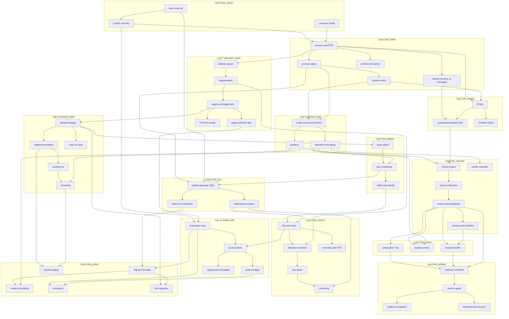

# KERNEL TRAIL - Curriculum Map

**Document 05. Companion to `00-DESIGN-BRIEF.md`, which is authoritative where the two disagree.**

Textbook: Silberschatz, Galvin and Gagne, *Operating System Concepts*, 10th edition.
Course model: UT Dallas CS/SE 4348, Operating Systems Concepts.

---

## 0. How to read this document

Every leg below is written against the frozen contracts in `src/game/types.ts` and
`src/kernel/types.ts`. Objectives are given as literal `LearningObjective` objects and
terminal commands as literal `TerminalCommandDef` objects, so a leg author can paste them
into `src/legs/<leg>/objectives.ts` and `commands.ts` without reinterpretation. Chapter
citations are given as literal `ChapterRef` objects.

Objective ids follow `obj.<leg_id>.<slug>`. Codex ids follow `codex.<topic>`. Both are
stable and are referenced by `RunState.objectivesMet`, `RunState.codexUnlocked` and
`Epitaph.codexEntry`. Renaming one is a breaking change to every save file.

Objective statements are written as things a player does and the simulator can see. A
statement that cannot be decided from a `KernelSnapshot` plus the event log is not an
objective and does not belong in this document.

### 0.1 Three citation corrections against the frozen types

The frozen contracts carry three section citations that do not match the 10th edition.
They are left in place because the interfaces are frozen, and the correct citations are
used throughout this document. Leg authors should cite the numbers in this column.

| Location in frozen code | Cited | Correct for 10th ed. | Note |
|---|---|---|---|
| `00-DESIGN-BRIEF.md`, pace to quantum row | 5.3.4 | 5.3.3 | 5.3.3 is Round-Robin, where the quantum is defined. 5.3.4 is Priority Scheduling. |
| `SafetyCheckResult.sequence` | 8.6.2 | 8.6.1 | Safe state and the safe sequence are 8.6.1. 8.6.2 is the resource-allocation-graph algorithm. |
| `DeadlockReport.cycle` | 8.3.2 | 8.7.1 | 8.3.2 is the resource-allocation graph. The wait-for graph and its cycle test are 8.7.1. |

`ProcessControlBlock.priority` citing 5.3.4 for "lower number is higher priority" is
correct and stays.

---

## Leg 0. THE BOOT SECTOR

`boot_sector`, index 0. Title: **The Boot Sector**. Subtitle: *Everything you want is on
the other side of a trap.*

### Chapter and section coverage

```ts
const chapters: readonly ChapterRef[] = [
  { chapter: 1, title: 'Introduction',
    sections: ['1.1', '1.2.1', '1.2.2', '1.3.1', '1.4.1', '1.4.2', '1.5', '1.6', '1.10.1'] },
  { chapter: 2, title: 'Operating-System Structures',
    sections: ['2.1', '2.2', '2.3', '2.3.1', '2.3.2', '2.3.3', '2.4', '2.8.1', '2.8.2', '2.9'] },
];
```

Section 1.7 (virtualization) is named once and deliberately left unexplained, so the
Portal has something to pay off. Sections 1.8, 1.9 and 1.11 are out of scope here and are
handled in the chapter audit.

### Prerequisite concepts

None. This leg assumes zero operating systems background, which is the stated audience.
It establishes the vocabulary every later leg depends on: process, resource, trap, mode,
and the idea that the kernel is code that runs only when something asks for it.

### Learning objectives

```ts
const objectives: readonly LearningObjective[] = [
  {
    id: 'obj.boot_sector.acquire_via_trap',
    statement: 'Acquires every starting resource by issuing a syscall trap at the depot rather than by writing to the resource pool directly, finishing outfitting with zero EPERM results in the syscall log.',
    chapter: { chapter: 2, title: 'Operating-System Structures', sections: ['2.3', '2.3.1'] },
    assessedBy: 'terminal_command',
  },
  {
    id: 'obj.boot_sector.mode_switch_budget',
    statement: 'Completes outfitting with total mode-switch overhead under 40 cycles while still leaving the Boot Sector with at least 120 cycles, 24 quota, 30 blocks and 40 bandwidth.',
    chapter: { chapter: 1, title: 'Introduction', sections: ['1.4.1', '1.4.2'] },
    assessedBy: 'decision',
  },
  {
    id: 'obj.boot_sector.classify_privilege',
    statement: 'Labels each of the six depot services as requiring kernel mode or user mode before purchasing it, and gets at least five of six right.',
    chapter: { chapter: 1, title: 'Introduction', sections: ['1.4.1'] },
    assessedBy: 'decision',
  },
  {
    id: 'obj.boot_sector.balanced_ledger',
    statement: 'Leaves the Boot Sector with no resource category at zero, so no later leg opens with a category already exhausted.',
    chapter: { chapter: 1, title: 'Introduction', sections: ['1.5'] },
    assessedBy: 'outcome',
  },
  {
    id: 'obj.boot_sector.consult_manual',
    statement: 'Resolves at least two unfamiliar depot terms with `man` before committing cycles to them.',
    chapter: { chapter: 2, title: 'Operating-System Structures', sections: ['2.2'] },
    assessedBy: 'terminal_command',
  },
  {
    id: 'obj.boot_sector.disc_class_tradeoff',
    statement: 'Selects a disc class and, at the confirmation gate, names which resource that class is short of, matching the class table.',
    chapter: { chapter: 1, title: 'Introduction', sections: ['1.5'] },
    assessedBy: 'decision',
  },
];
```

### Diegetic introduction

The convoy assembles on a plate of cold circuitry with a depot at one end and nothing
lit beyond it. A stack of storage blocks sits within arm's reach, and the obvious first
move is to take some. Reaching for them produces a hard stop and a single line of text:
`EPERM`. The depot clerk, an arbiter with no face, will hand over the same blocks if
asked through the window, and asking costs cycles the player can watch drain.

### The mechanic

The player spends `cycles` at six depot windows to buy into `quota`, `blocks` and
`bandwidth`. Each purchase is a `SyscallRequest` submitted through the window and every
submission charges a fixed trap cost of 4 cycles regardless of purchase size, so buying
in six small batches costs 24 cycles of pure overhead and buying in two costs 8. Before
each purchase the player picks kernel or user from a two-way toggle on the window; picking
user on a privileged service returns `EPERM` and burns the trap cost anyway. The player
also picks a `DiscClass`, which sets the starting ledger and the `classMultiplier` in
`ScoreBreakdown`. The terminal is available from the first second of the run.

### Assessment

`obj.boot_sector.acquire_via_trap` is met when the leg's syscall log contains at least six
`syscall.invoked` events with `result.ok === true` and zero with `errno === 'EPERM'`.
`obj.boot_sector.mode_switch_budget` is met when `cycles` spent on trap overhead is under
40 and the closing `ResourceLedger` meets or beats the four floors. `obj.boot_sector.
balanced_ledger` is met when `min(cycles, quota, blocks, bandwidth) > 0` at
`evaluate()`. `obj.boot_sector.consult_manual` is met when the terminal history contains
two or more `man` invocations naming distinct topics, both issued before the first
successful purchase of that topic's resource.

### Failure mode

There is no death in the Boot Sector, by design; permadeath with no information is
punishment rather than teaching. The failure is deferred and it is real. A player who
spends everything on cycles arrives in the Fork Fields with a quota too small to hold five
address spaces, and the first Program to be denied frames takes `out_of_memory` in leg 1
with an epitaph that names the Boot Sector purchase. A player who traps six separate times
arrives 24 cycles short and finds the Quantum Pass unaffordable at any pace above
conservative. The leg-complete debrief states the closing ledger against the recommended
floors and says which leg each shortfall will be felt in, without saying how to fix it.

### Terminal commands introduced

```ts
const terminalCommands: readonly TerminalCommandDef[] = [
  {
    name: 'man',
    usage: 'man <topic>',
    summary: 'Read the manual page for a command, a concept or an error code.',
    manual: [
      'man prints the manual page for a topic. A topic is a command name (man ps), a',
      'concept (man syscall), or an error code (man EPERM).',
      '',
      'Manual pages in this system are written to be read before you need them, which is',
      'not how anyone reads them. Reading one after a failure is the normal case and is',
      'expected. Every error message printed by this shell names the topic that explains',
      'it, so the error itself tells you what to type next.',
      '',
      'A manual page never tells you which choice to make. It tells you what the choice',
      'costs. The codex, which fills in as you encounter things, is where remedies live.',
      '',
      'See also: syscall, mode, codex.',
    ].join('\n'),
    chapter: { chapter: 2, title: 'Operating-System Structures', sections: ['2.2'] },
  },
  {
    name: 'syscall',
    usage: 'syscall <name> [args...]',
    summary: 'Issue a system call directly and print the result and its cost.',
    manual: [
      'syscall submits a request to the kernel on your behalf and prints what came back.',
      '',
      'A system call is not a function call. A function call jumps to another address in',
      'your own address space and costs a few ticks. A system call raises a trap: the',
      'processor stops executing your code, switches from user mode to kernel mode, runs',
      'kernel code that validates every argument you passed because it trusts none of',
      'them, switches back, and resumes you. That round trip is the mode-switch cost, and',
      'this shell charges you 4 cycles for it whether you asked for one block or one',
      'hundred. Batch your requests.',
      '',
      'The kernel validates arguments because a system call is the only door between code',
      'that may do anything and code that may not. If the kernel trusted your arguments,',
      'the door would not be a door.',
      '',
      'Results come back as ok with a value, or as an errno. Common errnos here:',
      '  EPERM   you asked for something your current mode does not permit',
      '  ENOMEM  the resource exists but there is not enough of it',
      '  EINVAL  the arguments were malformed; the trap still cost you 4 cycles',
      '',
      'Examples:',
      '  syscall brk 12          request 12 more quota',
      '  syscall open manifest   open the convoy manifest, returns a descriptor',
      '',
      'See also: mode, man EPERM.',
    ].join('\n'),
    chapter: { chapter: 2, title: 'Operating-System Structures', sections: ['2.3', '2.3.1', '2.3.2'] },
  },
  {
    name: 'mode',
    usage: 'mode [--history]',
    summary: 'Report the current processor mode and, with --history, every switch this leg.',
    manual: [
      'mode prints whether the processor is currently executing in user mode or kernel',
      'mode, and which Program it is executing on behalf of.',
      '',
      'There is one processor and one mode bit. When the bit says kernel, the running code',
      'may touch any memory and issue any instruction. When it says user, a large set of',
      'instructions fault instead of executing. The bit is hardware. No program can set it',
      'by asking politely; it flips on a trap, on an interrupt, and on nothing else.',
      '',
      'This is worth being precise about because two different ideas are often confused.',
      'Kernel mode is a processor state that lasts microseconds. An administrator account',
      'is a policy label that lasts for a login session. They are unrelated. The same',
      'Program in this convoy enters kernel mode dozens of times per leg and is never an',
      'administrator.',
      '',
      'mode --history prints every switch this leg with the cause: trap, interrupt, or',
      'return. If the count surprises you, that is the lesson. The kernel is not running',
      'alongside your Programs. It is running only in these intervals.',
      '',
      'See also: syscall, ring (available later).',
    ].join('\n'),
    chapter: { chapter: 1, title: 'Introduction', sections: ['1.4.1', '1.4.2'] },
  },
];
```

### Codex entries unlocked

| Id | One line |
|---|---|
| `codex.os_role` | What an operating system does: allocator, control program, and the thing that runs when nothing else may. |
| `codex.dual_mode` | The mode bit, why it is hardware, and what a mode switch costs. |
| `codex.syscall_trap` | The trap mechanism, argument validation, and why batching matters. |
| `codex.resource_ledger` | Cycles, quota, blocks and bandwidth, and which kernel resource each stands for. |
| `codex.kernel_structure` | Monolithic, layered and microkernel structures, and what each trades away. |

### Misconceptions targeted

**"A system call is just a library function with a fancy name."** Students who have
written `printf` believe they have made system calls all day and that nothing special
happened. The break is the first purchase: the player is offered the identical acquisition
twice on the same window, once as a direct reach and once through the trap. The direct
reach returns `EPERM` and costs nothing; the trap succeeds and costs 4 cycles, and the
cycle meter is on screen. The cost is the evidence that something structural happened.

**"The operating system is a program that runs alongside my program, like a background
service."** The break is `mode --history` combined with the CPU pillar in the world, which
has exactly one occupant slab. While the convoy stands idle at the depot, the pillar holds
a Program and the kernel cycle counter does not move. It moves only in the four-tick
intervals around each trap. A student who believes the kernel is always running expects a
steady drain and sees a flat line with spikes.

**"Kernel mode means being logged in as root or administrator."** This one survives entire
courses because both are described as "having permission". The break is placed at the disc
class gate: whichever class the player picks, the same Program is shown entering ring 0
during a trap and leaving it 4 cycles later, with its identity and its domain unchanged
across both. The `mode` man page states the distinction in the same words the world just
demonstrated, and `codex.dual_mode` holds it for reference when the Arbiter Wall raises it
again eleven legs later.

---

## Leg 1. THE FORK FIELDS

`fork_fields`, index 1. Title: **The Fork Fields**. Subtitle: *Everything you create is
yours until you collect it.*

### Chapter and section coverage

```ts
const chapters: readonly ChapterRef[] = [
  { chapter: 3, title: 'Processes',
    sections: ['3.1.1', '3.1.2', '3.1.3', '3.2.1', '3.2.2', '3.2.3',
               '3.3.1', '3.3.2', '3.4.1', '3.4.2', '3.5', '3.6.1', '3.6.2'] },
];
```

### Prerequisite concepts

From `boot_sector`: the syscall trap and its cost, the mode bit, the resource ledger. The
Fork Fields is where `fork`, `exec`, `wait` and `exit` stop being names on the depot
window and become the only way to get anything done.

### Learning objectives

```ts
const objectives: readonly LearningObjective[] = [
  {
    id: 'obj.fork_fields.reap_every_child',
    statement: 'Reaps every exited child with wait, so the process table holds zero entries in the zombie state when the leg ends.',
    chapter: { chapter: 3, title: 'Processes', sections: ['3.3.2'] },
    assessedBy: 'outcome',
  },
  {
    id: 'obj.fork_fields.read_the_pcb',
    statement: 'Uses ps -l on a blocked Program, names the PCB field that records what it is blocked on, and unblocks it by satisfying that condition rather than by killing and respawning it.',
    chapter: { chapter: 3, title: 'Processes', sections: ['3.1.3'] },
    assessedBy: 'terminal_command',
  },
  {
    id: 'obj.fork_fields.state_transitions',
    statement: 'Returns a waiting Program to ready by completing the event it waits on, producing a waiting-to-ready transition in the event log with no intervening new state.',
    chapter: { chapter: 3, title: 'Processes', sections: ['3.1.2'] },
    assessedBy: 'outcome',
  },
  {
    id: 'obj.fork_fields.switch_budget',
    statement: 'Crosses the fields in under 90 context switches by choosing the batched scouting route over the interleaved one.',
    chapter: { chapter: 3, title: 'Processes', sections: ['3.2.3'] },
    assessedBy: 'outcome',
  },
  {
    id: 'obj.fork_fields.ipc_channel_choice',
    statement: 'Assigns shared memory to the one high-volume transfer and message passing to the two low-volume ones, keeping total IPC cost under 25 cycles.',
    chapter: { chapter: 3, title: 'Processes', sections: ['3.4.1', '3.4.2', '3.5', '3.6.1'] },
    assessedBy: 'decision',
  },
  {
    id: 'obj.fork_fields.no_orphans',
    statement: 'Ends the leg with zero Programs carrying the orphaned affliction, either by reaping before the parent exits or by reparenting the child.',
    chapter: { chapter: 3, title: 'Processes', sections: ['3.3.2'] },
    assessedBy: 'survival',
  },
  {
    id: 'obj.fork_fields.exec_replaces',
    statement: 'Uses exec to replace a scout Program image in place when the task changes, rather than forking a second scout, keeping the live process count at or under 8.',
    chapter: { chapter: 3, title: 'Processes', sections: ['3.3.1'] },
    assessedBy: 'decision',
  },
];
```

### Diegetic introduction

The fields are wide and the route is unclear, so the convoy does the sensible thing and
sends copies of itself down the branches. A Program steps into a split gate and two come
out, identical, from the same point on the road. The scouts report back and stop moving.
They do not derezz and they do not leave. Within a hundred ticks the field is crowded with
motionless copies, and the next split gate refuses to open: `EAGAIN`.

### The mechanic

The player issues `fork` at split gates, `exec` at the retasking post and `wait` from the
terminal. Each fork spawns a real `ProcessSpec` with its own `addressSpaceId` and consumes
quota; each unreaped exit leaves a PCB in `zombie` state occupying a table slot. The table
has 16 slots and the leg needs 11 live processes at its peak, so roughly five unreaped
children are enough to jam it. `ps` lists the table with states; `wait <pid>` reaps one;
`wait -a` reaps all reapable children of the convoy. At the three data crossings the
player chooses an IPC channel: shared memory costs 8 cycles to set up and nothing per
message, message passing costs nothing to set up and 3 cycles per message. The
high-volume transfer sends 9 messages.

### Assessment

`obj.fork_fields.reap_every_child` is met when no PCB in the closing `KernelSnapshot` has
`state === 'zombie'` and the event log contains a `process.reaped` event for every
`process.exited` event. `obj.fork_fields.read_the_pcb` is met when a `ps -l` invocation on
a PCB with a non-null `blockedOn` is followed, before any `kill` on that pid, by the
syscall that satisfies that `BlockReason`. `obj.fork_fields.switch_budget` is met when
`SchedulingMetrics.contextSwitches` is under 90. `obj.fork_fields.ipc_channel_choice` is
met when the shared-memory channel is bound to the 9-message transfer and total cycles
charged to IPC is under 25.

### Failure mode

The process table fills. `fork` returns `EAGAIN`, the scout that would have found the
route is never created, and the Program that needed it acquires `orphaned` (2 integrity
per travel tick, fatal after 60). If integrity reaches zero the Program derezzes with
`TerminationReason: 'out_of_memory'`, because what ran out was kernel table space rather
than user memory, and the epitaph says exactly that. The inscription is in the Oregon
Trail register; the `cause` line under it reads "the process table was full of children
that had already exited. A terminated process holds its slot until its parent collects its
exit status." It links `codex.zombie_orphan`.

The instructive wrong remedy is available and does not work. `kill <zombie-pid>` returns
ok and changes nothing, because a signal delivered to a process that has already exited is
delivered to nobody. `kill <parent-pid>` does clear the zombies, by reparenting them to
the init Program which reaps them immediately, and it costs the player the parent. That
outcome is recorded as `outcome: 'costly'` in the decision log and the debrief names the
cheaper move.

### Terminal commands introduced

```ts
const terminalCommands: readonly TerminalCommandDef[] = [
  {
    name: 'ps',
    usage: 'ps [-l] [-e] [pid...]',
    summary: 'List processes and their control blocks.',
    manual: [
      'ps prints one line per process. With -l it prints the long form, which is a',
      'readable dump of the process control block.',
      '',
      'The PCB is the process, as far as the kernel is concerned. A process is not the',
      'code; several processes can run the same code. A process is this record plus the',
      'address space it points at. When the scheduler switches away from a process, every',
      'register it was using is copied into this record, and copied back out when it runs',
      'again. That copy is the context switch, and it is why switching is not free.',
      '',
      'Columns in the long form:',
      '  PID     process id',
      '  PPID    parent process id. Every process except the first has one.',
      '  STATE   new, ready, running, waiting, terminated, or zombie',
      '  PRI     priority. Lower is more urgent.',
      '  BURST   ticks of CPU still needed by the current burst',
      '  SVC     total service time still required, across all bursts',
      '  BLOCKED what this process is waiting for, if anything',
      '  AS      address space id',
      '',
      'STATE is worth reading carefully. running means it holds the processor right now,',
      'and exactly one process can. ready means it could run and is waiting for a turn.',
      'waiting means it could not run even if offered the processor, because it is waiting',
      'for an event; the BLOCKED column names the event. zombie means it has already',
      'exited and is holding its slot until its parent collects it.',
      '',
      'A process in waiting will never be helped by giving it more processor time. Look at',
      'BLOCKED and satisfy that instead.',
      '',
      'See also: wait, kill, pstree, top.',
    ].join('\n'),
    chapter: { chapter: 3, title: 'Processes', sections: ['3.1.2', '3.1.3'] },
  },
  {
    name: 'wait',
    usage: 'wait <pid> | wait -a',
    summary: 'Collect the exit status of a terminated child and free its table slot.',
    manual: [
      'wait blocks the caller until the named child terminates, then returns its exit',
      'status and releases its process table slot. With -a it reaps every child of the',
      'convoy that has already exited, without blocking.',
      '',
      'This is the step everyone forgets. When a process exits it does not disappear. It',
      'moves to the zombie state and keeps its PCB, because its exit status has to be',
      'stored somewhere until its parent asks for it. The kernel cannot know whether the',
      'parent cares. So the slot is held.',
      '',
      'A zombie uses no processor time at all. Check it with top: it sits at zero percent',
      'forever. The resource it exhausts is the process table, which is a fixed-size array',
      'in kernel memory. When the table is full, fork fails with EAGAIN, and the failure',
      'appears in a process that has nothing to do with the zombies.',
      '',
      'You cannot kill a zombie. It has already exited; there is nothing left to signal.',
      'Only its parent can clear it, by calling wait. If the parent is gone, the child is',
      'reparented to the first process, which reaps continuously, and the problem solves',
      'itself at the cost of the parent.',
      '',
      'See also: ps, kill, man EAGAIN, codex zombie_orphan.',
    ].join('\n'),
    chapter: { chapter: 3, title: 'Processes', sections: ['3.3.2'] },
  },
  {
    name: 'kill',
    usage: 'kill [-s <signal>] <pid>',
    summary: 'Send a signal to a running process.',
    manual: [
      'kill sends a signal to a process. The name is misleading: most signals do not',
      'terminate anything, and the default signal can be caught and ignored.',
      '',
      'Signals reach a process only while it exists. A process in the zombie state has',
      'already exited, so a signal to it succeeds and does nothing. If you find yourself',
      'killing zombies, read wait instead.',
      '',
      'Killing a parent has consequences you should predict before you type it. Its',
      'children become orphans and are reparented. In this system that means they are',
      'collected immediately, which does clear a jammed process table, and it also means',
      'you have spent a Program to avoid typing wait.',
      '',
      'Signals:',
      '  -s term   ask the process to exit. It may decline.',
      '  -s kill   remove it from the table. It cannot decline and cannot clean up.',
      '            Anything it held, including locks, is held forever.',
      '',
      'That last line matters more than it looks. A process killed with -s kill while',
      'holding a mutex does not release the mutex. You will meet this again at the ford.',
      '',
      'See also: ps, wait, nice.',
    ].join('\n'),
    chapter: { chapter: 3, title: 'Processes', sections: ['3.3.2'] },
  },
  {
    name: 'pstree',
    usage: 'pstree [pid]',
    summary: 'Show the process hierarchy as a tree of parents and children.',
    manual: [
      'pstree draws the parent-child hierarchy rooted at the given process, or at the',
      'first process if none is given.',
      '',
      'Processes form a tree because fork is the only way to make one. A new process is',
      'always a copy of an existing one, which is why every process has exactly one parent',
      'and why the tree has a single root. exec does not make a new process; it replaces',
      'the program running inside an existing one, so the tree does not change shape when',
      'you exec, only the label does.',
      '',
      'Zombies are drawn in the tree with a hollow marker. Their position tells you which',
      'parent owes you a wait call.',
      '',
      'See also: ps, wait.',
    ].join('\n'),
    chapter: { chapter: 3, title: 'Processes', sections: ['3.3.1'] },
  },
  {
    name: 'ipc',
    usage: 'ipc [--channels] [--bind <channel> <transfer>]',
    summary: 'List interprocess communication channels and bind a transfer to one.',
    manual: [
      'ipc lists the channels available for moving data between address spaces, and binds',
      'a pending transfer to one.',
      '',
      'Two processes cannot read each other memory. That is the whole point of an address',
      'space, and it is enforced by hardware. So passing data between them requires the',
      'kernel to cooperate, and there are two shapes that cooperation takes.',
      '',
      'Shared memory: the kernel maps one region of physical memory into both address',
      'spaces. Setup costs a syscall. After that, the processes read and write it directly',
      'at memory speed with no kernel involvement per message. The kernel has also stopped',
      'protecting them from each other in that region, so they must arrange their own',
      'mutual exclusion. You will do that at the ford.',
      '',
      'Message passing: each send and each receive is a syscall, so the kernel copies the',
      'data and the cost is per message. Nothing is shared, so nothing can be corrupted by',
      'a badly timed write. It is the safer shape and the slower one.',
      '',
      'The rule that follows: many small messages favour message passing, few large ones',
      'favour shared memory. Count before you bind.',
      '',
      '  ipc --channels                  list channels and their costs',
      '  ipc --bind shm survey_dump      bind the survey transfer to shared memory',
      '',
      'See also: man shared_memory, codex ipc_models.',
    ].join('\n'),
    chapter: { chapter: 3, title: 'Processes', sections: ['3.4.1', '3.5', '3.6.1'] },
  },
];
```

### Codex entries unlocked

| Id | One line |
|---|---|
| `codex.process_concept` | A process is a program in execution plus the state that makes it resumable. |
| `codex.pcb` | Every field of the process control block and which subsystem writes it. |
| `codex.process_states` | The five-state diagram, plus zombie, and which transitions are legal. |
| `codex.context_switch` | What is saved, what it costs, and why it is pure overhead. |
| `codex.fork_exec` | Why creation and program loading are separate operations. |
| `codex.zombie_orphan` | Why exited processes linger, what an orphan is, and who cleans up. |
| `codex.ipc_models` | Shared memory against message passing, with the cost crossover. |

### Misconceptions targeted

**"fork returns once, and the child starts from the top of the program."** Students who
have only used higher-level spawn APIs read `fork()` as "start this other thing". The
break is the split gate itself, which is built to be visually unambiguous: one runner
enters, two leave, both from the same point on the road, both carrying the same partially
completed task, and each with a different number lit on its disc. The player is then given
a branch that can only be resolved by reading that number, so proceeding requires
accepting that both copies are executing the same instruction at the same place with
different return values. There is no way to pass the gate under the wrong model.

**"A zombie is a runaway process eating CPU."** The word invites it. The break is placed at
the moment `fork` first returns `EAGAIN`: the player's instinct is to look for something
consuming resources, and `top` shows every zombie at 0.0% CPU with the processor 40% idle.
The resource that ran out is a table, and the leg makes the player find that out by
elimination. `ps` shows 14 of 16 slots used and 5 of them in `zombie`.

**"Killing the zombie fixes it."** This is the direct consequence of the previous belief
and it is the most common wrong move at this moment in a real course. The game lets the
player make it: `kill` on a zombie returns success. Nothing changes. The success is the
teaching, because it forces the question of what a signal is delivered to. The `kill` man
page answers it in one sentence and points at `wait`, and the decision log marks the
attempt so the debrief can show the player the sequence they typed.

---
## Leg 2. THE WEAVE

`the_weave`, index 2. Title: **The Weave**. Subtitle: *Eight strands, one bridge.*

### Chapter and section coverage

```ts
const chapters: readonly ChapterRef[] = [
  { chapter: 4, title: 'Threads & Concurrency',
    sections: ['4.1.1', '4.1.2', '4.2', '4.2.1', '4.2.2',
               '4.3.1', '4.3.2', '4.3.3', '4.5.1', '4.5.2',
               '4.6.1', '4.6.3', '4.6.4'] },
];
```

Amdahl's Law is presented within 4.2 in the 10th edition rather than as a numbered
subsection; the leg cites `4.2` for it and the codex entry quotes the formula.

### Prerequisite concepts

From `fork_fields`: process, address space, PCB, context switch cost, the fact that two
processes cannot read each other's memory. The Weave depends on that last point completely,
because its whole content is what changes when that protection is removed.

### Learning objectives

```ts
const objectives: readonly LearningObjective[] = [
  {
    id: 'obj.the_weave.speedup_prediction',
    statement: 'Sets the strand count for the weave crossing so that measured speedup lands within 15 percent of the Amdahl prediction for the segment stated serial fraction.',
    chapter: { chapter: 4, title: 'Threads & Concurrency', sections: ['4.2'] },
    assessedBy: 'outcome',
  },
  {
    id: 'obj.the_weave.stop_adding_strands',
    statement: 'Stops adding strands at or before the point where the next strand buys under 3 percent additional speedup, and finishes the leg with at least 20 percent of bandwidth unspent.',
    chapter: { chapter: 4, title: 'Threads & Concurrency', sections: ['4.2', '4.2.1'] },
    assessedBy: 'decision',
  },
  {
    id: 'obj.the_weave.shared_versus_private',
    statement: 'Places the running tally in shared state and the per-strand scratch counters in thread-local storage, producing zero false_sharing events on the tally slab.',
    chapter: { chapter: 4, title: 'Threads & Concurrency', sections: ['4.1.2', '4.6.4'] },
    assessedBy: 'outcome',
  },
  {
    id: 'obj.the_weave.model_choice',
    statement: 'Selects one-to-one mapping for the segment containing a blocking read, so that no single blocked strand stalls the other strands of the same Program.',
    chapter: { chapter: 4, title: 'Threads & Concurrency', sections: ['4.3.1', '4.3.2'] },
    assessedBy: 'decision',
  },
  {
    id: 'obj.the_weave.pool_sizing',
    statement: 'Sizes the strand pool so that no queued task waits more than 20 ticks for a worker and no worker idles for more than 30 percent of the segment.',
    chapter: { chapter: 4, title: 'Threads & Concurrency', sections: ['4.5.1'] },
    assessedBy: 'outcome',
  },
  {
    id: 'obj.the_weave.deferred_cancellation',
    statement: 'Cancels the runaway strand at a declared cancellation point rather than immediately, so the shared tally is left consistent and no fs.corruption event follows.',
    chapter: { chapter: 4, title: 'Threads & Concurrency', sections: ['4.6.3'] },
    assessedBy: 'terminal_command',
  },
  {
    id: 'obj.the_weave.concurrency_versus_parallelism',
    statement: 'Correctly labels the single-core segment as concurrent and the four-core segment as parallel at the checkpoint gate, having measured both.',
    chapter: { chapter: 4, title: 'Threads & Concurrency', sections: ['4.1.1'] },
    assessedBy: 'decision',
  },
];
```

### Diegetic introduction

The Weave is a braid of lanes running side by side, and a Program can enter it as several
strands of itself at once. The first braid rewards this exactly as expected: two strands,
roughly half the time. The player adds strands. At four, the gain is smaller than it
should be. At eight it is barely there. Ahead, where all lanes converge, there is a
single-file bridge, and every strand has to cross it alone.

### The mechanic

The player sets a strand count from 1 to 16 per Program per segment, using the strand dial
at the loom anchor. Each strand costs bandwidth to create and adds context switch load. At
the model gate the player picks many-to-one, one-to-one or many-to-many for the next
segment. At the tally slab the player drags each of five variables into either the shared
region or the thread-local region. The strand pool at the second braid has a size dial and
a live queue the player can watch. `amdahl` computes the predicted ceiling from a serial
fraction the segment posts openly, so the player can predict before choosing rather than
tune by trial.

### Assessment

`obj.the_weave.speedup_prediction` is met when
`abs(measured / predicted - 1) < 0.15` for the chosen strand count, computed from the
segment's tick count against the single-strand baseline the leg records at entry.
`obj.the_weave.stop_adding_strands` is met when the highest strand count the player
committed is at or below the first N where marginal speedup drops under 0.03, and closing
`bandwidth` is at least 20 percent of the leg's opening bandwidth.
`obj.the_weave.shared_versus_private` is met when zero `false_sharing` afflictions were
acquired and the tally value at segment end equals the sum the leg computed serially.
`obj.the_weave.pool_sizing` is met from the pool's own instrumentation: max queue wait
under 20 ticks and worker idle fraction under 0.30.

### Failure mode

Over-threading. Past roughly six strands on a four-core segment the context switch count
climbs faster than the work completes, cache lines bounce between cores, and the strands
begin acquiring `cache_thrash` (1 integrity per travel tick, drains only) and
`false_sharing` (1.5 per tick, drains only) if the tally was left shared without padding.
Neither is fatal on its own, which is deliberate: the Weave is the relief slope before the
Quantum Pass and it should hurt without killing. If a Program does reach zero integrity
here it derezzes with `TerminationReason: 'thrashing_collapse'`, and the epitaph names
cache thrashing rather than page thrashing so the two are separated from the first
encounter. LUMEN's 15 percent service reduction masks the problem slightly, which is a
trap worth knowing about: a convoy that still has LUMEN will over-thread further before
noticing.

The remedy is to reduce the strand dial, which is `{ kind: 'reduce_degree', by: 2 }`, and
to pad or privatise the tally.

### Terminal commands introduced

```ts
const terminalCommands: readonly TerminalCommandDef[] = [
  {
    name: 'threads',
    usage: 'threads [pid] [--tls] [--cancel <tid>] [--mode deferred|async]',
    summary: 'List the strands of a Program, inspect thread-local storage, and cancel one.',
    manual: [
      'threads lists the threads inside a process, with the state of each.',
      '',
      'A thread has its own program counter, registers and stack, and shares everything',
      'else with the other threads of the same process: the code, the heap, the open file',
      'descriptors, the address space. That sharing is the entire reason threads are',
      'cheap to create and cheap to switch between, and it is the entire reason they are',
      'dangerous. Two processes cannot corrupt each other memory. Two threads do it by',
      'default.',
      '',
      '--tls shows which variables are thread-local. A thread-local variable has one copy',
      'per thread, so writes from different threads cannot collide. Anything the threads',
      'genuinely share has to be shared, and has to be protected. Anything they do not',
      'share should be thread-local, and putting it there costs nothing.',
      '',
      '--cancel asks a thread to stop. Read --mode before you use it.',
      '  deferred  the thread stops at the next declared cancellation point, having',
      '            finished whatever partial update it was in the middle of.',
      '  async     the thread stops immediately, wherever it is. If it was halfway',
      '            through updating shared state, that state stays halfway updated, and',
      '            if it held a lock, it still holds it.',
      'deferred is the correct default and async is for the case where correctness has',
      'already been lost.',
      '',
      'See also: amdahl, top -H, codex tls.',
    ].join('\n'),
    chapter: { chapter: 4, title: 'Threads & Concurrency', sections: ['4.1.2', '4.6.3', '4.6.4'] },
  },
  {
    name: 'amdahl',
    usage: 'amdahl --serial <fraction> --cores <n> [--strands <n>]',
    summary: 'Compute the speedup ceiling for a workload with a fixed serial fraction.',
    manual: [
      'amdahl prints the best speedup achievable for a workload, given the fraction of it',
      'that cannot be done in parallel.',
      '',
      '  speedup <= 1 / (S + (1 - S) / N)',
      '',
      'S is the serial fraction and N is the number of processing cores. The formula says',
      'something blunt: as N grows without limit, speedup approaches 1/S and stops. A',
      'workload that is 25 percent serial can never go more than four times faster, on any',
      'machine, ever, no matter how many cores you buy.',
      '',
      'Two consequences worth carrying:',
      '',
      'First, the ceiling is set by the serial part, so effort spent shrinking S is worth',
      'more than effort spent adding cores once N is past a handful. On this crossing the',
      'single-file bridge is S. You can pick a route with a shorter bridge.',
      '',
      'Second, N in the formula is cores, not threads. Adding threads beyond the core count',
      'does not increase N. It increases the number of things competing for the same N',
      'cores, which adds switching overhead and buys nothing. The formula has no term for',
      'that overhead, so real speedup falls below the ceiling rather than reaching it.',
      '',
      '  amdahl --serial 0.3 --cores 4     print the ceiling for this segment',
      '',
      'See also: threads, codex amdahl.',
    ].join('\n'),
    chapter: { chapter: 4, title: 'Threads & Concurrency', sections: ['4.2'] },
  },
  {
    name: 'top',
    usage: 'top [-H] [-n <rows>]',
    summary: 'Live view of processor use, per process or, with -H, per thread.',
    manual: [
      'top refreshes a live table ordered by processor use.',
      '',
      'Read the summary line first. It splits processor time into: user, work done in user',
      'mode; sys, work done in the kernel on behalf of a process; and idle, nobody wanted',
      'it. A high sys number with low throughput usually means the system is spending its',
      'time switching or trapping rather than computing.',
      '',
      '-H expands each process into its threads. Use it on the weave: a process showing 95',
      'percent total that is eight threads at 12 percent each is behaving differently from',
      'one thread at 95 percent, and the difference decides whether more strands will help.',
      '',
      'Idle time is not always waste. A pool with 20 percent worker idle and no queued task',
      'waiting is correctly sized. A pool with 0 percent idle and a queue is undersized.',
      '',
      'See also: ps, threads, vmstat, iostat.',
    ].join('\n'),
    chapter: { chapter: 4, title: 'Threads & Concurrency', sections: ['4.1.1'] },
  },
];
```

### Codex entries unlocked

| Id | One line |
|---|---|
| `codex.thread_concept` | What a thread owns and what it shares, against the process it lives in. |
| `codex.concurrency_vs_parallelism` | Interleaved progress against simultaneous execution, and why one core gives only the first. |
| `codex.amdahl` | The speedup ceiling, with the worked numbers from this leg's bridge. |
| `codex.multithreading_models` | Many-to-one, one-to-one and many-to-many, and what each does when a thread blocks. |
| `codex.thread_pool` | Why creation cost pushes you to reuse workers, and how to size the pool. |
| `codex.false_sharing` | Two threads, two variables, one cache line, and the invisible contention. |
| `codex.tls` | Thread-local storage as the cheapest correctness fix available. |

### Misconceptions targeted

**"Threads make a program faster in proportion to how many you create."** The break is
staged in two parts so the player cannot dismiss the first as noise. The braid pays out
near-linear speedup at two strands, which confirms the belief. Then the same dial at four
and eight returns 1.7x and 1.9x on a segment whose serial fraction is posted on a sign at
the entrance. `amdahl --serial 0.4 --cores 4` prints 2.1, and the measured 1.9 sits just
under it. The gap between belief and measurement is made checkable rather than asserted.

**"Threads have their own memory, like small processes."** The break is the tally slab.
The player is asked to have eight strands each add 1000 to a shared counter and the result
is not 8000, visibly, on a lit slab in the world. The same experiment run with eight forked
processes produces eight separate slabs each reading 1000, because each has its own address
space. The two results side by side make the distinction concrete before any lock is
introduced, which is what sets up the Narrows.

**"Concurrency and parallelism are two words for the same thing."** Almost every student
uses them interchangeably and almost every textbook treats the distinction as a definition
to be memorised. The break is a measurement. The first braid is single-core: eight strands
finish the batch in the same wall time as one strand, and the strand ribbons visibly
interleave on one lane. The second braid is four-core: the same eight strands finish in
roughly a quarter of the time, and four ribbons move at once. At the checkpoint gate the
player must label which braid was which, and the gate does not open on a wrong label.

---

## Leg 3. QUANTUM PASS

`quantum_pass`, index 3. Title: **Quantum Pass**. Subtitle: *Someone has to go last.*

### Chapter and section coverage

```ts
const chapters: readonly ChapterRef[] = [
  { chapter: 5, title: 'CPU Scheduling',
    sections: ['5.1.1', '5.1.2', '5.1.3', '5.2',
               '5.3.1', '5.3.2', '5.3.3', '5.3.4', '5.3.5', '5.3.6',
               '5.4', '5.5.1', '5.8.1', '5.8.2'] },
];
```

Section 5.6 (real-time scheduling) is touched only by the deadline flag on one workload
and is listed as partial in the audit.

### Prerequisite concepts

From `fork_fields`: PCB fields `cpuBurstRemaining`, `serviceRemaining`, `priority`,
`readySince`, the ready state, and the measured cost of a context switch. From `the_weave`:
that more runnable work than cores means queueing. Quantum Pass is the first leg where a
policy the player set can kill a Program, and it is placed here because the player now has
the vocabulary to read why.

### Learning objectives

```ts
const objectives: readonly LearningObjective[] = [
  {
    id: 'obj.quantum_pass.waiting_time_target',
    statement: 'Brings average waiting time across the pass below 12 ticks with zero process.starving events marked fatal.',
    chapter: { chapter: 5, title: 'CPU Scheduling', sections: ['5.2'] },
    assessedBy: 'outcome',
  },
  {
    id: 'obj.quantum_pass.sjf_is_optimal',
    statement: 'Runs the same arrival set under at least three non-preemptive policies with gantt --replay and identifies shortest-job-first as the one with the lowest average waiting time, recording the margin.',
    chapter: { chapter: 5, title: 'CPU Scheduling', sections: ['5.3.2', '5.8.2'] },
    assessedBy: 'terminal_command',
  },
  {
    id: 'obj.quantum_pass.quantum_sizing',
    statement: 'Sets a round-robin quantum between 1.2 and 4 times the median burst, holding context switch overhead under 10 percent of total CPU while average response time stays under 8 ticks.',
    chapter: { chapter: 5, title: 'CPU Scheduling', sections: ['5.3.3'] },
    assessedBy: 'decision',
  },
  {
    id: 'obj.quantum_pass.clear_starvation',
    statement: 'Clears an active starvation affliction within 20 ticks of the first warning, by switching to priority_aging or by raising the starved Program priority with nice.',
    chapter: { chapter: 5, title: 'CPU Scheduling', sections: ['5.3.4'] },
    assessedBy: 'survival',
  },
  {
    id: 'obj.quantum_pass.avoid_convoy_effect',
    statement: 'Declines first-come-first-served on the segment where one long CPU-bound Program arrives ahead of four short ones, finishing at least 30 percent below the recorded FCFS waiting-time baseline.',
    chapter: { chapter: 5, title: 'CPU Scheduling', sections: ['5.3.1'] },
    assessedBy: 'decision',
  },
  {
    id: 'obj.quantum_pass.tune_mlfq',
    statement: 'Configures multilevel feedback queue level quanta so the two interactive Programs remain at level 0 and the CPU-bound Program descends at least two levels, with no Program left below its aging interval at the end of the segment.',
    chapter: { chapter: 5, title: 'CPU Scheduling', sections: ['5.3.5', '5.3.6'] },
    assessedBy: 'outcome',
  },
  {
    id: 'obj.quantum_pass.switch_rate',
    statement: 'Holds context switches under one per six ticks of simulated CPU while running a preemptive policy.',
    chapter: { chapter: 5, title: 'CPU Scheduling', sections: ['5.1.3', '5.3.3'] },
    assessedBy: 'outcome',
  },
];
```

### Diegetic introduction

The pass narrows to a single ledge that takes one runner at a time. The convoy queues.
Under the policy the convoy has carried since the Boot Sector, first come first served, the
order is settled by arrival, and the Program at the front is a heavy compile with a long
burst. Everyone else stands still behind it, including three Programs whose whole job is a
short check and a return. The wait counter above KESTREL starts climbing and does not stop.

### The mechanic

The player sets `SchedulerId` at the ledge control (all seven policies are available),
sets `quantum`, `agingInterval` and the MLFQ `levelQuanta` array, and can `nice` an
individual pid. `Pace` maps onto quantum through the standard table: conservative 12,
steady 8, aggressive 4, reckless 1. The Gantt ribbon runs along the ledge wall in the
world, drawn from the live event log, with context switch cost rendered as a visible gap.
`gantt --replay <policy>` re-runs the recorded arrival set under a different policy and
prints both ribbons, which is the leg's central instrument and the first appearance of the
counterfactual machinery the end-of-run report is built on.

### Assessment

`obj.quantum_pass.waiting_time_target` reads `SchedulingMetrics.averageWaitingTime < 12`
at `evaluate()` with zero `process.starving` events carrying `fatal: true`.
`obj.quantum_pass.sjf_is_optimal` requires at least three `gantt --replay` invocations
naming distinct non-preemptive policies, followed by the player committing SJF for the
segment. `obj.quantum_pass.quantum_sizing` compares the committed quantum against the
median `burst` of the segment's `ProcessSpec` set, and reads
`contextSwitches * SWITCH_COST / totalCpuTicks < 0.10` together with
`averageResponseTime < 8`. `obj.quantum_pass.tune_mlfq` reads `queueLevel` per PCB at
segment end against the required distribution.

### Failure mode

Starvation, and it is the first policy death in the game. Under `priority` with aging
disabled, the lowest-priority Program in the convoy stops being selected. `readySince`
stops advancing toward `lastScheduledTick`. At `starvationThreshold` a
`process.starving` event fires with `fatal: false` and the Program acquires the
`starvation` affliction (2.5 integrity per travel tick, fatal after 45). At
`starvationFatalThreshold` it derezzes with `TerminationReason: 'starvation'`. SABLE
survives three times the normal threshold, so a convoy that still has SABLE gets a longer
warning window and a player who does not read the warning still loses somebody else.

The remedy is `{ kind: 'set_scheduler', to: 'priority_aging' }` or
`{ kind: 'terminal', command: 'nice' }`. The instructive wrong remedy is raising the
quantum, which does nothing at all under a priority policy because the quantum is not what
is excluding the Program, and the game lets the player try it and watch the counter keep
climbing. The epitaph cause line reads: "it was ready to run for 340 consecutive ticks. A
priority policy with no aging will pick a higher-priority process every single time one
exists."

### Terminal commands introduced

```ts
const terminalCommands: readonly TerminalCommandDef[] = [
  {
    name: 'sched',
    usage: 'sched [--policy <id>] [--quantum <n>] [--aging <n>] [--levels <n,n,n>]',
    summary: 'Read or set the CPU scheduling policy and its parameters.',
    manual: [
      'sched with no arguments prints the current policy, its parameters, and the live',
      'metrics. With arguments it changes the policy immediately, on the running system.',
      '',
      'Policies:',
      '  fcfs            run to completion in arrival order. Simple and fair in the weakest',
      '                  sense of fair. One long job at the front makes everyone behind it',
      '                  wait for all of it. That is the convoy effect and it is why this',
      '                  policy is a teaching example rather than a choice.',
      '  sjf             pick the shortest next burst. Provably gives the minimum average',
      '                  waiting time for a fixed set of jobs. Requires knowing burst',
      '                  lengths in advance, which no real system does; see --estimate.',
      '  srtf            preemptive sjf. A shorter arrival preempts the running job.',
      '                  Better average waiting time, more switches, and long jobs can be',
      '                  pushed back indefinitely.',
      '  priority        pick the lowest priority number. Nothing guarantees a high number',
      '                  ever runs. This policy starves processes. It is not a defect in',
      '                  the implementation.',
      '  priority_aging  the same, plus every process gains a priority level for each',
      '                  --aging ticks it spends ready without running. Starvation becomes',
      '                  impossible because waiting is itself a path to the front.',
      '  rr              each ready process gets --quantum ticks in turn. Response time is',
      '                  bounded by (n-1) * quantum, which is the property interactive',
      '                  work needs. Average waiting time is worse than sjf.',
      '  mlfq            several round-robin queues at different levels. A process that',
      '                  uses its whole quantum drops a level; a process that blocks early',
      '                  stays. This separates interactive work from CPU-bound work',
      '                  without being told which is which.',
      '',
      'On --quantum. There is a floor and a ceiling and both hurt. Set it near 1 and the',
      'system spends its time saving and restoring registers; measure it with top and watch',
      'sys climb while throughput falls. Set it far above the typical burst and round robin',
      'degenerates into fcfs, because everyone finishes before being preempted. The useful',
      'range is a small multiple of the typical burst: long enough that most bursts finish',
      'inside one slice, short enough that response time stays bounded.',
      '',
      'On --aging. Zero disables it. Any nonzero value makes starvation impossible under',
      'priority, at the cost of letting low-priority work eventually displace high-priority',
      'work. That trade is the point.',
      '',
      'See also: gantt, nice, top, codex scheduling_criteria.',
    ].join('\n'),
    chapter: { chapter: 5, title: 'CPU Scheduling', sections: ['5.3.1', '5.3.2', '5.3.3', '5.3.4', '5.3.6'] },
  },
  {
    name: 'nice',
    usage: 'nice [-n <delta>] <pid>',
    summary: 'Adjust one process priority number.',
    manual: [
      'nice changes the priority of a running process by the given delta.',
      '',
      'The number is a priority, and in this system, as in Silberschatz, a lower number',
      'means more urgent. nice -n -5 makes a process more likely to run. nice -n 5 makes it',
      'less likely. The name comes from being nice to other processes by lowering your own',
      'claim, which is why the sign reads backwards from what most people expect the first',
      'time.',
      '',
      'nice is a blunt instrument and it is worth knowing what it cannot do. It does not',
      'give a process more processor time in absolute terms; it changes its position in a',
      'comparison against other ready processes. Under fcfs it has no effect at all, because',
      'fcfs never consults priority. Under round robin it has no effect either. It matters',
      'under priority, priority_aging and mlfq.',
      '',
      'Using nice to rescue a starving process works, once. It fixes this process now. It',
      'does not fix the policy that starved it, and the next process down will starve in',
      'exactly the same way. Aging fixes the policy.',
      '',
      'See also: sched --aging, ps -l, codex starvation.',
    ].join('\n'),
    chapter: { chapter: 5, title: 'CPU Scheduling', sections: ['5.3.4'] },
  },
  {
    name: 'gantt',
    usage: 'gantt [--last <ticks>] [--replay <policy>] [--metrics]',
    summary: 'Draw the execution timeline, and replay the same arrivals under another policy.',
    manual: [
      'gantt draws which process held the processor during each tick, as a chart. Gaps are',
      'context switches and idle time, drawn to scale, so overhead is visible as area rather',
      'than quoted as a number.',
      '',
      '--metrics prints the four numbers that decide whether a policy is doing well:',
      '  waiting time     total time ready but not running. Minimise this for throughput.',
      '  turnaround time  arrival to completion. Waiting time plus service time.',
      '  response time    arrival to first run. Minimise this for anything a human waits on.',
      '  cpu utilisation  fraction of ticks doing work rather than switching or idling.',
      'These conflict. A policy that minimises response time will switch often and lose',
      'utilisation to overhead. Deciding which number matters is the scheduling problem;',
      'the algorithms are just answers to different versions of it.',
      '',
      '--replay re-runs the exact arrival times and burst lengths you already experienced,',
      'under a different policy, and prints both charts. The run is deterministic, so this',
      'is a real comparison rather than an estimate. It is the only honest way to answer',
      'the question "would something else have been better", and you can ask it after the',
      'fact, which is when the question usually occurs to people.',
      '',
      '  gantt --replay sjf      what the last segment looked like under sjf',
      '',
      'See also: sched, top, codex scheduling_criteria.',
    ].join('\n'),
    chapter: { chapter: 5, title: 'CPU Scheduling', sections: ['5.2', '5.8.1', '5.8.2'] },
  },
];
```

### Codex entries unlocked

| Id | One line |
|---|---|
| `codex.scheduling_criteria` | The five criteria, and which pairs of them cannot be maximised together. |
| `codex.fcfs_convoy` | First come first served and the convoy effect, with this leg's numbers. |
| `codex.sjf_optimality` | Why SJF minimises average waiting time and why that does not make it usable. |
| `codex.round_robin` | The quantum, response-time bound, and the two ways to set it wrong. |
| `codex.priority_starvation` | Priority scheduling, indefinite blocking, and aging as the structural fix. |
| `codex.mlfq` | Feedback queues as a way to infer job type from behaviour. |
| `codex.preemption_cost` | What preemption buys and what it charges. |

### Misconceptions targeted

**"Priority scheduling means important work finishes sooner, and starvation is a rare
corner case."** Students treat starvation as a footnote because it is usually presented as
one. The break is the leg's default configuration: the pass opens under `priority` with
`agingInterval: 0`, which is a legal and common configuration, and the convoy contains one
Program with a high priority number. It never runs. Not rarely, never, for 340 consecutive
ticks, with the wait counter over its head the whole time. The player watches indefinite
blocking happen on a normal workload with no adversarial input, which is the actual claim
the textbook makes and which almost nobody believes until they see it.

**"Smaller quantum is more responsive, so the smallest quantum is best."** Half true, which
is what makes it durable. The break is the reckless pace setting, which is quantum 1. The
Gantt ribbon fills with switch gaps until the gaps are wider than the work bands, and
`gantt --metrics` shows response time improved by 0.4 ticks while utilisation fell 22
points and throughput fell with it. The player sees both halves of the trade in one chart,
which is why the ribbon draws overhead to scale rather than reporting it.

**"SJF works because the OS knows how long each job will take."** Students accept SJF as
practical because the textbook presents the worked example with burst lengths given. The
break is the burst estimate depot: the player can buy predicted burst lengths, and the
predictions are produced by exponential averaging over previous bursts, which is what a
real system does. On the segment where a Program changes behaviour, the estimate is wrong,
SRTF on the wrong estimate makes the wrong preemption, and `gantt --replay rr` shows round
robin beating it on the same arrivals. SJF stays optimal in theory and loses in practice
within the same leg, from the same data.

---

## Leg 4. THE NARROWS

`the_narrows`, index 4. Title: **The Narrows**. Subtitle: *Two feet, one plank.*

### Chapter and section coverage

```ts
const chapters: readonly ChapterRef[] = [
  { chapter: 6, title: 'Synchronization Tools',
    sections: ['6.1', '6.2', '6.3', '6.4.1', '6.4.2', '6.4.3',
               '6.5', '6.6.1', '6.6.2', '6.7.1', '6.7.2', '6.8', '6.9'] },
];
```

### Prerequisite concepts

From `the_weave`: shared state between strands, and the tally that came out wrong. From
`fork_fields`: shared memory as an IPC channel, and blocking. From `quantum_pass`:
preemption, which is what makes the interleaving happen at all, and priority, which is what
makes priority inversion possible.

The Narrows is where the Weave's broken tally gets an explanation and a fix, which is why
the two legs are adjacent.

### Learning objectives

```ts
const objectives: readonly LearningObjective[] = [
  {
    id: 'obj.the_narrows.three_requirements',
    statement: 'Selects a ford protocol that holds mutual exclusion, progress and bounded waiting together, ending the leg with zero sync.race_detected events and no Program waiting more than three turns for the plank.',
    chapter: { chapter: 6, title: 'Synchronization Tools', sections: ['6.2'] },
    assessedBy: 'outcome',
  },
  {
    id: 'obj.the_narrows.spin_versus_block',
    statement: 'Spins only where the expected hold time is under the 4-tick context switch cost and blocks otherwise, keeping total sync.busy_wait spun ticks under 25 for the leg.',
    chapter: { chapter: 6, title: 'Synchronization Tools', sections: ['6.5', '6.9'] },
    assessedBy: 'decision',
  },
  {
    id: 'obj.the_narrows.minimal_critical_section',
    statement: 'Marks a guarded region with lock --mark that covers every write to the shared ledger and is under 6 ticks long, so no unguarded write remains and no Program is excluded longer than necessary.',
    chapter: { chapter: 6, title: 'Synchronization Tools', sections: ['6.2', '6.5'] },
    assessedBy: 'terminal_command',
  },
  {
    id: 'obj.the_narrows.atomic_primitive',
    statement: 'Replaces the test-then-set crossing with compare_and_swap and reruns the identical recorded interleaving with trace --replay, observing the race count fall to zero.',
    chapter: { chapter: 6, title: 'Synchronization Tools', sections: ['6.4.2', '6.4.3'] },
    assessedBy: 'terminal_command',
  },
  {
    id: 'obj.the_narrows.semaphore_capacity',
    statement: 'Sets the ford semaphore count to the number of Programs the ford physically holds, so no Program blocks while capacity is free and none is admitted past capacity.',
    chapter: { chapter: 6, title: 'Synchronization Tools', sections: ['6.6.1'] },
    assessedBy: 'outcome',
  },
  {
    id: 'obj.the_narrows.priority_inversion',
    statement: 'Clears a priority_inversion affliction before the high-priority Program deadline, by enabling priority inheritance on the contended mutex or by spending SABLE shield on it.',
    chapter: { chapter: 6, title: 'Synchronization Tools', sections: ['6.8'] },
    assessedBy: 'survival',
  },
];
```

### Diegetic introduction

The crossing is a single plank over a gap, with a ledger post at each end that records who
has crossed. Two Programs step on together because nothing stops them, both read the
ledger, both write it, and the number on the post is now one less than the number of
Programs standing on the far side. The convoy's own manifest is that number. `trace` will
show, tick by tick, the exact order of reads and writes that produced it.

### The mechanic

This is the leg the design brief's river crossing maps onto directly. At each of four
crossings the player picks one of: spin-wait (costs cycles proportional to hold time, no
switch cost), block on a semaphore (costs one context switch each way), pay 6 cycles for a
monitor (correct by construction, most expensive), or wait for the ford to clear (costs
travel ticks and risks a random event). The player also sets the ford semaphore's
`capacity` at `declareSync` time, marks the critical region with `lock --mark`, toggles
priority inheritance on the contended mutex, and replays recorded interleavings with
`trace --replay`.

### Assessment

`obj.the_narrows.three_requirements` reads zero `sync.race_detected` events and, from the
`SyncPrimitive` wait queues, that no pid was overtaken more than twice
(`ordered: true` on the chosen primitive satisfies bounded waiting structurally, so this
also passes when the player picks an ordered primitive and never notices why).
`obj.the_narrows.spin_versus_block` sums `spunTicks` across `sync.busy_wait` events and
requires under 25. `obj.the_narrows.minimal_critical_section` checks that every
`memory.access` with `write: true` to the ledger address falls between a matching
`sync.acquired` and `sync.released` pair, and that the mean interval between them is under
6 ticks. `obj.the_narrows.atomic_primitive` requires a `trace --replay` invocation on a
recorded race followed by zero races on the identical replay.

### Failure mode

Two distinct failures, deliberately separated.

The race corrupts the convoy manifest. The corrupted value propagates: the manifest is what
the Archive later uses to find the convoy's own map file, so a race here that is never
noticed becomes an `fs.corruption` event in leg 11 with `recoverable: false`. A Program
that acts on the corrupted manifest derezzes with
`TerminationReason: 'storage_corruption'`. ORRERY can restore it if ORRERY is alive and the
journal exists, which is the first time the convoy composition changes what survivable
means.

Priority inversion. A low-priority Program holds the ford mutex, a medium-priority Program
preempts it and runs, and the high-priority Program that needs the mutex waits behind both.
The affliction is `priority_inversion` (3 integrity per travel tick, fatal after 30) on the
high-priority Program, which is exactly backwards from what the player expects and is the
point. The epitaph cause reads: "it was the highest-priority Program in the convoy and it
waited 210 ticks for a lock held by the lowest. Priority does not transfer through a lock
unless you make it."

Spin-based politeness produces the third outcome: two Programs each yield to the other
forever, acquiring `livelock` (1 integrity per travel tick, never fatal, blocks progress).
Nothing dies and nothing moves, which is a preview of the Gridlock two legs later.

### Terminal commands introduced

```ts
const terminalCommands: readonly TerminalCommandDef[] = [
  {
    name: 'lock',
    usage: 'lock [--list] [--mark <start> <end>] [--inherit on|off] [--kind mutex|semaphore|monitor]',
    summary: 'List synchronisation primitives, mark a critical section, and set inheritance.',
    manual: [
      'lock --list prints every synchronisation primitive: its kind, its value, who holds',
      'it, and who is queued on it.',
      '',
      'A critical section is a region of code that touches shared data and must not be',
      'interleaved with another region touching the same data. Marking one is a claim you',
      'are making about your own code, and the system takes you at your word. Nothing in',
      'the hardware associates a lock with the data it protects. The association exists',
      'only in the discipline of the code, which is why two crossings guarding the same',
      'ledger with two different mutexes will still corrupt it, and why both crossings will',
      'look correct in isolation.',
      '',
      'Three requirements any correct solution must satisfy at once:',
      '  mutual exclusion  at most one process inside the section at a time',
      '  progress          if the section is free, some waiting process gets in, and the',
      '                    decision is not deferred forever by processes not trying to',
      '                    enter',
      '  bounded waiting   there is a limit on how many times others can enter ahead of',
      '                    you. Without this you have mutual exclusion and starvation.',
      'A protocol missing any one of them fails, and it usually fails on the third, quietly,',
      'under load.',
      '',
      'On section length. A section that is too long excludes everyone for no reason and',
      'converts a parallel program into a serial one; you measured that effect on the',
      'weave. A section that is too short leaves a write outside the guard, which is the',
      'defect you are here to avoid. Mark the smallest region that contains every access to',
      'the shared data, and no more.',
      '',
      '--inherit on enables priority inheritance: while a low-priority holder blocks a',
      'high-priority waiter, the holder temporarily runs at the waiter priority. This costs',
      'nothing when there is no contention and it is the difference between a bounded wait',
      'and an unbounded one.',
      '',
      'See also: race, trace, sem, codex critical_section.',
    ].join('\n'),
    chapter: { chapter: 6, title: 'Synchronization Tools', sections: ['6.2', '6.5', '6.8'] },
  },
  {
    name: 'race',
    usage: 'race [--list] [--show <n>] [--expected]',
    summary: 'List detected data races and show the interleaving that caused each.',
    manual: [
      'race lists every data race the system detected, with the participating processes,',
      'the value that resulted, and the value that should have resulted.',
      '',
      '--show expands one race into its instruction interleaving. This is the part worth',
      'reading slowly. A statement like count = count + 1 is one line of source and three',
      'machine operations: load count into a register, add one, store the register back.',
      'Between any two of those operations the scheduler may preempt you, because the',
      'scheduler has no idea that those three operations were meant to be one thing.',
      '',
      'So two processes each running count = count + 1 can interleave as: A loads 5, B',
      'loads 5, A adds and stores 6, B adds and stores 6. Two increments, one result. No',
      'instruction executed incorrectly. The defect is entirely in the interleaving.',
      '',
      'This is why "the operation is fast, so it will not be interrupted" is not an',
      'argument, and why "I checked and it works" is not evidence. A race that needs a',
      'specific interleaving to appear will not appear on most runs, and will appear on the',
      'run that matters.',
      '',
      'See also: trace --replay, lock, codex race_condition.',
    ].join('\n'),
    chapter: { chapter: 6, title: 'Synchronization Tools', sections: ['6.1', '6.2'] },
  },
  {
    name: 'trace',
    usage: 'trace [--from <tick>] [--to <tick>] [--pid <pid>] [--replay <n>]',
    summary: 'Print the kernel event log for a tick range, and replay a recorded interleaving.',
    manual: [
      'trace prints the raw event log: every state change, every acquisition, every',
      'preemption, in order, with tick numbers.',
      '',
      'This run is deterministic. The whole run is a function of its seed and the decisions',
      'you have made, which means an interleaving that happened once can be reproduced',
      'exactly, forever. --replay takes a recorded race and re-runs the identical sequence',
      'of scheduling decisions against whatever protocol you have now installed.',
      '',
      'That property is why this game can teach synchronisation and a real machine mostly',
      'cannot. On a real machine you fix a race, the race stops appearing, and you have no',
      'way to know whether you fixed it or got lucky. Here you can fix it and prove it,',
      'against the exact interleaving that broke it.',
      '',
      '  trace --pid 4 --from 200 --to 260   everything Program 4 did in that window',
      '  trace --replay 1                    re-run recorded race 1 under current locking',
      '',
      'See also: race, gantt --replay, lock.',
    ].join('\n'),
    chapter: { chapter: 6, title: 'Synchronization Tools', sections: ['6.1'] },
  },
];
```

### Codex entries unlocked

| Id | One line |
|---|---|
| `codex.race_condition` | Interleaving, lost updates, and why source lines are not atomic. |
| `codex.critical_section` | The three requirements, and which one implementations usually miss. |
| `codex.petersons` | A software-only solution, what it proves, and why memory reordering breaks it in practice. |
| `codex.atomic_hardware` | Test-and-set, compare-and-swap, and memory barriers as the real foundation. |
| `codex.mutex_semaphore` | A binary lock against a counting semaphore, and when the count is the answer. |
| `codex.spin_vs_block` | The crossover point where spinning stops being cheaper than switching. |
| `codex.monitor` | Correct by construction, at a cost, with the condition variable attached. |
| `codex.priority_inversion` | How a high-priority process ends up behind a low-priority one, and inheritance as the fix. |

### Misconceptions targeted

**"count++ is a single operation, so it cannot be interrupted halfway."** This is the
single most common wrong belief in an OS course and it survives being told otherwise. The
break is `race --show 1`, which does not argue: it prints the load, the add and the store
for both Programs on a shared timeline with the preemption marked between the load and the
store. The player has already seen the wrong number on the ledger post in the world, so the
trace is an explanation of something they have witnessed rather than a claim about
something hypothetical.

**"A mutex protects a variable."** Students draw a line from lock to data and believe the
system enforces it. The break is a scripted crossing: the second ford guards the same
manifest with a second, differently named mutex, and both crossings are individually
correct. The race still happens, `lock --list` shows two primitives both with zero
contention, and the manifest is still wrong. The lesson stated in the `lock` man page is
that the association between a lock and its data lives in convention, and the convention
was violated by code that looked fine.

**"On a fast machine the critical section is short enough that a race will not realistically
happen, and disabling interrupts would fix it anyway."** The break has two halves. First,
the leg replays the identical interleaving on demand, so "unlikely" stops being a defence.
Second, the interrupt-disable option is available at the third crossing and it works, on
one core, and the third crossing is four cores. The other three cores never received an
interrupt to disable and step onto the plank exactly as before. `race --list` fills up while
the player's chosen protection is still enabled.

---

## Leg 5. THE CISTERN

`the_cistern`, index 5. Title: **The Cistern**. Subtitle: *Filling, draining, and the five
who cannot eat.*

### Chapter and section coverage

```ts
const chapters: readonly ChapterRef[] = [
  { chapter: 7, title: 'Synchronization Examples',
    sections: ['7.1.1', '7.1.2', '7.1.3', '7.2.1', '7.2.2', '7.5.1', '7.5.2'] },
  { chapter: 6, title: 'Synchronization Tools',
    sections: ['6.6.2', '6.7.2'] },
];
```

The Chapter 6 citations carry forward the counting semaphore and the condition variable,
which the Cistern uses rather than introduces. Sections 7.3 and 7.4 are API-specific
(POSIX and Java) and are out of scope; see the audit.

### Prerequisite concepts

From `the_narrows`: mutex, counting semaphore, monitor, condition variable, and the fact
that a protocol can be correct on mutual exclusion and still wrong. From `quantum_pass`:
starvation and aging, which return here as writer starvation. From `the_weave`: producers
and consumers as separate strands.

### Learning objectives

```ts
const objectives: readonly LearningObjective[] = [
  {
    id: 'obj.the_cistern.stable_buffer',
    statement: 'Sets producer count, consumer count and buffer capacity so cistern occupancy stays between 10 and 90 percent for 400 consecutive ticks, with zero overflow spills and zero underflow draws.',
    chapter: { chapter: 7, title: 'Synchronization Examples', sections: ['7.1.1'] },
    assessedBy: 'outcome',
  },
  {
    id: 'obj.the_cistern.semaphore_ordering',
    statement: 'Orders the empty, full and mutex acquisitions so that the mutex is taken after the counting semaphore in both producer and consumer, producing zero deadlock.detected events on the intake path.',
    chapter: { chapter: 7, title: 'Synchronization Examples', sections: ['7.1.1'] },
    assessedBy: 'terminal_command',
  },
  {
    id: 'obj.the_cistern.reader_writer_policy',
    statement: 'Chooses an rwlock policy under which the pending writer waits no more than 30 ticks while reader throughput stays above 60 percent of the reader-preference baseline.',
    chapter: { chapter: 7, title: 'Synchronization Examples', sections: ['7.1.2'] },
    assessedBy: 'decision',
  },
  {
    id: 'obj.the_cistern.clear_writer_starvation',
    statement: 'Clears a starvation affliction on the writer Program by moving the rwlock from reader preference to writer preference or to fair queueing, before the writer reaches its fatal threshold.',
    chapter: { chapter: 7, title: 'Synchronization Examples', sections: ['7.1.2'] },
    assessedBy: 'survival',
  },
  {
    id: 'obj.the_cistern.break_the_ring',
    statement: 'Breaks the five-tap ring by capping simultaneous seaters at four or by reversing one Program acquisition order, ending the segment with zero deadlock.detected events.',
    chapter: { chapter: 7, title: 'Synchronization Examples', sections: ['7.1.3'] },
    assessedBy: 'outcome',
  },
  {
    id: 'obj.the_cistern.signal_after_predicate',
    statement: 'Signals the condition variable after changing the predicate it guards, leaving zero Programs blocked on a condition whose predicate is already true at segment end.',
    chapter: { chapter: 6, title: 'Synchronization Tools', sections: ['6.7.2'] },
    assessedBy: 'outcome',
  },
];
```

### Diegetic introduction

The Cistern is a lit tank with intake pipes above and drain taps below, and the convoy
needs it at a stable level to refill quota. Set the intakes running and the tank overflows,
and the spilled payload is gone. Throttle them and the taps draw air, and a Program drawing
air loses integrity. The level is the buffer and the player is standing inside a
producer-consumer problem before the phrase is used.

The second half of the leg is a ring of five taps arranged in a circle, each needing two
handles, with one handle between each adjacent pair. Five Programs each take the handle on
their left at the same tick. Nothing moves again.

### The mechanic

The player sets producer count (1 to 6), consumer count (1 to 6) and buffer capacity (4 to
32) at the cistern console. `sem` inspects and adjusts semaphore values live, including the
`empty` and `full` counting semaphores, so the invariant `empty + full == capacity` can be
watched and broken. `buffer` shows occupancy history as a chart. At the archive alcove the
player picks an rwlock policy from reader preference, writer preference or fair queueing.
At the ring the player picks one of: cap seating at four, reverse one Program's acquisition
order, require both handles atomically, or leave it and use the monitor from the Narrows.

### Assessment

`obj.the_cistern.stable_buffer` samples occupancy every tick for the segment and requires
the full window inside [0.10, 0.90] with zero spill and zero underflow events.
`obj.the_cistern.semaphore_ordering` reads the acquisition order from the `sync.acquired`
sequence per producer and per consumer, requiring the counting semaphore before the mutex
in both. `obj.the_cistern.reader_writer_policy` reads the writer's max queue wait from
`sync.blocked` to `sync.acquired` and reader completion count against the recorded
baseline. `obj.the_cistern.break_the_ring` requires zero `deadlock.detected` events across
the ring segment. `obj.the_cistern.signal_after_predicate` reads the closing snapshot for
any `blockedOn` of kind `condition` whose predicate evaluates true.

### Failure mode

Producer-consumer collapse. Overflow spills payload, costing `blocks` directly. Underflow
gives consumers `livelock` because they keep waking, finding nothing, and sleeping again.
Sustained underflow costs quota, and a Program starved of quota derezzes with
`TerminationReason: 'out_of_memory'`.

The ordering error is the sharper failure and it is the one worth building for. A producer
that takes the mutex first and then waits on `empty` holds the mutex while blocked, so no
consumer can take the mutex to make room, so `empty` never rises. `deadlock.detected` fires
with a two-node cycle, and both Programs derezz with `TerminationReason: 'deadlock_victim'`
unless the player intervenes. This is a deadlock, in leg 5, one leg before deadlock is
named. That is deliberate: the Gridlock opens with the player having already survived one.

Writer starvation under reader preference produces the `starvation` affliction on the
writer, and the remedy is a policy change rather than a `nice`, which distinguishes it from
the Quantum Pass version of the same affliction.

The ring produces the canonical four-way (here five-way) circular wait. Under
`deadlockStrategy: 'ignore'`, which is the leg's default, the Programs simply stop and the
convoy stops with them.

### Terminal commands introduced

```ts
const terminalCommands: readonly TerminalCommandDef[] = [
  {
    name: 'sem',
    usage: 'sem [--list] [--set <id> <value>] [--order <pid>] [--trace <id>]',
    summary: 'Inspect and adjust semaphores, and show the acquisition order of a process.',
    manual: [
      'sem --list prints every semaphore with its current value, capacity, holders and',
      'wait queue.',
      '',
      'A semaphore is not a lock, though a semaphore with capacity 1 behaves like one. A',
      'counting semaphore holds an integer. Waiting on it decrements and blocks if the',
      'result would be negative; signalling increments and wakes a waiter. The integer is',
      'the point: it counts available instances of something, and it lets three Programs',
      'into a space that holds three, which no mutex can express.',
      '',
      'The bounded buffer needs three primitives and each does a different job:',
      '  empty  counts free slots. A producer waits on it.',
      '  full   counts filled slots. A consumer waits on it.',
      '  mutex  protects the buffer structure itself while it is modified.',
      'empty + full is always the capacity. Watch that invariant; if it drifts, a signal',
      'has been lost.',
      '',
      'Acquisition order is not a style question here. A producer that takes mutex first',
      'and then waits on empty is holding the mutex while asleep. The consumer that would',
      'have made room needs the mutex to do it. Nobody moves again, and the code reads',
      'perfectly well. Take the counting semaphore first, then the mutex, in both roles.',
      '',
      '--order prints the sequence in which a process acquires primitives. Compare two',
      'processes and look for a pair taken in opposite orders. That pair is a cycle waiting',
      'for the right timing.',
      '',
      'See also: buffer, rwlock, lock, wfg (available later).',
    ].join('\n'),
    chapter: { chapter: 7, title: 'Synchronization Examples', sections: ['7.1.1'] },
  },
  {
    name: 'buffer',
    usage: 'buffer [--history <ticks>] [--capacity <n>] [--producers <n>] [--consumers <n>]',
    summary: 'Show and adjust the bounded buffer, its occupancy and its rates.',
    manual: [
      'buffer prints current occupancy, capacity, producer rate, consumer rate, and the',
      'occupancy history as a chart.',
      '',
      'The bounded buffer is the shape of almost every pipeline that has ever been built,',
      'and it has exactly two failure modes. If production outruns consumption the buffer',
      'fills; a correct implementation then blocks the producer, and an incorrect one drops',
      'data. If consumption outruns production the buffer empties and consumers block. Both',
      'are correct behaviour for a buffer. Neither is a healthy pipeline.',
      '',
      'The buffer cannot fix a rate mismatch. It can only absorb variance around a rate',
      'that already matches. Sizing it larger buys more absorption of bursts and buys',
      'nothing at all if the average rates differ, because a permanent mismatch fills any',
      'finite buffer eventually. If occupancy trends monotonically in either direction, the',
      'answer is producer or consumer counts, not capacity.',
      '',
      'Aim to keep occupancy off both walls. A buffer pinned at full means the producers',
      'are blocked and you have paid for parallelism you are not getting. A buffer pinned',
      'at empty means the consumers are.',
      '',
      'See also: sem, top, codex bounded_buffer.',
    ].join('\n'),
    chapter: { chapter: 7, title: 'Synchronization Examples', sections: ['7.1.1'] },
  },
  {
    name: 'rwlock',
    usage: 'rwlock [--list] [--policy reader|writer|fair] [--stats]',
    summary: 'Inspect and set the reader-writer lock policy.',
    manual: [
      'rwlock reports the reader-writer locks, their current holders, and the policy in',
      'force.',
      '',
      'A reader-writer lock exists because readers do not conflict with each other. Any',
      'number may hold the lock at once as long as no writer does. The gain is real: on a',
      'read-heavy structure it is the difference between serial access and near-free',
      'access.',
      '',
      'The cost is that the policy now has to decide something a mutex never had to: when a',
      'writer is waiting and new readers keep arriving, the system either admits them or',
      'holds them back, and both answers have a victim.',
      '',
      '  reader  yes. Maximum read throughput. The writer waits until there is a moment',
      '          with no readers at all, and on a busy structure that moment may not come.',
      '          This starves writers, and it starves them silently, because every reader',
      '          is being served promptly and the system looks healthy.',
      '  writer  no. Arriving readers queue behind the waiting writer. The writer gets in',
      '          promptly. Read throughput drops, and a stream of writers can starve',
      '          readers by the same mechanism in reverse.',
      '  fair    arrivals are served in order regardless of kind. Neither side starves.',
      '          Throughput sits between the two.',
      '',
      'There is no policy here that is correct in general. There is a policy that matches',
      'your workload, and choosing it requires knowing whether a stale read or a delayed',
      'write costs you more.',
      '',
      'See also: sem, ps -l, codex readers_writers.',
    ].join('\n'),
    chapter: { chapter: 7, title: 'Synchronization Examples', sections: ['7.1.2'] },
  },
];
```

### Codex entries unlocked

| Id | One line |
|---|---|
| `codex.bounded_buffer` | Producers, consumers, the three semaphores, and the ordering that matters. |
| `codex.readers_writers` | Shared reads, exclusive writes, and the starvation each policy chooses. |
| `codex.dining_philosophers` | The five-way circular wait, and four ways to break it. |
| `codex.condition_variable` | Wait, signal, the predicate, and why the loop is not optional. |
| `codex.mesa_vs_hoare` | Signal-and-continue against signal-and-wait, and what changes for the waiter. |
| `codex.kernel_sync` | How a kernel synchronises itself, including the case where it cannot block. |

### Misconceptions targeted

**"A semaphore is just a lock with a longer name."** Students who met mutexes first
collapse the two, and the counting behaviour never registers. The break is a forced
comparison at the intake: the cistern has three intake ports and the player is first given
only a mutex. Throughput is one third of capacity and the world shows two idle ports.
Replacing it with a semaphore of count 3 fills all three ports with no correctness change,
and `sem --list` shows the value dropping 3, 2, 1, 0 as they enter. The count is what the
mutex could not express.

**"signal hands the monitor and the condition straight to the waiter, so if I checked the
predicate before waiting I do not need to check it again."** This produces the `if` instead
of `while` bug, which is invisible until a third party intervenes. The break is the Mesa
toggle at the alcove: the Cistern runs signal-and-continue, which is what every real system
does. A consumer is signalled that the buffer is non-empty, and by the time it is scheduled
another consumer has taken the item. Under the `if` version it draws air and takes integrity
damage; under the `while` version it re-checks and sleeps again. The player can flip the
toggle to signal-and-wait and watch the `if` version start working, which makes the
dependency on semantics explicit rather than mysterious.

**"Dining philosophers is a puzzle, not a thing that happens."** It is presented as a
brainteaser and filed as one. The break is placed two legs later on purpose: the same
five-node ring reappears in the Gridlock as four Programs holding gate keys, and again in
the Bus as two Programs each holding one of two device locks. The Cistern's codex entry for
`codex.dining_philosophers` is cross-linked from both, and the Gridlock's opening card
names the Cistern ring by tick number. The claim being broken is that the shape is
artificial, and the refutation is that the player meets it three times in unrelated
subsystems.

---
## Leg 6. THE GRIDLOCK

`the_gridlock`, index 6. Title: **The Gridlock**. Subtitle: *Nothing is broken. Nothing is
moving.*

This is the first of the two hardest legs. See the difficulty section for what is placed
around it.

### Chapter and section coverage

```ts
const chapters: readonly ChapterRef[] = [
  { chapter: 8, title: 'Deadlocks',
    sections: ['8.1', '8.2', '8.3.1', '8.3.2', '8.4',
               '8.5.1', '8.5.2', '8.5.3', '8.5.4',
               '8.6.1', '8.6.2', '8.6.3',
               '8.7.1', '8.7.2', '8.7.3', '8.8.1', '8.8.2'] },
];
```

### Prerequisite concepts

From `the_cistern`: the five-tap ring, which the player has already deadlocked, and the
mutex-before-semaphore ordering error, which produced a two-node cycle. From
`the_narrows`: hold, wait, and the fact that a killed holder never releases. From
`fork_fields`: `heldResources` and `requestedResources` on the PCB, which are the two
arrays the wait-for graph is built from.

The Gridlock names what leg 5 did to the player. That sequencing is the leg's whole
pedagogical structure.

### Learning objectives

```ts
const objectives: readonly LearningObjective[] = [
  {
    id: 'obj.the_gridlock.name_the_condition',
    statement: 'Points at one edge of the live wait-for graph, names which of the four Coffman conditions the chosen remedy removes, and applies a remedy that ends the cycle within 10 ticks.',
    chapter: { chapter: 8, title: 'Deadlocks', sections: ['8.3.1', '8.5.1', '8.5.2', '8.5.3', '8.5.4'] },
    assessedBy: 'terminal_command',
  },
  {
    id: 'obj.the_gridlock.safe_admission',
    statement: 'Runs the safety check before each grant so that every granted request leaves the system in a safe state, ending the leg with zero deadlock.detected events and at most two resource.denied events.',
    chapter: { chapter: 8, title: 'Deadlocks', sections: ['8.6.1', '8.6.3'] },
    assessedBy: 'outcome',
  },
  {
    id: 'obj.the_gridlock.unsafe_is_not_deadlocked',
    statement: 'Grants a request that produces an unsafe but not deadlocked state only when no safe alternative exists, and records the safe sequence that justified every other admitted grant.',
    chapter: { chapter: 8, title: 'Deadlocks', sections: ['8.6.1'] },
    assessedBy: 'decision',
  },
  {
    id: 'obj.the_gridlock.total_ordering',
    statement: 'Imposes a single total order on the four gate resources and holds it across the whole crossing, so circular_wait never appears in any DeadlockReport.',
    chapter: { chapter: 8, title: 'Deadlocks', sections: ['8.5.4'] },
    assessedBy: 'outcome',
  },
  {
    id: 'obj.the_gridlock.victim_selection',
    statement: 'When detection fires, selects the victim with the lowest rollback cost rather than the lowest priority, keeping total lost work under 40 ticks.',
    chapter: { chapter: 8, title: 'Deadlocks', sections: ['8.8.2'] },
    assessedBy: 'decision',
  },
  {
    id: 'obj.the_gridlock.preempt_safely',
    statement: 'Spends SABLE shield only on a resource whose holder can be rolled back, so the preemption produces no storage_corruption event.',
    chapter: { chapter: 8, title: 'Deadlocks', sections: ['8.5.3', '8.8.1'] },
    assessedBy: 'survival',
  },
  {
    id: 'obj.the_gridlock.detection_interval',
    statement: 'Sets the detection interval so the algorithm runs at most once per 25 ticks and still reports every cycle before any participant reaches its starvation threshold.',
    chapter: { chapter: 8, title: 'Deadlocks', sections: ['8.7.3'] },
    assessedBy: 'decision',
  },
];
```

### Diegetic introduction

Four gates stand in a square, each opened by a key held on the far side of the next. Four
Programs, one at each gate, each already holding the key to the gate behind them and
waiting for the one ahead. Beams close between them into a ring. Then nothing happens, and
keeps not happening. No Program is damaged. `ps` shows four in `waiting`, `top` shows the
processor at zero percent with nothing to run, and the terminal accepts commands normally.
The convoy's travel meter is the only thing that moves, downward.

### The mechanic

At the gate house the player sets `KernelConfig.deadlockStrategy` to `ignore`, `detect`,
`avoid` or `prevent`, and each has a distinct cost the leg charges openly. Under `avoid`
every `resource.requested` runs `evaluateBankers` before granting, and the player can run
it manually first. Under `prevent` the player assigns a rank to each of the four gate
resources and acquisitions out of rank order are refused. Under `detect` the player sets
the detection interval and picks victims when a report fires. `wfg` draws the wait-for
graph as text and highlights the cycle. SABLE's shield makes one resource preemptible for
20 ticks, which is a direct attack on the third Coffman condition and the only way the
convoy can break a cycle without losing a Program.

### Assessment

`obj.the_gridlock.name_the_condition` requires a `wfg --explain <edge>` invocation whose
named condition matches the `CoffmanCondition` the applied remedy actually removes,
followed by the cycle clearing within 10 ticks. `obj.the_gridlock.safe_admission` reads
zero `deadlock.detected` events and at most two `resource.denied` with `reason: 'unsafe'`.
`obj.the_gridlock.total_ordering` reads every `resource.granted` sequence per pid and
requires monotonically increasing rank, with zero `circular_wait` in any report.
`obj.the_gridlock.victim_selection` compares the chosen victim's `totalCpuUsed` against the
alternatives at the moment of choice and requires the minimum, with summed lost work under
40 ticks. `obj.the_gridlock.detection_interval` checks the configured interval against the
worst observed cycle-to-detection latency and the participants' `readySince`.

### Failure mode

The convoy stops. That is the failure, and its horror is that it is not an error. Under
`deadlockStrategy: 'ignore'` the four Programs hold `waiting` indefinitely, the leg's travel
budget drains, and each acquires `lock_convoy` (2 integrity per travel tick, fatal after
50). At zero integrity they derezz with `TerminationReason: 'deadlock_victim'`. The epitaph
cause line reads: "it held gate two and waited for gate three. Three held three and waited
for four. Nothing failed. Every Program was doing exactly what it was told, in a circle."

Three instructive wrong remedies are all available.

Killing a Program in the cycle does break it, immediately, and it is the correct emergency
action. It is also the most expensive one, because the killed Program is gone permanently.
The game records this as `outcome: 'costly'` rather than `'fatal'`, and the debrief shows
the avoidance run on the same seed finishing with four survivors.

Restarting the crossing does nothing. The same order produces the same cycle, deterministically, which the player can verify with `trace --replay`.

Using SABLE's shield on a non-rollbackable resource (the archive write lock) preempts it
successfully and corrupts the partial write, producing `fs.corruption` with
`recoverable: false` and a `storage_corruption` death later in the Archive. Preemption is
only safe when the holder's state can be restored, and the leg makes the player find the
edge of that rule.

### Terminal commands introduced

```ts
const terminalCommands: readonly TerminalCommandDef[] = [
  {
    name: 'wfg',
    usage: 'wfg [--cycle] [--explain <edge>] [--watch]',
    summary: 'Draw the wait-for graph and identify cycles in it.',
    manual: [
      'wfg draws the wait-for graph: one node per process, an edge from A to B when A is',
      'waiting for something B is holding.',
      '',
      'The wait-for graph is a collapsed form of the resource-allocation graph, and the',
      'collapse is only valid when every resource type has exactly one instance. With one',
      'instance, a cycle in this graph is a deadlock, full stop. With several instances of',
      'a type, a cycle is a possibility rather than a proof, and you need the full',
      'allocation matrix instead; see bankers.',
      '',
      'A deadlock requires all four of these to hold at the same time:',
      '  mutual exclusion  the resource cannot be shared',
      '  hold and wait     a process holding one resource requests another',
      '  no preemption     the resource cannot be taken back from its holder',
      '  circular wait     a closed chain of processes each waiting on the next',
      '',
      'Remove any one and deadlock becomes impossible. That is the entire theory, and it is',
      'why --explain names the condition each edge demonstrates: the remedy you pick should',
      'be aimed at a specific condition, and you should be able to say which.',
      '',
      'Notice what a deadlock does not look like. No process has failed. No error has been',
      'raised. Processor use is low because there is nothing to run, which reads as an idle',
      'system rather than a broken one. Deadlock is diagnosed by noticing an absence, and',
      'this graph is how you make the absence visible.',
      '',
      'See also: bankers, resources, ps, codex coffman.',
    ].join('\n'),
    chapter: { chapter: 8, title: 'Deadlocks', sections: ['8.3.1', '8.3.2', '8.7.1'] },
  },
  {
    name: 'bankers',
    usage: 'bankers [--state] [--check <pid> <resource> <n>] [--sequence]',
    summary: 'Show the allocation matrices and test whether a request would keep the system safe.',
    manual: [
      'bankers --state prints the four matrices the avoidance algorithm works from:',
      '  available   free instances of each resource type',
      '  max         the most each process will ever need, declared in advance',
      '  allocation  what each process holds now',
      '  need        max minus allocation',
      '',
      '--check tests one hypothetical grant. It pretends to give the process what it asked',
      'for, then looks for a safe sequence: an ordering of all processes such that each one',
      'in turn can have its remaining need met from what is available plus what the earlier',
      'ones release when they finish. If such an ordering exists the state is safe and the',
      'grant is allowed. If not, the request is refused and the process waits, even though',
      'the resource is sitting free.',
      '',
      'Read that last clause again, because it is the part that feels wrong. The banker',
      'refuses requests it could satisfy. It is buying a guarantee: in a safe state,',
      'deadlock cannot occur, because a completion order always exists.',
      '',
      'Safe, unsafe and deadlocked are three states, not two. Every deadlocked state is',
      'unsafe. Most unsafe states are not deadlocked and never become deadlocked, because',
      'processes usually do not request their full declared maximum. An unsafe state is one',
      'where the system can no longer promise, and the algorithm trades away some real',
      'throughput for that promise.',
      '',
      'The costs of the promise, stated plainly: every process must declare its maximum in',
      'advance, which most real programs cannot do; the check runs on every request and',
      'costs time proportional to processes times resource types; and resources sit idle',
      'that could have been used. This is why real systems mostly do not do this.',
      '',
      '  bankers --check 3 gate_c 1     would granting this stay safe',
      '  bankers --sequence             print the current safe sequence, if one exists',
      '',
      'See also: wfg, resources, codex bankers.',
    ].join('\n'),
    chapter: { chapter: 8, title: 'Deadlocks', sections: ['8.6.1', '8.6.3'] },
  },
  {
    name: 'resources',
    usage: 'resources [--list] [--rank <id> <n>] [--strategy ignore|detect|avoid|prevent]',
    summary: 'List resource types, impose an acquisition order, and set the deadlock strategy.',
    manual: [
      'resources lists every resource type with total instances, available instances,',
      'holders, and whether it can be preempted.',
      '',
      '--rank assigns each resource a number and requires that any process acquiring more',
      'than one takes them in increasing rank order. This is prevention by attacking',
      'circular wait, and it is the cheapest prevention there is: no runtime check, no',
      'declared maximums, no refusals. A cycle needs some process to acquire downward, and',
      'no process ever does.',
      '',
      'It is not free. A process that needs rank 4 and rank 1 must take rank 1 first, even',
      'if it will not touch it for another 200 ticks, so it holds a resource it is not using',
      'and everyone else waits on it. Prevention converts a deadlock risk into a certain',
      'loss of concurrency. On this crossing that loss is about 40 percent of the segment.',
      '',
      '--strategy picks how the system handles deadlock at all:',
      '  ignore   do nothing. Most real systems, most of the time. Cheap, and correct until',
      '           it is not, at which point somebody reboots.',
      '  detect   let deadlocks happen, run a cycle test periodically, then recover by',
      '           preempting or terminating. Costs the detection sweep plus the lost work.',
      '  avoid    run the safety check before every grant. Costs throughput and requires',
      '           declared maximums.',
      '  prevent  make one of the four conditions structurally impossible. Costs',
      '           concurrency, permanently, whether or not a deadlock would ever have',
      '           occurred.',
      '',
      'There is no free option. Pick the one whose cost you can afford on this crossing.',
      '',
      'See also: wfg, bankers, codex deadlock_handling.',
    ].join('\n'),
    chapter: { chapter: 8, title: 'Deadlocks', sections: ['8.1', '8.4', '8.5.4', '8.7.3'] },
  },
];
```

### Codex entries unlocked

| Id | One line |
|---|---|
| `codex.coffman` | The four necessary conditions, and the remedy each one implies. |
| `codex.resource_allocation_graph` | Claim edges, assignment edges, and when a cycle is a proof. |
| `codex.deadlock_prevention` | Attacking each condition, and what each attack costs in concurrency. |
| `codex.safe_state` | Safe, unsafe and deadlocked as three distinct states. |
| `codex.bankers` | The safety algorithm step by step, with this leg's matrices. |
| `codex.deadlock_detection` | Cycle detection, interval tuning, and detection overhead. |
| `codex.deadlock_recovery` | Victim selection, rollback, and the starvation risk in repeated victimisation. |
| `codex.deadlock_handling` | Why production systems usually choose to ignore it. |

### Misconceptions targeted

**"A deadlock is a crash, or a hang the system will notice and report."** Students expect
an error message. The break is the leg's opening 60 ticks under `ignore`: everything is
healthy. `ps` shows four Programs in `waiting`, which is a normal state they have seen a
dozen times. `top` shows 0 percent processor use, which reads as an idle system. The
terminal responds instantly. No event fires, because `deadlock.detected` only fires under
`detect`, and the player has not turned it on. The player has to notice that the travel
meter is draining and nothing else is changing, and then go and build the wait-for graph
themselves. Diagnosing by absence is the skill, and the leg refuses to hand it over.

**"Unsafe means deadlocked."** The banker's refusals feel arbitrary until this is broken,
and students who believe it conclude that avoidance is simply detection done earlier. The
break is a scripted grant at the third gate: the player is offered a request that
`bankers --check` calls unsafe, and if they grant it anyway, it completes fine, and so does
the next one, and the crossing finishes. Then `bankers --sequence` shows that no safe
sequence existed at any point during that stretch, so the system had no guarantee and got
away with it. The debrief replays the same grant on a seed where the maximum claims are
actually exercised and it deadlocks. The distinction being taught is between a state that
is bad and a state that cannot be promised safe.

**"Prevention is strictly better than the alternatives, so a well-built system prevents
deadlock."** This is what the ordering of the textbook chapter suggests to a student
skimming it. The break is a direct measurement the leg forces: the crossing must be run
under two strategies, because the gate house charges a toll that makes a single strategy
insufficient for the full width. Ordering-based prevention completes the crossing in 340
ticks with all Programs alive. Avoidance completes it in 245 with all Programs alive and
two denied requests. Both are correct, one is 40 percent slower, and the slower one is the
one students name as the right answer on a written exam. The debrief prints both times.

---

## Leg 7. THE ALLOCATION YARDS

`allocation_yards`, index 7. Title: **The Allocation Yards**. Subtitle: *There is enough
room. There is nowhere to stand.*

### Chapter and section coverage

```ts
const chapters: readonly ChapterRef[] = [
  { chapter: 9, title: 'Main Memory',
    sections: ['9.1.1', '9.1.2', '9.1.3', '9.1.4', '9.1.5',
               '9.2.1', '9.2.2', '9.2.3',
               '9.3.1', '9.3.2', '9.3.3', '9.3.4',
               '9.4.1', '9.4.3', '9.5.1', '9.5.2'] },
];
```

### Prerequisite concepts

From `fork_fields`: `addressSpaceId` on the PCB, and that two processes cannot read each
other's memory. From `boot_sector`: `quota` as the memory resource and the trap that
requests it. From `the_weave`: cache lines, which reappear here as the reason locality
matters.

### Learning objectives

```ts
const objectives: readonly LearningObjective[] = [
  {
    id: 'obj.allocation_yards.strategy_choice',
    statement: 'Selects an allocation strategy that places every Program in the convoy and leaves external fragmentation under 12 percent of total yard space at leg end.',
    chapter: { chapter: 9, title: 'Main Memory', sections: ['9.2.2', '9.2.3'] },
    assessedBy: 'outcome',
  },
  {
    id: 'obj.allocation_yards.diagnose_fragmentation',
    statement: 'Distinguishes an allocation failure caused by fragmentation from one caused by genuine exhaustion using free -f, and spends cycles on compaction only in the first case.',
    chapter: { chapter: 9, title: 'Main Memory', sections: ['9.2.3'] },
    assessedBy: 'terminal_command',
  },
  {
    id: 'obj.allocation_yards.paging_trade',
    statement: 'Converts the yard to paged allocation and reports external fragmentation at exactly zero while internal fragmentation rises to no more than half a frame per Program.',
    chapter: { chapter: 9, title: 'Main Memory', sections: ['9.3.1'] },
    assessedBy: 'outcome',
  },
  {
    id: 'obj.allocation_yards.translate_address',
    statement: 'Reads a page table with pagetable and translates a given logical address to the correct frame number and offset on the first attempt at the translation gate.',
    chapter: { chapter: 9, title: 'Main Memory', sections: ['9.3.1', '9.3.2'] },
    assessedBy: 'terminal_command',
  },
  {
    id: 'obj.allocation_yards.locality_over_hardware',
    statement: 'Raises the TLB hit rate above 85 percent by choosing the contiguous access route over the scattered one, without buying additional TLB entries.',
    chapter: { chapter: 9, title: 'Main Memory', sections: ['9.3.2'] },
    assessedBy: 'decision',
  },
  {
    id: 'obj.allocation_yards.protection_bits',
    statement: 'Clears the executable bit on the data pages so the scripted write-then-execute attempt raises a protection fault instead of running.',
    chapter: { chapter: 9, title: 'Main Memory', sections: ['9.3.3'] },
    assessedBy: 'decision',
  },
  {
    id: 'obj.allocation_yards.page_size_tradeoff',
    statement: 'Chooses a page size that holds each Program page table under 64 entries while keeping internal fragmentation under 8 percent of allocated memory.',
    chapter: { chapter: 9, title: 'Main Memory', sections: ['9.3.1', '9.4.1'] },
    assessedBy: 'decision',
  },
];
```

### Diegetic introduction

The yards are long rows of lit slabs, most of them dark and unclaimed. The convoy needs
five contiguous berths for five address spaces. The request is refused: `ENOMEM`. The
player can see free slabs from where they are standing, dozens of them, scattered between
occupied runs in strips of two and three. The refusal notice reads
`memory.allocation_failed, reason: fragmentation`, and there is enough total free space
three times over.

### The mechanic

The player sets `AllocationStrategy` at the yard office (first fit, best fit, worst fit,
buddy), pays cycles for compaction (cost scales with the number of occupied runs moved),
and at the gate converts the yard from contiguous to paged allocation. Once paged, the
player sets `pageSize` (which changes both page table size and internal fragmentation
visibly, since the page table is drawn as a physical index board), sets protection bits per
page range, and picks a route through the yard that is either contiguous (high locality) or
scattered (low locality). VESPER's remap ability rebuilds one page table with optimal
locality, which is the strongest single move available in this leg. `free`, `pagetable`,
`frag` and `tlb` are the instruments.

### Assessment

`obj.allocation_yards.strategy_choice` reads
`MemoryMetrics.externalFragmentation < 0.12` with zero Programs left unplaced.
`obj.allocation_yards.diagnose_fragmentation` requires a `free -f` invocation between the
`memory.allocation_failed` event and the compaction purchase, and requires that no
compaction was purchased following a failure whose `reason` was `no_space`.
`obj.allocation_yards.paging_trade` reads `externalFragmentation === 0` and
`internalFragmentation <= 0.5 * pageSize * processCount`.
`obj.allocation_yards.translate_address` is a single gated answer at the translation gate,
checked against the live page table; the gate accepts one attempt.
`obj.allocation_yards.locality_over_hardware` reads `MemoryMetrics.tlbHitRate > 0.85` with
`KernelConfig.tlbEntries` unchanged from the leg's opening value.

### Failure mode

No fit. A Program that cannot be placed cannot run, and after 30 ticks unplaced it derezzes
with `TerminationReason: 'out_of_memory'`. Before that it acquires `fragmented` (1.5
integrity per travel tick, fatal after 30), whose remedy is
`{ kind: 'set_allocation', to: 'best_fit' }` or the compaction purchase or VESPER's remap.

The instructive wrong remedy is buying more quota. It works, once, at high cost, and the
next allocation fails in exactly the same way because the yard is no less fragmented than
it was. The debrief prints the fragmentation figure at the moment of purchase next to the
free-space figure, so the player sees they bought space they already had.

Worst fit is available and is the trap for players who reason that leaving the largest
remaining hole must be good. It produces the worst external fragmentation of the four on
this leg's allocation sequence, and `frag --compare` will replay all four strategies
against the recorded request sequence to show it.

The protection failure is separate: leaving the executable bit set on data pages lets the
scripted injection run, which kills nothing here and plants a modified Program
image that resurfaces at the Arbiter Wall. That is the long fuse in the run.

### Terminal commands introduced

```ts
const terminalCommands: readonly TerminalCommandDef[] = [
  {
    name: 'free',
    usage: 'free [-f] [-h]',
    summary: 'Report memory totals, and with -f the shape of the free space.',
    manual: [
      'free prints total, used and free memory.',
      '',
      '-f prints something the totals cannot tell you: the shape of the free space. It',
      'lists every free run with its size, and the largest single run.',
      '',
      'That last number is the one that decides whether an allocation succeeds under',
      'contiguous allocation. A request for 12 contiguous frames fails when the largest',
      'free run is 9, regardless of whether 200 frames are free in total. The memory exists',
      'and it is unusable, because it is in the wrong shape. That is external',
      'fragmentation, and it is why an out-of-memory failure with plenty of free memory is',
      'a normal event rather than a contradiction.',
      '',
      'Two failures look identical in the totals and need opposite responses:',
      '  no_space       genuinely not enough free memory. Compaction will not help. You',
      '                 need to free something or run fewer things.',
      '  fragmentation  enough free memory, wrong shape. Compaction will help, at the cost',
      '                 of moving every occupied run and stalling every process that owns',
      '                 one. Paging avoids the problem entirely instead of curing it.',
      'Read the reason on the failure event before you spend anything.',
      '',
      'See also: frag, pagetable, vmstat, codex fragmentation.',
    ].join('\n'),
    chapter: { chapter: 9, title: 'Main Memory', sections: ['9.2.3'] },
  },
  {
    name: 'pagetable',
    usage: 'pagetable [pid] [--entry <page>] [--translate <logical>] [--bits]',
    summary: 'Show a process page table and translate logical addresses through it.',
    manual: [
      'pagetable prints one row per page of a process address space.',
      '',
      'Paging splits the address space into fixed-size pages and physical memory into',
      'frames of the same size, and keeps a table mapping one to the other. The mapping is',
      'arbitrary, so a process address space can be contiguous while the memory holding it',
      'is scattered anywhere. That is the whole trick, and it is why paging makes external',
      'fragmentation impossible: any free frame fits any page.',
      '',
      'What it does not remove is internal fragmentation. A process needing 2.3 pages gets',
      '3, and 0.7 of a page is wasted inside the last frame. Average waste is half a page',
      'per process, which is why page size is a real decision: larger pages mean smaller',
      'page tables and more internal waste.',
      '',
      'A logical address splits into a page number and an offset. The page number indexes',
      'this table to find a frame number; the offset is carried across unchanged. With a',
      '256-byte page, logical address 1000 is page 3, offset 232. If page 3 maps to frame',
      '11, the physical address is 11 * 256 + 232.',
      '',
      '--bits shows the per-page protection bits. These are enforced by the memory',
      'management unit on every access, not by any code you write, which is the only reason',
      'they are worth anything. A page marked non-executable cannot be executed even by the',
      'process that owns it and wants to.',
      '',
      'Note the cost this table implies. Every memory access now needs a table lookup',
      'first, which is itself a memory access. Without help, paging doubles the cost of',
      'every access. See tlb.',
      '',
      'See also: tlb, free, frag, codex paging.',
    ].join('\n'),
    chapter: { chapter: 9, title: 'Main Memory', sections: ['9.3.1', '9.3.2', '9.3.3', '9.4.1'] },
  },
  {
    name: 'tlb',
    usage: 'tlb [--stats] [--entries <n>] [--flush]',
    summary: 'Report translation lookaside buffer hit rate and size.',
    manual: [
      'tlb reports hits, misses, hit rate, and the number of entries.',
      '',
      'The translation lookaside buffer is a small associative cache of recent page-to-frame',
      'mappings, sitting in the memory management unit. It exists because paging otherwise',
      'costs two memory accesses per access: one to read the page table, one to read the',
      'data. The TLB makes the first one free when it hits.',
      '',
      'Effective access time = h * m + (1 - h) * 2m, where h is the hit rate and m is one',
      'memory access. At h = 0.99 you pay 1.01m and paging is nearly free. At h = 0.5 you',
      'pay 1.5m and half your memory bandwidth is going to translation.',
      '',
      'The hit rate is not a property of the hardware. It is a property of your access',
      'pattern. A TLB with 16 entries covers 16 pages; a loop touching 8 pages hits',
      'constantly and a loop striding across 400 pages misses constantly, on the same',
      'hardware. Buying more entries helps a little and costs real money. Improving',
      'locality helps a lot and costs a route choice.',
      '',
      '--flush empties the TLB, which is what happens on every context switch unless the',
      'entries are tagged with an address space id. That is a hidden cost of switching, on',
      'top of the register save you already measured.',
      '',
      'See also: pagetable, top, codex tlb.',
    ].join('\n'),
    chapter: { chapter: 9, title: 'Main Memory', sections: ['9.3.2'] },
  },
  {
    name: 'frag',
    usage: 'frag [--internal] [--external] [--compare] [--compact]',
    summary: 'Measure fragmentation, compare allocation strategies, and compact.',
    manual: [
      'frag reports internal and external fragmentation separately, because they are',
      'different problems with opposite cures.',
      '',
      '  external  free memory exists but is split into runs too small to use. Caused by',
      '            variable-size contiguous allocation over time. Cured by compaction, or',
      '            avoided by paging.',
      '  internal  memory was allocated in fixed units larger than the request, and the',
      '            remainder inside the unit is unusable. Caused by fixed-size allocation.',
      '            Cured by smaller units, which cost more table space.',
      'Moving from contiguous allocation to paging trades the first for the second. That is',
      'a good trade, and it is a trade rather than a solution.',
      '',
      '--compare replays the recorded allocation sequence under all four strategies and',
      'prints the resulting fragmentation for each. On most sequences first fit and best fit',
      'land close together, with first fit faster; worst fit does badly, despite the',
      'plausible argument that leaving the largest hole must leave the most useful hole. It',
      'leaves the most holes, which is the opposite of useful. Run it before you believe any',
      'of this.',
      '',
      '--compact slides every occupied run together. It works, and it stops every process',
      'that owns memory for the duration, and it must update every base register. Price it',
      'against the alternative before spending.',
      '',
      'See also: free -f, pagetable, codex fragmentation.',
    ].join('\n'),
    chapter: { chapter: 9, title: 'Main Memory', sections: ['9.2.2', '9.2.3', '9.3.1'] },
  },
];
```

### Codex entries unlocked

| Id | One line |
|---|---|
| `codex.address_binding` | Compile time, load time and execution time binding, and what each forbids. |
| `codex.logical_vs_physical` | Why the process sees an address the hardware never does. |
| `codex.contiguous_allocation` | Base and limit registers, first, best and worst fit. |
| `codex.fragmentation` | Internal against external, with the two cures and their costs. |
| `codex.paging` | Pages, frames, the table, and the end of external fragmentation. |
| `codex.tlb` | The translation cache, hit rate as a property of locality, and effective access time. |
| `codex.page_protection` | Per-page bits enforced in hardware, and why software checks are not equivalent. |
| `codex.page_table_structure` | Hierarchical and inverted tables, and the space problem they solve. |

### Misconceptions targeted

**"Out of memory means memory is full."** The break is the leg's opening event and it is
put first for that reason. `ENOMEM` fires with 38 percent of the yard free and visibly
dark, and `free -f` shows 41 free runs whose largest is 9 frames against a request for 12.
The word "out" is doing the damage, and the fix is to make the player look at the shape
rather than the total. Every later out-of-memory event in the run, including the ones in
the Drowned Reach, prints its `reason` field for the same purpose.

**"Paging solves fragmentation."** Students who meet paging after contiguous allocation
conclude that fragmentation is now behind them, and it is a half-truth that costs them
later when they reason about page size or slab allocation. The break is instrumented: the
moment the yard converts to paging, `frag` shows external fragmentation dropping to exactly
0 and internal fragmentation rising from 0 to a nonzero number in the same frame, on two
adjacent meters. The player then chooses a page size, and watches the internal figure move
inversely against the page table size on the index board. The trade is visible as two
numbers moving in opposite directions under one dial.

**"Address translation is free because the MMU does it in hardware."** The break is the
`--flush` demonstration. The player is given a segment with the TLB disabled and the
crossing takes almost exactly twice as long, which `tlb --stats` attributes precisely: every
access became two accesses. Then the TLB is restored and the player is offered two routes
through the yard with identical distance and different locality. The contiguous route hits
92 percent and the scattered route hits 41 percent, on the same hardware, with the same
number of entries. Hardware provides the mechanism and the access pattern decides whether it
helps.

---

## Leg 8. THE DROWNED REACH

`drowned_reach`, index 8. Title: **The Drowned Reach**. Subtitle: *The ground arrives when
you step, and it is starting to leave faster.*

The showpiece leg and the second of the two hardest.

### Chapter and section coverage

```ts
const chapters: readonly ChapterRef[] = [
  { chapter: 10, title: 'Virtual Memory',
    sections: ['10.1', '10.2.1', '10.2.2', '10.2.3', '10.3',
               '10.4.1', '10.4.2', '10.4.3', '10.4.4', '10.4.5', '10.4.6',
               '10.5.1', '10.5.2', '10.5.3',
               '10.6.1', '10.6.2', '10.6.3', '10.7', '10.8.1', '10.8.2'] },
];
```

### Prerequisite concepts

From `allocation_yards`: pages, frames, the page table, the valid bit, the TLB, and
locality. From `quantum_pass`: the degree of multiprogramming as a thing the player sets.
From `fork_fields`: `fork`, which returns here as the copy-on-write case. Without the valid
bit from leg 7 the Reach cannot be explained at all, which is why the two legs are adjacent
and why paging is not taught here.

### Learning objectives

```ts
const objectives: readonly LearningObjective[] = [
  {
    id: 'obj.drowned_reach.effective_access_time',
    statement: 'Holds the page fault rate below 0.4 percent so effective access time stays under three times the memory access time across the crossing.',
    chapter: { chapter: 10, title: 'Virtual Memory', sections: ['10.2.3'] },
    assessedBy: 'outcome',
  },
  {
    id: 'obj.drowned_reach.replacement_choice',
    statement: 'Selects a replacement policy whose fault count on this leg reference string lands within 20 percent of the optimal policy count, and confirms the gap with belady --compare.',
    chapter: { chapter: 10, title: 'Virtual Memory', sections: ['10.4.2', '10.4.3', '10.4.4', '10.4.5'] },
    assessedBy: 'terminal_command',
  },
  {
    id: 'obj.drowned_reach.reproduce_belady',
    statement: 'Reproduces Belady anomaly by raising FIFO frame count from three to four on the scripted string and observing the fault count rise, then shows LRU does not do this on the same string.',
    chapter: { chapter: 10, title: 'Virtual Memory', sections: ['10.4.2'] },
    assessedBy: 'terminal_command',
  },
  {
    id: 'obj.drowned_reach.working_set_allocation',
    statement: 'Allocates frames so that no Program holds fewer frames than its measured working set while total allocation stays at or under the frame budget.',
    chapter: { chapter: 10, title: 'Virtual Memory', sections: ['10.5.1', '10.5.2', '10.6.2'] },
    assessedBy: 'outcome',
  },
  {
    id: 'obj.drowned_reach.recover_from_thrashing',
    statement: 'On a memory.thrashing warning, reduces the degree of multiprogramming until the fault rate falls below the threshold, and does so before any Program integrity drops below 40.',
    chapter: { chapter: 10, title: 'Virtual Memory', sections: ['10.6.1', '10.6.3'] },
    assessedBy: 'survival',
  },
  {
    id: 'obj.drowned_reach.global_versus_local',
    statement: 'Switches from global to local replacement once one Program fault storm begins taking frames from Programs that were not faulting, and shows the victim Program fault rate falling afterwards.',
    chapter: { chapter: 10, title: 'Virtual Memory', sections: ['10.5.3'] },
    assessedBy: 'decision',
  },
  {
    id: 'obj.drowned_reach.copy_on_write',
    statement: 'Forks the scout with copy-on-write so the fork costs fewer than four frames rather than a full address space copy.',
    chapter: { chapter: 10, title: 'Virtual Memory', sections: ['10.3'] },
    assessedBy: 'decision',
  },
];
```

### Diegetic introduction

The Reach is water to the horizon with no road across it. A Program steps forward anyway,
and a slab of ground rises under its foot after a visible pause, arriving from somewhere
below. Then the next one, on the next step. The convoy is walking on ground that does not
exist until it is needed, which is fine, until the player looks back and sees the slabs
behind them dissolving to make the ones ahead.

### The mechanic

The player sets `PageReplacementId` at the reach console, sets `Rations` (which maps onto
frames allocated per process: generous 24, standard 16, lean 10, starved 6), and sets
`TravelPolicy.degreeOfMultiprogramming` from 2 to 9. `vmstat` gives the fault rate,
`ws` gives per-process working set size from `MemoryMetrics.workingSets`, and
`belady --compare` replays the recorded reference string under any policy and frame count.
KESTREL's prefetch satisfies the next five faults instantly, which is a rescue rather than a
strategy. VESPER's remap rebuilds one page table for locality, which lowers that Program's
working set for the rest of the leg.

The world does the teaching here. Frames are the slabs. A `memory.page_evicted` event
dissolves a specific slab the player can see, and if it was dirty the dissolve is slower
because it is being written back.

### Assessment

`obj.drowned_reach.effective_access_time` reads
`MemoryMetrics.faultRate` converted to a per-access probability under 0.004 across the
crossing window. `obj.drowned_reach.replacement_choice` compares the leg's
`MemoryMetrics.pageFaults` against a shadow run of `optimal` on the identical reference
string, requiring a ratio under 1.20, and requires at least one `belady --compare`
invocation. `obj.drowned_reach.reproduce_belady` requires two `belady` invocations on the
scripted string differing only in frame count, with the higher count returning the higher
fault total, followed by the same pair under `lru`.
`obj.drowned_reach.working_set_allocation` reads each pid's allocated frame count against
its `workingSets` entry and the sum against `totalFrames`.
`obj.drowned_reach.recover_from_thrashing` requires that after the first
`memory.thrashing` event with `severity: 'warning'`, `degreeOfMultiprogramming` decreases
and `faultRate` falls below `thrashingThreshold` before any convoy `integrity` reaches 40.

### Failure mode

Thrashing, and it is the signature death of the game. As the degree of multiprogramming
rises past what the frame budget supports, every Program's resident set falls below its
working set, so every Program faults on almost every access, so every fault evicts a frame
another Program is about to need. Processor use collapses because everything is blocked on
paging. The ground dissolves faster than it forms and the convoy is standing on almost
nothing.

`memory.thrashing` fires at `severity: 'warning'`, Programs acquire `thrashing` (4 integrity
per travel tick, fatal after 25), and at `severity: 'critical'` a Program derezzes with
`TerminationReason: 'thrashing_collapse'`. LUMEN is vulnerable to thrashing per the convoy
table, so the compiler is usually the first to go, and losing LUMEN raises every later leg's
service times by 15 percent. The epitaph cause reads: "it faulted 41 times in 50 ticks. Its
working set was 14 frames. It had been allocated 6."

The remedy is `{ kind: 'reduce_degree', by: 2 }`, or moving from global to local
replacement, or raising rations at the cost of admitting fewer Programs.

The trap is the one the textbook names in 10.6.1 and the leg builds a whole interaction
around it. When thrashing begins, processor utilisation falls. The reach console offers, in
plain and reasonable language, to admit more Programs to use the idle processor. Taking that
option is correct reasoning from a wrong model and it accelerates the collapse to certain
death within about 40 ticks. It is the single most instructive wrong button in the game.

### Terminal commands introduced

```ts
const terminalCommands: readonly TerminalCommandDef[] = [
  {
    name: 'vmstat',
    usage: 'vmstat [--interval <ticks>] [--faults] [--policy <id>]',
    summary: 'Report virtual memory activity: faults, evictions, write-backs and fault rate.',
    manual: [
      'vmstat prints paging activity over time: page faults, major faults, evictions,',
      'write-backs, free frames, and the smoothed fault rate.',
      '',
      'Demand paging brings a page into memory only when it is referenced. Nothing is',
      'loaded in advance. A reference to a page whose valid bit is clear traps to the',
      'kernel, which finds a free frame, reads the page from the backing store, fixes the',
      'table, and restarts the instruction that faulted. The process saw nothing except a',
      'delay.',
      '',
      'The delay is enormous compared to a memory access. If a memory access costs 200',
      'nanoseconds and a fault costs 8 milliseconds, the effective access time is',
      '  (1 - p) * 200ns + p * 8ms',
      'and a fault rate p of just 1 in 1000 makes the average access about 40 times slower',
      'than memory. To keep the slowdown under 10 percent you need p below roughly 1 in',
      '400,000. Page fault rates are not judged on a scale where 1 percent sounds small.',
      '',
      'major faults are the ones that read from the backing store. minor faults are',
      'satisfied without I/O, for instance when the page is already in memory and only the',
      'table entry was missing, or when a copy-on-write page is being copied. Only the',
      'major ones cost what the formula above describes.',
      '',
      'Watch the eviction count against the fault count. When they rise together and stay',
      'together, pages are being evicted and immediately faulted back in, which is the',
      'shape of thrashing.',
      '',
      'See also: ws, belady, degree, free, codex demand_paging.',
    ].join('\n'),
    chapter: { chapter: 10, title: 'Virtual Memory', sections: ['10.2.1', '10.2.3', '10.4.1'] },
  },
  {
    name: 'ws',
    usage: 'ws [pid] [--window <ticks>] [--budget]',
    summary: 'Report the working set of each process and compare it against allocated frames.',
    manual: [
      'ws prints, per process, the set of pages referenced in the last window of ticks, its',
      'size, and the number of frames currently allocated to that process.',
      '',
      'The working set is the set of pages a process is actually using right now. Programs',
      'do not access memory uniformly; they work in one region for a while, then move to',
      'another. That is locality, and it is the reason demand paging works at all rather',
      'than being a disaster.',
      '',
      'The rule this gives you is short and it decides survival on this crossing:',
      '  if a process has fewer frames than its working set, it will fault continuously,',
      '  and giving it more processor time will not help.',
      'A process below its working set is not slow. It is unable to make progress, because',
      'every page it needs evicts another page it needs.',
      '',
      '--budget sums the working sets of all admitted processes and compares the total',
      'against the frames available. If the sum exceeds the supply, no allocation policy',
      'can fix it. Something has to be suspended. That is not a failure of the memory',
      'system; it is the memory system telling you the truth about the workload.',
      '',
      'Window size matters. Too short and you miss pages the process still needs; too long',
      'and you count pages it has finished with. The measured set is an estimate, and',
      'VESPER makes it a better one.',
      '',
      'See also: vmstat, degree, codex working_set.',
    ].join('\n'),
    chapter: { chapter: 10, title: 'Virtual Memory', sections: ['10.6.2', '10.6.3', '10.5.1'] },
  },
  {
    name: 'belady',
    usage: 'belady [--policy <id>] [--frames <n>] [--string <refs>] [--compare]',
    summary: 'Replay a page reference string under any policy and frame count.',
    manual: [
      'belady replays a recorded reference string under a chosen replacement policy and',
      'frame count, and prints the fault count and the frame contents at each step.',
      '',
      'Use it to answer the question that policy arguments always come down to: how many',
      'faults would the other choice have produced on exactly this workload.',
      '',
      'The policies:',
      '  fifo     evict the oldest loaded page. Cheap, ignores use, and suffers Belady',
      '           anomaly: adding frames can increase faults. Try --frames 3 and then',
      '           --frames 4 on the scripted string and read the totals.',
      '  optimal  evict the page that will be referenced furthest in the future. Provably',
      '           minimal. Unimplementable, because it requires knowing the future. It is a',
      '           yardstick, and having a yardstick is worth a lot when comparing real',
      '           policies.',
      '  lru      evict the least recently used page. Approximates optimal by assuming the',
      '           recent past predicts the near future, which locality makes broadly true.',
      '           Belongs to the stack algorithms, which cannot exhibit Belady anomaly.',
      '  clock    second chance. One reference bit per frame and a moving hand. This is what',
      '           real systems use, because exact LRU needs work on every single memory',
      '           access and clock needs a bit set.',
      '  lfu      evict the least frequently used. Punishes a page that was heavily used',
      '           once and is now finished, and favours old popular pages forever.',
      '',
      'A note on the gap between lru and clock. Exact LRU requires updating an ordering on',
      'every access, in hardware, on the critical path of every load and store. Nobody does',
      'this. Clock gets most of the benefit from one bit and a pointer. When you pick lru',
      'here you are picking a model; when a real kernel picks it, it picks clock.',
      '',
      '  belady --policy fifo --frames 3     fault count under fifo with three frames',
      '  belady --compare                    all policies at the current frame count',
      '',
      'See also: vmstat, ws, codex page_replacement.',
    ].join('\n'),
    chapter: { chapter: 10, title: 'Virtual Memory', sections: ['10.4.2', '10.4.3', '10.4.4', '10.4.5', '10.4.6'] },
  },
  {
    name: 'degree',
    usage: 'degree [--set <n>] [--suspend <pid>] [--resume <pid>]',
    summary: 'Read or set the degree of multiprogramming, and suspend a process to the backing store.',
    manual: [
      'degree reports how many processes are currently admitted to memory, and sets it.',
      '',
      'Raising the degree of multiprogramming raises processor utilisation, up to a point,',
      'because more admitted processes mean more chances that something is ready when the',
      'processor is free. Past that point every admitted process gets fewer frames, resident',
      'sets fall below working sets, fault rates climb, and everything blocks on paging.',
      'Utilisation collapses.',
      '',
      'Here is the trap, and it has killed more convoys than any other single thing on this',
      'crossing. When thrashing starts, processor utilisation falls. A utilisation graph',
      'showing an idle processor invites exactly one response: admit more work. Doing that',
      'gives the new process frames taken from processes that were already short, and the',
      'collapse accelerates. The correct response to falling utilisation during thrashing is',
      'the opposite of the correct response to falling utilisation at any other time.',
      '',
      'Tell the two apart by reading the fault rate, not the utilisation. Idle processor',
      'with a low fault rate means admit more work. Idle processor with a high fault rate',
      'means suspend something.',
      '',
      '--suspend swaps a process out entirely, freeing all its frames at once. It is a',
      'blunt instrument and it is the fastest way out of a collapse.',
      '',
      'See also: vmstat, ws --budget, codex thrashing.',
    ].join('\n'),
    chapter: { chapter: 10, title: 'Virtual Memory', sections: ['10.6.1', '10.6.3'] },
  },
];
```

### Codex entries unlocked

| Id | One line |
|---|---|
| `codex.demand_paging` | The valid bit, the fault path, and the arithmetic of effective access time. |
| `codex.copy_on_write` | Sharing until a write, and why fork stopped being expensive. |
| `codex.page_replacement` | FIFO, optimal, LRU, clock and LFU, with fault counts on one string. |
| `codex.beladys_anomaly` | More frames, more faults, and which policies can do it. |
| `codex.frame_allocation` | Equal, proportional and priority allocation, and the minimum frame count. |
| `codex.global_vs_local` | Whether a faulting process may take frames from another. |
| `codex.working_set` | Locality, the window, and the rule that decides admission. |
| `codex.thrashing` | The collapse, the utilisation trap, and page-fault-frequency control. |
| `codex.kernel_memory` | Buddy allocation and slab allocation, and why the kernel does not page itself. |

### Misconceptions targeted

**"More frames always mean fewer faults."** It is monotonic in every student's mental
model and it is false. The break is Belady's anomaly, run by the player rather than
described: the scripted reference string is posted at the reach console, and the player is
asked to predict the fault count at four frames after seeing it at three. FIFO at three
frames gives nine faults; at four frames it gives ten. The player then runs the same pair
under LRU and gets the monotonic result they expected. The anomaly is not a curiosity here,
it is the evidence that intuitions about replacement need to be checked against a
simulation.

**"Thrashing means there is not enough memory, and the processor being idle means I should
run more."** These are two beliefs that combine into the worst possible action, which is why
the leg puts them in one interaction. The reach console literally offers "processor
utilisation is at 22 percent. Admit two more Programs?" at the moment thrashing begins. The
first belief is nearly right and incomplete: the shortage is relative to the working sets of
the admitted processes, so it can be fixed by admitting fewer without adding any memory. The
second is the classic misreading of the utilisation curve. The `degree` man page names the
diagnostic that separates the two cases (fault rate, not utilisation) and the debrief
replays the counterfactual where the player reduced the degree instead.

**"LRU is what operating systems use, and it is implemented with a timestamp on each
page."** Students carry LRU out of the course as the practical answer, and it is a model
rather than an implementation. The break is priced: the reach console sells exact LRU, and
its cost is charged in bandwidth per memory access rather than as a flat fee, so the meter
drains continuously while the policy is active. Clock costs one bit per frame and a hand
position, drawn in the world as a rotating arm over the frame slabs. `belady --compare`
shows clock landing within a few faults of LRU on the leg's string. The player pays the
difference and then chooses to stop paying it.

---

## Leg 9. THE PLATTERS

`the_platters`, index 9. Title: **The Platters**. Subtitle: *The arm only moves one way at
a time.*

### Chapter and section coverage

```ts
const chapters: readonly ChapterRef[] = [
  { chapter: 11, title: 'Mass-Storage Structure',
    sections: ['11.1.1', '11.1.2', '11.1.3',
               '11.2.1', '11.2.2', '11.2.3', '11.2.4',
               '11.3', '11.4', '11.5.1', '11.5.2', '11.6.1', '11.6.2',
               '11.8.1', '11.8.2', '11.8.3', '11.8.4', '11.8.5'] },
];
```

The 10th edition numbers the HDD scheduling subsections FCFS (11.2.1), SCAN (11.2.2) and
C-SCAN (11.2.3), and discusses SSTF within 11.2 without giving it its own number. The
kernel exposes `sstf`, `look` and `clook` alongside the numbered three; the codex marks
LOOK and C-LOOK as the practical variants described in 11.2.4 rather than as separate
textbook sections.

### Prerequisite concepts

From `drowned_reach`: the backing store, swap, and the fact that a major fault is a disk
read, which is what makes disk latency matter to the player. From `quantum_pass`:
scheduling metrics and the idea that a policy can starve someone. From `fork_fields`:
blocking on I/O.

The Platters is deliberately a scheduling leg with different physics, so the player can
recognise the shape of a problem they solved in leg 3 and find that the answer is different
because the cost model is different.

### Learning objectives

```ts
const objectives: readonly LearningObjective[] = [
  {
    id: 'obj.the_platters.total_head_travel',
    statement: 'Reduces total head travel below 900 cylinders on the recorded request queue while no single request waits longer than 120 ticks.',
    chapter: { chapter: 11, title: 'Mass-Storage Structure', sections: ['11.2.1', '11.2.2', '11.2.3'] },
    assessedBy: 'outcome',
  },
  {
    id: 'obj.the_platters.sstf_starves',
    statement: 'Recognises that shortest-seek-time-first is starving the far-edge request and switches to a SCAN-family policy before that request exceeds its deadline.',
    chapter: { chapter: 11, title: 'Mass-Storage Structure', sections: ['11.2.2', '11.2.4'] },
    assessedBy: 'survival',
  },
  {
    id: 'obj.the_platters.variance_choice',
    statement: 'Selects C-SCAN on the segment with uniform cylinder arrivals and shows waiting-time variance at least 30 percent below the SCAN baseline on the same queue.',
    chapter: { chapter: 11, title: 'Mass-Storage Structure', sections: ['11.2.3', '11.2.4'] },
    assessedBy: 'decision',
  },
  {
    id: 'obj.the_platters.nvm_has_no_arm',
    statement: 'Switches the NVM segment to FCFS with request merging on the grounds that head position is meaningless there, and keeps throughput above the SCAN baseline.',
    chapter: { chapter: 11, title: 'Mass-Storage Structure', sections: ['11.1.2', '11.3'] },
    assessedBy: 'decision',
  },
  {
    id: 'obj.the_platters.raid_level_choice',
    statement: 'Selects a RAID level that survives the scripted single-device failure with zero lost blocks while write amplification stays under two times.',
    chapter: { chapter: 11, title: 'Mass-Storage Structure', sections: ['11.8.1', '11.8.2', '11.8.3'] },
    assessedBy: 'outcome',
  },
  {
    id: 'obj.the_platters.rebuild_window',
    statement: 'Completes the RAID rebuild before the scripted second failure, by spending blocks on a hot spare or by lowering foreground I/O for the duration.',
    chapter: { chapter: 11, title: 'Mass-Storage Structure', sections: ['11.8.4', '11.8.5'] },
    assessedBy: 'survival',
  },
];
```

### Diegetic introduction

The Platters is a rotating disc the size of a plaza with a single arm suspended above it.
Requests appear as lit marks at cylinder positions and the arm travels to each in turn, in
arrival order, because that is the policy the convoy has been carrying since the Boot
Sector. The arm crosses the whole plaza, comes back, crosses it again. Meanwhile the
convoy's swap reads are queued behind that travel, and Programs that were fine in the
Drowned Reach start blocking on pages they already paid for.

### The mechanic

The player sets `DiskSchedulingId` at the arm console and sets the initial head direction
for the SCAN family. `seekq` shows the pending queue as cylinder numbers with wait ages and
draws the projected arm path from `DiskSchedulingPolicy.snapshot().projectedPath`, which is
also drawn in the world as a lit trace over the platter. `iostat` gives throughput, average
wait and wait variance. At the array bay the player picks a `RaidLevel`, optionally buys a
hot spare with `blocks`, and during the rebuild can lower foreground I/O to shorten the
window. KESTREL halves seek cost while alive.

### Assessment

`obj.the_platters.total_head_travel` sums `distance` over `disk.seek` events for the
segment and reads `max(waitTicks)` over `disk.served`.
`obj.the_platters.sstf_starves` requires that after the first `disk.served` showing a
`waitTicks` over 90 on the edge request, the policy changes to a SCAN-family id before that
request's deadline. `obj.the_platters.variance_choice` computes the variance of `waitTicks`
under the committed policy against a shadow replay under `scan`.
`obj.the_platters.raid_level_choice` requires zero lost blocks through the scripted failure
and a measured write amplification under 2.0.
`obj.the_platters.rebuild_window` requires the `raid.rebuild` progress to reach 1.0 before
the second failure event.

### Failure mode

Seek starvation. Under SSTF the arm stays where the requests are dense and the request at
cylinder 4 is never the nearest. Its `waitTicks` climbs without bound. The Program blocked
on it takes `TerminationReason: 'io_timeout'` when the wait exceeds the device deadline, and
the epitaph cause reads: "its read sat at cylinder 4 for 380 ticks. Shortest-seek-time-first
never chose it, because there was always something closer."

The array failure is the harder one. A single device failure under RAID 0 loses everything
immediately, which is the fastest possible run-ending event in the game and is why the array
bay states the level's redundancy in plain terms before the purchase. Under RAID 5 a single
failure is survivable and the array runs degraded during rebuild; if the scripted second
failure lands inside the rebuild window, the array is lost and the affected Programs derezz
with `TerminationReason: 'storage_corruption'`. ORRERY cannot recover this, because ORRERY
rebuilds inodes from the journal and the journal is also on the array. That limit is stated
in the Archive codex and demonstrated here.

`bit_rot` (0.5 integrity per travel tick, never fatal) is the ambient affliction of this
leg, cured by spending blocks on scrubbing.

### Terminal commands introduced

```ts
const terminalCommands: readonly TerminalCommandDef[] = [
  {
    name: 'iostat',
    usage: 'iostat [--device <id>] [--variance] [--interval <ticks>]',
    summary: 'Report storage throughput, average wait, wait variance and queue depth.',
    manual: [
      'iostat prints per-device throughput, average service time, average wait time, wait',
      'time variance, and queue depth.',
      '',
      'Read variance next to the average, always. A policy with a good average and terrible',
      'variance is serving most requests quickly and abandoning a few completely, and the',
      'abandoned ones belong to processes that will block, time out, and die. The average',
      'will not show you that. This is the same lesson the ready queue taught, in different',
      'hardware.',
      '',
      'Queue depth tells you whether scheduling matters at all. With a queue depth of one',
      'there is nothing to reorder and every policy is the same policy. Disk scheduling only',
      'pays when requests are waiting, which means it pays most exactly when the system is',
      'under load.',
      '',
      'See also: seekq, raid, top, codex disk_scheduling.',
    ].join('\n'),
    chapter: { chapter: 11, title: 'Mass-Storage Structure', sections: ['11.2.4'] },
  },
  {
    name: 'seekq',
    usage: 'seekq [--policy <id>] [--direction up|down] [--path] [--compare]',
    summary: 'Show the pending request queue, the projected arm path, and set the policy.',
    manual: [
      'seekq lists pending requests by cylinder with the age of each, and draws the path',
      'the arm will take under the current policy.',
      '',
      'A mechanical drive costs three things per request: seek time to move the arm to the',
      'cylinder, rotational latency to wait for the sector to come round, and transfer',
      'time. Seek dominates, and it is the only one scheduling can reduce, which is why',
      'every one of these policies is about arm movement.',
      '',
      '  fcfs   serve in arrival order. Fair, and the arm may cross the platter repeatedly',
      '         for no reason. Use it as the baseline you are trying to beat.',
      '  sstf   serve the nearest request next. Large reduction in total travel. It also',
      '         starves the edges: while requests keep arriving near the head, a request at',
      '         cylinder 4 is never the nearest one and waits forever. This is starvation,',
      '         with the same structure as priority scheduling without aging, on different',
      '         hardware.',
      '  scan   sweep to one end serving everything on the way, reverse, sweep back. No',
      '         starvation, because the arm is guaranteed to arrive. Requests just behind',
      '         the arm wait almost a full sweep, so waiting time varies a lot depending on',
      '         where you happen to be.',
      '  cscan  sweep in one direction only, then return without serving. Treats the',
      '         cylinders as circular. Total travel is slightly higher than scan and waiting',
      '         time is much more uniform, because every position waits about the same.',
      '  look   scan, but reverse at the last request rather than at the physical end. Same',
      '  clook  behaviour, less pointless travel. These are what real drivers implement.',
      '',
      'Choosing between them is choosing what to optimise. sstf minimises the average and',
      'accepts terrible worst cases. cscan gives up some average to make the worst case',
      'predictable. If anything in your workload has a deadline, predictable beats fast.',
      '',
      '--compare replays the recorded queue under every policy and prints total travel,',
      'average wait and worst wait for each.',
      '',
      'See also: iostat, codex disk_scheduling.',
    ].join('\n'),
    chapter: { chapter: 11, title: 'Mass-Storage Structure', sections: ['11.2.1', '11.2.2', '11.2.3', '11.2.4'] },
  },
  {
    name: 'raid',
    usage: 'raid [--level <n>] [--status] [--spare] [--rebuild]',
    summary: 'Show and configure the storage array, and manage rebuilds.',
    manual: [
      'raid reports the array level, device states, and rebuild progress.',
      '',
      'RAID combines several devices for one of two reasons, and it is worth being clear',
      'which one you are buying.',
      '  0   striping, no redundancy. Fast, and any single device failure loses everything.',
      '      This is not redundancy; it is the opposite of redundancy, since the array now',
      '      fails if any member fails.',
      '  1   mirroring. Every block on two devices. Survives one failure per mirror pair.',
      '      Costs half your capacity and makes reads faster and writes no slower.',
      '  4   striping with a dedicated parity device. Survives one failure. Every write',
      '      touches the parity device, which becomes the bottleneck.',
      '  5   striping with parity spread across all devices. Survives one failure, no parity',
      '      bottleneck. A small write costs a read of the old data and parity plus two',
      '      writes, which is the write amplification you will see in iostat.',
      '  6   two parity blocks. Survives two failures. More write cost, and worth it for',
      '      large arrays where a rebuild takes long enough that a second failure is likely.',
      '  10  mirrored stripes. Fast, survives failures that do not take out both halves of',
      '      a pair, costs half your capacity.',
      '',
      'The rebuild window is the dangerous part and it is where arrays actually die. While',
      'a degraded array rebuilds, it has no redundancy left, and the rebuild reads every',
      'block on every surviving device, which is exactly the workload most likely to expose',
      'a second failure. Shorten the window: keep a hot spare so the rebuild starts',
      'immediately, and reduce foreground I/O so it finishes sooner.',
      '',
      'One thing RAID does not do, stated here because assuming otherwise is how data is',
      'lost: it is not a backup. It protects against a device failing. It faithfully',
      'replicates every deletion, every overwrite and every corruption written through the',
      'file system, to every member, instantly.',
      '',
      'See also: iostat, journal (available later), codex raid.',
    ].join('\n'),
    chapter: { chapter: 11, title: 'Mass-Storage Structure', sections: ['11.8.1', '11.8.2', '11.8.3', '11.8.4', '11.8.5'] },
  },
];
```

### Codex entries unlocked

| Id | One line |
|---|---|
| `codex.storage_geometry` | Cylinders, seek time, rotational latency, and where the time actually goes. |
| `codex.disk_scheduling` | The six policies with total travel and worst wait on one queue. |
| `codex.seek_starvation` | SSTF edge starvation as the same shape as priority starvation. |
| `codex.nvm` | Why flash has no arm, and what scheduling means when seek cost is zero. |
| `codex.swap_space` | Where swap lives, and why its layout is chosen differently from a file system. |
| `codex.raid` | The levels, their redundancy, and their write costs. |
| `codex.raid_rebuild` | The degraded window and why the second failure happens during it. |

### Misconceptions targeted

**"SSTF is the best disk scheduler, because minimising seek time is the whole objective."**
Students learn the algorithms as a ranked list with SSTF near the top. The break is a
starvation death with a named victim: the leg's request stream is generated so that arrivals
cluster in the middle third, and one convoy read sits at cylinder 4. Under SSTF that read is
never nearest. `seekq` shows it at the top of the age column, climbing, while total head
travel looks excellent. The player is watching a good average kill a Program, which is the
same lesson the Quantum Pass taught with a different clock.

**"RAID means the data is backed up."** This belief has destroyed real data and it survives
because redundancy and backup sound like the same idea. The break is scripted and blunt: at
the array bay the player is asked to delete a stale file to reclaim blocks, does so, and the
deletion appears on every mirror in the same tick, drawn as three devices updating together.
The array is perfectly healthy and the file is perfectly gone. The `raid` man page states
the distinction in its last paragraph and the codex entry links forward to the journal in
the Archive, which addresses a different failure again.

**"An SSD is a fast disk, so the same scheduling wins by a larger margin."** The break is a
measurement on the NVM segment. The player carries C-SCAN over from the platter segment and
throughput is worse than FCFS, which is counterintuitive until `iostat` shows why: there is
no arm, so reordering buys nothing, and the reordering itself adds queueing delay and breaks
up sequential runs that could have been merged. The lesson generalises past storage:
scheduling policies encode assumptions about the cost model, and moving them to hardware
with a different cost model can make them worse than doing nothing.

---
## Leg 10. THE BUS

`the_bus`, index 10. Title: **The Bus**. Subtitle: *Ask once, or be told. Choose wrong and
you do nothing else.*

### Chapter and section coverage

```ts
const chapters: readonly ChapterRef[] = [
  { chapter: 12, title: 'I/O Systems',
    sections: ['12.1', '12.2.1', '12.2.2', '12.2.3', '12.2.4', '12.2.5',
               '12.3.1', '12.3.2', '12.3.3', '12.3.4', '12.3.5',
               '12.4.1', '12.4.2', '12.4.3', '12.4.4', '12.4.5', '12.4.6',
               '12.5', '12.7'] },
];
```

### Prerequisite concepts

From `boot_sector`: the trap, and the fact that the mode bit also flips on an interrupt.
From `fork_fields`: blocking, and `BlockReason` of kind `io`. From `the_platters`: the disk
as a device with a queue, which the Bus generalises. From `drowned_reach`: the page fault as
an I/O event, which is where the two legs join.

### Learning objectives

```ts
const objectives: readonly LearningObjective[] = [
  {
    id: 'obj.the_bus.polling_to_interrupt',
    statement: 'Switches the slow device from polling to interrupt-driven once poll-wasted ticks exceed 15 percent of processor time, and shows useful-work utilisation rising by at least 12 points.',
    chapter: { chapter: 12, title: 'I/O Systems', sections: ['12.2.2', '12.2.3'] },
    assessedBy: 'outcome',
  },
  {
    id: 'obj.the_bus.clear_interrupt_storm',
    statement: 'Clears an interrupt_storm affliction by enabling coalescing or by moving the offending device to polling, bringing the interrupt rate under 40 per 100 ticks.',
    chapter: { chapter: 12, title: 'I/O Systems', sections: ['12.2.3', '12.7'] },
    assessedBy: 'survival',
  },
  {
    id: 'obj.the_bus.dma_offload',
    statement: 'Moves the bulk transfer to DMA so per-byte processor involvement falls to zero, and schedules at least three other Programs during the transfer window.',
    chapter: { chapter: 12, title: 'I/O Systems', sections: ['12.2.4'] },
    assessedBy: 'decision',
  },
  {
    id: 'obj.the_bus.buffer_sizing',
    statement: 'Sizes the device buffer so no producer stalls on a full buffer and no transfer takes more than two copies from device to requesting Program.',
    chapter: { chapter: 12, title: 'I/O Systems', sections: ['12.4.2', '12.4.3'] },
    assessedBy: 'outcome',
  },
  {
    id: 'obj.the_bus.blocking_choice',
    statement: 'Issues the manifest log write as asynchronous I/O and the route configuration read as blocking, so no Program waits on data it does not immediately need.',
    chapter: { chapter: 12, title: 'I/O Systems', sections: ['12.3.4'] },
    assessedBy: 'decision',
  },
  {
    id: 'obj.the_bus.driver_absorbs_difference',
    statement: 'Attaches the unknown device through the block-device interface with iomode --attach and completes a transfer without changing any Program, showing that the driver rather than the caller absorbs device specifics.',
    chapter: { chapter: 12, title: 'I/O Systems', sections: ['12.3.1', '12.5'] },
    assessedBy: 'terminal_command',
  },
];
```

### Diegetic introduction

The Bus is a raised causeway with device ports hanging off both sides. The convoy's cheapest
device answers only when asked, so a Program stands at the port asking, and asking again,
and asking again, while the cycle meter drains and the device says nothing for 200 ticks and
then says yes. Everything else in the convoy waits, because the Program doing the asking is
holding the processor to do it.

### The mechanic

Each device carries an `IoMode` the player can set: `polling`, `interrupt` or `dma`. The
player also sets a coalescing threshold per interrupt-driven device, sets buffer size per
device, and chooses blocking or asynchronous per issued request at the request post. At the
unknown-device port the player attaches a device through one of the three application
interfaces (block, character, network) with `iomode --attach`, and the wrong interface
produces a working attachment with wrong semantics rather than an error, which is the point.
`irq` shows the interrupt rate and the handler time. KESTREL halves device latency and is
vulnerable to interrupt storms, so the Program that helps most on this leg is the one most
likely to be lost on it.

### Assessment

`obj.the_bus.polling_to_interrupt` sums `wastedTicks` over `io.poll_wasted` and requires the
mode change once the ratio passes 0.15, then reads useful-work utilisation before and after.
`obj.the_bus.clear_interrupt_storm` counts `io.interrupt` events per 100 ticks after the
remedy. `obj.the_bus.dma_offload` requires an `io.dma_transfer` event with at least three
distinct `context.switch` events to other pids inside the transfer window.
`obj.the_bus.buffer_sizing` requires zero producer stall events and at most two copy
operations per transfer in the device trace. `obj.the_bus.driver_absorbs_difference` requires
a successful transfer through the attached device with zero edits to any `ProcessSpec`.

### Failure mode

Interrupt storm. The network port under interrupt-per-arrival receives faster than the
handler completes, so the processor spends its time entering and leaving the handler and
never returns to any Program. Utilisation reads near 100 percent and throughput is zero,
which is a distinct signature from thrashing and from deadlock and is worth having met.
Programs acquire `interrupt_storm` (3.5 integrity per travel tick, fatal after 20). Because
no Program is making progress, `livelock` follows on any Program that was mid-transaction.
Death is `TerminationReason: 'io_timeout'`. The epitaph cause reads: "the port raised 900
interrupts in 100 ticks. Every one was handled correctly. None of them left time to do
anything with the data."

The remedy is coalescing, or moving the device to polling for the duration of the burst,
which is the reversal that makes the leg's first lesson conditional rather than absolute.

The buffer failure is quieter: an undersized device buffer stalls the producer on every
transfer, which does not kill anyone and costs bandwidth throughout the leg. The wrong
interface attachment produces a character device treated as a block device, so seeks silently
do nothing and the Program reads the wrong bytes, which surfaces as `fs.corruption` in the
Archive.

### Terminal commands introduced

```ts
const terminalCommands: readonly TerminalCommandDef[] = [
  {
    name: 'iomode',
    usage: 'iomode [--device <id>] [--set polling|interrupt|dma] [--attach <id> block|character|network]',
    summary: 'Show and set how the processor communicates with a device, and attach a new one.',
    manual: [
      'iomode reports each device transfer mode and lets you change it.',
      '',
      '  polling    the processor reads a status register in a loop until the device is',
      '             ready. Every one of those reads is a processor cycle spent on nothing.',
      '             It is the right choice when the wait is shorter than the cost of',
      '             handling an interrupt, and the wrong choice by an enormous margin when',
      '             the wait is long.',
      '  interrupt  the device raises a signal when it is ready. The processor does other',
      '             work in the meantime and is interrupted to handle completion. Costs a',
      '             context switch into the handler and back, per event.',
      '  dma        the device transfers directly to and from memory, and interrupts the',
      '             processor once when the whole transfer is done. Per-byte processor cost',
      '             is zero.',
      '',
      'The usual summary is that interrupts beat polling, and that is true for the case',
      'everyone has in mind: a slow device with occasional events. Invert the case and the',
      'answer inverts. A device delivering events faster than the handler runs will spend',
      'all available processor time entering and leaving the handler, and the system will',
      'appear fully busy while completing nothing. At that arrival rate, polling the device',
      'in a controlled loop and batching what you find is faster, because you pay the entry',
      'cost once for many events. High-rate network drivers do exactly this.',
      '',
      'So the rule is about rates rather than about mechanisms: interrupt when events are',
      'rarer than the handler cost, poll when they are more frequent.',
      '',
      '--attach binds an unfamiliar device to one of the standard application interfaces.',
      'This is what a device driver is: the thing that presents a specific piece of hardware',
      'through a general interface so that no program has to know which device it is talking',
      'to. Choose the interface that matches the device semantics. A block device supports',
      'seeking to an arbitrary position; a character device is a stream and seeking on it is',
      'meaningless. Attaching a stream as a block device succeeds and gives you a seek that',
      'silently does nothing.',
      '',
      'See also: irq, devstat, codex io_methods.',
    ].join('\n'),
    chapter: { chapter: 12, title: 'I/O Systems', sections: ['12.2.2', '12.2.3', '12.2.4', '12.3.1', '12.5'] },
  },
  {
    name: 'irq',
    usage: 'irq [--rate] [--coalesce <n>] [--handlers] [--latency]',
    summary: 'Report interrupt rate and handler time, and set coalescing.',
    manual: [
      'irq prints the interrupt rate per device, the time spent in each handler, and the',
      'fraction of processor time going to interrupt handling.',
      '',
      'An interrupt is a hardware event that stops the running instruction stream, switches',
      'to kernel mode, runs a handler, and returns. It is the same mechanism as a trap, with',
      'one difference that matters: a trap is raised by the running program and an interrupt',
      'is raised by something outside it, at a moment the program cannot predict or refuse.',
      '',
      'The cost is per interrupt and it does not shrink when interrupts get more frequent.',
      'Multiply it out on any device and you find a rate above which the processor cannot',
      'keep up. Past that rate the system enters an interrupt storm: fully occupied, making',
      'no progress, and unable to run the code that would drain the device queue. The',
      'utilisation meter reads near 100 percent, which is why this failure is often',
      'mistaken for healthy load.',
      '',
      '--coalesce n tells the device to raise one interrupt per n events, or after a short',
      'timeout, whichever comes first. It trades a little latency for a large reduction in',
      'per-event overhead, and it is the standard fix.',
      '',
      'Handlers must be short. Anything a handler does, it does with other interrupts',
      'possibly disabled and with the interrupted process suspended. Real systems split',
      'handlers into a minimal part that runs immediately and a deferred part that runs',
      'later as ordinary kernel work.',
      '',
      'See also: iomode, top, codex interrupt_storm.',
    ].join('\n'),
    chapter: { chapter: 12, title: 'I/O Systems', sections: ['12.2.3', '12.7'] },
  },
  {
    name: 'devstat',
    usage: 'devstat [--device <id>] [--buffer <n>] [--copies] [--async on|off]',
    summary: 'Show device queues and buffering, set buffer size, and set request mode.',
    manual: [
      'devstat prints per-device queue length, buffer occupancy, copy count per transfer,',
      'and whether requests are blocking or asynchronous.',
      '',
      'Buffering exists for three separate reasons and it is worth keeping them apart.',
      'First, speed mismatch: a fast producer and a slow device need somewhere to put the',
      'difference. Second, transfer size mismatch: a device that moves 512 bytes at a time',
      'serving a request for 3000. Third, copy semantics: the write call returns as soon as',
      'the data is in the kernel buffer, so the calling program may reuse its own memory',
      'immediately, even though the device has not seen the data yet.',
      '',
      'That third one has a consequence people are surprised by. A write that returned',
      'successfully has not necessarily reached the device, and a power loss between the',
      'return and the flush loses it. Anything that must be durable has to say so; see sync',
      'and the journal.',
      '',
      '--copies counts how many times each transfer is copied on its way through. Every copy',
      'costs memory bandwidth and none of them do anything useful. Two is normal, one is',
      'good, and more than two usually means a layer is buffering something that was already',
      'buffered.',
      '',
      '--async on issues requests without blocking the caller; the caller is notified on',
      'completion. Use it when the result is not needed immediately, such as a log write.',
      'Use blocking when the next instruction genuinely depends on the data, such as reading',
      'the route configuration you are about to follow. Making everything asynchronous is',
      'not free: it moves the waiting into your own code and makes ordering your problem.',
      '',
      'See also: iomode, irq, iostat, codex io_buffering.',
    ].join('\n'),
    chapter: { chapter: 12, title: 'I/O Systems', sections: ['12.3.4', '12.4.2', '12.4.3'] },
  },
];
```

### Codex entries unlocked

| Id | One line |
|---|---|
| `codex.io_methods` | Polling, interrupts and DMA, with the rate at which each wins. |
| `codex.interrupt_mechanism` | The interrupt vector, handler entry, and why handlers must be short. |
| `codex.interrupt_storm` | Full utilisation with zero throughput, and coalescing as the fix. |
| `codex.dma` | Direct transfer, cycle stealing, and what DMA still costs. |
| `codex.device_interfaces` | Block, character and network interfaces, and what each promises. |
| `codex.device_driver` | The driver as the thing that makes different hardware look the same. |
| `codex.io_buffering` | The three reasons to buffer, and why a returned write is not durable. |
| `codex.io_protection` | Why I/O instructions are privileged and what would happen if they were not. |

### Misconceptions targeted

**"Interrupts are strictly better than polling; polling is what you do when you do not know
better."** The course order teaches polling first and interrupts as the improvement, which
plants this firmly. The break is the network port. The player, having just learned to move
devices off polling, moves this one off polling too, and the system locks up at 98 percent
utilisation with zero packets processed. `irq --rate` shows 900 interrupts per 100 ticks
against a handler cost that admits 40. Moving the device back to polling fixes it. The
player has now made the same change in both directions on the same leg, for good reasons
both times, which is the only way this belief actually breaks.

**"DMA means the transfer is free, because the processor is not involved."** Nearly true and
the gap matters. The break is instrumented on the bulk transfer: DMA is enabled, the
processor is correctly scheduled onto three other Programs, and those three Programs run
about 20 percent slower for the duration. `devstat` attributes it to bus contention, because
the DMA controller and the processor are both reaching for memory over the same bus, and the
controller wins some of those cycles. The processor is not doing the transfer and it is
still paying for it.

**"A device driver is part of the device, or a piece of vendor software that sits beside the
operating system."** Students treat drivers as an implementation detail with no conceptual
content. The break is the unknown-device port: the same physical device is attached twice, as
a block device and as a character device, and the convoy's Programs are unchanged in both
cases. Under one attachment seeking works and under the other it silently does nothing. The
Program's code never mentions the device. What changed was the kernel's translation layer,
which is the entire definition of a driver, and the leg makes the player perform the
substitution rather than read about it.

---

## Leg 11. THE ARCHIVE

`the_archive`, index 11. Title: **The Archive**. Subtitle: *The lights go out between the
write and the write.*

### Chapter and section coverage

```ts
const chapters: readonly ChapterRef[] = [
  { chapter: 13, title: 'File-System Interface',
    sections: ['13.1.1', '13.1.2', '13.1.3', '13.2.1', '13.2.2',
               '13.3.1', '13.3.2', '13.3.3', '13.4.1', '13.4.2', '13.5'] },
  { chapter: 14, title: 'File-System Implementation',
    sections: ['14.1', '14.2.1', '14.2.2', '14.3.1', '14.3.2',
               '14.4.1', '14.4.2', '14.4.3', '14.5.1', '14.5.2',
               '14.6', '14.7.1', '14.7.2', '14.7.4'] },
  { chapter: 15, title: 'File-System Internals',
    sections: ['15.1', '15.2', '15.3', '15.4', '15.5', '15.7'] },
];
```

### Prerequisite concepts

From `the_platters`: blocks, seek cost, and RAID, which sets the boundary of what the file
system can repair. From `the_bus`: buffering, and the fact that a returned write has not
reached the device. From `allocation_yards`: allocation strategies and fragmentation, which
recur here with blocks instead of frames and a very different cost for getting it wrong.
From `arbiter_wall` this leg borrows nothing, because it comes first; file permissions
introduced here are what leg 12 generalises into an access matrix.

### Learning objectives

```ts
const objectives: readonly LearningObjective[] = [
  {
    id: 'obj.the_archive.allocation_method_choice',
    statement: 'Assigns indexed allocation to the random-access archive and contiguous allocation to the sequential stream, keeping average random access under two block reads.',
    chapter: { chapter: 14, title: 'File-System Implementation', sections: ['14.4.1', '14.4.2', '14.4.3'] },
    assessedBy: 'decision',
  },
  {
    id: 'obj.the_archive.linked_random_cost',
    statement: 'Shows with inode --walk that reading block 40 of a linked-allocation file requires 40 sequential reads, and declines linked allocation for the random workload.',
    chapter: { chapter: 14, title: 'File-System Implementation', sections: ['14.4.2'] },
    assessedBy: 'terminal_command',
  },
  {
    id: 'obj.the_archive.reclaim_free_space',
    statement: 'Recovers at least 60 blocks by rebuilding the free-space bitmap and by closing unlinked-but-open files located with lsof.',
    chapter: { chapter: 14, title: 'File-System Implementation', sections: ['14.5.1', '14.5.2'] },
    assessedBy: 'terminal_command',
  },
  {
    id: 'obj.the_archive.journal_before_crash',
    statement: 'Enables journaling before the scripted power loss, so post-crash recovery completes by replaying the log rather than by scanning every inode.',
    chapter: { chapter: 14, title: 'File-System Implementation', sections: ['14.7.1', '14.7.2'] },
    assessedBy: 'outcome',
  },
  {
    id: 'obj.the_archive.write_ordering',
    statement: 'Orders the data write before the metadata write so that a crash between them leaves an unreferenced block rather than a directory entry pointing at unwritten space.',
    chapter: { chapter: 14, title: 'File-System Implementation', sections: ['14.2.1', '14.7.1'] },
    assessedBy: 'decision',
  },
  {
    id: 'obj.the_archive.mount_semantics',
    statement: 'Mounts the shared volume with consistency semantics under which no Program reads a version older than its own last write, with zero stale-read events.',
    chapter: { chapter: 15, title: 'File-System Internals', sections: ['15.2', '15.4', '15.7'] },
    assessedBy: 'decision',
  },
  {
    id: 'obj.the_archive.directory_structure',
    statement: 'Converts the flat 400-entry catalogue to a hashed or tree structure once linear lookup exceeds 30 ticks per open, bringing average open cost under 6 ticks.',
    chapter: { chapter: 14, title: 'File-System Implementation', sections: ['14.3.1', '14.3.2'] },
    assessedBy: 'outcome',
  },
];
```

### Diegetic introduction

The Archive is a hall of block stacks with a catalogue at the entrance, and the convoy's own
route map is filed somewhere inside it. Under the allocation method the volume was formatted
with, a Program looking for block 40 of the map walks to block 1, reads a pointer, walks to
block 2, reads a pointer, and continues, in full view, thirty-nine times. Then, partway
through the convoy's own write to the manifest, the hall goes dark.

### The mechanic

The player sets `FileAllocationMethod` per volume at the format bench, toggles
`journalingEnabled` (which costs blocks per transaction and is charged visibly), chooses the
write ordering at the manifest write, sets the directory implementation, and mounts the
shared volume with a chosen consistency semantics. `inode` walks an inode's block list and
shows the cost of each access method. `fsck` runs recovery after the scripted power loss.
`journal` shows the log with its transaction phases. `lsof` finds open file descriptors,
including descriptors on files that have been unlinked, which is where the missing blocks
went. ORRERY's restore rebuilds one corrupted inode from the journal, and it does nothing at
all if journaling was off, which is the leg's sharpest lesson about paying in advance.

### Assessment

`obj.the_archive.allocation_method_choice` reads the `method` field on each `Inode` against
the workload the leg assigned it, and the measured average block reads per random access.
`obj.the_archive.linked_random_cost` requires an `inode --walk` invocation on the linked
file followed by a format choice other than `linked` for the random workload.
`obj.the_archive.reclaim_free_space` requires the closing free block count to exceed the
pre-reclamation count by 60 or more, with at least one `lsof` invocation preceding it.
`obj.the_archive.journal_before_crash` requires `journalingEnabled === true` at the tick of
the power loss and an `fs.recovered` event with `fromJournal: true`.
`obj.the_archive.write_ordering` reads the order of `fs.block_allocated` against the metadata
write in the transaction that the crash interrupts.

### Failure mode

Unjournaled corruption. The power loss lands between the data write and the metadata write.
Without a journal, `fsck` must scan every inode and every block to rebuild consistency, which
costs a large number of ticks, and it can restore structural consistency without restoring
content: the file system is coherent and the manifest is garbage. `fs.corruption` fires with
`recoverable: false`, and any Program acting on the manifest derezzes with
`TerminationReason: 'storage_corruption'`.

With a journal, the same crash produces `fs.corruption` with `recoverable: true`, `fsck`
replays the log, and either the transaction is completed or it is rolled back cleanly.
ORRERY's restore covers one additional inode beyond that. If ORRERY died at the Arbiter Wall
in a previous run, or in the Narrows to a race, this is where the loss is felt, and the
epitaph chain is visible in the tombstone list.

`bit_rot` continues from the Platters. The reversed write ordering (metadata first) produces
a directory entry pointing at blocks that were never written, which reads as a file full of
whatever was there before, and is the more alarming of the two crash outcomes because
nothing reports an error.

### Terminal commands introduced

```ts
const terminalCommands: readonly TerminalCommandDef[] = [
  {
    name: 'inode',
    usage: 'inode <id> [--walk] [--blocks] [--method] [--links]',
    summary: 'Show a file metadata record, its block list, and the cost of reaching a block.',
    manual: [
      'inode prints one file metadata record: size, owner, permissions, timestamps, link',
      'count, allocation method, and the blocks it occupies.',
      '',
      'The inode is the file. The name is not; names live in directories, which are just',
      'files whose contents are name-to-inode pairs. This is why a file can have two names',
      '(two directory entries pointing at one inode, link count 2) and why deleting one name',
      'does not delete the file. It decrements the link count. The blocks are freed when the',
      'count reaches zero and no process still holds it open.',
      '',
      '--walk traces the path from the inode to a chosen block and counts the reads. The',
      'count depends entirely on the allocation method:',
      '  contiguous  start block plus offset. One read, always. Requires a run of free',
      '              blocks at creation time and cannot grow past its neighbour, which is',
      '              external fragmentation again, on disk, where compaction is far more',
      '              expensive than it was in memory.',
      '  linked      each block holds a pointer to the next. Grows freely, no external',
      '              fragmentation, and reaching block n costs n reads. Random access is',
      '              effectively unavailable. A single corrupted pointer orphans the rest of',
      '              the file.',
      '  indexed     one index block holds the block numbers. Two reads for any block:',
      '              index, then data. Costs one block per file even for tiny files, and the',
      '              index block itself sets a maximum file size unless you chain or nest',
      '              index blocks.',
      '  extent      records runs of consecutive blocks as (start, length) pairs. Behaves',
      '              like contiguous when the file is unfragmented and degrades gracefully',
      '              when it is not.',
      '',
      'Match the method to the access pattern. Sequential streams do well on contiguous and',
      'extent. Anything with random access needs indexed or extent, and choosing linked for',
      'it converts every read into a walk.',
      '',
      'See also: fsck, journal, lsof, codex allocation_methods.',
    ].join('\n'),
    chapter: { chapter: 14, title: 'File-System Implementation', sections: ['14.4.1', '14.4.2', '14.4.3'] },
  },
  {
    name: 'journal',
    usage: 'journal [--tail <n>] [--enable] [--disable] [--mode metadata|ordered|data] [--checkpoint]',
    summary: 'Show the write-ahead log and set journaling mode.',
    manual: [
      'journal prints the log of transactions with their phases: begin, write, commit,',
      'checkpoint.',
      '',
      'A file system operation touches several blocks that must change together. Appending',
      'to a file writes the data block, updates the free-space map, and updates the inode.',
      'A crash between any two of those leaves the volume inconsistent, and the inconsistency',
      'is not detectable by looking at any single block.',
      '',
      'The journal is a write-ahead log. Before touching the real structures, the intended',
      'changes are written to the log and the transaction is committed there. Only then are',
      'the real blocks updated. If a crash happens before the commit record, the transaction',
      'never happened and the log is discarded. If it happens after, recovery replays the log',
      'and finishes the job. Either way the volume ends up in a state that a complete',
      'operation would have produced.',
      '',
      'This turns recovery from a scan of the entire volume into a replay of the last few',
      'transactions, which is the difference between minutes and moments on a large volume.',
      '',
      'Modes, and this is the part that is usually assumed rather than read:',
      '  metadata  journal only the structural changes. Recovery gives you a consistent',
      '            file system quickly, and it does not promise your file contents are',
      '            right. A file can survive the crash with correct metadata pointing at',
      '            blocks that hold whatever was there before.',
      '  ordered   journal metadata, and force the data blocks out before committing the',
      '            metadata that points at them. Cheap, and it rules out the worst case',
      '            above.',
      '  data      journal everything, contents included. Every block is written twice.',
      '            Safest and slowest.',
      '',
      'Journaling costs blocks and it costs write bandwidth, continuously, whether or not a',
      'crash ever happens. That is what insurance is. Deciding after the crash is not an',
      'option the system offers.',
      '',
      'See also: fsck, devstat, sync, codex journaling.',
    ].join('\n'),
    chapter: { chapter: 14, title: 'File-System Implementation', sections: ['14.7.1', '14.7.2'] },
  },
  {
    name: 'fsck',
    usage: 'fsck [--check] [--repair] [--from-journal]',
    summary: 'Check and repair file system consistency after a crash.',
    manual: [
      'fsck checks the volume for inconsistencies and repairs what it can.',
      '',
      'It looks for the specific ways a partially completed operation leaves things wrong:',
      'blocks marked free that an inode also claims, blocks claimed by two inodes, inodes',
      'with a link count that disagrees with the number of directory entries pointing at',
      'them, and inodes reachable from no directory at all.',
      '',
      '--from-journal replays the log instead of scanning. It is faster by orders of',
      'magnitude and it is available only if the journal was enabled before the crash.',
      '',
      'Understand what a successful repair means and does not mean. fsck restores structural',
      'consistency: after it runs, the metadata describes a coherent file system. It has no',
      'way to know what your data was supposed to be. An inode whose blocks were never',
      'written will be repaired into a perfectly consistent file full of stale contents, and',
      'fsck will report success, because by its definition it succeeded.',
      '',
      'Orphaned inodes, meaning files with data and no name, are placed in the lost and found',
      'directory under their inode number. Whether you can identify them afterwards is your',
      'problem.',
      '',
      'See also: journal, inode, lsof, codex crash_consistency.',
    ].join('\n'),
    chapter: { chapter: 14, title: 'File-System Implementation', sections: ['14.7.1', '14.7.4'] },
  },
  {
    name: 'lsof',
    usage: 'lsof [--pid <pid>] [--unlinked] [--counts]',
    summary: 'List open files by process, including files that have been deleted but not closed.',
    manual: [
      'lsof lists every open file descriptor with the process holding it and the inode it',
      'refers to.',
      '',
      '--unlinked is the interesting one. A file whose last directory entry has been removed',
      'is not necessarily gone. Its blocks are freed only when the link count reaches zero',
      'and no process still has it open. Until then the file exists with no name: invisible',
      'in every directory, absent from every listing, and still occupying its blocks.',
      '',
      'This is why a volume can report itself full while the sum of the visible files is far',
      'less than its capacity, and why deleting more files does not help. The blocks are held',
      'by descriptors. Closing the descriptor releases them, and so does ending the process',
      'that holds it.',
      '',
      'The behaviour is deliberate rather than a defect. It lets a running program keep',
      'reading a file that has been replaced underneath it, and it lets a program create a',
      'temporary file, unlink it immediately, and rely on the system to reclaim it no matter',
      'how the program exits.',
      '',
      'See also: fsck, inode --links, codex free_space.',
    ].join('\n'),
    chapter: { chapter: 14, title: 'File-System Implementation', sections: ['14.5.1'] },
  },
  {
    name: 'mount',
    usage: 'mount [--list] [<volume> <point>] [--semantics unix|session|immutable] [--vfs]',
    summary: 'Attach a volume into the namespace and set its sharing semantics.',
    manual: [
      'mount attaches a volume at a point in the directory namespace, so that the volume',
      'contents appear under that path.',
      '',
      'A mount point is an ordinary directory whose contents are replaced by the mounted',
      'volume root while the mount stands. Programs walking the path do not know a boundary',
      'was crossed, which is the point: one namespace, several volumes, possibly several',
      'different file system implementations underneath.',
      '',
      '--vfs shows the layer that makes that work. The virtual file system defines one set',
      'of operations (open, read, write, and the rest) and each file system type implements',
      'them. Programs call the general interface. The same mechanism is what lets a remote',
      'volume appear as a local directory.',
      '',
      '--semantics decides what a reader sees while a writer is writing, and shared volumes',
      'have no default that is right for everyone:',
      '  unix       writes are visible to other readers immediately. Simple to reason about',
      '             and expensive to provide across a network.',
      '  session    writes become visible when the writer closes the file. Readers who',
      '             opened earlier keep seeing the old contents until they reopen. Cheap,',
      '             and it means two readers can disagree about the file for a while.',
      '  immutable  once shared, contents cannot change; a new version is a new file. No',
      '             consistency problem, at the cost of the ability to edit in place.',
      '',
      'Pick by asking what a stale read costs you here. On this crossing it costs a Program',
      'that follows a route the convoy has already abandoned.',
      '',
      'See also: inode, lsof, codex vfs.',
    ].join('\n'),
    chapter: { chapter: 15, title: 'File-System Internals', sections: ['15.2', '15.3', '15.5', '15.7'] },
  },
];
```

### Codex entries unlocked

| Id | One line |
|---|---|
| `codex.file_concept` | Attributes, operations, and the open file table behind a descriptor. |
| `codex.access_methods` | Sequential against direct access, and what each demands of the layout. |
| `codex.directory_structure` | Flat, tree, acyclic graph, and the link count that makes graphs safe. |
| `codex.allocation_methods` | Contiguous, linked, indexed and extent, with the read count for block n. |
| `codex.free_space` | Bit vectors and linked lists, and why deleted files can still hold blocks. |
| `codex.crash_consistency` | What a partially completed operation leaves behind, and what fsck can and cannot fix. |
| `codex.journaling` | Write-ahead logging, the three modes, and the continuous cost. |
| `codex.vfs` | One namespace over several implementations, local and remote. |
| `codex.consistency_semantics` | What a reader sees during a write, across three models. |

### Misconceptions targeted

**"Deleting a file frees its space."** Every student believes this and every system
administrator has been caught by it. The break is a volume that reports itself full while the
visible files sum to a fraction of capacity. The player deletes more files and the free count
does not move. `lsof --unlinked` shows four files with no directory entries, held open by a
Program, holding 140 blocks between them. The blocks return the moment the descriptors close.
The link count on the inode is the mechanism and `inode --links` shows it going to zero only
when both the name and the descriptor are gone.

**"Journaling protects my data."** Students hear "journaling file system" and conclude their
file contents are safe. Metadata journaling, which is the common default, protects the file
system structure and says nothing about contents. The break is the scripted power loss run
in metadata mode: `fsck --from-journal` replays cleanly, reports the volume consistent, the
manifest exists with the right size and the right owner, and its contents are the previous
version's bytes. Nothing errored. The player then reruns the same crash in ordered mode and
the contents are correct, having paid for it in write bandwidth all leg.

**"A directory contains files."** The containment model makes hard links, link counts and
the behaviour of deletion incomprehensible, and students carry it a long way. The break is
constructive rather than corrective: the player is asked to make the convoy manifest
reachable from two catalogue locations without copying it, which is impossible under the
containment model. Creating the second entry raises the link count to 2 and `inode --links`
shows one inode with two names. Removing one name leaves the file intact and reachable by the
other, which the containment model predicts should have deleted it.

---

## Leg 12. THE ARBITER WALL

`arbiter_wall`, index 12. Title: **The Arbiter Wall**. Subtitle: *It checked the disc. The
disc was wrong.*

### Chapter and section coverage

```ts
const chapters: readonly ChapterRef[] = [
  { chapter: 17, title: 'Protection',
    sections: ['17.1', '17.2', '17.3', '17.4.1', '17.4.2',
               '17.5', '17.6.1', '17.6.2', '17.6.3', '17.7', '17.8', '17.9', '17.10'] },
  { chapter: 16, title: 'Security',
    sections: ['16.1', '16.2.1', '16.2.2', '16.2.3', '16.3.1', '16.3.2',
               '16.4.1', '16.4.2', '16.4.3', '16.4.4', '16.5', '16.6.1', '16.6.2', '16.6.3'] },
];
```

Chapter 17 is listed first because the leg teaches it first. See the dependency graph note
on where the book's order and the teaching order disagree.

### Prerequisite concepts

From `boot_sector`: the mode bit and the trap, which are the two-ring version of what this
leg generalises. From `allocation_yards`: per-page protection bits enforced in hardware, and
the executable bit the player may have left set on data pages seven legs ago. From
`the_archive`: file permissions and the owner field on an inode, which become one row of the
access matrix. From `fork_fields`: the `domain` field on the PCB.

### Learning objectives

```ts
const objectives: readonly LearningObjective[] = [
  {
    id: 'obj.arbiter_wall.least_privilege',
    statement: 'Assigns each Program the smallest domain that still completes its work, removing at least three rights from the default domain and ending the leg with zero security.access_denied events on legitimate operations.',
    chapter: { chapter: 17, title: 'Protection', sections: ['17.2', '17.4.1'] },
    assessedBy: 'outcome',
  },
  {
    id: 'obj.arbiter_wall.block_escalation',
    statement: 'Blocks the scripted ring 3 to ring 0 escalation, so the security.escalation_attempt event reports blocked true.',
    chapter: { chapter: 17, title: 'Protection', sections: ['17.3'] },
    assessedBy: 'survival',
  },
  {
    id: 'obj.arbiter_wall.read_the_matrix',
    statement: 'Reads the access matrix with access --matrix, names the single cell that would have to change to permit a denied operation, and changes only that cell.',
    chapter: { chapter: 17, title: 'Protection', sections: ['17.5', '17.6.1'] },
    assessedBy: 'terminal_command',
  },
  {
    id: 'obj.arbiter_wall.roles_over_lists',
    statement: 'Replaces five per-Program access list entries with two roles, granting no Program a right it did not already hold.',
    chapter: { chapter: 17, title: 'Protection', sections: ['17.6.2', '17.8'] },
    assessedBy: 'decision',
  },
  {
    id: 'obj.arbiter_wall.sign_not_encrypt',
    statement: 'Signs the convoy manifest rather than encrypting it, on the grounds that the requirement is detecting tampering rather than hiding contents, and the wall accepts the signature.',
    chapter: { chapter: 16, title: 'Security', sections: ['16.4.1', '16.4.3', '16.4.4'] },
    assessedBy: 'decision',
  },
  {
    id: 'obj.arbiter_wall.revoke_delegated',
    statement: 'Revokes a capability delegated to a compromised Program and confirms with audit --rights that every copy of that capability is also dead.',
    chapter: { chapter: 17, title: 'Protection', sections: ['17.7', '17.10'] },
    assessedBy: 'terminal_command',
  },
  {
    id: 'obj.arbiter_wall.reject_oversized_input',
    statement: 'Rejects the oversized argument at the depot gate, preventing the scripted injection from producing a stack_overflow affliction.',
    chapter: { chapter: 16, title: 'Security', sections: ['16.2.2'] },
    assessedBy: 'survival',
  },
];
```

### Diegetic introduction

The wall is a line of arbiters that read each Program's disc and decide whether it passes.
The convoy queues and passes one at a time. One Program's disc was rewritten in the Archive,
by the injection that ran because a data page still had its executable bit set at the
Allocation Yards. The arbiter reads it, finds it valid, and lets it through. Behind the wall
it begins issuing ring 0 traps, and they succeed.

### The mechanic

The player edits the access matrix directly: `access --grant <domain> <object> <right>` and
`--revoke`, with the matrix drawn in the world as a lit grid the focus camera locks to. The
player sets each Program's `ProtectionRing`, defines roles and assigns Programs to them,
chooses between an access list implementation and a capability implementation for each
object, chooses signing or encryption for the manifest, and sets the depot gate's argument
validation. `audit` replays every access decision with the rule that produced it. ORRERY is
vulnerable to protection faults, so the Program that repairs corruption is the one this leg
threatens.

### Assessment

`obj.arbiter_wall.least_privilege` counts rights removed from the default domain against the
leg's opening `ProtectionDomain.rights` map, and requires zero `security.access_denied`
events on the operations the leg marks legitimate.
`obj.arbiter_wall.block_escalation` reads the scripted `security.escalation_attempt` event's
`blocked` field. `obj.arbiter_wall.read_the_matrix` requires an `access --matrix` invocation
followed by exactly one `--grant` that resolves the denial, with no other grants in between.
`obj.arbiter_wall.roles_over_lists` compares the effective rights set per Program before and
after the role conversion, requiring set equality or a subset.
`obj.arbiter_wall.revoke_delegated` requires an `audit --rights` invocation after revocation
showing zero live copies of the revoked capability.

### Failure mode

Privilege escalation. The compromised Program executes in ring 0 and rewrites another
Program's page tables. That Program derezzes with `TerminationReason: 'protection_fault'`,
and the epitaph cause reads: "another Program was executing in ring 0. Nothing it did after
that point was checked, because checking is what ring 3 is for."

If the player left the executable bit set at the Allocation Yards, the injection succeeds
automatically and the leg opens already compromised, which is the payoff of a decision made
five legs and roughly forty minutes earlier. If the bit was cleared, the injection raises a
protection fault at the moment it tries to execute and the leg opens clean. This is the
longest causal chain in the game and the debrief traces it explicitly, naming the tick of the
original decision.

The `stack_overflow` affliction (2 integrity per travel tick, fatal after 35) comes from the
unvalidated depot argument. The remedy is a decision made before the fact rather than after,
which is stated in the codex as the general shape of security work.

Over-restriction is the opposite failure and it is not free. A player who strips rights
aggressively produces `security.access_denied` on legitimate work, Programs stall, and the
leg's travel budget drains. Least privilege means smallest sufficient, and the leg charges
for both directions of error.

### Terminal commands introduced

```ts
const terminalCommands: readonly TerminalCommandDef[] = [
  {
    name: 'access',
    usage: 'access [--matrix] [--domain <id>] [--grant <domain> <object> <right>] [--revoke ...] [--impl acl|capability]',
    summary: 'Show and edit the access matrix, and choose how it is stored.',
    manual: [
      'access --matrix prints the access matrix: one row per protection domain, one column',
      'per object, and in each cell the rights that domain holds over that object.',
      '',
      'The matrix is the model, and it is the model everything else in protection is an',
      'implementation of. A process runs inside a domain; the domain is a row; every access',
      'is checked against a cell. Changing what a process may do means changing its row, or',
      'moving it to a different one.',
      '',
      'The matrix is mostly empty in any real system, so nobody stores it as a matrix.',
      '  acl         store each column with its object: this file, and the list of who may',
      '              do what to it. Answering "who can read this" is instant. Answering',
      '              "what can this process reach" requires scanning every object.',
      '  capability  store each row with its domain: this process, and the tokens it holds.',
      '              Checking an access is instant because the process presents the token.',
      '              Revoking one is hard, because the tokens have been handed out and',
      '              copied and you no longer know where they all are.',
      'The choice is a trade between the two questions you will need to answer quickly and',
      'the revocation you will eventually need to perform.',
      '',
      'The principle to apply while editing: give each domain the smallest set of rights',
      'that lets it finish its work. Not because extra rights will definitely be abused, but',
      'because the damage a compromised process can do is exactly the rights it holds, and',
      'you decide that number in advance. Over-restricting has a cost too, and it is paid in',
      'denied operations on work you needed done.',
      '',
      'See also: ring, audit, chmod, codex access_matrix.',
    ].join('\n'),
    chapter: { chapter: 17, title: 'Protection', sections: ['17.4.1', '17.5', '17.6.1', '17.6.2', '17.10'] },
  },
  {
    name: 'ring',
    usage: 'ring [--list] [--set <pid> <0-3>] [--gates] [--attempts]',
    summary: 'Show and set the protection ring each process executes in.',
    manual: [
      'ring reports which protection ring each process runs in and lists the gates through',
      'which a ring can be changed.',
      '',
      'Ring 0 is the kernel and may execute any instruction. Ring 3 is where ordinary',
      'processes run, and a large set of instructions fault there instead of executing: the',
      'ones that touch I/O ports, load page tables, mask interrupts, or change the ring',
      'itself.',
      '',
      'The enforcement is in hardware, and that is the only reason it is worth anything. A',
      'check written in software can be bypassed by not calling it. A process in ring 3',
      'cannot decline to be in ring 3. It changes ring only by passing through a gate the',
      'kernel defined, arriving at an address the kernel chose, which is what a system call',
      'is.',
      '',
      'This distinction is where most reasoning about security goes wrong. An application',
      'that validates its own input is doing something useful and it is not enforcing',
      'anything, because an attacker who reaches the code after the check has skipped the',
      'check. Enforcement means a boundary that cannot be gone around, and there are very few',
      'of those: the ring boundary, the page protection bits, and the reference monitor that',
      'consults the access matrix.',
      '',
      '--attempts lists every ring transition attempt with its outcome. A blocked attempt is',
      'a process trying to do something it was never supposed to be able to do, and it',
      'deserves attention even though nothing broke.',
      '',
      'See also: mode, access, audit, codex protection_rings.',
    ].join('\n'),
    chapter: { chapter: 17, title: 'Protection', sections: ['17.3', '17.2'] },
  },
  {
    name: 'audit',
    usage: 'audit [--decisions <n>] [--rights <capability>] [--denied] [--why <event>]',
    summary: 'Replay access decisions with the rule that produced each, and trace delegated rights.',
    manual: [
      'audit replays access control decisions, showing for each the domain, the object, the',
      'right requested, the outcome, and the rule that decided it.',
      '',
      '--why on a denial names the exact cell that was consulted and what it contained. Use',
      'it before granting anything. The usual response to a denial is to add rights until it',
      'stops, which reliably grants far more than the operation needed and is how domains',
      'accumulate privilege that nobody can later justify. One denial should produce one',
      'grant of one right.',
      '',
      '--rights traces a capability through every domain that holds a copy. This is the',
      'question capability systems are bad at answering and it is the question revocation',
      'depends on. If a capability was delegated and the delegate copied it, revoking the',
      'original leaves the copy alive unless the implementation supports indirect revocation.',
      'Check here rather than assuming.',
      '',
      'The audit log is also the only way to notice a successful attack. A blocked attempt',
      'raises an event and gets attention. An attempt that succeeded because the rights were',
      'wrongly granted looks exactly like normal operation, and shows up here as a domain',
      'exercising a right you did not intend it to have.',
      '',
      'See also: access, ring --attempts, codex least_privilege.',
    ].join('\n'),
    chapter: { chapter: 17, title: 'Protection', sections: ['17.6.3', '17.7'] },
  },
  {
    name: 'chmod',
    usage: 'chmod <rwx> <inode> [--owner <domain>] [--sign] [--encrypt]',
    summary: 'Set file permissions, and sign or encrypt an object.',
    manual: [
      'chmod sets the read, write and execute bits on a file for its owner, and with --sign',
      'or --encrypt applies cryptographic protection to its contents.',
      '',
      'File permissions are one row and one column of the access matrix, stored with the',
      'object, which makes them an access list in the small. The same reasoning applies:',
      'grant what is needed, and remember that the execute bit on a data file is a right',
      'nobody needs and an attacker requires.',
      '',
      'On --sign against --encrypt, which are constantly confused and solve different',
      'problems:',
      '  encrypt  makes the contents unreadable without the key. It provides secrecy. It',
      '           does not tell a reader who produced the contents, and it does not stop',
      '            anyone from replacing the whole object with a different encrypted object.',
      '  sign     attaches a value computed from the contents and a private key. Anyone with',
      '           the public key can verify that these exact contents came from that key',
      '           holder and have not been altered. It provides authentication and integrity.',
      '           It does not hide anything; a signed file is fully readable.',
      '',
      'Choose by naming the threat. If the danger is that someone reads the manifest, encrypt',
      'it. If the danger is that someone rewrites the manifest and the wall accepts it,',
      'signing is the answer and encryption is not, because an arbiter that only checks',
      'whether a thing decrypts will accept anything encrypted with the key it was given.',
      '',
      'See also: access, inode, audit, codex cryptography.',
    ].join('\n'),
    chapter: { chapter: 16, title: 'Security', sections: ['16.4.1', '16.4.2', '16.4.3', '16.4.4'] },
  },
];
```

### Codex entries unlocked

| Id | One line |
|---|---|
| `codex.protection_vs_security` | Internal mechanism against external threat, and why one is a prerequisite for the other. |
| `codex.least_privilege` | Smallest sufficient rights, and the cost of erring in either direction. |
| `codex.protection_rings` | Hardware-enforced ring boundaries and the gates that cross them. |
| `codex.protection_domain` | Domains, domain switching, and the process-to-domain association. |
| `codex.access_matrix` | The model, and access lists against capabilities as two ways to store it. |
| `codex.revocation` | Why capabilities are hard to revoke and what implementations do about it. |
| `codex.rbac` | Roles as a layer between subjects and rights, and why it scales. |
| `codex.code_injection` | Unvalidated input, overwritten return addresses, and non-executable data pages. |
| `codex.cryptography` | Symmetric and asymmetric encryption, signing, and which threat each addresses. |
| `codex.authentication` | Proving identity, and the difference between authentication and authorisation. |

### Misconceptions targeted

**"If my program validates its input, the system is secure."** Students place enforcement in
application code because that is the code they write. The break is the escalation itself: the
compromised Program does not fail the depot gate's check, it arrives at the code after the
check with a rewritten return address, so the check was performed, passed, and then made
irrelevant. `ring --attempts` shows the transition succeeding. The lesson stated in the `ring`
man page is that enforcement requires a boundary that cannot be routed around, and the leg
gives the player exactly three such boundaries to work with.

**"Encryption and authentication are the same protection."** Students reason that an
encrypted thing is a safe thing. The break is scripted at the wall: the player encrypts the
manifest, and the attacker does not decrypt it. The attacker replaces it with a different
manifest encrypted under the same key, which the convoy handed out when it set up the
channel, and the arbiter accepts it because decryption succeeds. Signing the manifest instead
makes the substitution detectable, and costs the same. The player is asked to name the threat
before choosing, and the wall's gate text states the threat plainly, so the failure is a
mismatch between tool and threat rather than a trick.

**"Kernel privilege belongs to an account, so removing the account removes the risk."** This
is the Boot Sector misconception returning at the end of the course, which is where it needs
to be tested. The break is that the escalated Program has no account at all: it is a Program
in the convoy, running in the same domain it has held for twelve legs, and what changed is
its ring. `access --matrix` shows its row unchanged before and after. `ring --list` shows the
change. Two different mechanisms, and the player has to look at the right one to see what
happened.

---

## Leg 13. THE PORTAL

`the_portal`, index 13. Title: **The Portal**. Subtitle: *It admits a machine, not a
Program.*

### Chapter and section coverage

```ts
const chapters: readonly ChapterRef[] = [
  { chapter: 18, title: 'Virtual Machines',
    sections: ['18.1', '18.3', '18.4.1', '18.4.2', '18.4.3',
               '18.5.1', '18.5.2', '18.5.3', '18.5.4', '18.5.5', '18.5.7', '18.5.8',
               '18.6.1', '18.6.2', '18.6.3', '18.6.4', '18.6.5'] },
];
```

### Prerequisite concepts

Every leg. The Portal is the scored finale and it works by re-presenting each subsystem one
level down, so the player meets scheduling inside scheduling, paging under paging, and the
ring boundary as the thing the whole construction rests on. It depends specifically on:
`boot_sector` (trap, mode bit), `quantum_pass` (quantum, starvation), `drowned_reach`
(frames, working set, thrashing), `the_bus` (device interfaces), `arbiter_wall` (rings, and
what isolation is enforced by).

### Learning objectives

```ts
const objectives: readonly LearningObjective[] = [
  {
    id: 'obj.the_portal.trap_and_emulate',
    statement: 'Runs the guest in ring 3 so its privileged instructions trap to the hypervisor, and finishes the crossing with every privileged instruction accounted for in hyper --traps.',
    chapter: { chapter: 18, title: 'Virtual Machines', sections: ['18.4.1', '18.4.3'] },
    assessedBy: 'terminal_command',
  },
  {
    id: 'obj.the_portal.hypervisor_type',
    statement: 'Chooses a type 1 hypervisor for the bare Substrate segment and a container for the segment that shares the host kernel, justifying the container by the absence of any distinct guest kernel requirement.',
    chapter: { chapter: 18, title: 'Virtual Machines', sections: ['18.5.2', '18.5.3', '18.5.4', '18.5.8'] },
    assessedBy: 'decision',
  },
  {
    id: 'obj.the_portal.nested_scheduling',
    statement: 'Sets guest and host quanta so no guest Program effective quantum falls below two ticks, and the guest records zero fatal starvation events.',
    chapter: { chapter: 18, title: 'Virtual Machines', sections: ['18.6.1'] },
    assessedBy: 'outcome',
  },
  {
    id: 'obj.the_portal.avoid_double_paging',
    statement: 'Reclaims frames from the over-provisioned guest with the balloon rather than by host-level paging, holding double-paging events at zero.',
    chapter: { chapter: 18, title: 'Virtual Machines', sections: ['18.6.2'] },
    assessedBy: 'outcome',
  },
  {
    id: 'obj.the_portal.container_isolation_limit',
    statement: 'Declines to place the untrusted Program in a container, on the grounds that a container shares the host kernel and the threat model includes kernel compromise.',
    chapter: { chapter: 18, title: 'Virtual Machines', sections: ['18.5.8'] },
    assessedBy: 'decision',
  },
  {
    id: 'obj.the_portal.live_migration',
    statement: 'Migrates the running convoy to the second host with downtime under five ticks, by pre-copying dirty pages until the dirty rate falls below the link rate.',
    chapter: { chapter: 18, title: 'Virtual Machines', sections: ['18.6.5'] },
    assessedBy: 'outcome',
  },
  {
    id: 'obj.the_portal.full_stack_run',
    statement: 'Brings at least three Programs through the Portal with no unresolved afflictions and a positive value in all four scored components.',
    chapter: { chapter: 18, title: 'Virtual Machines', sections: ['18.3'] },
    assessedBy: 'survival',
  },
];
```

### Diegetic introduction

The Portal is a gate the convoy cannot walk through. It admits a machine. The convoy has
spent thirteen legs being Programs on a machine and now has to become the machine, which
means building one and travelling inside it. The first attempt runs the guest at ring 0
because that is where a kernel goes, and within twenty ticks the guest's scheduler and the
host's scheduler are each preempting the other's decisions and nothing completes.

### The mechanic

The player builds the guest: picks a hypervisor type (0, 1 or 2) or a container, sets the
guest's ring, sets the host quantum and the guest quantum independently, allocates host
frames to the guest and sets the balloon target, chooses paravirtualised or emulated device
interfaces, and finally runs the migration. Every earlier leg's control appears twice, once
for the host and once for the guest, and the two settings interact rather than compose. This
is the leg where the player discovers that they now understand two schedulers at once, which
is the intended final state.

Scoring is live: `ScoreBreakdown` fields update as the crossing proceeds and are shown on the
gate face.

### Assessment

`obj.the_portal.trap_and_emulate` requires `hyper --traps` to show every privileged
instruction class trapped and emulated, with zero executed directly.
`obj.the_portal.nested_scheduling` computes the guest's effective quantum as host quantum
times the guest's share and requires it at or above 2 ticks, with zero
`process.starving` events carrying `fatal: true` inside the guest.
`obj.the_portal.avoid_double_paging` counts events where a page was evicted by the guest and
independently evicted by the host in the same window, requiring zero.
`obj.the_portal.live_migration` reads the downtime between final page transfer and guest
resume. `obj.the_portal.full_stack_run` reads the convoy at the Portal and every field of
`ScoreBreakdown`.

### Failure mode

Three, one per major subsystem, all reused from earlier legs with a new cause.

Nested scheduling collapse. Host quantum 4 and guest quantum 4 means a guest Program gets at
most one tick of real work per host slice after the guest's own switching overhead, so guest
Programs starve while the guest kernel reports them as scheduled. `TerminationReason:
'starvation'`, in a guest, which the player must diagnose from inside. The epitaph cause
reads: "the guest gave it a full quantum. The host gave the guest one tick of that quantum."

Double paging. The host swaps out a frame that the guest has already selected as its own
victim, so the page is read from the host's backing store solely to be written to the guest's
backing store. Fault rates multiply and the convoy takes `TerminationReason:
'thrashing_collapse'` for the second time in the run, from a cause that could not have
existed before this leg.

Container escape. If the player places the untrusted Program in a container, it shares the
host kernel, and one kernel-level exploit reaches every Program on the host. That is
`TerminationReason: 'protection_fault'` for multiple Programs at once, and it is the only
multi-casualty single event in the game.

### Terminal commands introduced

```ts
const terminalCommands: readonly TerminalCommandDef[] = [
  {
    name: 'hyper',
    usage: 'hyper [--type 0|1|2|container] [--traps] [--ring <n>] [--shadow] [--balloon <frames>]',
    summary: 'Configure and inspect the hypervisor, its trap log and its memory management.',
    manual: [
      'hyper reports the virtual machine manager configuration and the traps it has handled.',
      '',
      'The problem virtualization solves is that a guest operating system expects to run in',
      'ring 0 and there is already something there. The solution is to run the guest kernel',
      'in a less privileged ring and let its privileged instructions fault. The hypervisor',
      'catches each fault, works out what the guest was trying to do, does an equivalent',
      'thing to the virtual hardware, and returns. That is trap and emulate, and it is the',
      'whole idea.',
      '',
      'It only works if every privileged instruction actually traps when executed in the',
      'lower ring. Architectures where some privileged instructions fail silently instead of',
      'trapping cannot be virtualized this way, which is why binary translation exists',
      '(rewrite the guest instruction stream before it runs) and why hardware assistance',
      'exists (add a mode where the guest may believe it is in ring 0 while the hypervisor',
      'stays above it). Modern hardware provides the third, and the trap count in --traps is',
      'the cost you are still paying.',
      '',
      'Types:',
      '  0          firmware-level partitioning. The hardware is split up before any',
      '             software runs. Fast and inflexible.',
      '  1          the hypervisor is the operating system on bare metal. Guests run on it.',
      '             This is what data centres run.',
      '  2          the hypervisor is an application on a normal host operating system.',
      '             Convenient, and every guest operation passes through two kernels.',
      '  container  no guest kernel at all. Isolated namespaces and resource limits inside',
      '             one shared kernel. Startup is immediate and overhead is close to zero,',
      '             because there is nothing to emulate.',
      '',
      'The container line is worth reading twice. A container is not a small virtual machine.',
      'There is one kernel and every container shares it. That is why containers are cheap,',
      'and it is precisely why a kernel compromise reaches every container on the host. If',
      'your isolation requirement includes the kernel, a container does not provide it.',
      '',
      '--shadow shows the two-level address translation: guest page tables map guest virtual',
      'to guest physical, and the hypervisor maps guest physical to host physical. Every',
      'guest memory access resolves through both.',
      '',
      '--balloon reclaims memory from a guest by asking a driver inside it to allocate pages',
      'and hand them back. The guest then makes its own eviction decisions with the reduced',
      'supply, using its own knowledge of which pages matter. The alternative, having the',
      'host silently page out guest memory, produces double paging: the host swaps out a',
      'page, the guest then decides to evict the same page, and the page is read in from the',
      'host store purely to be written to the guest store. Ballooning exists to avoid that.',
      '',
      'See also: guest, migrate, codex virtualization.',
    ].join('\n'),
    chapter: { chapter: 18, title: 'Virtual Machines', sections: ['18.4.1', '18.4.2', '18.4.3', '18.5.2', '18.5.3', '18.5.4', '18.5.8', '18.6.2'] },
  },
  {
    name: 'guest',
    usage: 'guest [--list] [--quantum <n>] [--frames <n>] [--devices emulated|paravirt] [--stats]',
    summary: 'Configure the guest machine scheduler, memory and devices, and report its metrics.',
    manual: [
      'guest configures the virtual machine the convoy travels inside, and reports what it',
      'is doing.',
      '',
      'Everything you learned about scheduling now happens twice, and the two layers do not',
      'compose the way you would hope. The guest kernel schedules its processes across what',
      'it believes is a processor. That processor is itself a thread the host schedules. A',
      'guest process granted a full guest quantum receives it only when the guest is running,',
      'so its effective quantum is the guest quantum multiplied by the guest share of the',
      'host. Set both to small values and guest processes receive slivers of time, while the',
      'guest kernel reports that it scheduled them normally, because from inside it did.',
      '',
      'The same doubling applies to memory. The guest performs replacement on guest physical',
      'frames it believes are real, and the host performs replacement on the host frames',
      'backing them. Neither layer can see the other decisions. See hyper --balloon for why',
      'that matters.',
      '',
      '--devices chooses how the guest sees hardware:',
      '  emulated  the hypervisor imitates a real device register by register. The guest',
      '            uses its existing driver and knows nothing. Correct, and every register',
      '            access is a trap.',
      '  paravirt  the guest uses a driver written for virtualization and talks to the',
      '            hypervisor through a shared ring buffer. Far fewer traps, and it requires',
      '            a guest that knows it is a guest.',
      '',
      'See also: hyper, sched, ws, codex nested_scheduling.',
    ].join('\n'),
    chapter: { chapter: 18, title: 'Virtual Machines', sections: ['18.5.5', '18.6.1', '18.6.2', '18.6.3'] },
  },
  {
    name: 'migrate',
    usage: 'migrate <target-host> [--precopy] [--dirty-rate] [--downtime]',
    summary: 'Move a running guest to another host and report the transfer and downtime.',
    manual: [
      'migrate moves a running virtual machine from one host to another without terminating',
      'it.',
      '',
      'The state to move is mostly memory, and the machine keeps running and keeps modifying',
      'that memory while it is being copied. So the copy proceeds in rounds: send all pages,',
      'then send the pages that were dirtied during the previous send, then the ones dirtied',
      'during that, and so on. Each round is smaller than the last, provided the guest dirties',
      'pages more slowly than the link can carry them.',
      '',
      'When the remaining set is small enough, the guest is paused, the last pages and the',
      'processor state are sent, and the guest resumes on the target. The pause is the',
      'downtime, and keeping it short is the entire objective.',
      '',
      '--dirty-rate is the number to watch. If the guest dirties pages faster than the link',
      'carries them, the rounds stop shrinking and pre-copy never converges. The options are',
      'then a slower guest, a faster link, or accepting a longer pause.',
      '',
      'Live migration is the clearest single argument for the whole idea of a virtual',
      'machine. A running system with its processes, memory and open connections intact is',
      'moved to different hardware, because the system does not have a relationship with any',
      'hardware at all any more; it has a relationship with an interface the hypervisor',
      'provides.',
      '',
      'See also: hyper, guest, codex live_migration.',
    ].join('\n'),
    chapter: { chapter: 18, title: 'Virtual Machines', sections: ['18.6.5'] },
  },
];
```

### Codex entries unlocked

| Id | One line |
|---|---|
| `codex.virtualization` | The virtual machine as a faithful copy of hardware, and what that buys. |
| `codex.trap_and_emulate` | The guest in a lower ring, the trap, and the emulation step. |
| `codex.binary_translation` | Rewriting the instruction stream when trapping is not enough. |
| `codex.hypervisor_types` | Types 0, 1 and 2, with what sits between the guest and the metal in each. |
| `codex.containers` | Namespaces and limits over one shared kernel, and the isolation boundary that implies. |
| `codex.nested_scheduling` | Two schedulers, effective quantum, and why the guest cannot see the problem. |
| `codex.double_paging` | Two replacement policies over one page, and ballooning as the fix. |
| `codex.live_migration` | Iterative pre-copy, dirty rate, and the convergence condition. |

### Misconceptions targeted

**"A virtual machine is a sandboxed process."** Students collapse virtualization into process
isolation, which makes the guest kernel incomprehensible. The break is `hyper --shadow`,
which draws both translation layers as two stacked grids in the world: guest virtual to guest
physical in the guest's own page tables, and guest physical to host physical in the
hypervisor's. The player has spent two legs reading page tables and can read these. A
sandboxed process has one translation and no page tables of its own. The guest has both, and
it schedules processes, and it handles its own faults.

**"Containers are lightweight virtual machines, so they give the same isolation faster."**
This is the most consequential wrong belief in current practice and it is worth the leg's
last scripted event. The break is a query: from inside the container, the player asks for the
kernel version and receives the host's, exactly, because it is the host's. Then the untrusted
Program placed in a container exploits a kernel path and every other container on the host is
compromised in the same tick. The `hyper` man page states the boundary in advance and the leg
lets the player test it, once, expensively.

**"Virtualization is a performance tax you pay for isolation, so a bare machine is always
faster."** True per guest and false per host, and the difference is the reason the technology
exists. The break is the consolidation segment: six guests, each idle 80 percent of the time,
running on one host, complete the aggregate workload in fewer total cycles than six separate
hosts each idle 80 percent of the time. The `ScoreBreakdown.efficiency` component is computed
across the whole configuration rather than per guest, so the player sees the consolidated
figure beat the separated one on the gate face as the crossing runs.

---
# Cross-cutting sections

## A. Concept dependency graph

Every edge means the target cannot be taught before the source, because the target's
explanation uses the source as a term. Edges that cross leg boundaries are the constraints
on journey order; edges inside a leg are constraints on the order of moments within it.



### Where the book's order and the best teaching order disagree

Four places, and each is handled deliberately rather than tolerated.

**Chapter 17 before Chapter 16.** The book presents Security (16) then Protection (17). The
Arbiter Wall teaches Protection first. Security is the study of threats from outside the
system, and every mechanism that answers a threat is a protection mechanism, so teaching
threats first means naming attacks against machinery the student cannot yet describe. The
leg opens on rings and the access matrix, and introduces code injection, cryptography and
authentication once there is something for them to defend. The `ChapterRef` array for the leg
lists chapter 17 first for the same reason.

**Deadlock is experienced in Chapter 7's material before Chapter 8 names it.** The dining
philosophers problem sits in 7.1.3, one chapter before deadlock is characterised, and most
courses treat that as an accident of ordering. The Cistern uses it: the player deadlocks the
philosopher ring in leg 5, and again through the mutex-before-semaphore ordering error in the
same leg, and the Gridlock opens by naming the thing that has already happened to them twice.
Nothing about deadlock is explained in leg 5. The pattern is installed and left unlabelled.

**Thrashing is experienced before frame allocation is taught.** The book covers allocation of
frames (10.5) before thrashing (10.6), which is the correct logical order and the wrong
dramatic one. The Drowned Reach inverts it inside the leg: the collapse happens first, at a
degree of multiprogramming the player set without knowing what it meant, and the working set
model and allocation algorithms arrive as the explanation of something already survived. The
`ChapterRef` array keeps the book's section order; the leg's moment order is 10.2, 10.4,
10.6, then 10.5 as remedy.

**Page protection bits are used eight legs before the protection chapter.** Section 9.3.3
gives per-page read, write and execute bits, and the Allocation Yards makes the player set
them, with a consequence that does not surface until the Arbiter Wall. The book has the same
structure and does not exploit it. This is the run's longest causal chain and the reason the
Yards includes a protection objective that looks out of place in a memory leg.

One place they agree and it is worth naming because it constrains everything: synchronisation
must follow both threads and scheduling. Threads supply the shared state, and preemptive
scheduling supplies the interleaving. A course that teaches locks before either one is
teaching a solution to a problem the student has not got.

---

## B. Course outcome coverage matrix

The nine outcomes are the UT Dallas CS/SE 4348 student learning outcomes, verbatim. Depth
ratings: **introduced** means the player meets the idea and is not judged on it;
**practised** means at least one objective is assessed against it; **mastered** means the leg
can end badly if the player has it wrong, and at least one objective is assessed by `outcome`
or `survival`.

| # | Course outcome | Legs | Objectives | Depth |
|---|---|---|---|---|
| 1 | Explain the fundamental concepts and principles of processes and process management. | `boot_sector`, `fork_fields`, `quantum_pass`, `the_gridlock` | `obj.boot_sector.acquire_via_trap`, `obj.fork_fields.reap_every_child`, `obj.fork_fields.read_the_pcb`, `obj.fork_fields.state_transitions`, `obj.fork_fields.exec_replaces`, `obj.fork_fields.no_orphans`, `obj.fork_fields.switch_budget`, `obj.fork_fields.ipc_channel_choice` | introduced (leg 0), **mastered** (leg 1), practised (legs 3, 6) |
| 2 | Explain the concepts of threads and their role in concurrent and parallel execution. | `the_weave`, `quantum_pass`, `the_narrows` | `obj.the_weave.concurrency_versus_parallelism`, `obj.the_weave.speedup_prediction`, `obj.the_weave.model_choice`, `obj.the_weave.pool_sizing`, `obj.the_weave.shared_versus_private`, `obj.the_weave.deferred_cancellation`, `obj.the_weave.stop_adding_strands` | **mastered** (leg 2), practised (legs 3, 4) |
| 3 | Develop and analyze basic concurrent programs using appropriate synchronization techniques. | `the_narrows`, `the_cistern`, `the_gridlock` | `obj.the_narrows.three_requirements`, `obj.the_narrows.minimal_critical_section`, `obj.the_narrows.atomic_primitive`, `obj.the_narrows.semaphore_capacity`, `obj.the_narrows.spin_versus_block`, `obj.the_narrows.priority_inversion`, `obj.the_cistern.stable_buffer`, `obj.the_cistern.semaphore_ordering`, `obj.the_cistern.reader_writer_policy`, `obj.the_cistern.signal_after_predicate`, `obj.the_cistern.break_the_ring`, `obj.the_gridlock.total_ordering` | practised (leg 4), **mastered** (legs 5, 6) |
| 4 | Explain the concepts and mechanisms of virtual memory. | `allocation_yards`, `drowned_reach`, `the_platters`, `the_portal` | `obj.allocation_yards.paging_trade`, `obj.allocation_yards.translate_address`, `obj.allocation_yards.locality_over_hardware`, `obj.allocation_yards.page_size_tradeoff`, `obj.drowned_reach.effective_access_time`, `obj.drowned_reach.replacement_choice`, `obj.drowned_reach.reproduce_belady`, `obj.drowned_reach.working_set_allocation`, `obj.drowned_reach.recover_from_thrashing`, `obj.drowned_reach.global_versus_local`, `obj.drowned_reach.copy_on_write`, `obj.the_portal.avoid_double_paging` | introduced (leg 7), **mastered** (leg 8), practised (legs 9, 13) |
| 5 | Analyze and apply CPU scheduling algorithms to evaluate process scheduling and performance. | `quantum_pass`, `the_weave`, `the_platters`, `the_portal` | `obj.quantum_pass.waiting_time_target`, `obj.quantum_pass.sjf_is_optimal`, `obj.quantum_pass.quantum_sizing`, `obj.quantum_pass.avoid_convoy_effect`, `obj.quantum_pass.tune_mlfq`, `obj.quantum_pass.clear_starvation`, `obj.quantum_pass.switch_rate`, `obj.the_platters.total_head_travel`, `obj.the_platters.sstf_starves`, `obj.the_portal.nested_scheduling` | introduced (leg 2), **mastered** (leg 3), practised (legs 9, 13) |
| 6 | Explain the principles of I/O management and the role of device drivers in operating systems. | `the_bus`, `the_platters`, `the_archive`, `boot_sector` | `obj.the_bus.polling_to_interrupt`, `obj.the_bus.clear_interrupt_storm`, `obj.the_bus.dma_offload`, `obj.the_bus.buffer_sizing`, `obj.the_bus.blocking_choice`, `obj.the_bus.driver_absorbs_difference`, `obj.the_platters.nvm_has_no_arm`, `obj.the_archive.write_ordering` | introduced (leg 0, I/O protection), practised (leg 9), **mastered** (leg 10), practised (leg 11) |
| 7 | Explain file system concepts and file management techniques. | `the_archive`, `the_platters`, `arbiter_wall` | `obj.the_archive.allocation_method_choice`, `obj.the_archive.linked_random_cost`, `obj.the_archive.reclaim_free_space`, `obj.the_archive.journal_before_crash`, `obj.the_archive.write_ordering`, `obj.the_archive.mount_semantics`, `obj.the_archive.directory_structure`, `obj.arbiter_wall.read_the_matrix` | introduced (leg 9, blocks and RAID), **mastered** (leg 11), practised (leg 12, file protection) |
| 8 | Explain the fundamental concepts of operating system virtualization and its applications. | `the_portal`, `boot_sector` | `obj.the_portal.trap_and_emulate`, `obj.the_portal.hypervisor_type`, `obj.the_portal.container_isolation_limit`, `obj.the_portal.nested_scheduling`, `obj.the_portal.avoid_double_paging`, `obj.the_portal.live_migration`, `obj.the_portal.full_stack_run` | introduced (leg 0, section 1.7 named only), **mastered** (leg 13) |
| 9 | Analyze how operating systems manage and coordinate hardware and software resources. | `boot_sector`, `the_gridlock`, `allocation_yards`, `drowned_reach`, `the_bus`, `the_portal` | `obj.boot_sector.balanced_ledger`, `obj.boot_sector.mode_switch_budget`, `obj.the_gridlock.safe_admission`, `obj.the_gridlock.unsafe_is_not_deadlocked`, `obj.the_gridlock.name_the_condition`, `obj.the_gridlock.victim_selection`, `obj.the_gridlock.detection_interval`, `obj.the_gridlock.preempt_safely`, `obj.allocation_yards.strategy_choice`, `obj.allocation_yards.diagnose_fragmentation`, `obj.drowned_reach.working_set_allocation`, `obj.the_bus.dma_offload`, `obj.the_portal.full_stack_run` | introduced (leg 0), **mastered** (legs 6, 8), practised (legs 7, 10, 13) |

Every outcome reaches **mastered** in at least one leg. Outcome 8 is the thinnest, because
virtualization occupies one chapter and one leg; it is compensated by the Portal reusing
every earlier subsystem, so a player who reaches `obj.the_portal.full_stack_run` has
exercised outcome 8 against outcomes 1, 4, 5 and 6 simultaneously.

Outcome 3 says "develop and analyze". The game cannot ask a player to write code, so
"develop" is interpreted as constructing a correct protocol from primitives: choosing the
acquisition order, setting the semaphore counts, marking the critical region, and picking the
rwlock policy. `obj.the_cistern.semaphore_ordering` is the closest thing in the run to writing
a concurrent program, and it is assessed on the acquisition sequence the simulator observed
rather than on any text the player typed.

---

## C. Chapter coverage audit

| Ch | Title | Status | Leg | Justification for anything omitted |
|---|---|---|---|---|
| 1 | Introduction | Partial | `boot_sector` | 1.1 to 1.7 and 1.10.1 covered. 1.8 (distributed systems) deferred to stretch with ch 19. 1.9 (kernel data structures) is implementation background the simulator embodies rather than teaches. 1.11 (free and open-source) is context with no mechanic. |
| 2 | Operating-System Structures | Partial | `boot_sector` | 2.1 to 2.4, 2.8, 2.9 covered. 2.5 (linkers and loaders) named in `codex.address_binding` at leg 7 and not assessed. 2.6 (why applications are OS specific) has no mechanic and no failure mode. 2.10 (OS debugging) is out of scope; the game's own trace tooling is the substitute. |
| 3 | Processes | Covered | `fork_fields` | 3.7 (examples of IPC systems: POSIX, Mach, Windows) is API-specific and reduced to a codex note. 3.8 (client-server communication) deferred to stretch with ch 19. |
| 4 | Threads & Concurrency | Covered | `the_weave` | 4.4 (thread libraries) and 4.7 (OS examples) are API-specific. 4.5.3 to 4.5.5 (OpenMP, Grand Central Dispatch, Intel TBB) are named in `codex.thread_pool` as instances of implicit threading and not assessed. |
| 5 | CPU Scheduling | Covered | `quantum_pass` | 5.6 (real-time scheduling) partial: one workload carries a deadline flag and rate-monotonic and earliest-deadline-first appear in the codex without an objective. 5.7 (OS examples) out of scope as vendor-specific. |
| 6 | Synchronization Tools | Covered | `the_narrows` | Full chapter. 6.3 (Peterson's solution) is taught as a proof that software-only mutual exclusion is possible and as a caution about memory reordering, with no objective attached. |
| 7 | Synchronization Examples | Partial | `the_cistern` | 7.1 and 7.2 covered fully. 7.3 (POSIX synchronization) and 7.4 (Java synchronization) are API-specific and out of scope; the primitives they wrap are taught in leg 4. 7.5 (alternative approaches: transactional memory, functional languages) reduced to a codex note. |
| 8 | Deadlocks | Covered | `the_gridlock` | Full chapter, including all four handling strategies and both recovery methods. This is the most completely covered chapter in the game. |
| 9 | Main Memory | Covered | `allocation_yards` | 9.6 (Intel 32 and 64 bit) and 9.7 (ARMv8) are architecture case studies; the mechanisms they illustrate are taught generically. 9.4.2 (hashed page tables) and 9.4.4 (Oracle SPARC Solaris) are codex-only. |
| 10 | Virtual Memory | Covered | `drowned_reach` | 10.9 (other considerations: prepaging, page size, TLB reach, program structure) partly absorbed into objectives and partly codex. 10.10 (OS examples) out of scope as vendor-specific. |
| 11 | Mass-Storage Structure | Covered | `the_platters` | 11.7 (storage attachment: host-attached, network-attached, cloud) is named in the codex; network storage is deferred to stretch with ch 19. |
| 12 | I/O Systems | Partial | `the_bus` | 12.1 to 12.5 and 12.7 covered. 12.6 (STREAMS) is a System V specific framework with no general mechanic, and is out of scope. |
| 13 | File-System Interface | Covered | `the_archive` | Full chapter. 13.5 (memory-mapped files) is taught as the join between this leg and leg 8, with a codex entry and no separate objective. |
| 14 | File-System Implementation | Covered | `the_archive` | 14.7.3 (other recovery solutions) reduced to a codex line under `codex.journaling`. Everything else has a mechanic. |
| 15 | File-System Internals | Partial | `the_archive` | 15.1 to 15.5 and 15.7 covered. 15.6 (remote file systems) and 15.8 (NFS) require networking that the run does not simulate; deferred to stretch with ch 19. |
| 16 | Security | Partial | `arbiter_wall` | 16.1 to 16.6 covered. 16.7 (Windows 10 example) is out of scope as a vendor case study, and its content is covered generically by 16.6. |
| 17 | Protection | Covered | `arbiter_wall` | 17.11 (other protection improvement methods) and 17.12 (language-based protection) are codex-only; language-based protection has no mechanic in a game with no player-written code. |
| 18 | Virtual Machines | Covered | `the_portal` | 18.2 (history) is flavour in the codex. 18.7 (examples) and 18.8 (research) are out of scope as product surveys. |
| 19 | Networks and Distributed Systems | **Out of scope** | none | Requires a network simulator, a second machine model and a failure model for partial failure, none of which exist in `src/kernel`. Adding them would roughly double the simulator surface for one chapter. Offered as stretch content below. |
| 20 | The Linux System | **Out of scope** | none | A case study of one implementation. Every mechanism it describes is already taught generically, and the value it adds is concreteness that the game supplies through its own simulator instead. |
| 21 | Windows 10 | **Out of scope** | none | The same reasoning as chapter 20, with the additional problem that its distinctive material (the object manager, the registry, Windows-specific APIs) has no counterpart in a Substrate the game has already defined. |

Chapters 19, 20 and 21 are out of scope by the design brief, which states the curriculum as
chapters 1 through 18. They are named in the game exactly twice: `codex.os_role` mentions
that distributed systems exist and are a separate subject, and the end-of-run report offers
the stretch content described in section F if it ever ships.

---

## D. Difficulty and cognitive load curve

Concept density is counted as the number of new codex entries a leg unlocks, which tracks
new terms closely enough to plan against. Estimated minutes are for a first-time player on
`operator` difficulty.

| # | Leg | New codex entries | Est. minutes | Load | Role in the curve |
|---|---|---|---|---|---|
| 0 | boot_sector | 5 | 10 | low | Vocabulary and the ledger. Nothing can die. |
| 1 | fork_fields | 7 | 20 | moderate | First real system, first affliction, first avoidable death. |
| 2 | the_weave | 7 | 18 | moderate | Measurement leg. Failure drains and rarely kills. |
| 3 | quantum_pass | 7 | 25 | high | First policy death. The player learns that a setting is a decision. |
| 4 | the_narrows | 8 | 28 | high | First correctness failure as distinct from a performance failure. |
| 5 | the_cistern | 6 | 25 | high | Three classic problems, all of which reuse leg 4's primitives. Density is in application rather than in new terms. |
| 6 | **the_gridlock** | 8 | 35 | **spike** | Four handling strategies, two algorithms, one graph, and a failure with no error message. |
| 7 | allocation_yards | 8 | 25 | moderate | Deliberate relief. Concrete, measurable, immediately verifiable. |
| 8 | **drowned_reach** | 9 | 40 | **spike** | The showpiece. Highest term count, highest failure rate, the only leg with a trap the player is invited to walk into. |
| 9 | the_platters | 7 | 22 | moderate | Deliberate relief. A scheduling problem the player already solved, with different physics. |
| 10 | the_bus | 8 | 25 | moderate | New subsystem, familiar shape: rates, queues, and a policy reversal. |
| 11 | the_archive | 9 | 30 | high | Three chapters in one leg, held together by one crash. |
| 12 | arbiter_wall | 10 | 28 | high | Highest term count of any leg, and the lowest mechanical complexity: mostly one matrix. |
| 13 | the_portal | 8 | 35 | high | Everything at once, one level down. Load is recall rather than acquisition. |

### The two spikes

**Leg 6, deadlock.** The spike is structural rather than lexical. Eight new terms is not
unusual, and the difficulty is that the leg asks the player to diagnose a failure that
produces no error, no damage and no signal, then choose among four strategies whose costs are
paid in different currencies. It is also the first leg where the correct answer depends on
what the player expects to happen later, since prevention and avoidance are investments.

**Leg 8, virtual memory.** The spike is both lexical and structural. Nine new terms, an
anomaly that contradicts intuition, an allocation problem with a hard constraint, and a
collapse that accelerates while the player is deciding. It is also the leg where the game
deliberately offers a wrong action in reasonable language, which raises load because the
player must distrust the interface.

### Relief placement

Leg 5 sits before the deadlock spike and does two jobs. Its own load is high, and it is
almost entirely application of leg 4's primitives, so the term count is low and the player is
practising rather than acquiring. It also plants both deadlocks that leg 6 will name, which
converts part of leg 6's acquisition load into recognition load.

Leg 7 sits between the two spikes and is the flattest leg in the second half. Its failures
are visible, its remedies are immediate, and `frag --compare` will settle any argument in ten
seconds. The player rebuilds confidence on a leg where being careful reliably works, which is
not true of leg 6 and is barely true of leg 8.

Leg 9 sits immediately after the virtual memory spike and is structurally a repeat of leg 3
with a new cost model. The player recognises the shape (a queue, a policy, a starvation risk)
within a minute and spends the leg transferring rather than learning. This is the leg where a
player who lost Programs in the Drowned Reach can stabilise, and its ambient affliction
(`bit_rot`) is the only one in the game that is never fatal.

Legs 12 and 13 both carry high term counts and low mechanical complexity, which is
intentional at the end of a long run. Leg 12 is one matrix and a handful of decisions; leg 13
is a set of dials the player has already used, doubled.

### Load management devices used throughout

The codex unlocks only on encounter, so the player never carries an unused term. Terminal
commands are introduced at the leg that needs them and remain available forever, so the shell
grows from three commands to about thirty across the run rather than presenting thirty at
once. Afflictions reuse a fixed vocabulary of thirteen ids across fourteen legs, so a returning
affliction is recall rather than acquisition. The `--compare` and `--replay` flags follow one
convention across `gantt`, `frag`, `belady`, `seekq` and `trace`, so learning the idea once
covers five subsystems.

---

## E. Assessment philosophy

The game assesses by simulator outcome. An objective is met when a condition computed from
`KernelSnapshot` and the event log holds, and there is no quiz anywhere in the run.

### Why

A quiz measures whether a student can produce a remembered statement when prompted. The
statements in this subject are short and easy to remember, which is exactly the problem: a
student can write "thrashing occurs when the degree of multiprogramming exceeds available
memory, causing high paging activity and low CPU utilisation" and then, shown a system with
falling utilisation, admit more processes. The sentence and the behaviour are stored
separately, and only the sentence is examined.

Assessing by outcome makes the behaviour the observable. `obj.drowned_reach.recover_from_thrashing`
cannot be satisfied by knowing what thrashing is. It requires noticing the fault rate rather
than the utilisation, deciding that the correct response to an idle processor is here the
opposite of the usual one, and acting inside a window while the situation degrades. A player
who can recite the definition and cannot do that does not pass the objective, which is the
correct result.

Determinism is what makes this fair. Because the run is a pure function of its seed and the
decision log, the same choices produce the same outcome every time, so an objective is never
failed by luck and never passed by it. It also makes the counterfactual real: `gantt --replay`
and `belady --compare` do not estimate what the other policy would have done, they run it.

The four `assessedBy` values divide the work. `outcome` covers objectives with a measurable
end state, which is most of them. `decision` covers objectives where the choice is the
demonstration and the result may be confounded by other factors, such as choosing an IPC
channel. `terminal_command` covers objectives about reading the system rather than steering
it, which is a distinct skill and would otherwise be invisible. `survival` covers objectives
where the demonstration is recovering from a specific pathology within a time bound.

### What this cannot measure

Four things, and they are stated here so nobody claims otherwise.

It cannot measure whether the player can explain the mechanism. A player who reduces the
degree of multiprogramming because it worked last time has satisfied the objective and may
hold no model at all. Outcome assessment cannot distinguish understanding from a conditioned
response, and repeated encounters make conditioning more likely rather than less.

It cannot measure transfer to code. Nothing in the run asks the player to write a
synchronisation protocol, a page replacement policy or a driver, and there is no evidence
that choosing the correct semaphore ordering from four options predicts writing it correctly
in C.

It cannot measure knowledge of things with no failure mode. Linkers, loaders, the reasons
applications are operating-system specific, and most of chapters 19 through 21 have no
consequence the simulator can produce, so they cannot be assessed and are mostly out of
scope. The chapter audit is honest about this rather than pretending a codex entry is
coverage.

It cannot distinguish a good decision with a bad outcome from a bad decision, in the cases
where the leg's random event table intervenes. This is bounded: `RandomEventDef` entries
never decide an objective directly, and any objective that a random event could confound is
assessed by `decision` rather than by `outcome`.

### What the end-of-run report does about it

The report is built from `RunState.decisions`, which is append-only and records every choice
with the objective it related to and whether the simulator later showed it to be right. Four
things compensate for the gaps above.

**The counterfactual replay.** For each decision marked `costly` or `fatal`, the report
re-runs the affected segment from the same seed under the alternative the player did not
choose, and prints both results. This is the strongest teaching device available, because it
answers the question the player is actually asking at the moment they lost a Program, and it
answers it with a run rather than an assertion.

**The causal chain.** Deaths are traced back through the decision log to the decision that
caused them, including across legs. The Arbiter Wall death from an executable data page set
at the Allocation Yards is printed as a chain with tick numbers, which is the only way a
player would ever connect two events forty minutes apart.

**The explanation prompt.** After the report, the player is asked to select, for each fatal
decision, which of four statements describes what went wrong. This is the one quiz-shaped
thing in the game and it is deliberately placed after the outcome and outside scoring, so it
diagnoses the gap between doing and explaining without letting a remembered sentence
substitute for the doing. Its results are shown to the player and are not part of
`ScoreBreakdown`.

**The objective ledger.** Every objective is listed as met, unmet or not attempted, with its
`ChapterRef`, so a player using this alongside a course can find the section that covers what
they missed. `conceptsMastered` in `ScoreBreakdown` is the count of met objectives and is the
component the report leads with.

---

## F. Optional stretch content

Chapters 19 to 21 are out of scope for the shipping run. If the project extends, they work
better as post-game content than as additional legs, because the convoy has already reached
the Portal and a fifteenth leg would weaken the ending.

**The Far Side, chapter 19, Networks and Distributed Systems.** A post-game mode in which the
player has two Substrates and a link between them, and the convoy is split across both. The
new material is partial failure: a request that neither succeeds nor fails, a link that
delivers messages out of order, and a clock on each side that disagrees with the other. The
mechanics that carry over are message passing from leg 1 (which becomes unreliable), the
consistency semantics from leg 11 (which become the whole problem), and the wait-for graph
from leg 6 (which cannot be built, because no node can see the whole graph, and that is the
lesson). Requires a network model, a second machine instance and a partial-failure model in
`src/kernel`, which is why it is stretch rather than leg 14.

**Case Study: Monolith, chapter 20, The Linux System.** A short mode that re-runs three
earlier legs with the real system's actual choices substituted for the player's: the
completely fair scheduler in place of the Quantum Pass policies, the buddy and slab
allocators in place of the yard strategies, and ext4's journalling modes in place of the
Archive's. The player's own recorded runs are the baseline, so the mode answers "what does a
production kernel actually do here, and how does it compare to what I did". It needs no new
simulator subsystems, only new policy implementations against existing interfaces, which
makes it the cheapest of the three to build.

**Case Study: The Other Substrate, chapter 21, Windows 10.** The same shape as the Linux
mode, focused on the places where the design genuinely differs rather than on API surface:
the object manager as a uniform naming layer over things leg 11 kept separate, thread-based
rather than process-based scheduling, and the security reference monitor as a concrete
implementation of the access matrix from leg 12. This is the weakest of the three as a game
and the strongest as a demonstration that the concepts are implementation-independent, which
is the claim the whole curriculum rests on.

None of the three should unlock before the player has completed a run, and none should carry
objectives that count toward the nine course outcomes. They are for the player who finished
and wants to know how much of it was real.
